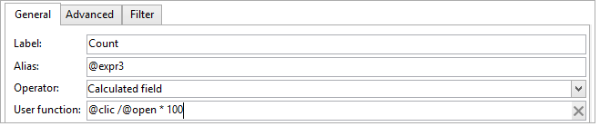

# Ejemplos de uso{#use-cases}

## Análisis de una población {#analyzing-a-population}

El siguiente ejemplo permite explorar la población establecida por un conjunto de boletines mediante el asistente de análisis descriptivo.

Los pasos de implementación se describen a continuación, y puede encontrar una lista exhaustiva de opciones con descripciones en las demás secciones de este capítulo.

### Identificación de la población que se va a analizar {#identifying-the-population-to-analyze}

En este ejemplo, deseamos explorar la población objetivo de los envíos incluidos en la carpeta **Boletines**.

To do this, select the concerned deliveries, then right-click and select **[!UICONTROL Action > Explore the target...]**.


### Selección de un tipo de análisis {#selecting-a-type-of-analysis}

En el primer paso del asistente, puede seleccionar la plantilla de análisis descriptivo que desee utilizar. By default, Adobe Campaign offers two templates: **[!UICONTROL Qualitative distribution]** and **[!UICONTROL Quantitative distribution]**. Para obtener más información sobre esto, consulte la sección [Configuración de la plantilla](../../reporting/using/using-the-descriptive-analysis-wizard.md#configuring-the-qualitative-distribution-template) de distribución cualitativa. Las distintas representaciones se presentan en la sección [Acerca del análisis](../../reporting/using/about-descriptive-analysis.md) descriptivo.

For this example, select the **[!UICONTROL Qualitative distribution]** template and choose a display with a chart and table (array). Give the report a name (&quot;Descriptive analysis&quot;) and click **[!UICONTROL Next]**.


### Selección de las variables que desea muestran {#selecting-the-variables-to-display}

El siguiente paso permite seleccionar los datos que se van a mostrar en la tabla.

Click the **[!UICONTROL Add...]** link to select the variable that contains the data to display. Aquí deseamos mostrar las ciudades de los destinatarios de nuestro envío en una línea:


Las columnas muestran el número de compras por empresa. En este ejemplo, las cantidades se acumulan en el campo **compras web**.

En este caso, queremos definir el agrupamiento de resultados para aclarar su visualización. To do this, select the **[!UICONTROL Manual]** binning option and set the calculation classes for the segments to display:


Then, click **[!UICONTROL Ok]** to approve the configuration.

Una vez definidas las líneas y las columnas, puede cambiarlas, moverlas o eliminarlas con la barra de herramientas.


### Definición del formato de visualización {#defining-the-display-format}

El siguiente paso del asistente le permite seleccionar el tipo de gráfico que desea generar.

En este caso, seleccione el histograma.


Las posibles configuraciones de los diferentes gráficos se detallan en la sección Opciones [del gráfico de informes de](../../reporting/using/processing-a-report.md#analysis-report-chart-options) análisis.

### Configuración de la estadística para calcular {#configuring-the-statistic-to-calculate}

A continuación, especifique los cálculos que se van a aplicar a los datos recopilados. De forma predeterminada, el asistente de análisis descriptivo realiza un recuento sencillo de los valores.

Esta ventana permite definir la lista de estadísticas que se van a calcular.


To create a new statistic, click the **[!UICONTROL Add]** button. For more on this, refer to [Statistics calculation](../../reporting/using/using-the-descriptive-analysis-wizard.md#statistics-calculation).

### Visualización y uso del informe {#viewing-and-using-the-report}

El último paso del asistente muestra la tabla y el gráfico.

Puede almacenar, exportar e imprimir datos utilizando la barra de herramientas sobre la tabla. For more on this, refer to [Processing a report](../../reporting/using/processing-a-report.md).


## Análisis de datos cualitativo {#qualitative-data-analysis}

### Ejemplo de visualización de un gráfico {#example-of-a-chart-display}

**Objetivo**: genera un informe de análisis sobre la ubicación de los clientes o los posibles clientes.

1. Open the descriptive analysis wizard and select **[!UICONTROL Chart]** only.

   

   Haga clic **[!UICONTROL Next]** para aprobar este paso.

1. Then select the **[!UICONTROL 2 variables]** option and specify that the **[!UICONTROL First variable (abscissa)]** will refer to recipient status (prospects/customers) and the second variable will refer to the country.
1. Seleccione **[!UICONTROL Cylinders]** como tipo.

   

1. Haga clic **[!UICONTROL Next]** y deje la **[!UICONTROL Simple count]** estadística predeterminada.
1. Haga clic en **[!UICONTROL Next]** para mostrar el informe.

   

   Pase el puntero por encima de una barra para ver el número exacto de clientes o posibles clientes de ese país.

1. Active o desactive la visualización de uno de los países según el pie de ilustración.

   

### Ejemplo de visualización de una tabla {#example-of-a-table-display}

**Objetivo**: analice los dominios de correo electrónico de la empresa.

1. Open the descriptive analysis wizard and select the **[!UICONTROL Array]** display mode only.

   

   Click the **[!UICONTROL Next]** button to approve this step.

1. Select the **[!UICONTROL Company]** variable as a column and the **[!UICONTROL Email domain]** variable as a row.
1. Keep the **[!UICONTROL By rows]** option for statistics orientation: the statistic calculation will be displayed to the right of the **[!UICONTROL Email domain]** variable.

   

   Haga clic **[!UICONTROL Next]** para aprobar este paso.

1. A continuación, introduzca las estadísticas que desea calcular: mantenga el recuento predeterminado y cree una nueva estadística. Para ello, haga clic en **[!UICONTROL Add]** y seleccione **[!UICONTROL Total percentage distribution]** como operador.

   

1. Introduzca una etiqueta para la estadística de modo que no quede un campo en blanco cuando se muestre el informe.

   

1. Haga clic en **[!UICONTROL Next]** para mostrar el informe.

   

1. Una vez generado el informe de análisis, puede ajustar la visualización para adaptarla a sus necesidades sin cambiar la configuración. For instance, you can switch the axes: right-click the domain names and select **[!UICONTROL Turn]** on the shortcut menu.

   

   La tabla muestra la información de la siguiente manera:

   

## Análisis de datos cuantitativo {#quantitative-data-analysis}

**Objetivos**: para generar un informe de análisis cuantitativo sobre la edad de los destinatarios.

1. Open the descriptive analysis wizard and select **[!UICONTROL Quantitative distribution]** from the drop-down list.

   

   Click the **[!UICONTROL Next]** button to approve this step.

1. Select the **[!UICONTROL Age]** variable and enter its label. Specify whether or not it&#39;s an integer, then click **[!UICONTROL Next]**.

   

1. Elimine las **[!UICONTROL Deciles]** estadísticas, **[!UICONTROL Distribution]** y **[!UICONTROL Sum]** : no son necesarios aquí.

   

1. Haga clic en **[!UICONTROL Next]** para mostrar el informe.

   

## Análisis de un objetivo de transición en un flujo de trabajo {#analyzing-a-transition-target-in-a-workflow}

**Objetivo**: generar informes sobre la población de un flujo de trabajo de objetivos.

1. Abra el flujo de trabajo de objetivos deseado.
1. Haga clic con el botón derecho en una transición que señale a la tabla de destinatarios.
1. Select **[!UICONTROL Analyze target]** in the drop-down menu to open the descriptive analysis window.

   

1. En este punto puede seleccionar la **[!UICONTROL Existing analyses and reports]** opción y utilizar los informes creados anteriormente (consulte [Reutilización de informes y análisis](../../reporting/using/processing-a-report.md#re-using-existing-reports-and-analyses)existentes) o crear un nuevo análisis descriptivo. Para ello, deje seleccionada la **[!UICONTROL New descriptive analysis from a template]** opción de forma predeterminada.

   El resto de la configuración es igual que para todos los análisis descriptivos.

### Recomendaciones para el análisis de objetivos {#target-analyze-recommendations}

El análisis de una población en un flujo de trabajo requiere que la población siga presente en la transición. Si se inicia el flujo de trabajo, es posible que el resultado relativo a la población se depure de la transición. Para ejecutar un análisis, puede hacer lo siguiente:

* Desvincular la transición de su actividad de destino e iniciar el flujo de trabajo para activarla. Una vez que la transición comience a parpadear, inicie el asistente de la forma habitual.

   

* Para modificar las propiedades del flujo de trabajo, seleccione la **[!UICONTROL Keep the result of interim populations between two executions]** opción. Esto permite iniciar un análisis de la transición que elija, incluso si el flujo de trabajo ha finalizado.

   

   Si la población se ha purgado de la transición, un mensaje de error le pide que seleccione la opción correspondiente antes de iniciar el asistente de análisis descriptivo.

   

>[!CAUTION]
>
>The **[!UICONTROL Keep the result of interim populations between two executions]** option must only be used in development phases, but never for an environment in production.\
>Las poblaciones provisionales se purgan automáticamente una vez que alcanzan su fecha límite de retención. This deadline is specified in the workflow properties **[!UICONTROL Execution]** tab.

## Análisis de los “logs” de seguimiento de los destinatarios {#analyzing-recipient-tracking-logs}

El asistente de análisis descriptivo puede generar informes sobre otras tablas de trabajo. Esto significa que puede analizar los “logs” de envío mediante la creación de un informe dedicado.

En este ejemplo, deseamos analizar la tasa de reacción de los destinatarios del boletín.

Para ello, siga los siguientes pasos:

1. Open the descriptive analysis wizard via the **[!UICONTROL Tools > Descriptive analysis]** menu and change the default work table. Select **[!UICONTROL Recipient tracking log]** and add a filter to exclude Proofs and include newsletters.

   

   Select a table display and click **[!UICONTROL Next]**.

1. En la siguiente ventana, especifique que los análisis corresponden a los envíos.

   

   En este caso, las etiquetas de envío se muestran en la primera columna.

1. Elimine el recuento predeterminado y cree tres estadísticas para configurar las estadísticas que desea mostrar en la tabla.

   Aquí, para cada boletín, la tabla muestra el número de aperturas, el número de clics, la tasa de reacción (como porcentaje).

1. Add a statistic for counting the number of clicks: define the relevant filter in the **[!UICONTROL Filter]** tab.

   

1. Then click the **[!UICONTROL General]** tab to rename the statistics label and alias:

   

1. Añada una segunda estadística para contar el número de aperturas:

   

1. Then click the **[!UICONTROL General]** tab to rename the statistics label and its alias:

   

1. Add the third statistic and select the **[!UICONTROL Calculated field]** operator to measure the reactivity rate.

   

   Go to the **[!UICONTROL User function]** field and enter the following formula:

   ```
   @clic / @open * 100
   ```

   Adaptar la etiqueta estadística como se muestra a continuación:

   

   Finally, specify whether the values are shown as a percentage: to do this, uncheck the **[!UICONTROL Default formatting]** option in the **[!UICONTROL Advanced]** tab and select **[!UICONTROL Percentage]** without a decimal point.

   

1. Haga clic en **[!UICONTROL Next]** para mostrar el informe.

   

## Análisis de los “logs” de exclusión de envío {#analyzing-delivery-exclusion-logs}

Si el análisis corresponde a un envío, puede analizar la población excluida. To do this, select the deliveries to be analyzed and right-click to access the **[!UICONTROL Action > Explore exclusions]** menu.


Esto abre al asistente de análisis descriptivo, y el análisis corresponde a los “logs” de exclusión de destinatarios.

Por ejemplo, puede mostrar los dominios de todas las direcciones excluidas y ordenarlos por fecha de exclusión.


Esto genera el siguiente tipo de informe:


