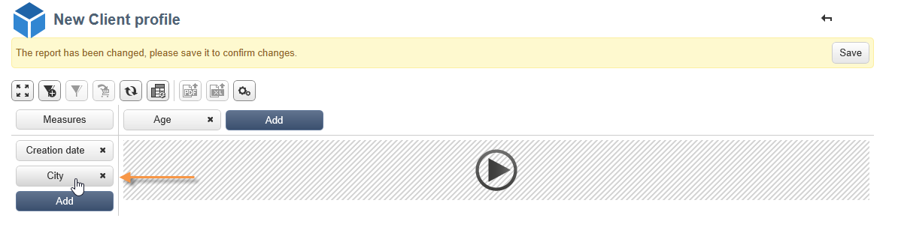

# Uso de cubos para explorar datos{#using-cubes-to-explore-data}

Marketing Analytics facilita la creación de informes y la identificación y selección de datos de la base de datos mediante cubos. Esta actividad permite:

* Crear informes basados en cubos. El proceso se detalla aquí: [Exploración de los datos de un informe](#exploring-the-data-in-a-report).
* Recopilar los datos de la base de datos y agruparlos en listas, por ejemplo, para identificar y crear destinatarios y envíos. Para más información, consulte [Creación de un grupo de destinatarios](#building-a-target-population).
* Insertar una tabla dinámica en un informe y hacer referencia a un cubo existente en él. Para más información, consulte [Inserción de una tabla dinámica en un informe](#inserting-a-pivot-table-into-a-report).

>[!NOTE]
>
>Se requiere Marketing Analytics para crear o modificar los cubos. Para más información, consulte [Sobre cubos](../../reporting/using/about-cubes.md).

## Exploración de los datos de un informe {#exploring-the-data-in-a-report}

### Paso 1: Creación de un informe basado en un cubo {#step-1---creating-a-report-based-on-a-cube}

Para crear un informe basado en un cubo, haga clic en el botón **[!UICONTROL Create]** de la pestaña **[!UICONTROL Reports]** y seleccione el cubo que desee utilizar.

El proceso se detalla aquí: [Creación de un informe basado en un cubo](../../reporting/using/creating-indicators.md#creating-a-report-based-on-a-cube).

### Paso 2: Selección de líneas y columnas {#step-2---selecting-lines-and-columns}

La visualización predeterminada muestra las dos primeras dimensiones del cubo (edad y ciudad, en este caso).

Los botones **[!UICONTROL Add]** en cada eje permiten añadir dimensiones.

1. Seleccione las dimensiones que desee mostrar en las líneas y en las columnas de la tabla. Para ello, arrastre y suelte las dimensiones disponibles como se muestra a continuación:
1. Seleccione las dimensiones que desee añadir a la tabla desde la lista:

   

1. Luego seleccione los parámetros de esta dimensión.

   

   Los parámetros dependen del tipo de datos de la dimensión seleccionada.

   Por ejemplo, en el caso de las fechas, puede haber disponibles varios niveles. Para más información, consulte [Muestra de medidas](../../reporting/using/concepts-and-methodology.md#displaying-measures).

   En este caso se ofrecen las siguientes opciones:

   

   Puede:

   * Expandir los datos durante la carga: los valores se muestran de forma predeterminada cada vez que se actualiza el informe (valor predeterminado: no).
   * Mostrar el total al final de la línea: cuando los datos se muestran en columnas, una opción adicional permite mostrar el total al final de la línea: se añade una columna a la tabla (valor predeterminado: sí).
   * Aplicar una clasificación: los valores de la columna se pueden ordenar según el valor, la etiqueta o en función de una medida (valor predeterminado: por valor).
   * Mostrar los valores en orden ascendente (a-z, 0-9) o descendente (z-a, 9-0).
   * Cambiar el número de columnas que desea mostrar al cargar (número predeterminado: 200).

1. Haga clic en **[!UICONTROL Ok]** para confirmar que la dimensión se añada a las ya existentes.

   El aviso amarillo sobre la tabla indica que se han realizado cambios. Haga clic en el botón **[!UICONTROL Save]** para guardarlos.

   

### Paso 3: Configuración de las medidas que desea mostrar {#step-3---configuring-the-measures-to-display}

Una vez que las líneas y las columnas están colocadas, indique las medidas que desee mostrar y su modo de visualización.

De forma predeterminada, solo se muestra una medida. Para añadir o configurar medidas:

1. Haga clic en el botón **[!UICONTROL Measures]**.

   

1. El botón **[!UICONTROL Use a measure]** permite seleccionar una de las medidas existentes.

   

   Seleccione la información que desee mostrar y el tipo de formato. La lista de opciones depende del tipo de medida que se haya configurado.

   

   La configuración general de medidas también está disponible a través del icono **[!UICONTROL Edit the configuration of the pivot table]** del encabezado.

   

   A continuación puede elegir si desea mostrar o no las etiquetas de medida. Para más información, consulte [Configuración de la visualización](../../reporting/using/concepts-and-methodology.md#configuring-the-display).

1. Es posible crear nuevas medidas utilizando las existentes. Para ello, haga clic en **[!UICONTROL Create a measure]** y configúrelo.

   

   Los siguientes tipos de medidas está disponibles:

   * Combinación de medidas: este tipo de medida permite crear la nueva medida utilizando las existentes:

      Los operadores disponibles son: suma, diferencia, multiplicación y tasa.

   * Proporción: este tipo de medida permite calcular el número de registros medidos para una dimensión determinada. Se puede calcular la proporcionalidad en función de una dimensión o subdimensión.
   * Variación: esta medida permite calcular la variación en valores de un nivel.
   * Desviación estándar: este tipo de medida permite calcular las desviaciones dentro de cada grupo de celdas en comparación con la media de los valores. Por ejemplo, se puede comparar el volumen de compra de todos los segmentos existentes.

   La medida creada se añade al informe.

   

   Una vez creada una medida, se puede editar y, si es necesario, cambiar su configuración. Para ello, haga clic en el botón **[!UICONTROL Measures]** y vaya a la pestaña de la medida que desea editar.

   A continuación, haga clic en **[!UICONTROL Edit the dynamic measure]** para acceder al menú de configuración.

## Creación de una población objetivo {#building-a-target-population}

Los informes creados con los cubos permiten recopilar datos de la tabla y guardarlos en una lista.

Para ello, añádalos a un carro y procese su contenido.

Para agrupar una población en una lista, siga los siguientes pasos:

1. Haga clic en las celdas que contienen los usuarios que quiera agrupar y selecciónelas. A continuación, haga clic en el icono **[!UICONTROL Add to cart]**.

   

   Haga esto las veces que sean necesarias para recopilar varios perfiles.

1. Haga clic en el botón **[!UICONTROL Show cart]** para ver su contenido antes de ejecutar la exportación.

   

1. El botón **[!UICONTROL Export]** permite agrupar los elementos del carro en una lista.

   Debe especificar el nombre de la lista y el tipo de exportación que desea realizar.

   

   Haga clic en **[!UICONTROL Start]** para ejecutar la exportación.

1. Una vez finalizada la exportación, un mensaje confirma su ejecución y el número de registros que se han procesado.

   

   Puede guardar el contenido del carro o vaciarlo.

   Se accede a la lista relevante a través de la pestaña **[!UICONTROL Profiles and targets]**.

   

## Inserción de una tabla dinámica en un informe {#inserting-a-pivot-table-into-a-report}

Para crear una tabla y explorar los datos de un cubo, siga los siguientes pasos:

1. Cree un nuevo informe con una sola página e inserte una tabla dinámica. Para obtener más información, consulte [esta página](../../reporting/using/creating-a-table.md#creating-a-breakdown-or-pivot-table).

   

1. En la pestaña **[!UICONTROL Data]** de la página, seleccione un cubo para procesar las dimensiones que contiene y mostrar las medidas calculadas.

   

   Esto permite generar el informe que se desea mostrar. Para más información, consulte [Paso 2 - Selección de líneas y columnas](#step-2---selecting-lines-and-columns).

