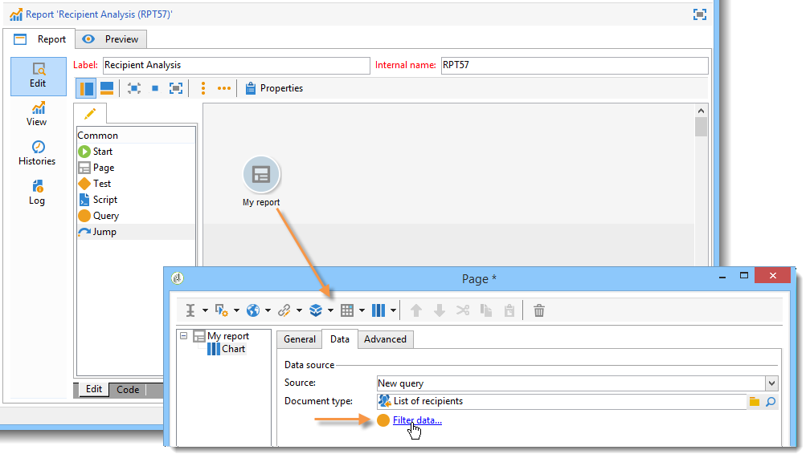
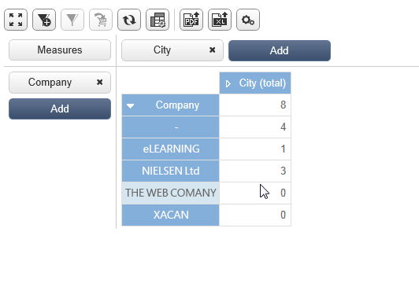
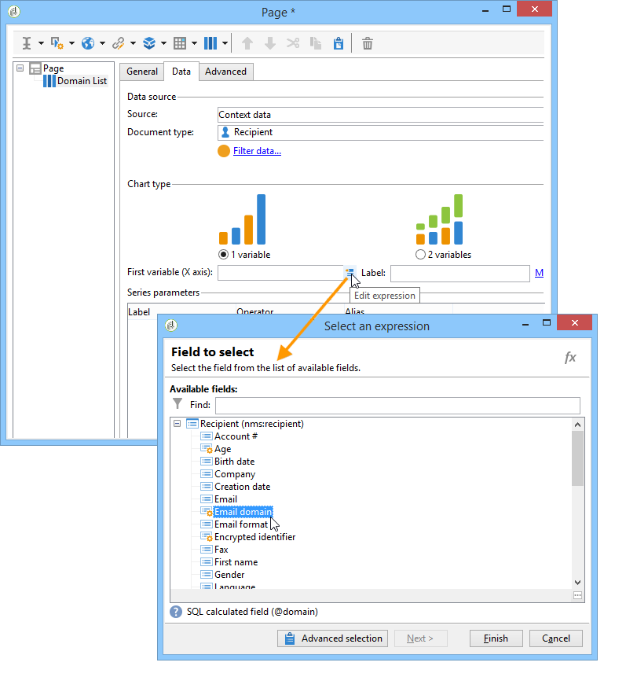

# Uso del contexto{#using-the-context}

Si desea representar datos en forma de **[!UICONTROL tables]** o **[!UICONTROL charts]**, puede tomarlos de dos fuentes: una nueva consulta (consulte [Definición de un filtro directo en los datos](#defining-a-direct-filter-on-data)) o el contexto del informe (consulte [Uso de datos de contexto](#using-context-data)).

## Definición de un filtro directo para los datos {#defining-a-direct-filter-on-data}

### Filtrado de datos {#filtering-data}

La utilización de una actividad de tipo **[!UICONTROL Query]** no es obligatoria al crear un informe. Los datos pueden filtrarse directamente en las tablas y gráficos que conforman el informe.

Esto le permite seleccionar los datos para mostrar en el informe directamente a través de la actividad del informe **[!UICONTROL Page]**.

Para ello, haga clic en el vínculo **[!UICONTROL Filter data...]** de la pestaña **[!UICONTROL Data]**: este vínculo le permite acceder al editor de expresiones para definir una consulta de los datos que se van a analizar.

### Ejemplo: Uso de un filtro en un gráfico {#example--use-a-filter-in-a-chart}

En el siguiente ejemplo, deseamos que el gráfico muestre solo los perfiles de destinatarios que viven en Francia y que realizaron una compra en algún momento del año.

Para definir este filtro, coloque una página en el gráfico y edítela. Haga clic en el vínculo **[!UICONTROL Filter data]** y cree un filtro que coincida con los datos que desea visualizar. Para obtener más información sobre la creación de consultas en Adobe Campaign, consulte [esta sección](../../platform/using/about-queries-in-campaign.md).

En este caso, deseamos visualizar el desglose por ciudad de los destinatarios seleccionados.

La renderización debería tener este aspecto:

### Ejemplo: Uso de un filtro en una tabla dinámica {#example--use-a-filter-in-a-pivot-table}

En este ejemplo, el filtro le permite visualizar solo los clientes no parisinos en la tabla dinámica, sin utilizar otra consulta de antemano.

Siga estos pasos:

1. Coloque una página en el gráfico y edítela.
1. Cree una tabla dinámica.
1. Vaya a la pestaña **[!UICONTROL Data]** y seleccione el cubo que desea utilizar.
1. Haga clic en el vínculo **[!UICONTROL Filter data...]** y defina la siguiente consulta para eliminar Adobe de la lista de empresas.

   

Solo los destinatarios que cumplan los criterios de filtrado aparecen en el informe.

## Uso de datos de contexto {#using-context-data}

Para representar los datos en forma de **[!UICONTROL table]** o **[!UICONTROL chart]**, los datos pueden provenir del contexto del informe.

En la página que contiene la tabla o el gráfico, la pestaña **[!UICONTROL Data]** permite seleccionar el origen de los datos.

* La opción **[!UICONTROL New query]** permite generar una consulta para recopilar datos. Para obtener más información sobre esto, consulte [Definición de un filtro directo en los datos](#defining-a-direct-filter-on-data).
* La opción **[!UICONTROL Context data]** permite utilizar los datos de entrada: el contexto del informe coincide con la información que contiene la transición entrante de la página que contiene el gráfico o la tabla. Este contexto puede, por ejemplo, contener los datos recopilados a través de la actividad **[!UICONTROL Query]** colocada ante la actividad **[!UICONTROL Page]** para la cual necesita especificar la tabla y los campos a los que afecta el informe.

Por ejemplo, en un cuadro de consulta, cree la siguiente consulta para los destinatarios:

Después, indique el origen de los datos en el informe, en este caso: **[!UICONTROL Data from the context]**.

La ubicación de los datos se deduce automáticamente. Si es necesario, puede forzar la ruta de datos.

Al seleccionar los datos a los que se refieren las estadísticas, los campos disponibles coinciden con los datos especificados en la consulta.

