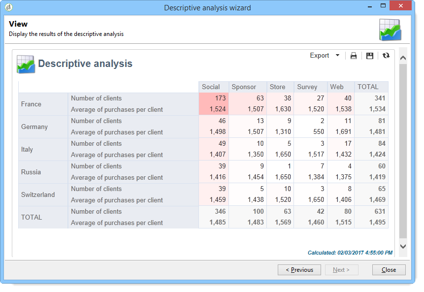

# Uso del asistente de análisis descriptivo{#using-the-descriptive-analysis-wizard}

Para crear un informe de análisis descriptivo, utilice el asistente dedicado. La configuración depende de los datos que se analicen y de la renderización deseada.

## Análisis de los datos de la base de datos {#analyzing-data-in-the-database}

El asistente de análisis descriptivo se puede iniciar mediante el menú **[!UICONTROL Tools > Descriptive analysis]**: en este caso, el análisis corresponde a los destinatarios de forma predeterminada (**nms:recipient**). Se aplica a todos los datos de la base de datos de Adobe Campaign.

Para analizar una tabla que no sea la de los destinatarios estándar (**nms:recipient**), haga clic en el vínculo **[!UICONTROL Advanced settings...]** del último paso del asistente y seleccione la tabla que coincida con la configuración, en este caso **cus:individual**:

Si desea generar estadísticas sobre una parte de los datos, puede definir un filtro: para ello, haga clic en el vínculo **[!UICONTROL Advanced settings...]** y defina el filtro que desee aplicar, como se muestra a continuación:

El análisis solo corresponde a los destinatarios de la base de datos mayores a 16 años y que viven en Londres.

## Análisis de un conjunto de datos {#analyzing-a-set-of-data}

Puede utilizar el asistente de análisis descriptivo a través de un contexto diferente: una lista, una transición de flujo de trabajo, uno o varios envíos, una selección de destinatarios, etc.

Se puede acceder a él a través de varios nodos del árbol de Adobe Campaign que señalan a la tabla de destinatarios.

Abra el asistente de análisis descriptivo seleccionando elementos y haciendo clic con el botón derecho. Solo se analizan los datos seleccionados.

* Para un conjunto de **destinatarios**, seleccione los destinatarios que se van a analizar, luego haga clic con el botón derecho y seleccione **[!UICONTROL Actions > Explore...]**, como se muestra arriba. Si se aplica un filtro a la lista de destinatarios, solo se analiza el contenido resultante.

   Para seleccionar todos los destinatarios de la carpeta o el filtro actual, utilice el atajo de teclado CTRL+A. Esto hace que se seleccionen incluso los destinatarios ocultos.

   Para ver un ejemplo del análisis descriptivo de los destinatarios, consulte [Análisis de datos cualitativos](../../reporting/using/use-cases.md#qualitative-data-analysis).

* En el contexto de un **flujo de trabajo**, coloque el cursor sobre una transición que señale a la tabla de destinatarios, haga clic con el botón derecho y seleccione **[!UICONTROL Analyze target]**. Para obtener más información, consulte el ejemplo en [Análisis de un destino de transición en un flujo de trabajo](../../reporting/using/use-cases.md#analyzing-a-transition-target-in-a-workflow).
* Para las **listas**, seleccione una o varias listas y aplique el mismo proceso que para los destinatarios.
* En el contexto de una **entrega**, seleccione los envíos cuyo destinatario desee analizar, haga clic con el botón derecho y seleccione **[!UICONTROL Actions > Explore the target]**, como se muestra a continuación:

   

   A continuación se proporcionan ejemplos de análisis descriptivos de los envíos: [Análisis de una población](../../reporting/using/use-cases.md#analyzing-a-population) y : [Análisis de los registros de seguimiento de destinatarios](../../reporting/using/use-cases.md#analyzing-recipient-tracking-logs).

## Configuración de la plantilla de distribución cualitativa {#configuring-the-qualitative-distribution-template}

La plantilla de **[!UICONTROL Qualitative distribution]** permite crear estadísticas sobre todos los tipos de datos (por ejemplo: nombre de la empresa, dominio de correo electrónico).

Las opciones de configuración disponibles para un informe creado mediante la plantilla de distribución **[!UICONTROL Qualitative distribution]** se detallan en [Visualización de datos en la tabla](#displaying-data-in-the-table). Un ejemplo completo se detalla en [Análisis de una población](../../reporting/using/use-cases.md#analyzing-a-population).

Cuando utiliza el asistente de análisis descriptivo para analizar los datos, las opciones disponibles dependen de la configuración elegida. A continuación se detallan dichas acciones.

### Agrupamiento de datos {#data-binning}

Cuando se seleccionan las variables que se van a mostrar, puede definir el agrupamiento de datos, o en otras palabras, configurar criterios de agrupación para los datos seleccionados.

>[!NOTE]
>
>Cuando el cálculo del campo se computa mediante un acumulado, marque **[!UICONTROL The data is already aggregated]** para mejorar el rendimiento.

Las opciones difieren según el contenido del campo:

* **[!UICONTROL None]**: esta opción permite mostrar todos los valores disponibles para la variable, sin agrupamiento.

   >[!CAUTION]
   >
   >Esta opción debe utilizarse con cuidado: puede tener un impacto importante sobre el informe y el rendimiento del equipo.

* **[!UICONTROL Auto]**: esta opción permite mostrar los “n” valores representados con más frecuencia. Se calculan automáticamente y cada uno representa un porcentaje de las variables en comparación con el número de intervalos. En el caso de los valores numéricos, Adobe Campaign genera automáticamente “n” clases para ordenar los datos.
* **[!UICONTROL Manual]**: esta opción funciona como la opción **[!UICONTROL Auto]**, excepto que estos valores se pueden definir manualmente. Para ello, haga clic en el botón **[!UICONTROL Add]** a la derecha de la tabla de valores.

   Adobe Campaign puede inicializar los valores automáticamente antes de la personalización: para ello, introduzca el número de grupos que desee generar y haga clic en el vínculo **[!UICONTROL Initialize with]**, como se muestra a continuación:

   

   A continuación, ajuste su contenido para adaptarlo a sus necesidades:

   

   Según el nivel de precisión deseado, los campos que contengan fechas pueden agruparse por hora, día, mes, año, etc.

   

* **[!UICONTROL Modulo]**: permite crear grupos de valores en el caso de valores numéricos. Por ejemplo, un módulo con un valor de 10 le permite crear un intervalo de valores que cambian de diez en diez.

   

   Este ejemplo permite ver el desglose de los destinatarios por grupo de edad.

   

### Visualización de datos en la tabla {#displaying-data-in-the-table}

Utilice la barra de herramientas para personalizar la visualización de variables en la tabla: elimine una columna, muestre datos en líneas en lugar de columnas, mueva una columna a la izquierda o a la derecha, visualice o modifique el cálculo de valores.

La sección superior de la ventana permite seleccionar la configuración de visualización.

Puede mostrar u ocultar el nombre de las estadísticas y los subtotales y elegir la orientación de las estadísticas. Para obtener más información, consulte [Configuración de la visualización del informe de análisis](../../reporting/using/processing-a-report.md#analysis-report-display-settings).

### Visualización de datos en el gráfico {#displaying-data-in-the-chart}

En el primer paso del asistente de análisis descriptivos, puede elegir mostrar los datos en el formulario de gráficos únicamente, sin tabla. En este caso, debe seleccionar variables al configurar el gráfico. Primero debe seleccionar el número de variables a mostrar y seleccionar los campos de la base de datos correspondiente.

A continuación, seleccione el tipo de gráfico deseado.

>[!NOTE]
>
>Puede mostrar las variables en un gráfico y en una tabla al mismo tiempo. Para ello, introduzca las variables en la ventana **[!UICONTROL Table configuration]**. Haga clic en **[!UICONTROL Next]** y seleccione el tipo de gráfico en la ventana de configuración del gráfico. Si se definen las subdimensiones en la tabla, no se muestran en el gráfico.

Haga clic en el vínculo **[!UICONTROL Variants]** para modificar las propiedades del gráfico.

Las opciones ofrecidas dependen del tipo de gráfico seleccionado. Para obtener más información, consulte [esta página](../../reporting/using/creating-a-chart.md#chart-types-and-variants).

### Cálculo de estadísticas {#statistics-calculation}

El asistente de análisis descriptivo le permite calcular varios tipos de estadísticas relacionadas con los datos. De forma predeterminada, solo se configura un recuento simple.

Haga clic en **[!UICONTROL Add]** para crear una estadística nueva.

Las siguientes operaciones son posibles:

* **[!UICONTROL Count]** para contar todos los valores no nulos del campo que se van a acumular, incluidos los valores duplicados (del campo acumulado).
* **[!UICONTROL Average]** para calcular la media de los valores de un campo numérico.
* **[!UICONTROL Minimum]** para calcular el mínimo de los valores en un campo numérico.
* **[!UICONTROL Maximum]** para calcular el máximo de los valores en un campo numérico,
* **[!UICONTROL Sum]** para calcular la suma de los valores en un campo numérico.
* **[!UICONTROL Standard deviation]** para calcular cómo se distribuyen los valores devueltos en torno a la media.
* **[!UICONTROL Row percentage distribution]** para calcular la proporción del valor en una columna y el valor de una fila (solo disponible para tablas).
* **[!UICONTROL Column percentage distribution]** para calcular la proporción del valor en una fila respecto al valor de una columna (solo disponible para tablas).
* **[!UICONTROL Total percentage distribution]** para calcular la distribución de los destinatarios correspondientes según los valores.

   

* **[!UICONTROL Calculated field]** para crear un operador personalizado (disponible solo para tablas). El campo **[!UICONTROL User function]** permite introducir el cálculo que se debe aplica a los datos.

   Ejemplo: Cálculo del importe promedio de compra por cliente según el país y el origen.

   

   Para mostrar la información anterior en una tabla, debe crear un campo calculado para almacenar el importe promedio de compra por cliente.

   Para ello:

   1. Calcule el total de la compra.

      

   1. Esta estadística no se muestra en la tabla. Debe desactivar la opción **[!UICONTROL Display in the table]** de la pestaña **[!UICONTROL Advanced]**.

      

   1. Cree una nueva estadística de tipo **[!UICONTROL Calculated field]** e introduzca la fórmula siguiente en el campo **[!UICONTROL User function]**:**@purchases/@count**.

      

### Visualización del informe {#displaying-the-report}

El último paso del asistente le permite mostrar el informe, es decir la tabla o el gráfico como se han configurado.

Cuando el informe contiene una tabla, la celda del resultado del cálculo aparece coloreada. Cuanto mayor sea el resultado, más intenso es el color.

Es posible cambiar el diseño de los resultados. Para ello, haga clic con el botón derecho en la variable correspondiente y seleccione la entrada en el menú de acceso directo.

Cuando el informe incluye un gráfico, las etiquetas del pie de ilustración permiten filtrar la información mostrada: haga clic en una etiqueta para habilitar o deshabilitar la visualización en el gráfico.

## Configuración de la plantilla de distribución cuantitativa {#configuring-the-quantitative-distribution-template}

Para generar un análisis descriptivo, seleccione la opción **análisis descriptivo nuevo desde una plantilla** si no está seleccionada de forma predeterminada.

La plantilla de **[!UICONTROL Quantitative distribution]** que permite generar estadísticas de los datos que se pueden medir o contar (por ejemplo: importe de la factura, edad de los destinatarios).

El modo de configuración de un informe de análisis creado mediante la plantilla **[!UICONTROL Quantitative distribution]** se detalla en el ejemplo de implementación [Análisis de datos cuantitativos](../../reporting/using/use-cases.md#quantitative-data-analysis).

Las opciones disponibles al utilizar el asistente de análisis descriptivo para crear un informe cuantitativo se describen a continuación.

Comience por seleccionar la variable a la que corresponden los cálculos:

De forma predeterminada, Adobe Campaign ofrece una serie de estadísticas a calcular para los datos seleccionados. Puede cambiar esta lista y añadir o eliminar estadísticas según sus necesidades.

Las siguientes operaciones son posibles:

* **[!UICONTROL Count]** para contar todos los valores no nulos del campo que se van a acumular, incluidos los valores duplicados (del campo acumulado).
* **[!UICONTROL Average]** para calcular la media de los valores de un campo numérico.
* **[!UICONTROL Minimum]** para calcular el mínimo de los valores en un campo numérico.
* **[!UICONTROL Maximum]** para calcular el máximo de los valores en un campo numérico.
* **[!UICONTROL Sum]** para calcular la suma de los valores en un campo numérico.
* **[!UICONTROL Standard deviation]** para calcular cómo se distribuyen los valores devueltos en torno a la media.
* **[!UICONTROL Number of missing values]** para calcular el número de campos numéricos sin valores definidos.
* **[!UICONTROL Decile distribution]** para distribuir los valores devueltos de forma que cada uno represente 1/10 de los valores de un campo numérico.
* **[!UICONTROL Custom distribution]** para distribuir los valores devueltos según los umbrales definidos por el usuario.

   El botón **[!UICONTROL Detail...]** editar una estadística y, si es necesario, personalizar su cálculo o su visualización:

   

   El último paso del asistente muestra el informe de análisis cuantitativo.

   

   Para realizar cambios en el informe, consulte [Procesamiento de un informe](../../reporting/using/processing-a-report.md).

