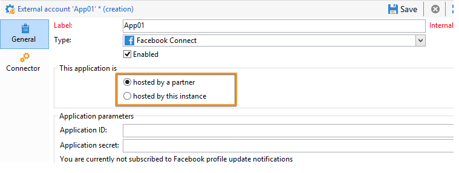
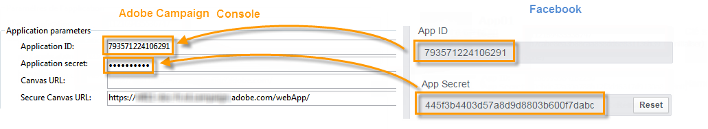

# Creación de una aplicación de Facebook{#creating-a-facebook-application}

Gracias a las aplicaciones web, el marketing social le permite mostrar contenido personalizado en las aplicaciones de Facebook, lo que facilita la adquisición de prospectos mediante esta red social. Para obtener más ejemplos de aplicaciones web de tipo Facebook, consulte [Ejemplos de aplicaciones de Facebook](../../social/using/examples-of-facebook-apps.md).

>[!NOTE]
>
>También es posible integrar Adobe Campaign con una aplicación de Facebook desarrollada por un socio. En este caso, no es necesario utilizar la aplicación web de Adobe Campaign para adquirir perfiles de Facebook. Para más información, consulte [Configuración de cuentas externas](#configuring-external-accounts).

Aplique los siguientes pasos de configuración:

1. Cree una o varias aplicaciones de Facebook. Para más información, consulte [Creación de una aplicación de Facebook](../../social/using/publishing-on-facebook-walls.md#creating-a-facebook-application).
1. Introduzca los vínculos **[!UICONTROL terms of service]** y **[!UICONTROL Privacy policy]** que se mostrarán en la pantalla de solicitud de los permisos de Facebook. Para obtener más información, consulte: [Introducción de los vínculos de condiciones de servicio y política de privacidad](#entering-the-terms-of-service-and-privacy-policy-links).
1. Para cada aplicación de Facebook, es necesario crear una cuenta externa de tipo **[!UICONTROL Facebook Connect]**. Para obtener más información, consulte [Configuración de cuentas externas](#configuring-external-accounts).
1. Para cada aplicación de Facebook, es necesario crear una aplicación web de tipo Facebook en Adobe Campaign. Para obtener más información, consulte: [Creación de una aplicación web de tipo Facebook](#creating-a-facebook-type-web-application).
1. Configure las aplicaciones de Facebook para que se muestren como pestañas en la página de Facebook. Para obtener más información, consulte [Configuración de pestañas de Facebook](#configuring-facebook-tabs).

## Configuración de cuentas externas {#configuring-external-accounts}

Para cada aplicación de Facebook, es necesario crear una cuenta externa de tipo **[!UICONTROL Facebook Connect]**.

Este paso requiere acceso a la consola de Adobe Campaign y a un explorador de Internet que haya iniciado sesión en la cuenta de Facebook que utilice para la administración de páginas:

* **Facebook**: seleccione la aplicación creada anteriormente ([https://developers.facebook.com/apps](https://developers.facebook.com/apps)) y seleccione la pestaña **[!UICONTROL Settings]** > **[!UICONTROL Basic]**.

   

   >[!NOTE]
   >
   >Si no aparece la sección **[!UICONTROL Facebook Web Games]**, haga clic en el botón **[!UICONTROL Add Platform]**, en la parte inferior de la página, y seleccione **[!UICONTROL Facebook Web Games]**.

* **Adobe Campaign**: vaya al nodo **[!UICONTROL Administration > Platform > External accounts]** del árbol y haga clic en **[!UICONTROL New]**.

   

1. Introduzca una etiqueta y un nombre interno y seleccione el tipo de **[!UICONTROL Facebook Connect]**.

   

1. Seleccione un modo de alojamiento de la aplicación entre **[!UICONTROL hosted by a partner]** o **[!UICONTROL hosted by this instance]**.

   

   **Aplicación alojada por un socio**

   Es posible integrar Adobe Campaign con una aplicación de Facebook desarrollada por un socio. En este caso, no es necesario utilizar las aplicaciones web de Adobe Campaign para adquirir perfiles de Facebook. Cuando el usuario de Facebook instala la aplicación, se genera una clave (token de acceso). El socio reenvía este token de acceso a Adobe Campaign llamando a un servicio web. A continuación, Adobe Campaign utiliza este token para iniciar sesión en la base de datos de Facebook y recopilar los datos compartidos por el usuario a través de la aplicación.

   >[!NOTE]
   >
   >Los parámetros del servicio web se detallan en el archivo WSDL disponible aquí: **`https://<Instance name>/nl/jsp/schemawsdl.jsp?schema=nms:visitor`**

   Para integrar la aplicación de terceros en Adobe Campaign, debe copiar el contenido de los campos de Facebook **[!UICONTROL App ID]** y **[!UICONTROL App Secret]** y pegarlo en los campos **[!UICONTROL Application ID]** y **[!UICONTROL Application secret]** de la consola.

   

   **Aplicación alojada por esta instancia**

   Si desea alojar la aplicación en esta instancia (si no tiene una aplicación de terceros), debe utilizar las aplicaciones web de Adobe Campaign para adquirir perfiles de Facebook. Para obtener más información, consulte [Ejemplos de aplicaciones de Facebook](../../social/using/examples-of-facebook-apps.md).

   En la consola de Adobe Campaign, copie la dirección contenida en el campo **[!UICONTROL Secure Canvas URL]** y péguela en el campo **[!UICONTROL Facebook Web games (https)]** en Facebook (en la sección **[!UICONTROL Facebook Web Games]**).

   

   >[!IMPORTANT]
   >
   >Evite utilizar la dirección URL no segura bajo cualquier circunstancia.

   En Facebook, copie el contenido de los campos **[!UICONTROL App ID]** y **[!UICONTROL App Secret]** y péguelo en los campos **[!UICONTROL Application ID]** y **[!UICONTROL Application secret]** de la consola.

   

1. En Facebook, haga clic en el botón **[!UICONTROL Save Changes]** en la parte inferior de la página.
1. En la consola de Adobe Campaign, haga clic en el botón **[!UICONTROL Subscribe]** para permitir que Adobe Campaign recupere los datos en tiempo real cada vez que un seguidor inicie sesión mediante esta aplicación. Para obtener más información, consulte: [Ejemplos de aplicaciones de Facebook](../../social/using/examples-of-facebook-apps.md).

   

## Introducción de los vínculos de condiciones de servicio y política de privacidad {#entering-the-terms-of-service-and-privacy-policy-links}

Recomendamos que añada los vínculos **[!UICONTROL Terms of service]** y **[!UICONTROL Privacy policy]** que se deban mostrar en la pantalla de solicitud de permisos de Facebook.

Las fases de configuración son las siguientes:

1. Introduzca la siguiente dirección: [https://developers.facebook.com/apps](https://developers.facebook.com/apps)y, a continuación, seleccione la aplicación de Facebook.
1. Seleccione la pestaña **[!UICONTROL Settings > Basic]** y escriba los campos **[!UICONTROL Privacy Policy URL]** y **[!UICONTROL Terms of Service URL]**.

   

## Creación de una aplicación web de tipo Facebook {#creating-a-facebook-type-web-application}

La aplicación de Facebook de Adobe Campaign permite mostrar contenido personalizado en la aplicación de Facebook. Para cada aplicación de Facebook, debe crear una aplicación web en Adobe Campaign. Para crear una aplicación web de Facebook, siga estos pasos:

1. Vaya a la pestaña **[!UICONTROL Social networks]**, haga clic en el vínculo **[!UICONTROL Applications]** y, a continuación, en el botón **[!UICONTROL Create]**.

   

1. Seleccione una plantilla de aplicación web de Facebook en la lista e introduzca la etiqueta.

   

   >[!NOTE]
   >
   >Hay cuatro plantillas de aplicación web de Facebook disponibles de forma predeterminada:
   >
   >* **[!UICONTROL New Facebook application]**: seleccione esta plantilla si desea comenzar desde una aplicación en blanco.
   >* **[!UICONTROL Pre-entered form]**: Aplicación de Facebook con un formulario y un botón de “inicio de sesión de Facebook” que permite a los usuarios rellenar automáticamente los campos del formulario utilizando los datos de su perfil. Esto permite que los usuarios completen el formulario más rápidamente y que las marcas obtengan información de mejor calidad.
   >* **[!UICONTROL "Canvas page" competition]**: Aplicación de Facebook que se muestra en la pantalla para que los usuarios obtengan una mejor experiencia visual.
   >* **[!UICONTROL "Page Tab" competition]**: Aplicación de Facebook totalmente integrada en las fichas de la página de marca.

1. En el campo **[!UICONTROL Application]**, introduzca la cuenta externa relacionada a la aplicación de Facebook. Para más información, consulte [Configuración de cuentas externas](#configuring-external-accounts).

   

1. Seleccione la pestaña **[!UICONTROL Edit]** y, a continuación, edite la aplicación web. Para obtener más información, consulte: [Ejemplos de aplicaciones de Facebook](../../social/using/examples-of-facebook-apps.md).

   

1. Una vez completada la aplicación web, seleccione la pestaña **[!UICONTROL Dashboard]** y, a continuación, haga clic en **[!UICONTROL Publish]** para publicar en línea.

   

## Configuración de pestañas de Facebook {#configuring-facebook-tabs}

Puede configurar las aplicaciones de Facebook para que se muestren como pestañas en la página de Facebook. Para ello, siga los siguientes pasos:

1. Seleccione la aplicación de Facebook ([https://developers.facebook.com/apps](https://developers.facebook.com/apps)) y, a continuación, la pestaña **[!UICONTROL Settings > Basic]**.

   

1. En la parte inferior de la página, haga clic en el botón **[!UICONTROL Add Platform]** y seleccione **[!UICONTROL Page Tab]**.

   

1. En el campo **[!UICONTROL Page Tab Name]** de la sección **[!UICONTROL Page Tab]**, introduzca la etiqueta tal como desea que aparezca en la página de Facebook.

   

1. En el campo **[!UICONTROL Secure Page Tab URL]**, introduzca la URL pública de la aplicación web, a la que se puede acceder desde la pestaña **[!UICONTROL Dashboard]** de la aplicación web. Para obtener más información sobre la creación de aplicaciones web de tipo Facebook, consulte [Creación de una aplicación web de tipo Facebook](#creating-a-facebook-type-web-application).

   

1. En **[!UICONTROL Dashboard]** de la aplicación web, haga clic en el vínculo **[!UICONTROL Add a page tab]**.

   

1. Seleccione la página de Facebook a la que desee añadir la pestaña y haga clic en **[!UICONTROL Add Page Tab]**.

   

