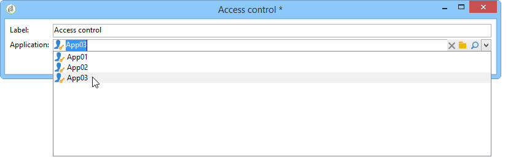
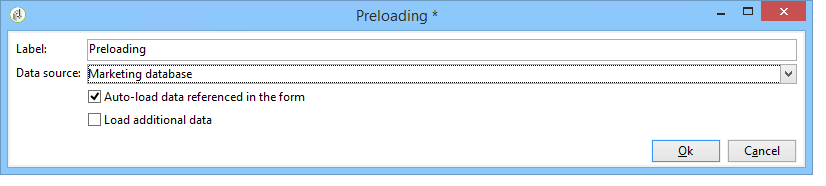

# Ejemplos de aplicaciones de Facebook{#examples-of-facebook-apps}

Cuando un usuario hace clic en la ficha de una aplicación de Facebook, se muestra en un espacio de 810 píxeles de ancho. Adobe Campaign utiliza una aplicación web de tipo Facebook para permitirle definir y personalizar el contenido mostrado en la aplicación de Facebook, lo que facilita la adquisición de perfiles.

>[!NOTE]
>
>También es posible integrar Adobe Campaign con una aplicación de Facebook desarrollada por un socio. En este caso, no es necesario utilizar la aplicación web de Adobe Campaign para adquirir perfiles de Facebook. Para más información, consulte [Configuración de cuentas externas](../../social/using/creating-a-facebook-application.md#configuring-external-accounts).

>[!IMPORTANT]
>
>Siga los pasos de configuración descritos en [Creación de una aplicación de Facebook](../../social/using/creating-a-facebook-application.md).

>[!NOTE]
>
>Esta sección detalla los elementos vinculados a las aplicaciones web de tipo Facebook. Todos los elementos compartidos con aplicaciones web estándar se detallan en [esta sección](../../web/using/about-web-applications.md).

Los ejemplos de aplicaciones web de tipo Facebook detallados a continuación son:

* Cómo crear una aplicación de Facebook en 7 pasos. Consulte [Inicio rápido: creación de una aplicación de Facebook en 7 pasos](#quick-start--creating-a-facebook-application-in-7-steps).
* Cómo reenviar la configuración a una aplicación de Facebook. Consulte [¿Cómo reenviar la configuración a una aplicación de Facebook?](#how-to-forward-settings-to-a-facebook-application-).
* Cómo adquirir datos de seguidores. Consulte [¿Cómo adquirir datos de seguidores?](#how-to-acquire-fan-data-).

>[!IMPORTANT]
>
>Estos casos de uso sencillo se proporcionan como ejemplos para ilustrar las funcionalidades de las aplicaciones web de tipo Facebook.

## Recomendaciones {#recommendations}

Las siguientes limitaciones están vinculadas directamente a Facebook:

* Debe crear todas las aplicaciones web en HTTPS.
* Una aplicación de Facebook que se muestra mediante una ficha tiene una anchura de 810 píxeles.

## Inicio rápido: creación de una aplicación de Facebook en 7 pasos {#quick-start--creating-a-facebook-application-in-7-steps}

Este ejemplo proporciona un proceso paso a paso de cómo mostrar una aplicación creada por Adobe Campaign en Facebook. En este caso, deseamos crear una aplicación que le permita mostrar el mensaje de **bienvenida** cuando el usuario haga clic en la ficha de la aplicación (**App01**).

Para crear esta aplicación, aplique los pasos siguientes:

1. Cree una aplicación en Facebook ([https://developers.facebook.com/apps](https://developers.facebook.com/apps)). Para más información, consulte [Creación de una aplicación de Facebook](../../social/using/publishing-on-facebook-walls.md#creating-a-facebook-application).

   

1. Cree una cuenta externa de tipo **[!UICONTROL Facebook Connect]** y escriba los parámetros de la aplicación Facebook. Para más información, consulte [Configuración de cuentas externas](../../social/using/creating-a-facebook-application.md#configuring-external-accounts).

   

1. Introduzca los vínculos **[!UICONTROL Terms of service]** y **[!UICONTROL Privacy policy]** que se mostrarán en la pantalla de solicitud de los permisos de Facebook. Para obtener más información, consulte: [Introducción de los vínculos de condiciones de servicio y política de privacidad](../../social/using/creating-a-facebook-application.md#entering-the-terms-of-service-and-privacy-policy-links).

   

1. Cree una aplicación web de tipo Facebook en Adobe Campaign. Para obtener más información, consulte: [Creación de una aplicación web de tipo Facebook](../../social/using/creating-a-facebook-application.md#creating-a-facebook-type-web-application).

   

1. Edite la aplicación web. En este ejemplo, hemos agregado una actividad **[!UICONTROL Page]** definido un título para ella.

   

1. Implemente la aplicación.

   

1. Configure la aplicación de Facebook para que se muestre como una ficha en la página de Facebook. Para más información, consulte [Configuración de pestañas de Facebook](../../social/using/creating-a-facebook-application.md#configuring-facebook-tabs).

   

Compruebe que la ficha de la aplicación **App01** aparece en la página de Facebook. Al hacer clic en él, se debe llamar a un mensaje de **Bienvenida**.

## ¿Cómo reenviar la configuración a una aplicación de Facebook? {#how-to-forward-settings-to-a-facebook-application-}

>[!IMPORTANT]
>
>Siga los pasos de configuración detallados en [Creación de una aplicación de Facebook](../../social/using/creating-a-facebook-application.md).

En el ejemplo 1, personalizamos la visualización de la página de Facebook según el valor del campo **[!UICONTROL Fan of the page]**. También es posible procesar el campo **[!UICONTROL Application settings]**. Este campo permite recuperar datos contenidos en un vínculo generado por Adobe Campaign a través de Facebook.

Veamos el ejemplo de una empresa que decide enviar una campaña de correo electrónico. En la entrega, un vínculo apunta a la aplicación Facebook. Este vínculo se personaliza gracias al parámetro **[!UICONTROL app_data]** añadido al final de la dirección URL. El valor de este parámetro podría ser un indicador que refleje la importancia del cliente. En nuestro ejemplo, los valores del parámetro **[!UICONTROL app_data]** son **[!UICONTROL big]** (cliente significativo) y **[!UICONTROL small]** (cliente menos significativo).

Una vez personalizada, la dirección URL tiene este aspecto:

* `http://<path of the Facebook application>&app_data=big` (para un cliente importante)
* `http://<path of the Facebook application>&app_data=small` (para un cliente menos significativo)

Entre los datos anónimos reenviados a Adobe Campaign por Facebook, se recopila el valor del campo **[!UICONTROL Application parameters]**, lo que permite a Adobe Campaign personalizar la visualización de la aplicación en función de este parámetro.

Si el usuario es un cliente importante (el valor del parámetro **[!UICONTROL app_data]** es **[!UICONTROL big]**), se muestra la siguiente imagen:

Si el usuario es un cliente menos importante (el valor del parámetro **[!UICONTROL app_data]** es **[!UICONTROL small]**), se muestra la siguiente imagen:

Para recrear este ejemplo de uso, se ha creado una aplicación web compuesta por los siguientes elementos:

* Una actividad **[!UICONTROL Test]** basada en el campo **[!UICONTROL Application parameter]**.
* dos páginas que contienen las imágenes que se van a mostrar según el valor del campo del **[!UICONTROL Application parameter]**.

## ¿Cómo se adquieren los datos del ventilador? {#how-to-acquire-fan-data-}

>[!IMPORTANT]
>
>Siga los pasos de configuración detallados en [Creación de una aplicación de Facebook](../../social/using/creating-a-facebook-application.md).

Este ejemplo muestra cómo ponerse en contacto con usuarios de Facebook y ofrecerles que compartan su información de perfil. Veamos el ejemplo de una empresa que quiere adquirir perspectivas y organiza una competencia en su página de Facebook para atraerlos.

Cada vez que un usuario hace clic en la ficha **[!UICONTROL App03]**, le preguntamos si desea participar en la competencia.

Si deciden participar en el concurso, les ofrecemos compartir su información de perfil.

Si aceptan compartir su información, se muestra la siguiente pantalla.

Para crear este ejemplo de uso, se ha creado una aplicación web compuesta por los siguientes elementos:

* una actividad **[!UICONTROL Test]**
* tres páginas
* una actividad **[!UICONTROL Access control]**
* una actividad **[!UICONTROL Pre-loading]**
* una actividad **[!UICONTROL Save]**
* una actividad **[!UICONTROL End]**

### Actividad de prueba {#test-activity}

La actividad **[!UICONTROL Test]** se basa en el campo **[!UICONTROL ID]** y **[!UICONTROL Application parameters]**.

Están formadas por varias ramas:

* **[!UICONTROL identifier (UID) is empty]**: Facebook solo lo reenvía el identificador si el usuario ya ha aceptado compartir su información. La primera rama de la actividad de **[!UICONTROL Test]** le permite hacer que la competencia solo esté disponible para los usuarios que nunca han entrado, es decir, los que tienen un ID vacío.
* **[!UICONTROL application parameter equals 'thanks']**: para evitar un error de visualización vinculado a Facebook, la página de finalización de la aplicación web apunta a la URL de la aplicación de Facebook a la que se agrega el parámetro **[!UICONTROL app_data]** mediante el uso del valor **[!UICONTROL thanks]** (para obtener más información sobre esto, consulte: [Finalizar actividad](#end-activity)). La segunda rama le permite averiguar si el usuario viene de la actividad **[!UICONTROL End]** de la primera rama (y acaba de entrar en la competencia) para mostrar un mensaje de agradecimiento. Para obtener más información sobre el uso de parámetros de URL adicionales, consulte: [¿Cómo reenviar la configuración a una aplicación de Facebook?](#how-to-forward-settings-to-a-facebook-application-).
* **[!UICONTROL Default branch]**: si el usuario ya se ha registrado en la competencia (ID ya introducido) en una fecha anterior (parámetro de aplicación distinto de **[!UICONTROL thanks]**), se mostrará una página que indicará que ya se ha registrado.

### Página de competencia {#competition-page}

Para evitar un error de visualización vinculado a Facebook, también debe seleccionar **[!UICONTROL Parent window]** o **[!UICONTROL In the top window]** en el campo **[!UICONTROL Window]** de la página de competencia.

### Actividad de control de acceso {#access-control-activity}

La actividad de **[!UICONTROL Access control]** permite mostrar la página de solicitud de permiso de Facebook cuando el usuario entra en la competencia. Si aceptan compartir su información, se recupera durante la precarga. Para obtener más información, consulte [Actividad de precarga](#pre-loading-activity).

Si previamente ha introducido la cuenta externa al crear la aplicación web (consulte [Creación de una aplicación](../../social/using/creating-a-facebook-application.md#creating-a-facebook-type-web-application) web de tipo Facebook), no es necesario editar la actividad. En caso contrario, vaya al campo **[!UICONTROL Application]** y seleccione la cuenta externa vinculada a Facebook.

### Actividad de precarga {#pre-loading-activity}

Seleccione la fuente de datos que se utilizará para la precarga:

* **[!UICONTROL Marketing database]**: esta opción le permite cargar previamente los datos mediante la base de datos de Adobe Campaign.
* **[!UICONTROL Facebook]**: esta opción le permite cargar previamente datos mediante Facebook.

**Base de datos de marketing**

Esta opción le permite recuperar los datos de un perfil que existe en la tabla de visitantes. La verificación se realiza en función del ID de Facebook externo recuperado cuando el usuario hace clic en la ficha de la aplicación de Facebook. Si agrega un formulario después de la actividad de **[!UICONTROL Pre-loading]**, los campos que contienen información en la base de datos se cargan previamente.

>[!NOTE]
>
>Para obtener más información sobre la precarga de datos mediante la base de datos de Adobe Campaign, consulte [esta sección](../../web/using/publishing-a-web-form.md#pre-loading-the-form-data).

**Facebook**

Esta opción permite definir la información de perfil de Facebook que se va a recopilar, entre la que el usuario ha aceptado compartir, para poder guardarla.

La opción **[!UICONTROL Database information]** permite recopilar los siguientes datos:

* **[!UICONTROL External ID]**: ID de usuario
* **[!UICONTROL Gender]**: género del usuario
* **[!UICONTROL Verified]**: este campo especifica si el usuario tiene o no una cuenta de Facebook verificada.
* **[!UICONTROL Full name]**: nombre completo del usuario
* **[!UICONTROL First name]**: nombre del usuario
* **[!UICONTROL Last name]**: apellido del usuario
* **[!UICONTROL Language]**: idioma del usuario

También puede decidir recopilar la foto del perfil, la lista de amigos, la dirección de correo electrónico, la fecha de nacimiento, los intereses y la ubicación marcando las casillas correspondientes.

Antes de hacer clic en **[!UICONTROL Ok]**, marque la casilla **[!UICONTROL I agree to comply with Facebook conditions of use]**.

>[!NOTE]
>
>Si marca una o más casillas en la sección **[!UICONTROL Private information]**, la pantalla de solicitud de permiso de Facebook mostrará automáticamente la solicitud de acceso para estos datos.
>
>Para que pueda recopilar la información seleccionada, el usuario debe aceptar compartirla.
>
>Si desea que ambos tipos de precarga (a través de Adobe Campaign y de Facebook) agreguen dos cuadros de precarga uno tras otro.

### Guardar actividad {#save-activity}

La actividad **[!UICONTROL Save]** permite almacenar la información recopilada durante las fases anteriores en la tabla de visitantes.

Si el perfil ya existe en la tabla de visitantes, sus datos se actualizan con los nuevos datos recopilados.

Si el perfil no existe en la base de datos y se ha recopilado la dirección de correo electrónico del usuario de Facebook, se creará un visitante en la tabla de visitantes.

1. En el campo **[!UICONTROL Visitor creation folder]**, seleccione la carpeta en la que se creará el perfil. En el caso de una aplicación web de tipo Facebook, la carpeta de creación predeterminada es **[!UICONTROL Visitors]**.
1. En el campo **[!UICONTROL Reconciliation mode]**, seleccione el modo de reconciliación que desee utilizar:

   * **[!UICONTROL Automatic]**: la reconciliación se realiza por correo electrónico, apellidos, nombre y fecha de nacimiento.
   * **[!UICONTROL Manual]**: Seleccione una o varias claves de reconciliación.
   * **[!UICONTROL None]**: no habrá reconciliación.

1. En el campo **[!UICONTROL Mapping]**, seleccione el esquema en el que desea llevar a cabo la reconciliación.

   >[!IMPORTANT]
   >
   >Asegúrese de que los campos de la pestaña **[!UICONTROL Social networks]** se especifican correctamente en la asignación de entrega. Se accede a las asignaciones de entregas a través del nodo **[!UICONTROL Administration > Campaign management > Target mappings]**.

1. Puede seleccionar una carpeta de búsqueda para la reconciliación y una carpeta de creación de nuevos perfiles. Si los campos están vacíos, se buscarán y crearán perfiles en la carpeta predeterminada del esquema de asignación.

### Actividad final {#end-activity}

Para evitar el error de visualización vinculado a Facebook, debe marcar la casilla **[!UICONTROL Use an external URL]** e introducir la URL de la aplicación de Facebook, seguida del parámetro **[!UICONTROL app_data]** y un valor. Este valor se utilizará en la actividad de **[!UICONTROL Test]** para detectar si el usuario acaba de entrar en la competencia y para mostrar un mensaje de agradecimiento, si corresponde. Para obtener más información, consulte [Actividad de prueba](#test-activity).

En nuestro ejemplo, el valor utilizado es **gracias**.

### Pantalla de detalles de un visitante {#details-screen-of-a-visitor}

Igual que para los seguidores de Twitter (consulte: [Principio de operación](../../social/using/publishing-on-twitter.md#operating-principle)), los perfiles de Facebook recuperados se almacenan en la tabla de visitantes. Para mostrar la lista de visitantes, vaya al nodo **[!UICONTROL Profiles and Targets > Visitors]**.

Cada posible cliente de Facebook que acepte compartir su información de perfil se agrega a la lista de visitantes. Si la casilla **[!UICONTROL Friends]** está marcada en la actividad **[!UICONTROL Pre-load]** (consulte: [Actividad de precarga](#pre-loading-activity)), también se agregan amigos.

En la sección **[!UICONTROL Summary]** de la ventana de detalles del visitante, existen dos estados posibles para el indicador **[!UICONTROL New Contact]**:

Si se muestra una marca de verificación verde, significa que el visitante no se reconcilió con ningún destinatario. En este caso, se crea un nuevo perfil en la lista de destinatarios.

Una cruz roja significa que el visitante se reconcilió con un destinatario. Puede hacer clic en la lupa a la derecha del campo **[!UICONTROL Recipient]** para mostrar el destinatario coincidente.

Vaya a la ventana de detalles de un destinatario para mostrar el visitante coincidente, si corresponde. Seleccione la pestaña **[!UICONTROL Others]** y, a continuación, haga doble clic en el nombre del visitante en la sección **[!UICONTROL Web identities]**.

La pantalla **[!UICONTROL Activities]** de la página de detalles de un visitante contiene la siguiente información:

* Actividades de abanico de tipo &quot;Open Graph&quot;: música reproducida, videos vistos, artículos leídos e inferencias de las aplicaciones instaladas (Deezer, Spotify, Dailymotion, Yahoo News, etc.)

   

* &quot;Me gusta&quot; y comentarios añadidos por el seguidor después de las entregas enviadas por Adobe Campaign
* páginas a las que les gusta el seguidor
* registros por parte del seguidor

   

   >[!NOTE]
   >
   >Para que Adobe Campaign pueda recopilar los registros de un seguidor, debe hacer clic en el botón **[!UICONTROL Subscribe]** en la pantalla de configuración del servicio. Para más información, consulte [Configuración de cuentas externas](../../social/using/creating-a-facebook-application.md#configuring-external-accounts).

## Cómo cargar previamente los campos de un formulario mediante datos de perfil de Facebook {#how-to-pre-load-the-fields-of-a-form-using-facebook-profile-data}

La aplicación **[!UICONTROL Social Marketing]** también permite agregar un botón a un formulario para precargar campos usando información de perfil de Facebook. Esta opción, que está disponible en todas las plantillas de aplicaciones web (actividades de tipo **[!UICONTROL Page]**) se detalla en [esta sección](../../web/using/static-elements-in-a-web-form.md#inserting-html-content).

>[!NOTE]
>
>Antes de empezar a utilizar esta función, debe crear una aplicación de Facebook y una cuenta externa de tipo **[!UICONTROL Facebook Connect]**. Para más información, consulte [Configuración de cuentas externas](../../social/using/creating-a-facebook-application.md#configuring-external-accounts).

