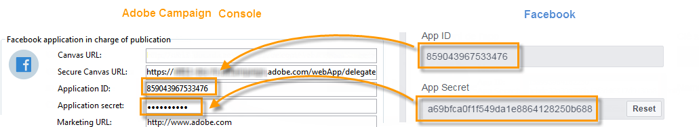

# Publicación en muros de Facebook{#publishing-on-facebook-walls}

Para que Adobe Campaign pueda enviar publicaciones a los muros de Facebook, debe delegar el acceso de escritura para estas páginas a Adobe Campaign. Esto implica los siguientes pasos de configuración:

1. Cree una cuenta de Facebook con una o varias páginas.
1. Cree una página de prueba de Facebook para enviar pruebas.
1. Cree una aplicación de Facebook.
1. Introduzca la configuración de la aplicación de Facebook en Adobe Campaign, en la cuenta externa de **[!UICONTROL Facebook routing]**.

## Requisitos previos {#prerequisites}

Comience creando una cuenta de Facebook y varias páginas: se van a utilizar para enviar publicaciones.

* Para crear una cuenta de Facebook, utilice el vínculo [https://www.facebook.com](https://www.facebook.com).
* Para crear una página de Facebook, utilice el enlace [https://www.facebook.com/pages/create.php](https://www.facebook.com/pages/create).

   Se recomienda usar la misma cuenta de Facebook para administrar todas las páginas. De este modo solo necesita una aplicación de Facebook y una cuenta externa para escribir en todas las páginas de la cuenta.

   

## Creación de una página de Facebook de prueba {#creating-a-test-facebook-page}

Se recomienda crear una página privada de Facebook para enviar pruebas de publicación (para obtener más información, consulte [Envío de la prueba](../../social/using/publishing-on-facebook.md#sending-the-proof).

1. Inicie sesión en la cuenta de Facebook que utiliza para administrar sus páginas.
1. Cree una nueva página de Facebook.
1. Haga clic en el botón **[!UICONTROL Settings]** en la esquina superior derecha.
1. En la pestaña **[!UICONTROL General]**, modifique los parámetros de visibilidad de la página: marque la casilla **[!UICONTROL Page unpublished]**.
1. Haga clic en el botón **[!UICONTROL Save Changes]**.

## Creación de una aplicación de Facebook {#creating-a-facebook-application}

Para que Adobe Campaign pueda publicar en los muros de sus páginas, debe crear una aplicación de Facebook. Para ello, siga los siguientes pasos:

1. Inicie sesión en la cuenta de Facebook que utiliza para administrar páginas.
1. Escriba la siguiente dirección en el explorador: [https://developers.facebook.com/apps](https://developers.facebook.com/apps).

   >[!IMPORTANT]
   >
   >Según el tipo de cuenta que tenga, puede que se necesiten una o más autorizaciones.
   >
   >Para crear una aplicación de Facebook, necesita una cuenta de Facebook **verificada**.

1. Haga clic en el botón **[!UICONTROL Add a New App]** en la esquina superior derecha de la página. Introduzca un nombre de aplicación y un correo electrónico de contacto. Luego, pase la comprobación de seguridad.

   

1. En **[!UICONTROL Settings > Basic]**, haga clic en **[!UICONTROL Add a platform]** y seleccione el tipo **[!UICONTROL Facebook Web Games]**.

   

1. En la sección **[!UICONTROL Products]**, en el menú de la izquierda, compruebe que puede ver el producto **[!UICONTROL Facebook Login]**. Si no es así, añada un nuevo producto y seleccione **[!UICONTROL Facebook Login]**.

   

1. Una vez creada la aplicación, seleccione la pestaña **[!UICONTROL App Review]** y publique la aplicación.

   

## Delegación del acceso de escritura a Adobe Campaign {#delegating-write-access-to-adobe-campaign}

Para delegar el acceso de escritura a Adobe Campaign para publicarlo en los muros de sus páginas, debe introducir los parámetros de la aplicación de Facebook creada anteriormente.

Este paso requiere acceso a la consola de Adobe Campaign y a un explorador de Internet que haya iniciado sesión en la cuenta de Facebook que utilice para la administración de páginas:

>[!IMPORTANT]
>
>El operador de Adobe Campaign debe tener derechos de administración para llevar a cabo esta configuración.

* **Facebook**: seleccione la aplicación creada anteriormente ([https://developers.facebook.com/apps](https://developers.facebook.com/apps)) y seleccione la pestaña **[!UICONTROL Settings > Basic]**.

   

   >[!NOTE]
   >
   >Si no aparece la sección **[!UICONTROL Facebook Web Games]**, haga clic en el botón **[!UICONTROL Add Platform]**, en la parte inferior de la página, y seleccione **[!UICONTROL Facebook Web Games]**.

* **Adobe Campaign**: vaya al nodo **[!UICONTROL Administration > Platform > External Accounts]** externas del árbol, seleccione la cuenta externa de **[!UICONTROL Facebook routing]** y haga clic en la pestaña **[!UICONTROL Connector]**.

   

1. En la consola de Adobe Campaign, copie la dirección contenida en el campo **[!UICONTROL Secure Canvas URL]** y péguela en el campo **[!UICONTROL Secure Web Games URL (https)]** en Facebook (en la sección **[!UICONTROL Facebook Web Games]**).

   

   >[!IMPORTANT]
   >
   >Evite utilizar la dirección URL no segura bajo cualquier circunstancia.

   Copie y pegue esta dirección URL también en **[!UICONTROL Products]** > **[!UICONTROL Facebook Login]** > **[!UICONTROL Settings]** > **[!UICONTROL Valid OAuth Redirect URIs]**. Para comprobar la validez de la URL, guarde la aplicación, copie y pegue la URL en el campo **[!UICONTROL Redirect URI to Check]** y haga clic en **[!UICONTROL Check URI]**.

   

1. En Facebook, copie el contenido de los campos **[!UICONTROL App ID]** y **[!UICONTROL App Secret]** y péguelo en los campos coincidentes de la consola.

   

1. En Facebook, haga clic en el botón **[!UICONTROL Save Changes]** en la parte inferior de la página.
1. Vaya a la consola de Adobe Campaign y guarde la cuenta externa.

   >[!NOTE]
   >
   >El campo **[!UICONTROL Marketing URL]** es opcional.

1. En la consola de Adobe Campaign, haga clic en el vínculo **[!UICONTROL Request the authorization from the application]** situado en la parte inferior de la pestaña **[!UICONTROL Connector]**. El flujo de trabajo **[!UICONTROL Synchronize Facebook pages]** se activa automáticamente y recopila todas las páginas de Facebook gestionadas por el administrador. Para obtener más información, consulte [Sincronización de páginas de Facebook](#synchronizing-facebook-pages).

   

   >[!NOTE]
   >
   >De forma predeterminada, las páginas se añaden a la carpeta de servicios de **[!UICONTROL Facebook]**, disponible mediante el nodo **[!UICONTROL Profiles and Targets > Services and Subscriptions]**. El campo **[!UICONTROL Folder]** de la pestaña **[!UICONTROL Connector]** permite cambiar la carpeta de servicio en la que se crean las páginas de Facebook después de la sincronización. También puede seleccionar las páginas de Facebook que desea sincronizar en Adobe Campaign gracias al campo **[!UICONTROL Filter]**. Si deja este campo vacío, se sincronizan todas las páginas de Facebook gestionadas por el administrador.

1. Se muestra un cuadro de diálogo con los diferentes ajustes de permisos de Facebook. Esto permite a Adobe Campaign enviar publicaciones a las páginas de cuenta de Facebook.

   Acepte las distintas solicitudes de permiso.

   

1. Se ha concedido a Adobe Campaign el derecho de publicar en los muros de las páginas de la cuenta de Facebook.

   

>[!NOTE]
>
>Si la cuenta de Facebook administra varias páginas, simplemente configure una cuenta externa para escribir en cualquier página de la cuenta de Facebook. Para cada nueva cuenta de Facebook, debe crear una nueva cuenta externa de tipo **[!UICONTROL Routing]**.

El flujo de trabajo **[!UICONTROL Synchronization of Facebook pages]** sincroniza todas las páginas administradas por la cuenta de Facebook, para permitirle publicar en su muro directamente a través de Adobe Campaign. Para obtener más información, consulte [Sincronización de páginas de Facebook](#synchronizing-facebook-pages).

## Sincronización de páginas de Facebook {#synchronizing-facebook-pages}

El flujo de trabajo de **[!UICONTROL Synchronization of Facebook pages]**, al que se accede mediante el nodo **[!UICONTROL Administration > Production > Technical workflows > Managing social networks]**, permite sincronizar (en Adobe Campaign) las páginas de la cuenta de Facebook configurada previamente. De forma predeterminada, este flujo de trabajo está configurado para ejecutarse una vez al día o siempre que un administrador haga clic en el vínculo **[!UICONTROL Request an authorization from the application]** en la pantalla de configuración del servicio (consulte [Delegación de acceso de escritura a Adobe Campaign](#delegating-write-access-to-adobe-campaign)).

Una vez finalizada la sincronización, las páginas recopiladas aparecen en la carpeta de servicios introducida en la cuenta externa (consulte [Delegación del acceso de escritura a Adobe Campaign](#delegating-write-access-to-adobe-campaign)). De forma predeterminada, las páginas se añaden a la raíz de la carpeta de servicios de **[!UICONTROL Facebook]**, que está disponible a través del menú **[!UICONTROL Profiles and Targets > Services and subscriptions]**.

Ahora puede publicar en los muros de sus páginas de Facebook directamente a través de Adobe Campaign. Para obtener más información, consulte [Publicación en Facebook](#publishing-on-facebook-walls).
