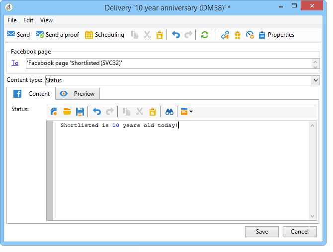
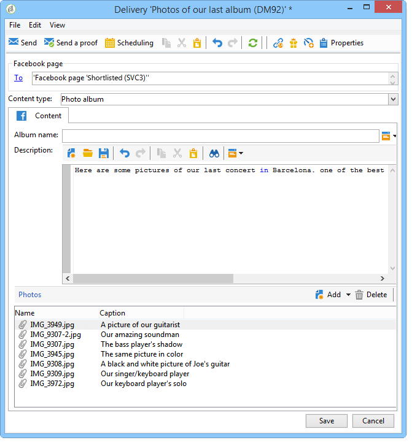

# Publicación en Facebook{#publishing-on-facebook}

Una vez completada la configuración, Social Marketing le permite publicar publicaciones en los muros de sus páginas de Facebook.

## Limitaciones {#limitations}

Las siguientes limitaciones son inherentes a Facebook.

* Las cadenas no deben superar los 1.000 caracteres.
* No se admite HTML.

## Creación de la entrega {#creating-the-delivery}

Cree una nueva entrega con la plantilla **[!UICONTROL Publish to a brand page]**.

## Selección del objetivo principal {#selecting-the-main-target}

Debe seleccionar las páginas en las que desea publicar la publicación.

1. Haga clic en el vínculo **[!UICONTROL To]**.

   

1. Haga clic en el botón **[!UICONTROL Add]**.

   

1. Seleccione **[!UICONTROL A Facebook page]**.

   

1. En el campo **[!UICONTROL Folder]**, seleccione la carpeta de servicios que contiene la página de Facebook. De forma predeterminada, las páginas se almacenan en la raíz de la carpeta de servicios de **[!UICONTROL Facebook]**. A continuación, seleccione la página de Facebook en la que desee publicar.

   

## Selección del destino de la prueba {#selecting-the-proof-target}

La pestaña **[!UICONTROL Target of the proofs]** le permite definir la página de Facebook que desea utilizar para probar los envíos antes de enviarlos. Recomendamos crear una página privada de Facebook dedicada a este fin. Para obtener más información sobre la creación de una página privada de Facebook, consulte [Creación de una página de Facebook de prueba](../../social/using/publishing-on-facebook-walls.md#creating-a-test-facebook-page). Para seleccionar el objetivo de prueba, aplique los mismos pasos que para el objetivo principal: [Selecting the main target](#selecting-the-main-target).

>[!NOTE]
>
>Si está utilizando la misma página de prueba de Facebook para todas las entregas, puede guardar el objetivo de prueba en la plantilla de entrega **[!UICONTROL Publish to a brand page]**, a la que se accede mediante el nodo **[!UICONTROL Resources > Templates > Delivery templates]**. El objetivo de prueba se especificará de forma predeterminada para cada nueva entrega.

## Definición de la audiencia {#defining-the-audience}

Si desea utilizar segmentos locales para reducir el tipo de público autorizado para ver la publicación, le recomendamos que cree una página de Facebook por segmento (por ejemplo: Adobe Campaign París, Adobe Campaign Londres, etc.).

Sin embargo, también es posible utilizar los filtros de audiencia utilizados por Facebook. La pestaña **[!UICONTROL Audience]** de **[!UICONTROL Select target window]** ofrece cuatro filtros:

* **[!UICONTROL Country]**
* **[!UICONTROL Regions]**
* **[!UICONTROL Cities]**
* **[!UICONTROL Languages]**

>[!IMPORTANT]
>
>Utilice esta función con cuidado. En los informes de entrega, el indicador **[!UICONTROL Number of fans]** no tendrá en cuenta estos filtros de Facebook.
>
>Facebook puede cambiar la lista de filtros de audiencia así como sus valores.

## Definición del contenido del mensaje {#defining-message-content}

Seleccione el tipo de publicación mediante el menú desplegable **[!UICONTROL Content type]**.

Los siguientes tipos de medidas están disponibles:

* a **[!UICONTROL Status]**
* a **[!UICONTROL Status with a link]**
* a **[!UICONTROL Status with a YouTube link]**
* a **[!UICONTROL Photo album]**

### Publicación de un estado {#publishing-a-status}

Una entrega de tipo de estado solo puede contener texto, como en el ejemplo siguiente:

Introduzca el estado de la publicación en la zona de entrada.

### Publicación de un estado con un vínculo {#publishing-a-status-with-a-link}

Una entrega de tipo de estado con un vínculo puede contener texto, imágenes y un vínculo. La siguiente sección detalla la simetría entre los campos de la pantalla de edición de la entrega y la publicación final en Facebook:

Introduzca los distintos campos:

>[!IMPORTANT]
>
>Todas las direcciones URL deben comenzar con **&quot;http://&quot;** o **&quot;https://&quot;**.

1. En el campo **[!UICONTROL Status]**, escriba el texto que se mostrará bajo el nombre de la página.
1. En el campo **[!UICONTROL Name]**, introduzca el título de la publicación.
1. En el campo **[!UICONTROL Link]**, introduzca la URL a la que apunta la publicación.

   >[!NOTE]
   >
   >Si desea agregar el campo **[!UICONTROL Link]** a la URL de una aplicación de Facebook para promocionarla, le recomendamos que lo adapte a los criterios de visualización del smartphone:
   >
   >1. Seleccione la aplicación de Facebook [https://developers.facebook.com/apps](https://developers.facebook.com/apps)y seleccione la pestaña **[!UICONTROL Settings > Basic]**.
   >1. Introduzca el campo **[!UICONTROL Namespace]**.
   >1. Introduzca el campo **[!UICONTROL Mobile Site URL]**: cuando un usuario hace clic en el vínculo de publicación en su smartphone, Facebook los redirigirá automáticamente a la URL definida en este campo.
   >1. Cree su aplicación web para que la pantalla de Facebook se personalice como una función del dispositivo utilizado (smartphone o PC).
   >1. Vaya al campo **[!UICONTROL Link]** de la publicación a través de la consola de Adobe Campaign, introduzca la URL del campo **[!UICONTROL Canvas page]**.

1. En el campo **[!UICONTROL Image]**, introduzca la dirección URL de la imagen que se mostrará a la izquierda de la publicación.

   >[!IMPORTANT]
   >
   >La imagen debe estar alojada en un sitio público de internet para que Facebook pueda cargarla.

1. En el campo **[!UICONTROL Caption]**, introduzca el texto que aparecerá al final de la publicación.
1. Vaya al campo **[!UICONTROL Description]** e introduzca el texto que se mostrará debajo del título.

### Publicación de un estado con un vínculo de YouTube {#publishing-a-status-with-a-youtube-link}

Este tipo de contenido le permite publicar un vínculo a un vídeo de YouTube. Al igual que un estado con un vínculo normal, puede definir un estado, un nombre, un rótulo, una descripción y un vínculo adicional. Facebook agrega la imagen automáticamente. A continuación se detallan las simetrías entre los campos de la pantalla de edición de envíos y la publicación final en Facebook:

Introduzca los distintos campos:

>[!IMPORTANT]
>
>Todas las direcciones URL deben comenzar con **&quot;http://&quot;** o **&quot;https://&quot;**.

1. En el campo **[!UICONTROL Status]**, escriba el texto que se mostrará bajo el nombre de la página.
1. En el campo **[!UICONTROL Name]**, introduzca el título de la publicación.
1. En el campo **[!UICONTROL Video code]**, introduzca el código del vídeo de YouTube. Por ejemplo, para el vínculo &#39;https://www.youtube.com/watch?v=abc123456&#39;, el código de vídeo será &#39;abc123456&#39;.
1. En el campo **[!UICONTROL Caption]**, introduzca el texto que aparecerá al final de la publicación.
1. Vaya al campo **[!UICONTROL Description]** e introduzca el texto que se mostrará debajo del título.

### Publicación de un álbum de fotos {#publishing-a-photo-album}

Este tipo de contenido le permite publicar un álbum de fotos. Puede agregar un nombre y una descripción para el álbum, así como un rótulo para cada foto. A continuación se detallan las simetrías entre los campos de la pantalla de edición de envíos y la publicación final en Facebook:

Introduzca los distintos campos:

1. Comience por introducir **[!UICONTROL Album name]**.
1. A continuación, introduzca la **[!UICONTROL Description]** que se mostrará encima de las fotos.
1. Para agregar una foto, haga clic en el botón **[!UICONTROL Add]**, seleccione la foto y haga clic en **[!UICONTROL Open]**.
1. Se puede añadir un rótulo a cada foto.

## Vista previa {#previewing}

La pestaña **[!UICONTROL Preview]** permite ver la renderización de la publicación.

1. Seleccione la pestaña **[!UICONTROL Preview]**.
1. Haga clic en el menú desplegable **[!UICONTROL Test personalization]** y seleccione **[!UICONTROL Service]**.
1. En el campo **[!UICONTROL Folder]**, seleccione la carpeta de servicio que contiene las páginas de Facebook. De forma predeterminada, las páginas se almacenan en la raíz de la carpeta de servicios de **[!UICONTROL Facebook]**.
1. Seleccione la página de Facebook en la que desee probar la vista previa.

>[!NOTE]
>
>La vista previa puede diferir ligeramente de la publicación final de Facebook. Recomendamos encarecidamente enviar una prueba antes de la entrega final para una representación exacta de la publicación. Consulte [Envío de la prueba](#sending-the-proof).

## Configuración del seguimiento {#configuring-tracking}

El seguimiento se puede ver en los informes de entrega y en la pestaña **[!UICONTROL Edit > Tracking]** de la entrega y el servicio.

Adobe Campaign mide los clics en la dirección URL contenida en la entrega. El número de clics en el botón **[!UICONTROL Like]**, el número de comentarios y el número de seguidores medidos por Facebook.

La configuración de seguimiento es la misma que para una entrega de correo electrónico. Para obtener más información, consulte [esta sección](../../delivery/using/about-delivery-monitoring.md).

>[!NOTE]
>
>En la plantilla de entrega de **[!UICONTROL Publish to a brand page]**, el seguimiento está habilitado de forma predeterminada.

## Envío de una prueba {#sending-the-proof}

Se recomienda encarecidamente enviar una prueba de la publicación antes de la entrega final para ver la representación exacta de la publicación en una página de prueba privada de Facebook. Para obtener más información sobre la creación de una página de prueba privada de Facebook, consulte [Creación de una página de prueba de Facebook](../../social/using/publishing-on-facebook-walls.md#creating-a-test-facebook-page). Los pasos para seleccionar la prueba de destino se detallan en [Selección del destino de prueba](#selecting-the-proof-target).

La entrega de la prueba es idéntico a los envíos por correo electrónico. Consulte [esta sección](../../delivery/using/steps-validating-the-delivery.md#sending-a-proof).

## Envío de mensajes {#sending-the-message}

1. Una vez aprobado el contenido, haga clic en el botón **[!UICONTROL Send]**.
1. Seleccione **[!UICONTROL Deliver as soon as possible]** y haga clic en el botón **[!UICONTROL Analyze]**.

   >[!NOTE]
   >
   >La opción **[!UICONTROL Postpone the delivery]** permite posponer la entrega a una fecha posterior.

   

1. Una vez completado el análisis, compruebe el resultado.
1. Haga clic en **[!UICONTROL Confirm delivery]**, luego en **[!UICONTROL Yes]**.

   
