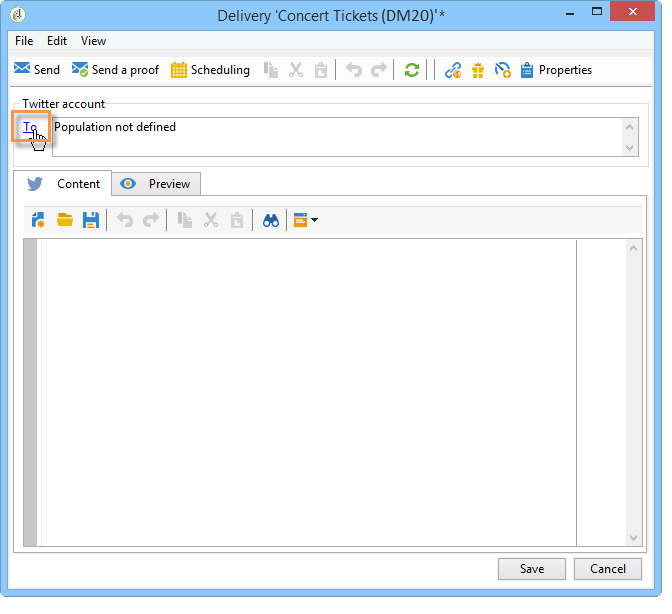
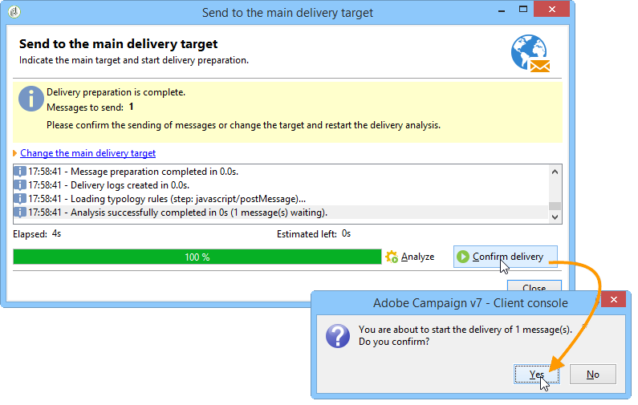
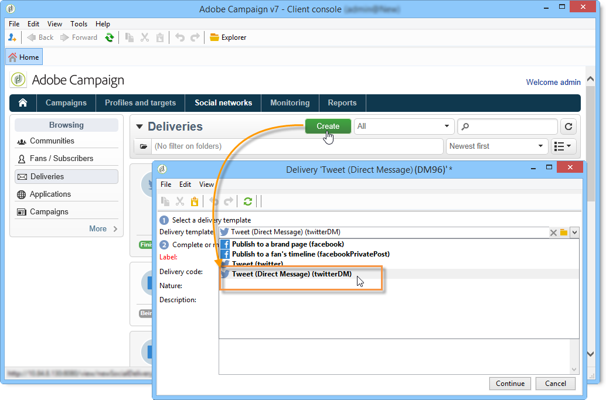

# Publicación en Twitter{#publishing-on-twitter}

## Publicación en sus cuentas de Twitter {#publishing-on-your-twitter-accounts}

Una vez completada la configuración, Social Marketing le permite enviar tweets a sus cuentas de Twitter.

### Limitaciones {#limitations}

Las siguientes limitaciones son restricciones inherentes a Twitter.

* El mensaje no puede exceder los 140 caracteres.
* No se admite el formato HTML.

### Creación de la entrega {#creating-the-delivery}

Cree una nueva entrega basada en la plantilla de envíos de **[!UICONTROL Tweet (twitter)]**.

### Selección del objetivo principal {#selecting-the-main-target}

Seleccione las cuentas a las que desee enviar tweets.

1. Haga clic en el vínculo **[!UICONTROL To]**.

   

1. Haga clic en el botón **[!UICONTROL Add]**.

   

1. Seleccione **[!UICONTROL A Twitter account]**.

   

1. En el campo **[!UICONTROL Folder]**, seleccione la carpeta de servicio que contiene la cuenta de Twitter. A continuación, seleccione la cuenta de Twitter a la que desee enviar el tweet.

   

### Selección del objetivo de la prueba {#selecting-the-target-of-the-proof}

La pestaña **[!UICONTROL Target of the proofs]** le permite definir la cuenta de Twitter que se utiliza para las entregas de prueba antes de la entrega final. Por lo tanto, recomendamos crear una cuenta privada de Twitter dedicada a la entrega de pruebas. Para obtener más información sobre cómo crear una cuenta privada de Twitter, consulte [Creación de una cuenta de prueba en Twitter](../../social/using/configuring-publishing-on-twitter.md#creating-a-test-account-on-twitter). Los pasos para seleccionar el objetivo de prueba son los mismos que para seleccionar el objetivo principal. Consulte [Creación de una cuenta de prueba en Twitter](../../social/using/configuring-publishing-on-twitter.md#creating-a-test-account-on-twitter).

>[!NOTE]
>
>Si utiliza la misma cuenta de prueba de Twitter para todas las entregas, puede guardar el objetivo de prueba en la plantilla de entrega de **[!UICONTROL Tweet]**, a la que se accede mediante el nodo **[!UICONTROL Resources > Templates > Delivery templates]**. El objetivo de prueba se especifica de forma predeterminada para cada nueva entrega.

### Definición del contenido del mensaje {#defining-the-message-content}

Escriba el contenido del tweet en la pestaña **[!UICONTROL Content]**.

### Visualización de la vista previa {#viewing-the-preview}

La pestaña **[!UICONTROL Preview]** permite controlar la renderización del tweet.

1. Seleccione la pestaña **[!UICONTROL Preview]**.
1. Haga clic en el menú desplegable **[!UICONTROL Test personalization]** y seleccione **[!UICONTROL Service]**.
1. En el campo **[!UICONTROL Folder]**, seleccione la carpeta de servicio que contiene su cuenta de Twitter.
1. Elija la cuenta de Twitter con la que desea probar la vista previa.

>[!NOTE]
>
>La vista previa puede diferir ligeramente del tweet final. Recomendamos encarecidamente enviar una prueba antes de la entrega final para ver una representación exacta del tweet. Consulte [Envío de la prueba](#sending-the-proof).

### Configuración del seguimiento {#configuring-tracking}

El seguimiento se puede ver en los informes de entrega y en la pestaña **[!UICONTROL Edit > Tracking]** de la entrega y el servicio.

La configuración de seguimiento es la misma que para una entrega de correo electrónico. Para obtener más información, consulte [esta sección](../../delivery/using/about-delivery-monitoring.md).

>[!NOTE]
>
>En la plantilla de entrega de **[!UICONTROL Tweet]**, el seguimiento está habilitado de forma predeterminada.

>[!IMPORTANT]
>
>No podemos distinguir entre robots que analizan tweets y usuarios que hacen clic.

### Envío de una prueba {#sending-the-proof}

Le recomendamos encarecidamente que envíe una prueba de su publicación antes de la entrega final para obtener una representación exacta de la publicación en una página privada de prueba de Twitter. Para obtener más información sobre la creación de una cuenta privada de Twitter, consulte [Creación de una cuenta de prueba en Twitter](../../social/using/configuring-publishing-on-twitter.md#creating-a-test-account-on-twitter). Los pasos para seleccionar el objetivo de prueba se detallan en [Selección del objetivo de la prueba](#selecting-the-target-of-the-proof).

La entrega de la prueba es idéntico a los envíos por correo electrónico. Consulte [esta sección](../../delivery/using/steps-validating-the-delivery.md#sending-a-proof).

### Envío de mensajes {#sending-the-message}

1. Una vez aprobado el contenido, haga clic en el botón **[!UICONTROL Send]**.
1. Seleccione **[!UICONTROL Deliver as soon as possible]** y haga clic en el botón **[!UICONTROL Analyze]**.

   >[!NOTE]
   >
   >La opción **[!UICONTROL Postpone the delivery]** permite posponer la entrega a una fecha posterior.

   

1. Una vez finalizado el análisis, compruebe el resultado.
1. Haga clic en **[!UICONTROL Confirm delivery]**, luego en **[!UICONTROL Yes]**.

## Envío de mensajes directos a los suscriptores {#sending-direct-messages-to-subscribers}

### Principio de funcionamiento {#operating-principle}

El flujo de trabajo **[!UICONTROL Synchronize Twitter accounts]** (consulte [Sincronización de cuentas de Twitter](../../social/using/configuring-publishing-on-twitter.md#synchronizing-twitter-accounts)) recupera la lista de suscriptores de Twitter para que pueda enviarles mensajes directos. Los seguidores recuperados se almacenan en una tabla específica: la tabla de visitantes. Para mostrar la lista de seguidores de Twitter, vaya al nodo **[!UICONTROL Profiles and Targets > Visitors]**.

>[!IMPORTANT]
>
>Para que el flujo de trabajo pueda recuperar la lista de seguidores de Twitter, la casilla **[!UICONTROL Synchronize Twitter accounts]** debe activarse en la pantalla Editar del servicio vinculado a la cuenta. Para obtener más información, consulte: [Delegación del acceso de escritura a Adobe Campaign](../../social/using/configuring-publishing-on-twitter.md#delegating-write-access-to-adobe-campaign).

Para cada seguidor, Adobe Campaign recupera la siguiente información:

* **[!UICONTROL Origin]**: nombre de la red social (**Twitter** en este caso)
* **[!UICONTROL External ID]**: identificador de usuario
* **[!UICONTROL User name]**: nombre de cuenta del usuario
* **[!UICONTROL Full name]**: nombre del usuario
* **[!UICONTROL Language]**: idioma del usuario
* **[!UICONTROL Number of friends]**: número de seguidores
* **[!UICONTROL Time zone]**: zona horaria del usuario
* **[!UICONTROL Verified]**: este campo indica si el usuario tiene una cuenta de Twitter verificada

### Limitaciones {#limitations-1}

Las siguientes limitaciones son restricciones inherentes a Twitter.

* El mensaje no puede exceder los 140 caracteres.
* No se admite HTML.
* No puede enviar más de 250 mensajes directos al día. Para evitar superar este umbral, puede realizar envíos en varias olas. Los envíos en olas están configurados como los envíos por correo electrónico. Para obtener más información, consulte [esta sección](../../delivery/using/steps-sending-the-delivery.md#sending-using-multiple-waves).

### Creación de la entrega {#creating-the-delivery-}

Cree una nueva entrega basada en la plantilla de envíos de **[!UICONTROL Tweet (Direct Message)]**.

### Selección del objetivo principal {#selecting-the-main-target-1}

Seleccione los seguidores a los que desee enviar el mensaje directo.

1. Haga clic en el vínculo **[!UICONTROL To]**.

   

1. Haga clic en el botón **[!UICONTROL Add]**.

   

1. Seleccione un tipo de objetivo.

   

   * Seleccione **[!UICONTROL Twitter subscribers]** para enviar un mensaje directo a todos los seguidores de la cuenta.

      >[!IMPORTANT]
      >
      >No puede enviar más de 250 mensajes al día. Si su cuenta de Twitter tiene más de 250 seguidores, le recomendamos encarecidamente que realice envíos en olas. Esto implica el mismo proceso que los envíos por correo electrónico. Consulte [esta sección](../../delivery/using/steps-sending-the-delivery.md#sending-using-multiple-waves).

   * Seleccione **[!UICONTROL Filter conditions]** para definir una consulta y ver su resultado. Esta opción es la misma que para los envíos por correo electrónico. Consulte [esta sección](../../platform/using/defining-filter-conditions.md) para obtener más información.

      

### Selección del objetivo de la prueba {#selecting-the-target-of-the-proof-1}

La pestaña **[!UICONTROL Target of the proofs]** le permite seleccionar el seguidor que recibe la prueba del mensaje directo. El proceso de selección es el mismo que para el objetivo principal. Consulte [Selección del objetivo principal](#selecting-the-main-target)

>[!NOTE]
>
>Si desea enviar todas las pruebas de los mensajes directos al mismo seguidor de Twitter, puede guardar el objetivo de prueba en la plantilla de entrega de **[!UICONTROL Tweet (Direct Message)]**, a la que se accede mediante el nodo **[!UICONTROL Resources > Templates > Delivery templates]**. El objetivo de prueba se especifica de forma predeterminada para cada nueva entrega.

### Definición del contenido del mensaje {#defining-message-content-}

Introduzca el contenido del tweet en la pestaña **[!UICONTROL Content]**.

Los campos de personalización se pueden usar del mismo modo que para los envíos por correo electrónico, por ejemplo, para agregar el nombre del seguidor en el cuerpo del mensaje. La personalización de contenido se detalla en [esta sección](../../delivery/using/about-personalization.md).

Los siguientes pasos son los mismos que para enviar un tweet a una cuenta de Twitter. Consulte [Publicación en sus cuentas de Twitter](#publishing-on-your-twitter-accounts).
