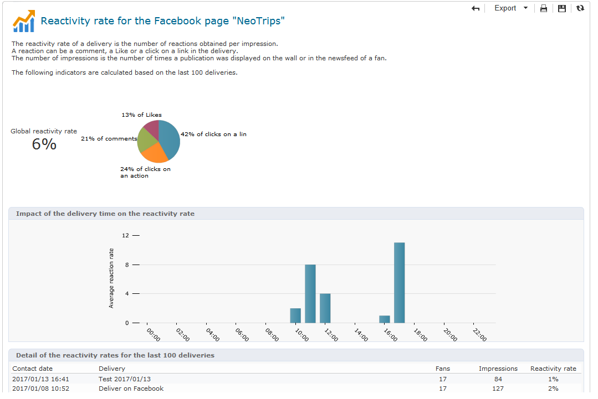
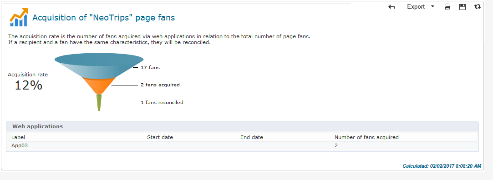

# Seguimiento{#tracking}

Social Marketing proporciona informes que le permiten medir la tasa de reactividad de las entregas de Facebook y Twitter, y analizar la adquisición de perfiles de Facebook. Estas son las opciones disponibles:

* El informe de **[!UICONTROL Reactivity rate]**, disponible a través de la pestaña **[!UICONTROL Summary]** de una entrega a Facebook o Twitter.

   

* El informe **[!UICONTROL Reactivity rate]**, disponible a través de la pestaña **[!UICONTROL Dashboard]** de un servicio de Twitter o Facebook.

   

* El informe **[!UICONTROL Fan acquisition]**, disponible a través de la pestaña **[!UICONTROL Dashboard]** de un servicio de Facebook.

   
