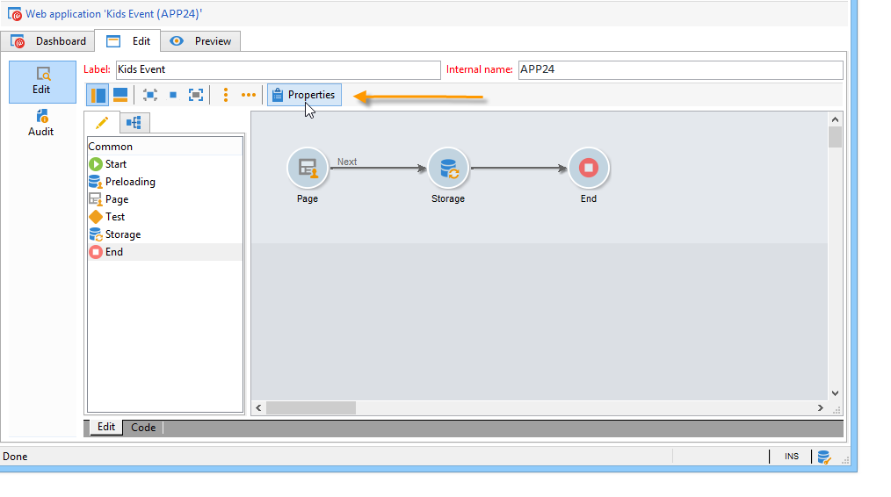

# Configuración de encuestas en línea{#configuring-surveys}

## Propiedades de encuesta {#survey-properties}

Las encuestas en línea son totalmente configurables y personalizables para satisfacer sus necesidades. Los parámetros deben introducirse en la ventana de propiedades.

Los parámetros disponibles se explican en [este documento](../../web/using/defining-web-forms-properties.md).

## Almacenamiento de datos de encuestas {#survey-data-storage}

De forma predeterminada, los campos de formulario web se almacenan en la tabla de destinatarios. Para usar otra tabla, selecciónela en el campo **[!UICONTROL Document type]**. El icono **[!UICONTROL Zoom]** le permite ver el contenido de la tabla seleccionada.

Las respuestas a las encuestas proporcionadas por los usuarios que no se almacenen en los campos (sino en las variables locales), se almacenan en los campos **Respuestas a las encuestas.** Puede cambiar el esquema utilizado basándose en el campo **[!UICONTROL Library]**. Este campo solo está disponible para las **encuestas**.
