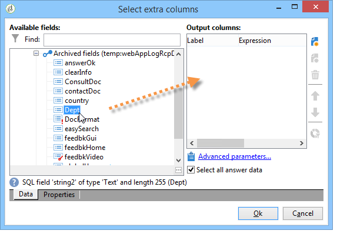
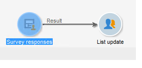
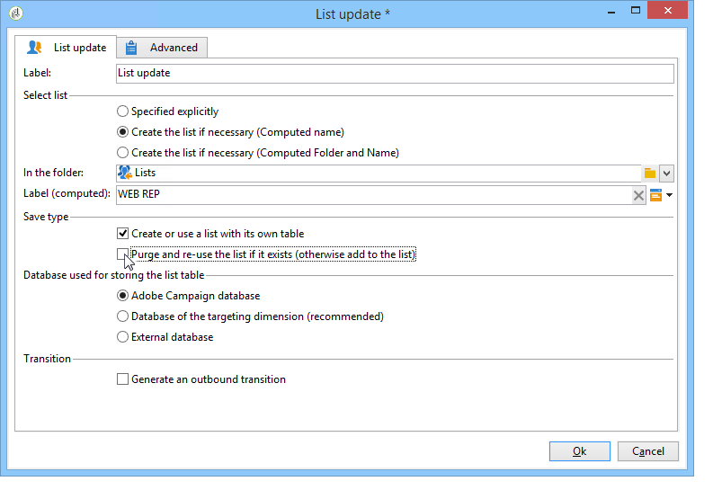
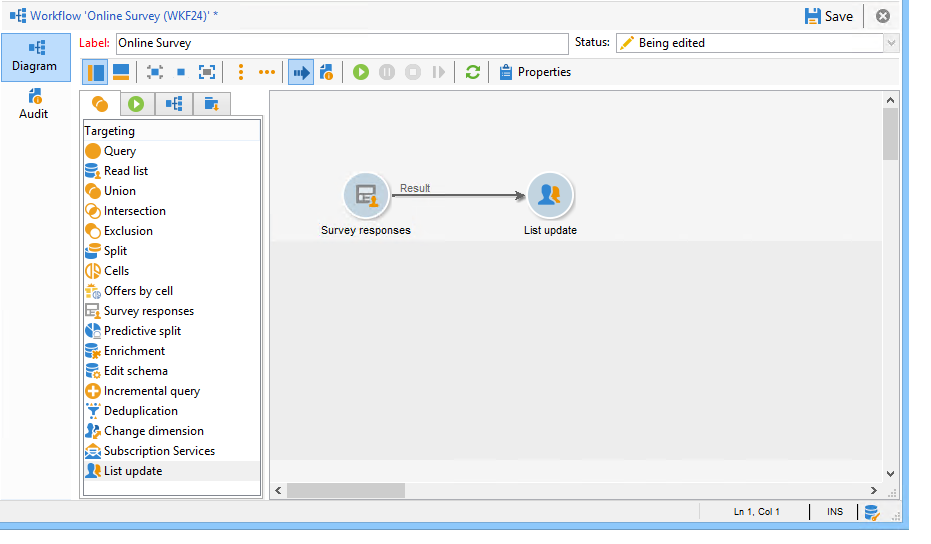
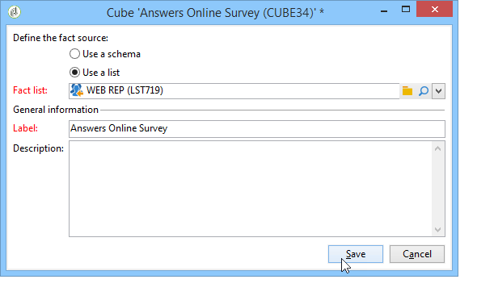
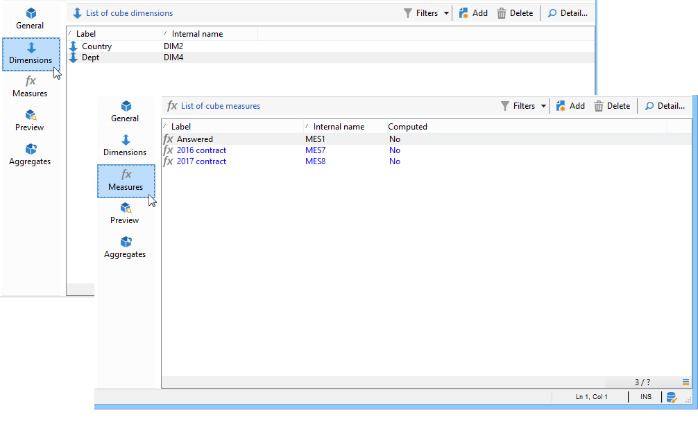
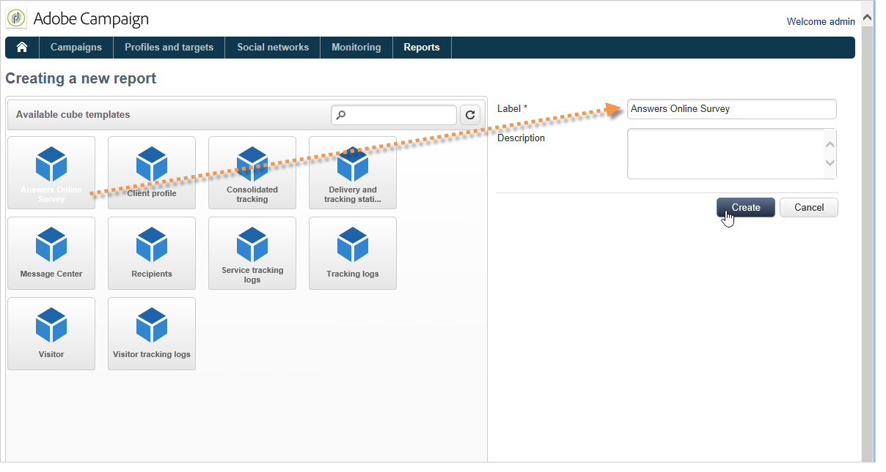

# Caso de uso: visualización del informe con las respuestas a una encuesta en línea{#use-case-displaying-report-on-answers-to-an-online-survey}

Las respuestas a las encuestas de Adobe Campaign se pueden recopilar y analizar mediante informes dedicados.

En el siguiente ejemplo, deseamos recopilar respuestas a una encuesta en línea y mostrarlas en una tabla dinámica.

Siga estos pasos:

1. Creación de un flujo de trabajo para recuperar respuestas a la encuesta y almacenarlas en una lista.
1. Creación de un cubo con los datos de la lista.
1. Creación de un informe con la tabla dinámica y visualización del desglose de las respuestas.

Antes de comenzar este ejemplo de uso, debe tener acceso a una encuesta y a un conjunto de respuestas que pueda analizar.

>[!NOTE]
>
>Este ejemplo de uso solo puede implementarse si se ha adquirido la opción **Survey Manager.** Compruebe el acuerdo de licencia.

## Paso 1: Creación de la recopilación de datos y el flujo de trabajo de almacenamiento {#step-1---creating-the-data-collection-and-storage-workflow}

Para recopilar las respuestas a la encuesta, realice los pasos siguientes:

1. Cree un flujo de trabajo y añada una actividad **[!UICONTROL Answers to a survey]**. Para obtener más información sobre esta actividad, consulte [esta sección](../../surveys/using/publish-track-and-use-collected-data.md#using-the-collected-data).
1. Edite la actividad y seleccione la encuesta cuyas respuestas desee analizar.
1. Habilite la opción **[!UICONTROL Select all the answer data]** para recopilar toda la información.

   

1. Seleccione las columnas que desee extraer (en este caso, seleccione: todos los campos archivados). Son los campos que contienen las respuestas.

   

1. Una vez configurado el cuadro de recopilación de respuestas, añada una actividad de tipo **[!UICONTROL List update]** para guardar los datos.

   

   En esta actividad, especifique la lista que desea actualizar y desmarque la opción **[!UICONTROL Purge and re-use the list if it exists (otherwise add to the list)]**: las respuestas se añaden a la tabla existente. Esta opción permite hacer referencia a la lista en un cubo. El esquema vinculado a la lista no se regenera para cada actualización, lo que garantiza la integridad del cubo que utiliza esta lista.

   

1. Inicie el flujo de trabajo para confirmar su configuración.

   

   La lista especificada se crea e incluye el esquema de las respuestas a la encuesta.

1. Añada un planificador para automatizar la recopilación diaria de respuestas y la actualización de la lista.

   Las actividades **[!UICONTROL List update]** y **[!UICONTROL Scheduler]** se detallan en .

## Paso 2: Creación del cubo, sus medidas y sus indicadores {#step-2---creating-the-cube--its-measures-and-its-indicators}

Después, puede crear el cubo y configurar sus medidas: se utilizan para crear los indicadores que se van a mostrar en el informe. Para obtener más información sobre la creación y configuración de los cubos, consulte [Acerca de cubos](../../reporting/using/ac-cubes.md).

En este ejemplo, el cubo se basa en los datos de la lista suministrados por el flujo de trabajo creado anteriormente.

Defina las dimensiones y las medidas que desea mostrar en el informe. Aquí queremos mostrar la fecha del contrato y el país del encuestado.

La pestaña **[!UICONTROL Preview]** permite controlar la renderización del informe.

## Paso 3: Creación del informe y configuración del diseño de datos dentro de la tabla {#step-3---creating-the-report-and-configuring-the-data-layout-within-the-table}

Después, se puede crear un informe basado en este cubo y procesar los datos y la información.

Adapte la información para que se muestre según sus necesidades.

