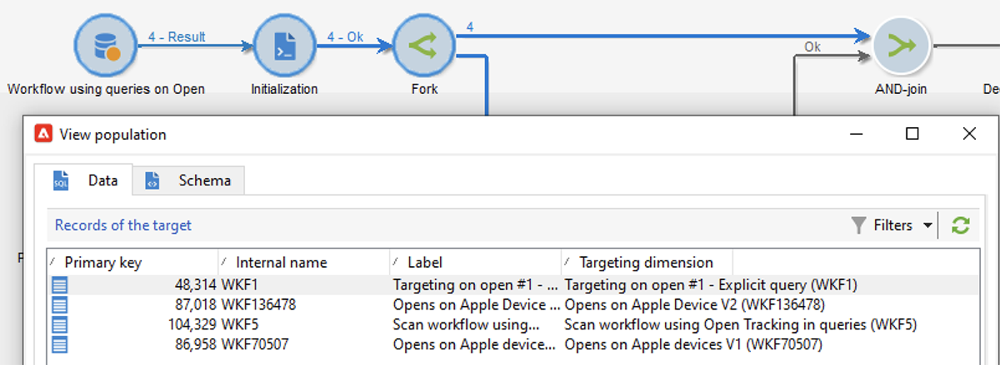
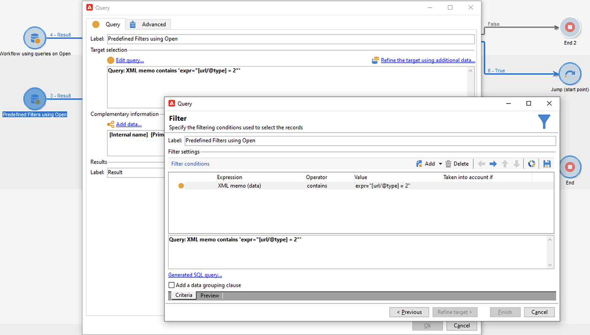
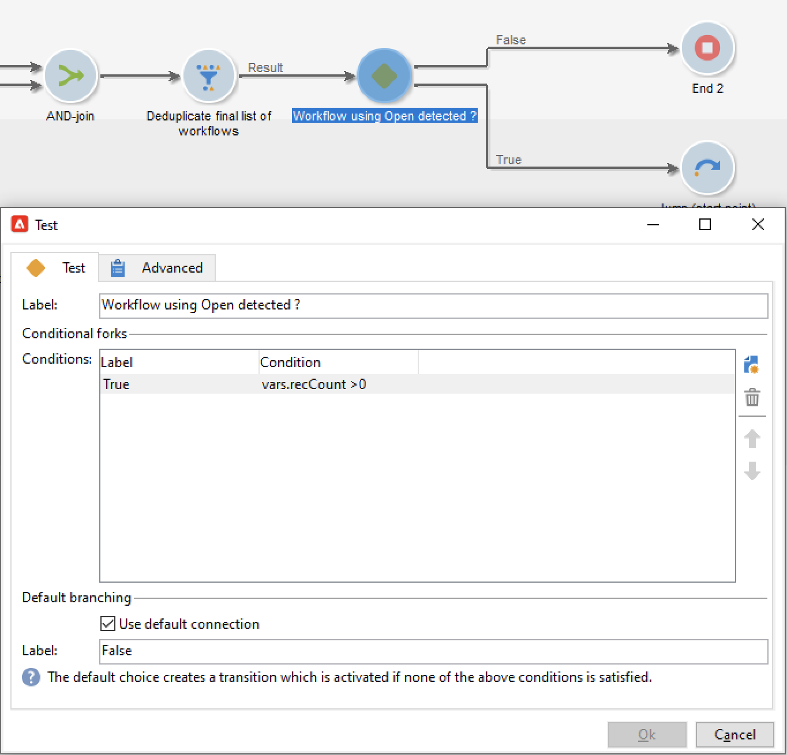
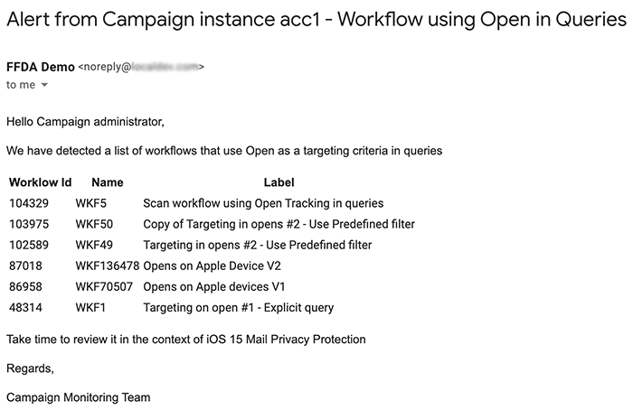
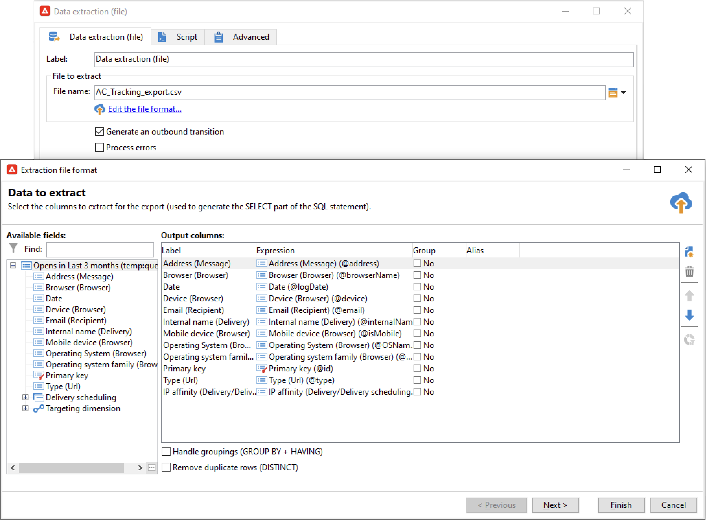

# Protección de privacidad de correo en la aplicación de correo de Apple


## ¿Qué ha cambiado?

En 2021, Apple introdujo nuevas funciones de protección de privacidad para su aplicación de correo nativa. Esta aplicación ahora incluye la función de protección de privacidad de correo de Apple. Básicamente, los remitentes ya no pueden usar píxeles de seguimiento para recopilar información sobre los destinatarios que han elegido activar la función de protección de privacidad de correo de Apple. [Más información](https://experienceleague.adobe.com/docs/deliverability-learn/deliverability-best-practice-guide/additional-resources/technotes/apple-mail-privacy-faq.html?lang=es){target=&quot;_blank&quot;}.

## ¿Cómo se ven afectadas mis campañas?

Adobe Campaign ofrece la capacidad de usar píxeles de seguimiento para rastrear las aperturas de correo electrónico. Puede utilizar esta capacidad no solo para objetivos y campañas, sino también para métricas. Por ejemplo, puede utilizar las tasas de apertura de correo electrónico para medir la eficacia de la campaña y la participación del usuario. En resumen, la segmentación, el direccionamiento y las métricas pueden verse afectadas en sus campañas. [Más información](https://experienceleague.adobe.com/docs/deliverability-learn/deliverability-best-practice-guide/additional-resources/technotes/apple-mail-privacy-faq.html#in-addition-to-measuring-opens%2C-what-else-is-impacted%3F){target=&quot;_blank&quot;}.

## ¿Qué acciones debo realizar?

La nueva función de Apple es la forma de las cosas que están por venir en el sector en términos de protección de la privacidad del correo electrónico. Le recomendamos encarecidamente que siga las recomendaciones del Adobe.

### Evaluar el impacto en los déclencheur de campaña

Evalúe cómo afectan estos cambios a los déclencheur de campaña actuales. Identifique los flujos de trabajo en los que las aperturas de correo electrónico se utilizan como criterio para la segmentación, el direccionamiento o el redireccionamiento. Lea el [sugerencias y trucos](#find-email-open-tracking).

### Conservar los datos

Preserve sus datos y consolide sus conocimientos actuales en dispositivos. Puede basar los indicadores clave de rendimiento (KPI) en el agente de usuario. Por ejemplo, puede generar KPI en torno a perfiles de personas que utilizan la aplicación de correo de iOS y Apple. Lea el [sugerencias y trucos](#preserve-tracking-data).

### Archivar los registros de seguimiento más allá del período de retención

Archive sus registros de seguimiento más allá del período de retención de Adobe Campaign:

1. Compruebe la duración del periodo de retención en la instancia de campaña.
1. Compruebe las asignaciones de destino activas. Determine si utiliza tablas de perfiles personalizadas además de la tabla de perfiles predeterminada (`nmsRecipient`).
1. Exporte sus registros de seguimiento desde Adobe Campaign. Incluya los registros que contienen datos sobre el agente de usuario y el sistema operativo.

### Evaluar la tendencia actual de los tipos de interés abiertos

Determine qué proporción de la audiencia utiliza la aplicación de correo de Apple en un dispositivo iOS.
Con esta evaluación, puede identificar posibles lagunas anómalas y su causa. Puede determinar si una brecha se debe a problemas de rendimiento de la campaña o a la funcionalidad de protección de la privacidad de Apple. Lea el [sugerencias y trucos](#measure-ios-footprint).

### Volver a evaluar la estrategia de la campaña y las métricas de rendimiento

Sobre todo, recomendamos encarecidamente que reevalúe de forma proactiva la estrategia de la campaña y las métricas de rendimiento de la campaña. Puede volver a centrarse en métricas más fiables, como pulsaciones, vistas de productos y compras.

Se recomienda explorar los datos disponibles actualmente y evaluar la correlación entre las tasas abiertas y otras métricas. Si estas métricas están correlacionadas de manera consistente, puede mejorar sus déclencheur con un buen nivel de confianza.

## Sugerencias y trucos

### Mida el espacio general de iOS {#measure-ios-footprint}

Para recopilar perspectivas de los datos de Adobe Campaign, puede utilizar informes predeterminados:

* **[!UICONTROL Operating Systems]** informe

   Para identificar la proporción de visitantes por sistema operativo y por versión, utilice este informe. [Más información](../../reporting/using/global-reports.md#operating-systems).

   Puede ver el desglose de visitantes por sistema operativo en relación con la cantidad total de visitantes.

   

   Para cada sistema operativo, puede ver el desglose de visitantes por versión del sistema operativo.

   

* **[!UICONTROL Breakdown of opens]** informe

   Para identificar la proporción de aperturas de correo electrónico por sistema operativo, utilice este informe. [Más información](../../reporting/using/global-reports.md#breakdown-of-opens).

   

### Determinar cómo se utiliza el seguimiento de apertura de correo electrónico {#find-email-open-tracking}

Puede identificar los flujos de trabajo en los que las aperturas de correo electrónico se utilizan como criterio para la segmentación, el direccionamiento y el redireccionamiento.

Para ello, puede usar la variable **[!UICONTROL type]** de la dirección URL del vínculo rastreado (**[!UICONTROL url/@type]**). Para las aperturas de correo electrónico, este atributo se establece en **[!UICONTROL Open]**. Este atributo está disponible en el editor de consultas, el **[!UICONTROL Query]** actividad en un flujo de trabajo y filtros predefinidos. Puede utilizar este atributo como criterio de objetivo para las campañas de marketing.


En este ejemplo, un especialista en marketing desea enviar una oferta de recompensa a los destinatarios que abrieron un correo electrónico de entrega específico en los últimos siete días y realizaron una compra en el último mes. En las consultas de flujo de trabajo, puede utilizar las aperturas de correo electrónico de varias formas:

* Puede utilizar las aperturas de correo electrónico como criterio de objetivo en una consulta.

   Puede especificar, como condición de filtrado, que el tipo de URL de los registros de seguimiento de una entrega específica debe configurarse como **[!UICONTROL Open]**.

   

* Puede utilizar un filtro predefinido. [Más información](../../workflow/using/creating-a-filter.md).

   

   Puede utilizar este filtro predefinido en actividades de consulta en flujos de trabajo.

   

   >[!NOTE]
   >
   >Desde un flujo de trabajo, no se pueden ver los criterios de objetivo de un filtro predefinido.

Para recuperar la lista de flujos de trabajo en los que se utilizan las aperturas de correo electrónico como criterio de objetivo, debe consultar la variable `xtk:workflow` esquema. El contenido del flujo de trabajo se almacena en la variable **[!UICONTROL XML memo (data)]** en formato XML.


Puede especificar que los flujos de trabajo deben incluir este contenido:

`expr="[url/@type] = 2"`

Este criterio de objetivo significa que el tipo de URL rastreada debe configurarse como **[!UICONTROL Open]**.


#### Ejemplo de implementación y paquete de muestra

Puede utilizar este ejemplo de implementación para identificar los flujos de trabajo en los que se utilizan las aperturas de correo electrónico como criterio de objetivo y para enviar una notificación al operador de campaña de su elección. Puede utilizar esta implementación para estos fines:

* Puede medir el impacto potencial del cambio de las aperturas de correo electrónico a otro KPI en los flujos de trabajo de objetivos. Si no utiliza las aperturas de correo electrónico, no es necesario realizar ninguna otra acción.
* Cuando vuelva a evaluar la implementación, puede utilizar este ejemplo para evitar saltar flujos de trabajo.

Este ejemplo muestra una implementación personalizada en un único flujo de trabajo técnico.


>[!IMPORTANT]
>
>El paquete solo se proporciona como ejemplo y no es compatible con Adobe como función de producto.
>
>Es posible que deba adaptar el código de muestra a la implementación de la campaña.
>
>El usuario final es el único responsable de instalar y utilizar este paquete de muestra.
>
>Se recomienda encarecidamente probar y validar este paquete en un entorno que no sea de producción.

Descargue el [paquete de ejemplo](assets/PKG_Search_workflows_using_Opens_in_queries_V1.xml) e instálelo. [Más información](../../platform/using/working-with-data-packages.md#importing-packages).

Una vez instalado el paquete , puede acceder al flujo de trabajo desde la carpeta que contiene los flujos de trabajo técnicos listos para usar en su instancia:

`/Administration/Production/Technical workflows/nmsTechnicalWorkflow`

En la interfaz de usuario, seleccione **[!UICONTROL Administration]** > **[!UICONTROL Production]** > **[!UICONTROL Technical workflows]**.


El flujo de trabajo consta de estos pasos principales:

1. Enumere los flujos de trabajo en los que se utilizan las aperturas de correo electrónico como criterio de objetivo.
1. Enumere los filtros predefinidos en los que se utilizan las aperturas de correo electrónico como criterio de objetivo.
1. Enumere los flujos de trabajo en los que se utilizan estos filtros predefinidos.
1. Combine las dos listas de flujos de trabajo en una lista.
1. Envíe una notificación por correo electrónico al operador especificado.

El flujo de trabajo incluye estos pasos detallados:

1. La actividad inicial es una actividad de consulta en la variable `xtk:workflow` esquema. Esta actividad se utiliza para encontrar, en la instancia correspondiente, las consultas de flujo de trabajo explícitas que incluyen aperturas de correo electrónico como criterio de objetivo.

   

   

   

   Como resultado, se devuelve una lista de flujos de trabajo.

   

   Dado que esta información se reutiliza, el nombre de la tabla de trabajo se almacena en una variable de instancia de flujo de trabajo global.

   

1. Se utiliza una segunda consulta para encontrar los filtros predefinidos que incluyen las aperturas de correo electrónico.

   

   

   

   Como resultado, se devuelve una lista de filtros predefinidos.

   

1. Esta lista de filtros predefinidos se utiliza para encontrar los flujos de trabajo en los que se utilizan estos filtros.
1. Ambas listas de flujos de trabajo se combinan en una lista.

   Para este fin, se utiliza código JavaScript.

   

   ```javascript
   const queryPredFilter = xtk.queryDef.create(
     <queryDef schema={vars.targetSchema} operation="select">
        <select>
          <node alias="@id" expr="@id" />
          <node alias="@name" expr="@name"  />
        </select>
        <where/>
     </queryDef>
       ).ExecuteQuery()
   
   var qDef =
     <queryDef schema="xtk:workflow" operation="select">
       <select>
         <node expr="@id"/>
         <node expr="@internalName"/>
         <node expr="@label"/>
       </select>
       <where>
         <condition boolOperator="OR" expr={"data like '%expr=[url/@type] = 2%'" }/>
       </where>
     </queryDef>
   
   for each (var filter in queryPredFilter) {       
   
      //logInfo (filter.@name);
      var condition;
      condition =<condition boolOperator="OR" expr={"data like '%" + filter.@name + "%'" }/>
      qDef.where.appendChild(condition);   
   
   }
   
   var queryWorkflowList = xtk.queryDef.create(qDef);
   var workflowList = queryWorkflowList.ExecuteQuery();
   
   var sWorkflowList = "";
   var iCount = 0
   for each (var workflow in workflowList) {       
   
      //logInfo ("Workflow ID: " + workflow.@id + " in " + instance.vars.mainTargetSchema);
   
      iWorkflowId = workflow.@id;
      iWorkflowName = workflow.@internaName;
      iWorkflowLabel = workflow.@label;
   
       xtk.session.Write(
             <{instance.vars.mainTargetSchema.split(':')[1]}
               _operation="insertOrUpdate"       
               _key="@id"
               xtkschema={instance.vars.mainTargetSchema}
               id={iWorkflowId}
               internaName={iWorkflowName}
               label={iWorkflowLabel}
             />
       )
   }
   ```

1. Los flujos de trabajo duplicados se eliminan de la lista combinada.

   

1. Se realiza una prueba para comprobar que la lista no está vacía.

   

   Si la lista no está vacía, se inserta en una tabla de HTML para las notificaciones por correo electrónico.

   

   ```js
   const queryWorkflow = xtk.queryDef.create(
       <queryDef schema={vars.targetSchema} operation="select">
           <select>
               <node alias="@id" expr="@id" />
               <node alias="@internalName" expr="@internalName"  />
               <node alias="@label" expr="@label"  />
           </select>
           <where/>
       </queryDef>
   ).ExecuteQuery()
   
   var sWorkflowList = '<table border="0" >';
   
   sWorkflowList = sWorkflowList + "<tr><th>Worklow Id</th><th>Name</th><th>Label</th></tr>";
   
   for each (var workflow in queryWorkflow) {       
   
      sWorkflowList = sWorkflowList + "<tr>" +
                       "<td>" + workflow.@id + "</td>" +
                       "<td>" + workflow.@internalName + "</td>" +
                       "<td>" + workflow.@label + "</td>" +
                       "</tr>";
   
   }
   
   sWorkflowList = sWorkflowList + "</table>";
   
   instance.vars.workflowList = sWorkflowList;
   ```

1. La tabla HTML se agrega a la plantilla de notificación.

   ```js
   <%= instance.vars.workflowLIst%>
   ```

   

   Las notificaciones por correo electrónico contienen la lista de flujos de trabajo que incluyen las aperturas por correo electrónico como criterio de objetivo en las consultas.

   

### Conservar los datos de seguimiento actuales {#preserve-tracking-data}

#### ¿Qué datos se ven afectados?

Los datos de perfil se enriquecen con el seguimiento de datos de acciones como aperturas de correo electrónico y pulsaciones. El seguimiento también proporciona, a través del agente de usuario cuando esta información está disponible, información clave sobre los dispositivos del usuario.

En pocas palabras, los datos de seguimiento de Adobe Campaign proporcionan esta información:

* El perfil asociado a la persona que abrió o hizo clic en un mensaje de correo electrónico específico.
* La fecha de apertura
* El dispositivo utilizado, por ejemplo, iPhone o Mac
* El sistema operativo y la versión, por ejemplo, iOS 15, macOS 12 o Windows 10
* La aplicación, como una aplicación de correo o un explorador web, y la versión, por ejemplo, Outlook 2019

#### ¿Por qué debería conservar los datos de seguimiento?

Se recomienda conservar estos datos por varios motivos:

* Adobe Campaign retiene estos datos durante un período limitado. El período de retención varía en función de la configuración de la instancia.

   Compruebe la configuración de su instancia. [Más información](../../platform/using/privacy-management.md#data-retention).

* Además de los cambios recientes de Apple, puede utilizar los datos de seguimiento para agregar un valor inmenso que aumente la participación de su audiencia.
* Apple puede traer más cambios a su aplicación de correo nativa y a su función de protección de privacidad de correo.

Por todas estas razones, le recomendamos encarecidamente que exporte estos datos lo antes posible. De lo contrario, los datos de seguimiento de parte de la audiencia podrían verse afectados negativamente.

#### ¿Cómo puedo conservar los datos de seguimiento?

Para conservar los datos de seguimiento, debe exportarlos desde Adobe Campaign a su sistema de información. [Más información](../../platform/using/get-started-data-import-export.md).

>[!IMPORTANT]
>
>El siguiente ejemplo se centra en la configuración predeterminada `nms:Recipient` esquema, que es el esquema de perfil predeterminado. Si utiliza asignaciones de destino personalizadas adicionales que están adjuntas a perfiles personalizados, le recomendamos que amplíe esta estrategia de exportación a todas las tablas de registro personalizadas. [Más información](../../configuration/using/target-mapping.md).

##### Principio

De forma predeterminada, la variable `nms:Recipient` schema está vinculado a tres esquemas que debe exportar:

| Esquema | Contenido |
| --- | --- |
| nms:trackingLogRcp | Seguimiento de datos, por ejemplo, el usuario, la hora y el mensaje correspondiente |
| nms:trackingUrl | Detalles sobre el vínculo, incluida la naturaleza, por ejemplo, una apertura de correo electrónico o una pulsación |
| nms:userAgent | Información sobre el dispositivo |

Las tablas están vinculadas en el modelo de datos.


Utilice estas relaciones para crear una sola consulta de exportación.


Puede enriquecer estos datos con información útil de esquemas vinculados:

| Esquema | Contenido |
| --- | --- |
| nms:Recipient | Detalles relacionados con perfiles |
| nms:Delivery | Información sobre el mensaje al que reaccionó el usuario |

Puede exportar el resultado a una solución de almacenamiento externa compatible con Adobe Campaign:

* SFTP
* S3
* Azure Blob

##### Implementación

Este ejemplo muestra cómo se pueden exportar datos de seguimiento desde Adobe Campaign.

1. Cree un flujo de trabajo que comience con una consulta.

   La consulta inicial se utiliza para recuperar los registros de seguimiento de los últimos tres meses.
Puede utilizar una consulta incremental para extraer solo los registros que aún no ha exportado.

   Agregue toda la información necesaria desde la **[!UICONTROL Additional data]** nodo .

   

1. Agregue un **[!UICONTROL Data extraction (file)]** actividad. Asigne todos los datos de la consulta a un formato de archivo de extracción.

   

   Elija el formato de archivo, por ejemplo, TXT o CSV.

   

1. Agregue la tercera y última actividad para la carga del archivo a una solución de almacenamiento compatible.


##### Implementación avanzada: desglose por dispositivo iOS

Puede utilizar flujos de trabajo para determinar si un destinatario utiliza la aplicación de correo de Apple. Puede dividir los registros de seguimiento por dispositivo. Por ejemplo, puede utilizar filtros de consulta para desglosar registros por dispositivo iOS:

| Aplicación | Sistema operativo o dispositivo  | Filtro de consulta |
| --- | --- | --- |
| Correo Apple | iOS 15 | `operating System (Browser) contains 'iOS 15' and browser (Browser) contains 'ApplewebKit'` |
| Correo Apple | iOS 14 o iOS 13 | `browser contains 'AppleWebKit' and operating System of browser contains 'iOS 14' or operating System of browser contains 'iOS 13'` |
| Correo Apple | Dispositivos móviles iOS: iPad, iPod y iPhone | `device (Browser) contains iPhone or device (Browser) equal to iPod or device (Browser) equal to iPad and browser (Browser) equal to 'AppleWebKit'` |
| Correo Apple | iPhone , iPad o iPod | `browser (Browser) equal to 'AppleWebKit' and device (Browser) equal to iPhone or device (Browser) equal to iPod or device (Browser) equal to iPad` |
| Correo Apple | Mac | `browser (Browser) equal to 'AppleWebKit' and operating System (Browser) contains 'Mac'` |
| Safari | macOS | `browser (Browser) equal to 'Safari' and device (Browser) equal to PC and operating System (Browser) contains 'Mac'` |
| Safari | Dispositivos móviles | `browser (Browser) equal to 'Safari' and device (Browser) equal to iPad or device (Browser) equal to iPod or device (Browser) equal to iPhone` |


Puede utilizar estas reglas para varios fines:

* Exportar y archivar datos en una solución de almacenamiento externa
* Calcular los KPI que se adjuntarán a los perfiles
* Creación de listas de supresión
* Creación de informes

Estos ejemplos muestran cómo se pueden utilizar flujos de trabajo para desglosar registros por dispositivo iOS:

* El primer flujo de trabajo de ejemplo incluye estas actividades:

   1. El **[!UICONTROL Query]** actividad se utiliza para seleccionar todas las aperturas de correo electrónico de los últimos tres meses.
   1. A **[!UICONTROL Split]** actividad se utiliza para dividir la selección por aplicación de correo electrónico, explorador, sistema operativo y dispositivo.

   1. A **[!UICONTROL Deduplication]** la actividad sigue cada **[!UICONTROL Split]** actividad. La variable **[!UICONTROL Deduplication]** para eliminar direcciones de correo electrónico duplicadas.

      La variable **[!UICONTROL Deduplication]** la actividad se coloca después de la **[!UICONTROL Split]** actividad para evitar perder información sobre los destinatarios que utilizan varios dispositivos.

   1. Un **[!UICONTROL End]** la actividad sigue cada **[!UICONTROL Deduplication]** actividad.

   Este tipo de flujo de trabajo resulta útil si almacena destinatarios únicamente en la tabla de destinatarios predeterminada para la segmentación.

   

* El segundo flujo de trabajo de ejemplo incluye estas actividades:

   1. El **[!UICONTROL Query]** actividad se utiliza para seleccionar todas las aperturas de correo electrónico de los últimos tres meses.
   1. A **[!UICONTROL Deduplication]** para eliminar direcciones de correo electrónico duplicadas.
   1. A **[!UICONTROL Fork]** actividad se utiliza:

      * En una transición, la variable **[!UICONTROL Change dimension]** para encontrar los destinatarios a los que se refiere el registro de seguimiento.
      * En la otra transición, la variable **[!UICONTROL Split]** actividad se utiliza para dividir la selección por aplicación de correo electrónico, explorador, sistema operativo y dispositivo.
   1. Un **[!UICONTROL End]** la actividad sigue cada transición después de **[!UICONTROL Split]** actividad.

   Este tipo de flujo de trabajo resulta útil si almacena destinatarios en una tabla que no sea la lista de distribución predeterminada.

   

## Vínculos útiles

[Preguntas frecuentes sobre la protección de la privacidad de correo de Apple](https://experienceleague.adobe.com/docs/deliverability-learn/deliverability-best-practice-guide/additional-resources/technotes/apple-mail-privacy-faq.html){target=&quot;_blank&quot;}
