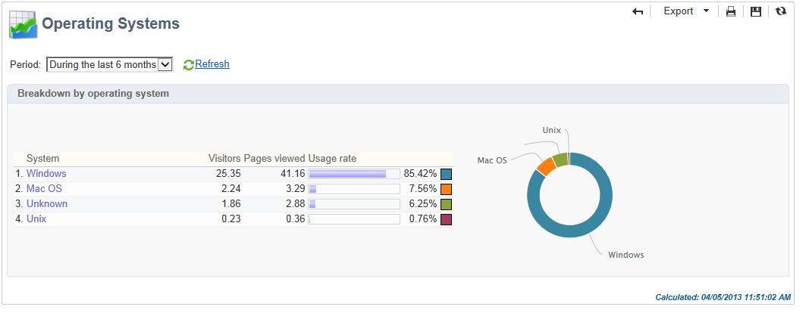
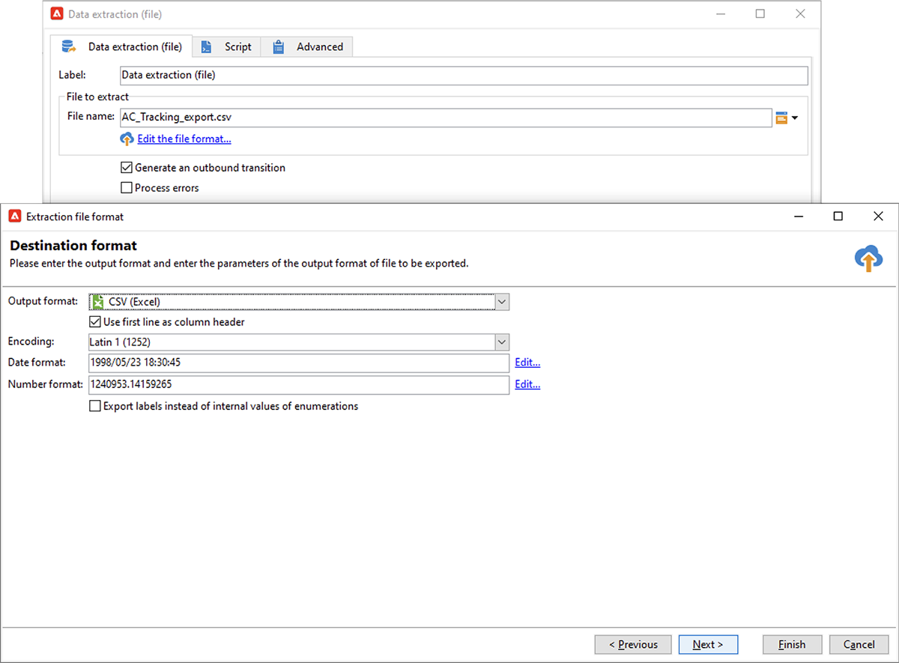

# Protección de privacidad de correo en la aplicación Mail de Apple


## ¿Qué ha cambiado?

En 2021, Apple introdujo nuevas funciones de protección de la privacidad para su aplicación de correo nativa. Esta aplicación ahora incluye la función Protección de privacidad de correo de Apple. Básicamente, los remitentes ya no pueden utilizar los píxeles de seguimiento para recopilar información sobre los destinatarios que han elegido activar la función Protección de privacidad de correo de Apple.

## ¿Cómo se ven afectadas mis campañas?

Adobe Campaign permite utilizar píxeles de seguimiento para rastrear las aperturas de correo electrónico. Puede utilizar esta capacidad no solo para campañas y objetivos, sino también para métricas. Por ejemplo, puede utilizar las tasas de apertura del correo electrónico para medir la eficacia de la campaña y la participación del usuario. En resumen, la segmentación, el direccionamiento y las métricas pueden verse afectados por las campañas.

## ¿Qué acciones debo realizar?

La nueva función de Apple es la forma de lo que está por venir en el sector en términos de protección de la privacidad del correo electrónico. Le recomendamos encarecidamente que siga las recomendaciones del Adobe.

### Evaluación del impacto en los déclencheur de la campaña

Evalúe cómo afectan estos cambios a los déclencheur de campaña actuales. Identifique los flujos de trabajo en los que las aperturas de correo electrónico se utilizan como criterio para la segmentación, el direccionamiento o el redireccionamiento. Lea el [sugerencias y trucos](#find-email-open-tracking).

### Conservar los datos

Preserve sus datos y consolide sus conocimientos actuales en dispositivos. Puede basar los indicadores clave de rendimiento (KPI) en el agente de usuario. Por ejemplo, puede generar KPI en torno a perfiles de personas que utilizan la aplicación de correo de iOS y Apple. Lea el [sugerencias y trucos](#preserve-tracking-data).

### Archivar los registros de seguimiento más allá del período de retención

Archive los registros de seguimiento más allá del período de retención de Adobe Campaign:

1. Compruebe la duración del periodo de retención en la instancia de Campaign.
1. Compruebe las asignaciones de destino activas. Determine si desea utilizar tablas de perfiles personalizadas además de la tabla de perfiles predeterminada (`nmsRecipient`).
1. Exporte sus registros de seguimiento desde Adobe Campaign. Incluya los registros que contienen datos sobre el agente de usuario y el sistema operativo.

### Evalúe la tendencia actual de las tasas de apertura

Determine qué proporción de la audiencia utiliza la aplicación Mail de Apple en un dispositivo iOS.
Con esta evaluación, puede identificar posibles lagunas anómalas y su causa. Puede determinar si una brecha se debe a problemas de rendimiento de la campaña o a la funcionalidad de protección de privacidad de Apple. Lea el [sugerencias y trucos](#measure-ios-footprint).

### Volver a evaluar la estrategia de campaña y las métricas de rendimiento

Sobre todo, le recomendamos encarecidamente que reevalúe de forma proactiva su estrategia de campaña y las métricas de rendimiento de la campaña. Puede volver a centrarse en métricas más fiables como, por ejemplo, pulsaciones, vistas de productos y compras.

Le recomendamos que explore los datos disponibles actualmente y evalúe la correlación entre las tasas abiertas y otras métricas. Si estas métricas se correlacionan de forma consistente, puede mejorar sus déclencheur con un buen nivel de confianza.

## Sugerencias y trucos

### Medir el espacio total de iOS {#measure-ios-footprint}

Para recopilar datos de Adobe Campaign, puede utilizar informes predeterminados como los siguientes:

* **[!UICONTROL Operating Systems]** informe

  Para identificar la proporción de visitantes por sistema operativo y por versión, utilice este informe. [Más información](../../reporting/using/global-reports.md#operating-systems).

  Puede ver el desglose de visitantes por sistema operativo en relación con la cantidad total de visitantes.

  

  Para cada sistema operativo, puede ver el desglose de visitantes por versión del sistema operativo.

  

* **[!UICONTROL Breakdown of opens]** informe

  Para identificar la proporción de correos electrónicos abiertos por sistema operativo, utilice este informe. [Más información](../../reporting/using/global-reports.md#breakdown-of-opens).

  

### Determinar cómo se utiliza el seguimiento de aperturas de correo electrónico {#find-email-open-tracking}

Puede identificar los flujos de trabajo en los que las aperturas de correo electrónico se utilizan como criterio para la segmentación, el direccionamiento y el redireccionamiento.

Para ello, puede utilizar el complemento **[!UICONTROL type]** atributo de la URL del vínculo rastreado (**[!UICONTROL url/@type]**). Para las aperturas de correo electrónico, este atributo se establece en **[!UICONTROL Open]**. Este atributo está disponible en el editor de consultas, el **[!UICONTROL Query]** actividad en un flujo de trabajo y filtros predefinidos. Puede utilizar este atributo como criterio de objetivo para campañas de marketing.


En este ejemplo, un experto en marketing desea enviar una oferta de recompensa a los destinatarios que hayan abierto un correo electrónico de entrega específico en los últimos siete días y hayan realizado una compra en el último mes. En las consultas de flujo de trabajo, puede utilizar las aperturas de correo electrónico de varias formas:

* Puede utilizar las aperturas de correo electrónico como criterio de objetivo en una consulta.

  Como condición de filtrado, puede especificar que el tipo de URL de los registros de seguimiento de una entrega específica se establezca en **[!UICONTROL Open]**.

  

* Puede utilizar un filtro predefinido. [Más información](../../workflow/using/creating-a-filter.md).

  

  Puede utilizar este filtro predefinido en las actividades de consulta de los flujos de trabajo.

  

  >[!NOTE]
  >
  >Desde un flujo de trabajo, no se pueden ver los criterios de objetivo de un filtro predefinido.

Para recuperar la lista de flujos de trabajo en los que las aperturas de correo electrónico se utilizan como criterio de objetivo, debe consultar la `xtk:workflow` esquema. El contenido del flujo de trabajo se almacena en la variable **[!UICONTROL XML memo (data)]** en formato XML.


Puede especificar que los flujos de trabajo deben incluir este contenido:

`expr="[url/@type] = 2"`

Este criterio de objetivo significa que el tipo de URL rastreada debe establecerse en **[!UICONTROL Open]**.


#### Ejemplo de implementación y paquete de muestra

Puede utilizar este ejemplo de implementación para identificar los flujos de trabajo en los que las aperturas de correo electrónico se utilizan como criterio de objetivo y para enviar una notificación al operador de campaña que elija. Puede utilizar esta implementación para los siguientes fines:

* Puede medir el impacto potencial del cambio de las aperturas de correo electrónico a otro KPI en los flujos de trabajo de objetivos. Si no utiliza las aperturas de correo electrónico, no es necesario realizar ninguna otra acción.
* Al volver a evaluar la implementación, puede utilizar este ejemplo para evitar omitir flujos de trabajo.

Este ejemplo muestra una implementación personalizada en un solo flujo de trabajo técnico.


>[!IMPORTANT]
>
>El paquete se proporciona solo como ejemplo y no es compatible con el Adobe como función de producto.
>
>Es posible que tenga que adaptar el código de ejemplo a la implementación de la campaña.
>
>El usuario final es el único responsable de instalar y utilizar este paquete de muestra.
>
>Le recomendamos encarecidamente que pruebe y valide este paquete en un entorno que no sea de producción.

Descargue la [paquete de muestra](assets/PKG_Search_workflows_using_Opens_in_queries_V1.xml) e instálelo. [Más información](../../platform/using/working-with-data-packages.md#importing-packages).

Una vez instalado el paquete, puede acceder al flujo de trabajo desde la carpeta que contiene los flujos de trabajo técnicos listos para usar en su instancia:

`/Administration/Production/Technical workflows/nmsTechnicalWorkflow`

En la interfaz de usuario, elija **[!UICONTROL Administration]** > **[!UICONTROL Production]** > **[!UICONTROL Technical workflows]**.


El flujo de trabajo consta de estos pasos principales:

1. Enumere los flujos de trabajo en los que se utilizan las aperturas de correo electrónico como criterio de objetivo.
1. Enumere los filtros predefinidos en los que las aperturas de correo electrónico se utilizan como criterio de objetivo.
1. Enumere los flujos de trabajo en los que se utilizan estos filtros predefinidos.
1. Combine las dos listas de flujos de trabajo en una lista.
1. Envíe una notificación por correo electrónico al operador especificado.

El flujo de trabajo incluye estos pasos detallados:

1. La actividad inicial es una actividad de consulta en `xtk:workflow` esquema. Esta actividad se utiliza para encontrar, en la instancia correspondiente, las consultas explícitas de flujo de trabajo que incluyen las aperturas de correo electrónico como criterio de objetivo.

   

   

   

   Como resultado, se devuelve una lista de flujos de trabajo.

   

   Dado que esta información se reutiliza, el nombre de la tabla de trabajo se almacena en una variable de instancia de flujo de trabajo global.

   

1. Se utiliza una segunda consulta para buscar los filtros predefinidos que incluyen las aperturas de correo electrónico.

   

   

   

   Como resultado, se devuelve una lista de filtros predefinidos.

   

1. Esta lista de filtros predefinidos se utiliza para buscar los flujos de trabajo en los que se utilizan estos filtros.
1. Ambas listas de flujos de trabajo se combinan en una lista.

   Para este fin, se utiliza código JavaScript.

   

   ```javascript
   const queryPredFilter = xtk.queryDef.create(
     <queryDef schema={vars.targetSchema} operation="select">
        <select>
          <node alias="@id" expr="@id" />
          <node alias="@name" expr="@name"  />
        </select>
        <where/>
     </queryDef>
       ).ExecuteQuery()
   
   var qDef =
     <queryDef schema="xtk:workflow" operation="select">
       <select>
         <node expr="@id"/>
         <node expr="@internalName"/>
         <node expr="@label"/>
       </select>
       <where>
         <condition boolOperator="OR" expr={"data like '%expr=[url/@type] = 2%'" }/>
       </where>
     </queryDef>
   
   for each (var filter in queryPredFilter) {       
   
      //logInfo (filter.@name);
      var condition;
      condition =<condition boolOperator="OR" expr={"data like '%" + filter.@name + "%'" }/>
      qDef.where.appendChild(condition);   
   
   }
   
   var queryWorkflowList = xtk.queryDef.create(qDef);
   var workflowList = queryWorkflowList.ExecuteQuery();
   
   var sWorkflowList = "";
   var iCount = 0
   for each (var workflow in workflowList) {       
   
      //logInfo ("Workflow ID: " + workflow.@id + " in " + instance.vars.mainTargetSchema);
   
      iWorkflowId = workflow.@id;
      iWorkflowName = workflow.@internaName;
      iWorkflowLabel = workflow.@label;
   
       xtk.session.Write(
             <{instance.vars.mainTargetSchema.split(':')[1]}
               _operation="insertOrUpdate"       
               _key="@id"
               xtkschema={instance.vars.mainTargetSchema}
               id={iWorkflowId}
               internaName={iWorkflowName}
               label={iWorkflowLabel}
             />
       )
   }
   ```

1. Los flujos de trabajo duplicados se eliminan de la lista combinada.

   

1. Se realiza una prueba para comprobar que la lista no está vacía.

   

   Si la lista no está vacía, se inserta en una tabla de HTML para las notificaciones por correo electrónico.

   

   ```js
   const queryWorkflow = xtk.queryDef.create(
       <queryDef schema={vars.targetSchema} operation="select">
           <select>
               <node alias="@id" expr="@id" />
               <node alias="@internalName" expr="@internalName"  />
               <node alias="@label" expr="@label"  />
           </select>
           <where/>
       </queryDef>
   ).ExecuteQuery()
   
   var sWorkflowList = '<table border="0" >';
   
   sWorkflowList = sWorkflowList + "<tr><th>Worklow Id</th><th>Name</th><th>Label</th></tr>";
   
   for each (var workflow in queryWorkflow) {       
   
      sWorkflowList = sWorkflowList + "<tr>" +
                       "<td>" + workflow.@id + "</td>" +
                       "<td>" + workflow.@internalName + "</td>" +
                       "<td>" + workflow.@label + "</td>" +
                       "</tr>";
   
   }
   
   sWorkflowList = sWorkflowList + "</table>";
   
   instance.vars.workflowList = sWorkflowList;
   ```

1. La tabla HTML se agrega a la plantilla de notificación.

   ```js
   <%= instance.vars.workflowLIst%>
   ```

   

   Las notificaciones por correo electrónico contienen la lista de flujos de trabajo que incluyen las aperturas por correo electrónico como criterio de objetivo en las consultas.

   

### Conservar los datos de seguimiento actuales {#preserve-tracking-data}

#### ¿Qué datos se ven afectados?

Los datos de perfil se enriquecen con los datos de seguimiento de acciones como aperturas de correo electrónico y pulsaciones. El seguimiento también proporciona, a través del agente de usuario cuando esta información está disponible, información clave sobre los dispositivos del usuario.

En pocas palabras, los datos de seguimiento de Adobe Campaign proporcionan esta información:

* El perfil asociado a la persona que abrió o hizo clic a través de un mensaje de correo electrónico específico
* La fecha de apertura
* El dispositivo utilizado, por ejemplo, iPhone o Mac
* El sistema operativo y la versión, por ejemplo, iOS 15, macOS 12 o Windows 10
* La aplicación, como una aplicación de correo o un explorador web, y la versión, por ejemplo, Outlook 2019

#### ¿Por qué debería conservar los datos de seguimiento?

Le recomendamos encarecidamente que conserve estos datos por varios motivos:

* Adobe Campaign conserva estos datos durante un período limitado. El periodo de retención varía en función de la configuración de la instancia.

  Compruebe la configuración de la instancia. [Más información](../../platform/using/privacy-management.md#data-retention).

* Además de los cambios recientes de Apple, puede utilizar los datos de seguimiento para añadir un valor inmenso y así aumentar la participación de su audiencia.
* Apple puede introducir más cambios en su aplicación de correo nativa y en su función de protección de privacidad de correo.

Por todos estos motivos, le recomendamos encarecidamente que exporte estos datos lo antes posible. De lo contrario, los datos de seguimiento de parte de la audiencia podrían verse afectados negativamente.

#### ¿Cómo se pueden conservar los datos de seguimiento?

Para conservar los datos de seguimiento, debe exportarlos de Adobe Campaign a su sistema de información. [Más información](../../platform/using/get-started-data-import-export.md).

>[!IMPORTANT]
>
>El siguiente ejemplo se centra en la configuración predeterminada `nms:Recipient` schema, que es el esquema de perfil predeterminado. Si utiliza asignaciones de destino personalizadas adicionales que se adjuntan a perfiles personalizados, le recomendamos que amplíe esta estrategia de exportación a todas las tablas de registros personalizados. [Más información](../../configuration/using/target-mapping.md).

##### Principio

De forma predeterminada, la variable `nms:Recipient` Este esquema está vinculado a tres esquemas que debe exportar:

| Esquema | Contenido |
| --- | --- |
| nms:trackingLogRcp | El seguimiento de datos, es decir, el usuario, la hora y el mensaje correspondiente |
| nms:trackingUrl | Detalles sobre el vínculo, incluida su naturaleza (por ejemplo, un correo electrónico abierto o una pulsación) |
| nms:userAgent | Información sobre el dispositivo |

Las tablas están vinculadas en el modelo de datos.


Utilice estas relaciones para crear una única consulta de exportación.


Puede enriquecer estos datos con información útil de esquemas vinculados:

| Esquema | Contenido |
| --- | --- |
| nms:Destinatario | Detalles relacionados con los perfiles |
| nms:Delivery | Información sobre el mensaje al que reaccionó el usuario |

Puede exportar el resultado a una solución de almacenamiento externo compatible con Adobe Campaign:

* SFTP
* S3
* Azure Blob

##### Implementación

Este ejemplo muestra cómo se pueden exportar datos de seguimiento desde Adobe Campaign.

1. Cree un flujo de trabajo que comience con una consulta.

   La consulta inicial se utiliza para recuperar los registros de seguimiento de los últimos tres meses.
Puede utilizar una consulta incremental para extraer únicamente los registros que aún no haya exportado.

   Añada toda la información necesaria del **[!UICONTROL Additional data]** nodo.

   

1. Añadir un **[!UICONTROL Data extraction (file)]** actividad. Asigne todos los datos de la consulta a un formato de archivo de extracción.

   

   Elija el formato de archivo, por ejemplo, TXT o CSV.

   

1. Añada la tercera y la última actividad para cargar el archivo en una solución de almacenamiento compatible.


##### Implementación avanzada: desglose por dispositivo iOS

Puede utilizar flujos de trabajo para determinar si un destinatario utiliza la aplicación de correo de Apple. Puede dividir los registros de seguimiento por dispositivo. Por ejemplo, puede utilizar filtros de consulta para desglosar registros por dispositivo iOS:

| Aplicación | Sistema operativo o dispositivo  | Filtro de consulta |
| --- | --- | --- |
| Correo electrónico de Apple | iOS 15 | `operating System (Browser) contains 'iOS 15' and browser (Browser) contains 'ApplewebKit'` |
| Correo electrónico de Apple | iOS 14 o iOS 13 | `browser contains 'AppleWebKit' and operating System of browser contains 'iOS 14' or operating System of browser contains 'iOS 13'` |
| Correo electrónico de Apple | Dispositivos móviles iOS: iPad, iPod y iPhone | `device (Browser) contains iPhone or device (Browser) equal to iPod or device (Browser) equal to iPad and browser (Browser) equal to 'AppleWebKit'` |
| Correo electrónico de Apple | iPhone, iPad o iPod | `browser (Browser) equal to 'AppleWebKit' and device (Browser) equal to iPhone or device (Browser) equal to iPod or device (Browser) equal to iPad` |
| Correo electrónico de Apple | Mac | `browser (Browser) equal to 'AppleWebKit' and operating System (Browser) contains 'Mac'` |
| Safari | macOS | `browser (Browser) equal to 'Safari' and device (Browser) equal to PC and operating System (Browser) contains 'Mac'` |
| Safari | Dispositivos móviles | `browser (Browser) equal to 'Safari' and device (Browser) equal to iPad or device (Browser) equal to iPod or device (Browser) equal to iPhone` |


Puede utilizar estas reglas para varios fines:

* Exportación y archivado de datos en una solución de almacenamiento externa
* Calcular los KPI que se van a adjuntar a los perfiles
* Creación de listas de supresión
* Creación de informes

Estos ejemplos muestran cómo se pueden utilizar flujos de trabajo para desglosar registros por dispositivo iOS:

* El primer flujo de trabajo de ejemplo incluye estas actividades:

   1. La inicial **[!UICONTROL Query]** se utiliza la actividad para seleccionar todas las aperturas de correo electrónico de los últimos tres meses.
   1. A **[!UICONTROL Split]** La actividad se utiliza para dividir la selección por aplicación de correo electrónico, explorador, sistema operativo y dispositivo.

   1. A **[!UICONTROL Deduplication]** la actividad sigue a cada **[!UICONTROL Split]** actividad. El **[!UICONTROL Deduplication]** La actividad se utiliza para eliminar direcciones de correo electrónico duplicadas.

      El **[!UICONTROL Deduplication]** la actividad se coloca después de **[!UICONTROL Split]** actividad para evitar perder información sobre los destinatarios que utilizan varios dispositivos.

   1. Un **[!UICONTROL End]** la actividad sigue a cada **[!UICONTROL Deduplication]** actividad.

  Este tipo de flujo de trabajo resulta útil si almacena los destinatarios únicamente en la tabla de destinatarios predeterminada para la segmentación.

  

* El segundo flujo de trabajo de ejemplo incluye estas actividades:

   1. La inicial **[!UICONTROL Query]** se utiliza la actividad para seleccionar todas las aperturas de correo electrónico de los últimos tres meses.
   1. A **[!UICONTROL Deduplication]** La actividad se utiliza para eliminar direcciones de correo electrónico duplicadas.
   1. A **[!UICONTROL Fork]** se utiliza la actividad:

      * En una transición, la variable **[!UICONTROL Change dimension]** se utiliza para encontrar los destinatarios a los que hace referencia el registro de seguimiento.
      * En la otra transición, la variable **[!UICONTROL Split]** La actividad se utiliza para dividir la selección por aplicación de correo electrónico, explorador, sistema operativo y dispositivo.

   1. Un **[!UICONTROL End]** La actividad sigue cada transición después de la **[!UICONTROL Split]** actividad.

  Este tipo de flujo de trabajo resulta útil si almacena los destinatarios en una tabla distinta a la tabla de destinatarios predeterminada.

  
