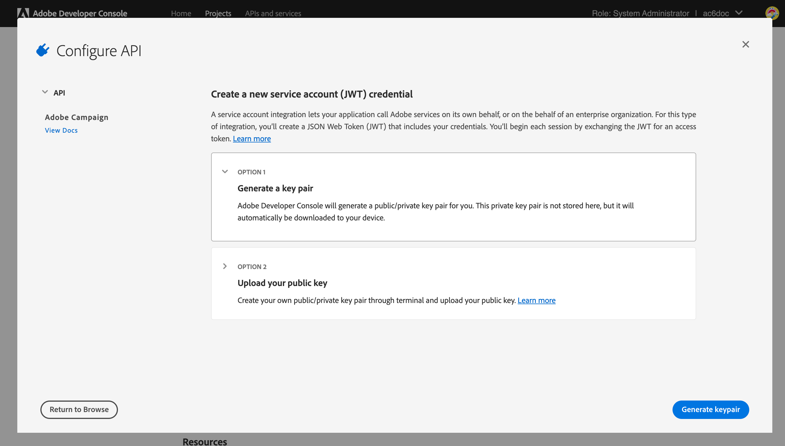
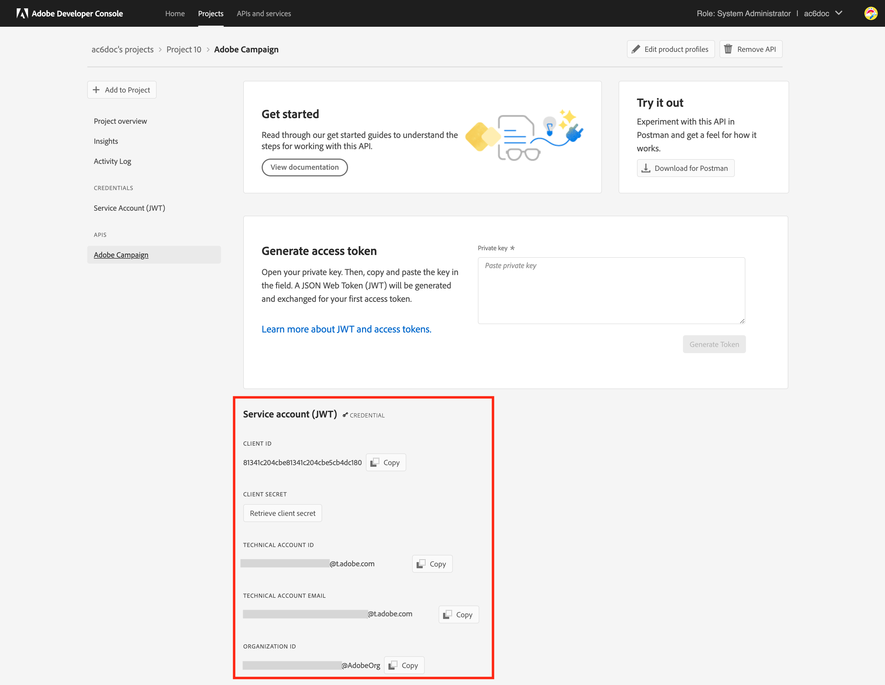

# Actualización del nuevo servidor de capacidad de envío {#acc-deliverability}

Inicio [Versión 7.2.2](../../rn/using/latest-release.md#release-7-2-2), Adobe Campaign se basa en un nuevo servidor de capacidad de envío que ofrece alta disponibilidad y aborda los problemas de cumplimiento de la seguridad. Ahora, el Campaign Classic sincroniza las reglas de envío, los broadlogs y las direcciones de supresión desde y hacia el nuevo servidor de capacidad de envío. El antiguo servidor de capacidad de envío se cancelará el 31 de agosto de 2022.

Como cliente Campaign Classic, debe implementar el nuevo servidor de entrega **antes del 31 de agosto de 2022**.

>[!NOTE]
>
>Para obtener más preguntas sobre estos cambios, consulte la [Preguntas frecuentes](#faq)o póngase en contacto con [Servicio de atención al cliente de Adobe](https://helpx.adobe.com/es/enterprise/admin-guide.html/enterprise/using/support-for-experience-cloud.ug.html){_blank}.

## ¿Qué ha cambiado?{#acc-deliverability-changes}

El Adobe está retirando los centros de datos más antiguos por motivos de seguridad. Los clientes de Adobe Campaign Classic deben migrar al nuevo servicio de entrega, alojado en el servicio web de Amazon (AWS).

Este nuevo servidor garantiza una alta disponibilidad (99.9) &#x200B; y proporciona extremos seguros y autenticados para permitir que los servidores de campaña recuperen los datos necesarios: en lugar de conectarse a la base de datos para cada solicitud, el nuevo servidor de capacidad de envío almacena en caché los datos para atender las solicitudes siempre que sea posible. Este mecanismo mejora el tiempo de respuesta. &#x200B;

## ¿Se ha visto afectado?{#acc-deliverability-impacts}

Todos los clientes se ven afectados y deben actualizar a [Campaign v7.2.2](../../rn/using/latest-release.md#release-7-2-2) (o más) e implemente su entorno para beneficiarse del nuevo servidor de capacidad de envío.

## ¿Cómo realizar la actualización?{#acc-deliverability-update}

Como **cliente alojado**, Adobe trabajará con usted para actualizar las instancias a la versión más reciente y crear el proyecto en la consola de Adobe Developer.

Como **cliente local/híbrido**, debe actualizar a [Campaign v7.2.2](../../rn/using/latest-release.md#release-7-2-2) (o más) para beneficiarse del nuevo servidor de capacidad de envío. Una vez actualizadas todas las instancias, debe [implementar la nueva integración](#implementation-steps) para almacenar en Adobe el servidor de capacidad de envío y garantizar una transición sin problemas.

## Pasos de implementación {#implementation-steps}

Como parte de la nueva integración del servidor de capacidad de envío, Campaign debe comunicarse con Adobe Shared Services mediante una autenticación basada en Identity Management Service (IMS). La forma preferida es utilizar el Token de puerta de enlace basado en Adobe Developer (también denominado Token de cuenta técnica o JWT de Adobe IO).

>[!WARNING]
>
>Estos pasos solo deben llevarse a cabo para implementaciones híbridas y locales.

### Requisitos previos{#prerequisites}

Antes de iniciar la implementación, compruebe la configuración de la instancia.

1. Abra la consola del cliente de Campaign e inicie sesión en Adobe Campaign as a Administrator.
1. Vaya a **Administración > Plataforma > Opciones**.
1. Compruebe que la variable `DmRendering_cuid` se rellena.

   * Si se completa la opción, puede iniciar la implementación.
   * Si no se rellena ningún valor, póngase en contacto con [Servicio de atención al cliente de Adobe](https://helpx.adobe.com/es/enterprise/admin-guide.html/enterprise/using/support-for-experience-cloud.ug.html){_blank} para obtener su CUID.

   Esta opción debe rellenarse en todas las instancias de Campaign (MKT, MID, RT, EXEC) con el valor correcto. Como cliente híbrido, póngase en contacto con el Adobe para que la opción se establezca en las instancias MID, RT y EXEC.

Como cliente local, también debe comprobar que una campaña **[!UICONTROL Product profile]** está disponible para su organización. Para ello, siga los pasos a continuación:

1. Como administrador, conéctese a [Adobe Admin Console](https://adminconsole.adobe.com/){_blank}.
1. Acceda a la **Producto y servicios** sección y marque **Adobe Campaign** aparece en la lista.
Si no puede ver **Adobe Campaign** póngase en contacto [Servicio de atención al cliente de Adobe](https://helpx.adobe.com/es/enterprise/admin-guide.html/enterprise/using/support-for-experience-cloud.ug.html){_blank} para agregarlo.
1. Haga clic en **Adobe Campaign** y seleccione su organización.
   **Precaución**: Si tiene más de una organización, asegúrese de seleccionar la correcta. Más información sobre las organizaciones [en esta página](https://experienceleague.adobe.com/docs/control-panel/using/faq.html#ims-org-id){_blank}.

1. Compruebe que **[!UICONTROL Product profile]** existe. Si no es así, créelo. No se requiere permiso para este **[!UICONTROL Product profile]**.


>[!CAUTION]
>
>Como cliente local, si hay un cortafuegos implementado en su lado, debe agregar esta dirección URL `https://deliverability-service.adobe.io` a su lista de permitidos. [Más información](../../installation/using/url-permissions.md).


### Paso 1: Crear/actualizar el proyecto de Adobe Developer {#adobe-io-project}

1. Acceso [Consola de Adobe Developer](https://developer.adobe.com/console/home) e inicie sesión con el acceso de desarrollador de su organización. Asegúrese de haber iniciado sesión en el portal correcto de la organización.
   **Precaución**: Si tiene más de una organización, asegúrese de seleccionar la correcta. Más información sobre las organizaciones [en esta página](https://experienceleague.adobe.com/docs/control-panel/using/faq.html#ims-org-id){_blank}.
1. Seleccione **[!UICONTROL Create new project]**.
   

   >[!CAUTION]
   >
   >Si ya está utilizando la funcionalidad de autenticación JWT de IO de Adobe para otra integración, como el conector de Analytics o los Déclencheur de Adobe, debe actualizar el proyecto añadiendo **API de Campaign** a ese proyecto.

1. Elija **[!UICONTROL Add API]**.
   
1. En la ventana **[!UICONTROL Add an API]** seleccione **[!UICONTROL Adobe Campaign]**.
   
1. Si el ID del cliente está vacío, seleccione **[!UICONTROL Generate a key pair]** para crear un par de claves pública y privada.
   

   Las claves se descargan automáticamente con una fecha de caducidad predeterminada de 365 días. Una vez caducado, deberá crear un nuevo par de claves y actualizar la integración en el archivo de configuración. Con la Opción 2, puede elegir crear y cargar manualmente su **[!UICONTROL Public key]** con una fecha de caducidad más larga.
   

   >[!CAUTION]
   >
   >Debe guardar la variable `config.zip` cuando aparezca el mensaje de descarga, ya que no podrá descargarlo de nuevo.

1. Haga clic en **[!UICONTROL Next]**.
1. Elija cualquier **[!UICONTROL Product profile]** existente o cree uno nuevo si es necesario. No se requiere permiso para este **[!UICONTROL Product profile]**. Para obtener más información, consulte **[!UICONTROL Product Profiles]**, consulte [esta página](https://helpx.adobe.com/es/enterprise/using/manage-developers.html){_blank}.
   

   A continuación, haga clic en **[!UICONTROL Save configured API]**.

1. En el proyecto, seleccione **[!UICONTROL Adobe Campaign]** y copie la siguiente información en **[!UICONTROL Service Account (JWT)]**

   

   * **[!UICONTROL Client ID]**
   * **[!UICONTROL Client Secret]**
   * **[!UICONTROL Technical account ID]**
   * **[!UICONTROL Organization ID]**

>[!CAUTION]
>
>El certificado de Adobe Developer caducará a los 12 meses. Debe generar un nuevo par de claves cada año.

### Paso 2: Adición de las credenciales del proyecto en Adobe Campaign {#add-credentials-campaign}

La clave privada debe codificarse en formato UTF-8 base64.

Para ello:

1. Utilice la clave privada generada en los pasos anteriores.
1. Codifique la clave privada mediante el siguiente comando: `base64 ./private.key > private.key.base64`. Esto guardará el contenido de base64 en un nuevo archivo `private.key.base64`.

   >[!NOTE]
   >
   >A veces, se pueden añadir automáticamente líneas adicionales al copiar/pegar la clave privada. Recuerde eliminarlas antes de codificar la clave privada.

1. Copie el contenido del archivo `private.key.base64`.
1. Inicie sesión mediante SSH en cada contenedor donde esté instalada la instancia de Adobe Campaign y añada las credenciales del proyecto en Adobe Campaign ejecutando el siguiente comando como usuario `neolane`. Esto insertará las credenciales **[!UICONTROL Technical Account]** en el archivo de configuración de instancia.

   ```sql
   nlserver config -instance:<instance name> -setimsjwtauth:Organization_Id/Client_Id/Technical_Account_ID/<Client_Secret>/<Base64_encoded_Private_Key>
   ```

1. Debe detener y luego reiniciar el servidor para que se tenga en cuenta la modificación. También puede ejecutar un `config -reload` comando.

### Paso 3: Habilitar el nuevo servidor de entrega

Ahora puede habilitar el nuevo servidor de capacidad de envío. Para realizar esto:

1. Abra la consola del cliente e inicie sesión en Adobe Campaign como administrador.
1. Vaya a **Administración > Plataforma > Opciones**.
1. Acceda a la `NewDeliverabilityServer_FeatureFlag` y establezca el valor en `1`. Esta configuración debe realizarse en todas las instancias de Campaign (MKT, MID, RT, EXEC). Como cliente híbrido, póngase en contacto con el Adobe para que la opción se establezca en las instancias MID, RT y EXEC.

### Paso 4: Validar la configuración

Para comprobar que la integración se ha realizado correctamente, siga los pasos a continuación:

1. Abra la consola del cliente e inicie sesión en Adobe Campaign.
1. Vaya a **Administración > Producción > Flujos de trabajo técnicos**.
1. Reinicie el **Actualización para la capacidad de entrega** Flujo de trabajo (deliverabilityUpdate). Esto debe realizarse en todas las instancias de Campaign (MKT, MID, RT, EXEC). Como cliente híbrido, póngase en contacto con el Adobe para que el flujo de trabajo se reinicie en las instancias MID, RT y EXEC.
1. Registros de comprobación: el flujo de trabajo se debe ejecutar sin errores.

>[!CAUTION]
>
>Después de la actualización, la variable **Actualizar la red semilla para la renderización de la bandeja de entrada (updateRenderingSeeds)** el flujo de trabajo debe detenerse, ya que ya no se aplicará y fallará.

## Preguntas frecuentes {#faq}

### ¿Cuál es la cronología de la actualización?

La transición al nuevo servidor de capacidad de envío, que permite añadir estas funciones mejoradas y reforzar la seguridad, empezará el 22 de julio para los clientes alojados (Campaign Managed Services). Todos los clientes alojados se actualizarán a finales de agosto.

Los clientes locales e híbridos deben realizar la transición durante el mismo periodo de tiempo.

### ¿Qué sucede si no actualizo mi entorno?

Las instancias de Campaign que no se actualicen antes del 31 de agosto ya no podrán conectarse con el servidor de entrega de Campaign. Como consecuencia, la variable **Actualización para la capacidad de entrega** El flujo de trabajo (deliverabilityUpdate) fallará, lo que afectará a su capacidad de envío.

Si no actualiza su entorno, la configuración de correo electrónico dejará de sincronizarse (reglas de administración MX, reglas de correo electrónico entrante, reglas de administración de dominio y reglas de calificación de rechazos). Esto podría afectar a lo largo del tiempo a la capacidad de envío. Si se realiza un cambio significativo en estas reglas, estos deberán aplicarse manualmente a partir de este punto.

Para instancias de MKT, solo [Lista global de supresión](../../campaign-opt/using/filtering-rules.md#default-deliverability-exclusion-rules) se ve afectado.
