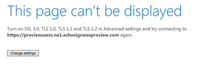

# Finalización del servicio de soporte para TLS 1.0 y 1.1{#eol-tls-support}

El Adobe ya no es compatible con los sistemas de usuario y de cliente que no son compatibles con el protocolo TLS (Transport Layer Security) 1.2. Si sigue utilizando versiones anteriores de TLS, podría perder el acceso a todos los productos y servicios del Adobe.

## ¿Por qué veo esta página?

Si ve el siguiente mensaje: **Esta página no se puede mostrar** Sin embargo, esto significa que las aplicaciones de Adobe, la página web o el servicio al que intenta acceder requieren una conexión de red más segura con su explorador web, sistema operativo o aplicación. Es obligatorio utilizar **TLS 1.2** para una comunicación de red segura y un intercambio de datos entre los sistemas de los usuarios y las aplicaciones de Adobe y los servicios web.

El Adobe de ha dejado de admitir versiones anteriores de TLS (incluidos TLS 1.0 y 1.1). Para obtener más información técnica sobre el protocolo TLS 1.2, consulte [Preguntas más frecuentes](#faq).

## ¿Qué puedo hacer para reanudar el servicio?

Los navegadores web modernos admiten TLS 1.2. Al actualizar el explorador, puede acceder a estas aplicaciones y servicios.

Puede descargar e instalar uno de los siguientes exploradores populares:

* [Google Chrome](https://www.google.com/chrome/)
* [Apple Safari](https://www.apple.com/safari/)
* [Firefox](https://www.mozilla.org/en-US/firefox/new/)
* [Microsoft Edge](https://www.microsoft.com/en-us/edge)

Si utiliza otro navegador, asegúrese de que sea compatible con TLS 1.2.

El sistema operativo y los marcos de aplicación también deben ser compatibles con TLS 1.2. Si la actualización del explorador no resuelve el problema, asegúrese de que el equipo cumple los requisitos del sistema que se enumeran en [Matriz de compatibilidad de Campaign](../../rn/using/compatibility-matrix.md).

## Preguntas frecuentes{#faq}

* **¿Qué es la seguridad de la capa de transporte (TLS)?**

  [Seguridad de capa de transporte](https://en.wikipedia.org/wiki/Transport_Layer_Security) (TLS) es un protocolo de seguridad que proporciona privacidad e integridad de datos entre dos aplicaciones que se comunican. Se implementa ampliamente en exploradores web y otras aplicaciones que requieren que los datos se intercambien de forma segura a través de una red.

  Según la especificación del protocolo, TLS incluye dos capas, el protocolo de registro TLS y el protocolo de enlace TLS. El protocolo Record proporciona seguridad de conexión. El protocolo de protocolo de enlace permite que el servidor y el cliente se autenticen mutuamente y negocien algoritmos de cifrado y claves criptográficas antes del intercambio de datos.

* **¿Cuáles son las consecuencias?**

  Los estándares de cumplimiento de seguridad de Adobe requieren la desaprobación de los protocolos más antiguos a partir de mayo de 2018 y exigen el uso de TLS 1.2 como versión actualizada. Si el sistema no es compatible con TLS 1.2, el acceso a algunas aplicaciones y servicios de Adobe está restringido.

* **¿Cómo le afecta TLS?**

  Solo puede interactuar con algunas aplicaciones y servicios de Adobe a través de una conexión de red segura. TLS ayuda a garantizar que la conexión entre su explorador y estas aplicaciones y servicios web sea segura y fiable.

  A medida que se lanzan nuevos exploradores y sistemas operativos, se actualizan los estándares de seguridad para garantizar mayores niveles de privacidad e integridad de los datos. Sin embargo, las versiones anteriores de estos navegadores o sistemas operativos no se actualizan para incluir los estándares más recientes.

  A medida que aumenta el nivel aceptable de seguridad, estas versiones y aplicaciones de navegador más antiguas y menos seguras quedan atrás.

  Para poder conectarse con sitios seguros, actualice las versiones del sistema operativo y del explorador.

* **¿TLS es vulnerable a los piratas informáticos?**

  Se han documentado ataques contra TLS 1.0 mediante un método de codificación anterior y las versiones anteriores son más vulnerables que TLS 1.2. Para obtener más información, consulte Ataques contra TLS/SSL.

* **¿Por qué el Adobe desactiva la compatibilidad con TLS 1.0 y 1.1?**

  El Adobe tiene estándares de seguridad que requieren deshabilitar la compatibilidad con protocolos más antiguos. Uno de estos estándares garantiza el cumplimiento de la industria de tarjetas de pago (PCI). El servidor de adaptación PCI es un conjunto de estándares de seguridad que requieren organizaciones que acepten, procesen, almacenen o transmitan información de tarjetas de crédito para mantener un entorno seguro.

  El cumplimiento de PCI exige el uso de TLS 1.1 o superior a partir de mayo de 2018.

* **¿Por qué el Adobe exige el uso de TLS 1.2 en lugar de permitir TLS 1.1 o TLS 1.0?**

  La mayoría de las solicitudes de aplicaciones de Adobe y servicios web provienen de sistemas de usuario compatibles con TLS 1.2, con poco tráfico de sistemas TLS 1.1.

  El Adobe ha migrado a TLS 1.2 para que sus aplicaciones y servicios web sean accesibles de forma más segura.

* **¿Cuál es la última fecha en la que puedo utilizar una versión anterior de TLS?**

  El Adobe de anima a los usuarios a abandonar rápidamente las versiones anteriores para evitar exponerse a vulnerabilidades de seguridad. Para obtener más información, póngase en contacto con el Servicio de atención al cliente de Adobe o con su gestor de éxito de clientes.

* **¿Qué mensaje de error aparece si utilizo un explorador que no está configurado para TLS 1.2?**

  Depende del explorador que esté utilizando. Todos los navegadores mencionados en [Matriz de compatibilidad de Campaign](../../rn/using/compatibility-matrix.md) están configurados para utilizar TLS 1.2. Si utiliza un explorador o una versión que no figura en la lista, actualice el explorador.

  El Adobe no controla los mensajes de error que genera la capa de comunicaciones SSL. El explorador genera estos mensajes antes de conectarse a las aplicaciones y los servicios de Adobe. Este es un ejemplo de error que puede producirse con Internet Explorer 11 en Windows 7:

  

  TLS 1.2 está habilitado en Internet Explorer 11 de forma predeterminada, pero si está desactivado, puede activarlo. En este caso, active TLS 1.2 desde el cuadro de diálogo de configuración avanzada en lugar de utilizar otras opciones. También pueden producirse otros errores, como los siguientes:

   * No se puede conectar al servicio
   * Servicio no disponible
   * Error en la conexión
