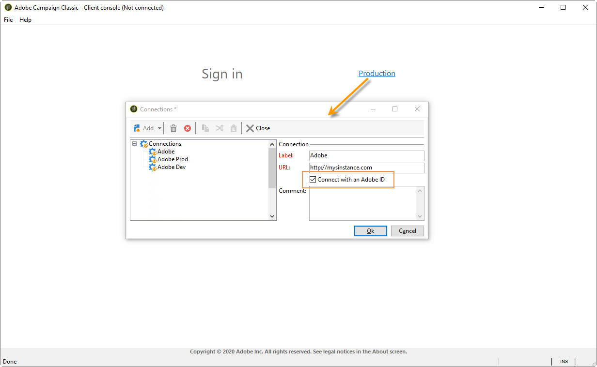

# Actualización del entorno para conectarse a Adobe Campaign con IMS {#acc-ims-faq}

El 30 de junio de 2021 se han realizado cambios en [Sistema Identity Management de Adobe](https://helpx.adobe.com/es/enterprise/using/identity.html) (IMS) funciones de inicio de sesión que podrían afectar a su capacidad para seguir utilizando Adobe Campaign. Obtenga información sobre cómo seguir utilizando Adobe Campaign Classic v7 sin interrupciones.

## ¿Qué ha cambiado?

El servicio Identity Management de Adobe (IMS) dejó de admitir versiones anteriores de Internet Explorer en **30 de junio de 2021**. [Más información](https://helpx.adobe.com/x-productkb/global/update-operating-system-and-browser.html).

Adobe desea conservar la funcionalidad de IMS para todos los clientes a partir del 30 de junio de 2021. IMS forma parte del marco de seguridad que permite a los usuarios iniciar sesión en la consola de cliente, por lo que Adobe Campaign.

Para conservar esta funcionalidad, los clientes deben actualizar la consola de cliente en el equipo de cada usuario y garantizar la última actualización de su [Versión de Windows](../../rn/using/compatibility-matrix.md#ClientConsoleoperatingsystems), con **Internet Explorer 11** integrado, se instala en el equipo de cada usuario.

## ¿Se ha visto afectado?

Si se está conectando a Campaign [a través de una Adobe ID](../../integrations/using/about-adobe-id.md), a través del servicio Adobe de Identity Management (IMS) y ejecutando una versión de Campaign anterior a la que se indica a continuación, se verá afectado.

Si ya ha actualizado pero utiliza una versión antigua de Microsoft Internet Explorer, debe actualizar a Internet Explorer 11.

## ¿Cómo realizar la actualización?

* Como cliente alojado, Adobe ya ha actualizado las instancias a la versión más reciente.

* Como cliente local/híbrido, debe actualizar a una de las versiones más recientes enumeradas anteriormente para beneficiarse de la nueva consola de cliente y garantizar una transición sin problemas **antes del 30 de junio de 2021**.

   La actualización a una de las nuevas versiones que se enumeran a continuación es obligatoria:

   * Gold Standard 11. [Más información](../../rn/using/gold-standard.md)
   * Versión 21.1.3 de Campaign. [Más información](../../rn/using/latest-release.md)
   * Versión 20.2.5 de Campaign. [Más información](../../rn/using/release--2020.md#release-20-2-5-build-9188)
   * Versión 20.1.4 de Campaign. [Más información](../../rn/using/release--2020.md#release-20-1-4-build-9126)
   * Versión 19.2.4 de Campaign. [Más información](../../rn/using/release--2019.md#release-19-2-4-build-9082)

   Estas versiones incluyen un nuevo protocolo de conexión. La actualización es obligatoria tanto para el servidor de Campaign como para la consola del cliente: una vez actualizadas todas las instancias, la consola de cliente debe actualizarse a esta versión, así como para poder conectarse a Campaign después de **30 de junio de 2021**.

Además, asegúrese de la última actualización de su [Versión de Windows](../../rn/using/compatibility-matrix.md#ClientConsoleoperatingsystems), con **Internet Explorer 11** integrado, se instala en el equipo de cada usuario.

## Preguntas frecuentes

**¿Cómo puedo comprobar mi versión de Campaign?**

Descubra cómo comprobar su versión [en esta sección](../../platform/using/launching-adobe-campaign.md#getting-your-campaign-version).

**¿Cómo puedo comprobar si utilizo IMS?**

Para comprobar el modo de conexión, puede:

* Inicie la consola del cliente de Campaign y acceda a la configuración de conexión de la instancia. Si la variable **Conectarse con un Adobe ID** está seleccionada, está utilizando Adobe IMS.

   

o

* Inicie la consola del cliente de Campaign y compruebe la ventana de conexión. Si se está conectando con un Adobe ID, como se muestra en la pantalla siguiente, está utilizando IMS.

   

**Mensaje de advertencia de conexión**

Los usuarios pueden ver el siguiente mensaje de advertencia si necesitan actualizar su consola de cliente o utilizar una versión antigua de Microsoft Internet Explorer: **Debe instalar la última actualización a Windows o sus aplicaciones Adobe.**

Si ve esta advertencia, asegúrese de instalar las actualizaciones más recientes del sistema operativo que está utilizando. [Más información](https://helpx.adobe.com/x-productkb/global/update-operating-system-and-browser.html)

Si no ha actualizado su versión de Internet Explorer, verá el siguiente mensaje y ya no podrá conectarse a Adobe Campaign:

>[!NOTE]
>
>En caso de que tenga preguntas acerca de estos cambios, póngase en contacto con el [Servicio de atención al cliente de Adobe](https://helpx.adobe.com/es/enterprise/admin-guide.html/enterprise/using/support-for-experience-cloud.ug.html).

## Vínculos útiles

* [Actualice su entorno](../../production/using/build-upgrade.md)
* [Preguntas frecuentes sobre la actualización de versiones](../../platform/using/faq-build-upgrade.md)
* [Poner la nueva consola de cliente a disposición de los usuarios](../../installation/using/client-console-availability-for-windows.md)
* [Instalación de la consola del cliente de Campaign](../../installation/using/installing-the-client-console.md)
* [Acceso a la distribución del software del Adobe](https://experienceleague.adobe.com/docs/experience-cloud/software-distribution/home.html?lang=en)
* [Descargar compilación del Campaign Classic](https://experience.adobe.com/#/downloads/content/software-distribution/es/campaign.html)
