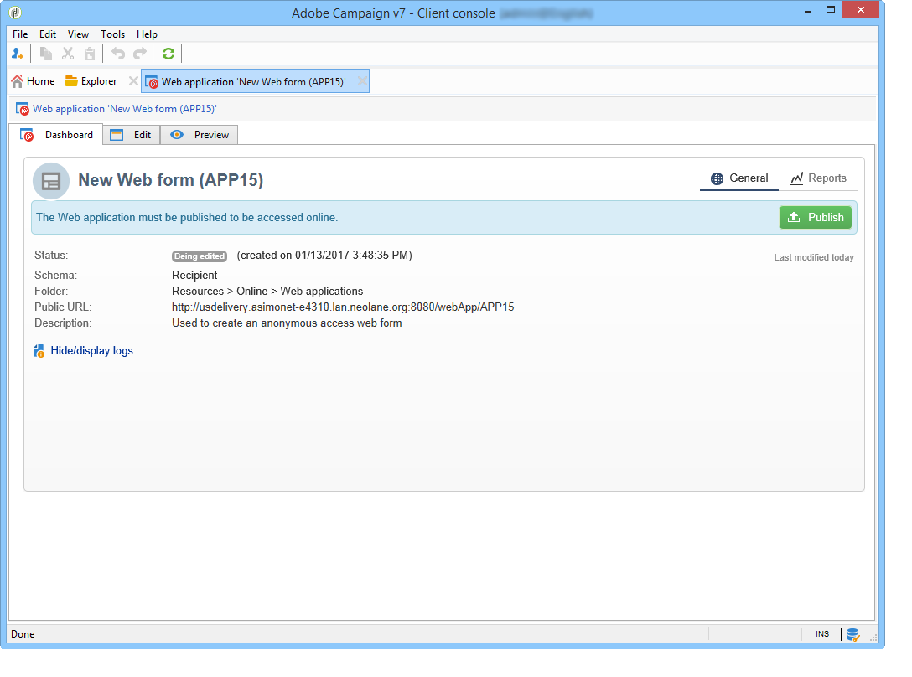
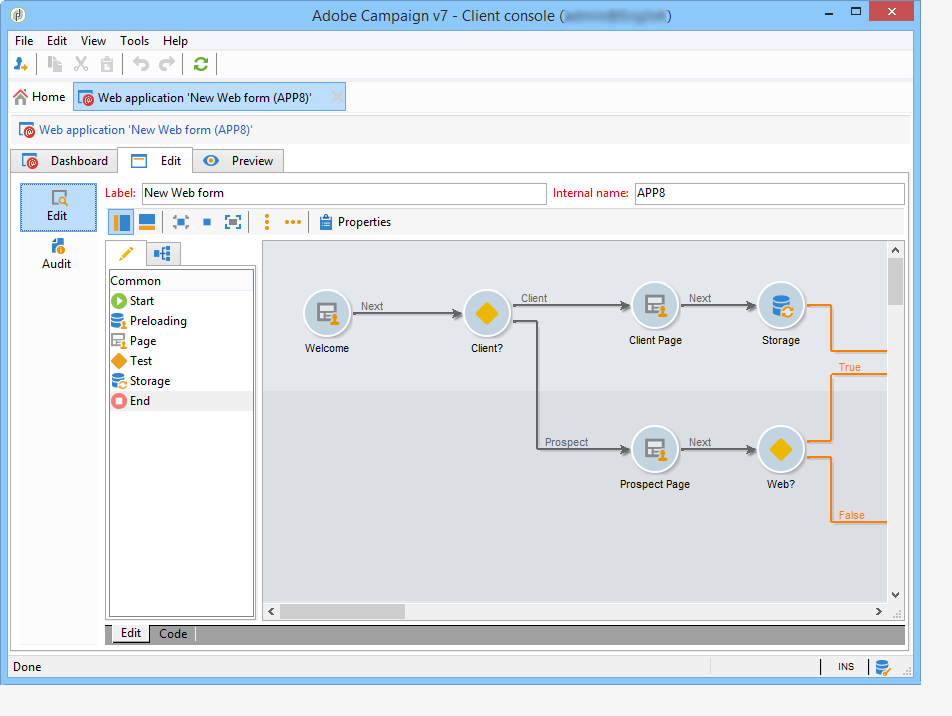
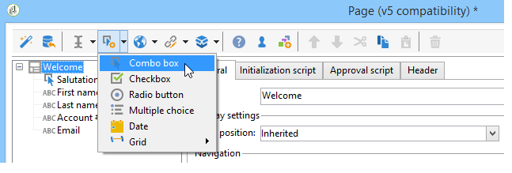

# Introducción a los formularios web{#about-web-forms}

Adobe Campaign incluye un módulo gráfico para definir y publicar formularios web para crear páginas que contengan campos de entrada y selección, y que pueden incluir datos de la base de datos. Esto le permite diseñar y publicar páginas web a las que los usuarios pueden acceder para ver o introducir información.

En este capítulo se detalla la creación y gestión de los formularios web, cómo administrar campos y páginas, así como los modos de almacenamiento y guardado.

>[!CAUTION]
>
>Por razones de privacidad, recomendamos utilizar HTTPS para todos los recursos externos.

## Pasos para crear un formulario web {#steps-for-creating-a-web-form}

En este capítulo se detallan los pasos necesarios para diseñar un **formulario web** en Adobe Campaign, así como las opciones y configuraciones disponibles. Adobe Campaign permite poner este formulario web a disposición de los usuarios, así como recopilar y archivar respuestas en la base de datos.

>[!CAUTION]
>
>Al configurar aplicaciones y formularios web, necesita una resolución vertical de 900 píxeles como mínimo (por ejemplo: 1600 x 900).

Se accede a los formularios web a través del menú Aplicaciones web del entorno de **Campañas**. En el directorio de Adobe Campaign, se agrupan dentro del nodo **[!UICONTROL Resources > Online > Web Applications]**.

Para crear un formulario web, haga clic en el botón **[!UICONTROL Create]** situado sobre la lista de aplicaciones web.

Seleccione la plantilla de formulario web (**[!UICONTROL newWebForm]** de forma predeterminada).

Esto le lleva al panel de control del formulario.

La pestaña **[!UICONTROL Edit]** le permite crear su contenido.

Para definir la configuración y el contenido del formulario web, realice los siguientes pasos:

* Comience por crear las páginas y los controles necesarios: campos de entrada, listas desplegables, contenido HTML, etc.

  Este paso se detalla a continuación.

* Defina la secuenciación de la página y la condición de visualización.

  Este paso se detalla en [Definición de la secuencia de páginas de formularios Web](defining-web-forms-page-sequencing.md).

* Si es necesario, traduzca el contenido.

  Este paso se detalla en [Traducir un formulario web](translating-a-web-form.md).

## Acerca del diseño de los formularios web {#about-web-forms-designing}

Las páginas del formulario se crean mediante un editor específico que permite definir y configurar zonas de entrada (texto), campos de selección (listas, casillas de verificación, etc.) y elementos estáticos (imágenes, contenido HTML, etc.). Pueden agruparse en contenedores y el diseño puede modificarse para adaptarse a sus necesidades (para más información, consulte).[&#128279;](defining-web-forms-layout.md#creating-containers)

En las siguientes secciones se detalla cómo definir el contenido y el diseño de las pantallas del formulario:

* [Adición de campos a un formulario web](adding-fields-to-a-web-form.md),
* [Inserción de contenido HTML](static-elements-in-a-web-form.md#inserting-html-content),
* [Elementos estáticos de un formulario web](static-elements-in-a-web-form.md),
* [Definición del diseño de los formularios web](defining-web-forms-layout.md).

>[!NOTE]
>
>* Durante el diseño de la página, puede ver la renderización final en la pestaña **[!UICONTROL Preview]**. Para ver los cambios, guarde el formulario primero. Todos los errores se muestran en la pestaña **[!UICONTROL Log]**.
>* Para asegurarse de que la visualización de página y el almacenamiento de la información se produzcan en la secuencia adecuada, habilite el modo de depuración en el formulario web. Para ello, vaya a la subpestaña **[!UICONTROL Preview]** y marque la casilla **[!UICONTROL Enable debug mode]**: todos los datos recopilados y los posibles errores de ejecución se muestran en la parte inferior de cada página.
>

### Uso de los iconos de la barra de herramientas {#using-the-icons-in-the-toolbar}

También puede utilizar los iconos de la barra de herramientas o hacer clic con el botón derecho para insertar una zona de entrada.

En este caso, comience por seleccionar el tipo de campo que desea añadir y el modo de almacenamiento de respuestas.

Haga clic en **[!UICONTROL Ok]** para aprobar la selección.

