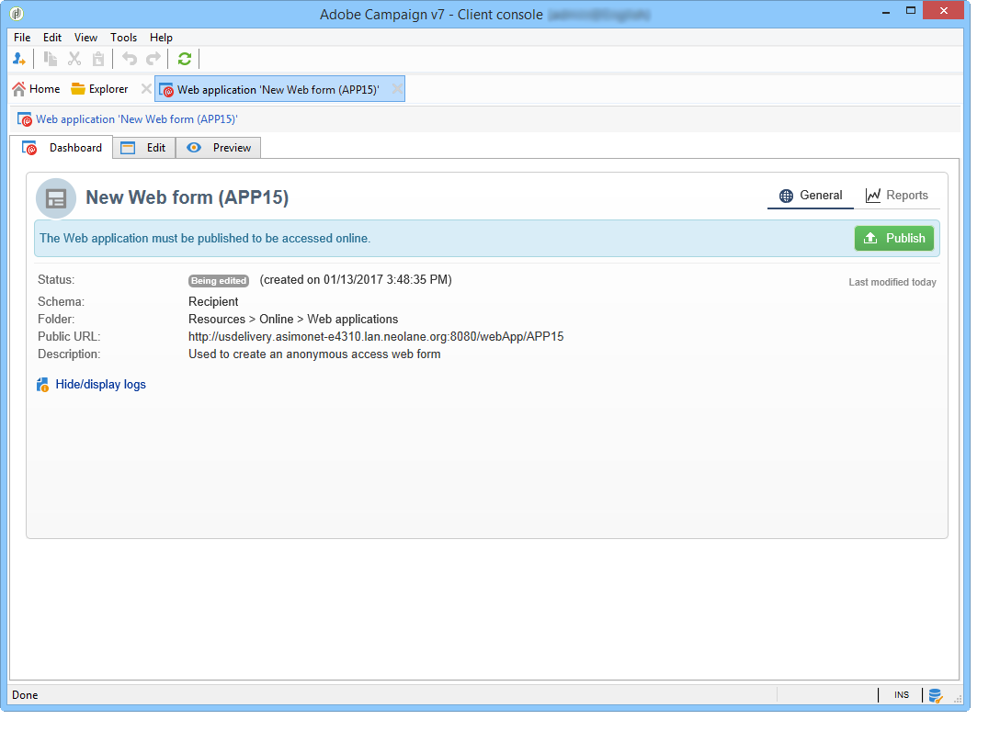

# Acerca de los formularios web{#about-web-forms}

Adobe Campaign incluye un módulo gráfico para definir y publicar formularios web para crear páginas que contengan campos de entrada y selección, y que pueden incluir datos de la base de datos. Esto le permite diseñar y publicar páginas web a las que los usuarios pueden acceder para ver o introducir información.

En este capítulo se detalla la creación y gestión de los formularios web, cómo administrar campos y páginas, así como los modos de almacenamiento y guardado.

>[!CAUTION]
>
>Por razones de privacidad, recomendamos utilizar HTTPS para todos los recursos externos.

## Pasos para crear un formulario web {#steps-for-creating-a-web-form}

En este capítulo se detallan los pasos necesarios para diseñar un **formulario web** en Adobe Campaign, así como las opciones y configuraciones disponibles. Adobe Campaign permite poner este formulario web a disposición de los usuarios, así como recopilar y archivar respuestas en la base de datos.

>[!CAUTION]
>
>Al configurar aplicaciones web y formularios web, necesita una resolución vertical mínima de 900 píxeles (por ejemplo: 1600 x 900).

Web forms are accessed via the Web Applications menu of the **Campaigns** tab. In the Adobe Campaign tree, they are grouped under the **[!UICONTROL Resources > Online > Web Applications]** node.

To create a Web form, click the **[!UICONTROL Create]** button above the list of Web applications.

Select the Web form template ( **[!UICONTROL newWebForm]** by default).

Esto le lleva al panel del formulario.

The **[!UICONTROL Edit]** tab lets you create your content.

Para definir la configuración y el contenido del formulario web, realice los siguientes pasos:

* Comience por crear las páginas y comprobaciones necesarias: campos de entrada, listas desplegables, contenido HTML, etc.

   Este paso se detalla a continuación.

* Defina la secuenciación de la página y la condición de visualización.

   Este paso se detalla en [Definición de la secuencia](../../web/using/defining-web-forms-page-sequencing.md)de páginas de formularios Web.

* Si es necesario, traduzca el contenido.

   Este paso se detalla en [Traducir un formulario](../../web/using/translating-a-web-form.md)web.

## Acerca del diseño de formularios web {#about-web-forms-designing}

Las páginas del formulario se crean mediante un editor específico que permite definir y configurar zonas de entrada (texto), campos de selección (listas, casillas de verificación, etc.) y elementos estáticos (imágenes, contenido HTML, etc.). They can be grouped into containers and their layout altered to suit your needs (for more on this, refer to [Creating containers](../../web/using/defining-web-forms-layout.md#creating-containers)).

En las siguientes secciones se detalla cómo definir el contenido y el diseño de las pantallas del formulario:

* [Adición de campos a un formulario web](../../web/using/adding-fields-to-a-web-form.md),
* [Inserción de contenido HTML](../../web/using/static-elements-in-a-web-form.md#inserting-html-content),
* [Elementos estáticos de un formulario web](../../web/using/static-elements-in-a-web-form.md),
* [Definición del diseño de los formularios web](../../web/using/defining-web-forms-layout.md).

>[!NOTE]
>
>* During page design, you can view the final rendering in the **[!UICONTROL Preview]** tab. Para ver los cambios, guarde el formulario primero. Any errors are displayed in the **[!UICONTROL Log]** tab.
>* Para asegurarse de que la visualización de página y el almacenamiento de la información se produzcan en la secuencia adecuada, active el modo de depuración en el formulario web. To do this, go to the **[!UICONTROL Preview]** sub-tab and check the **[!UICONTROL Enable debug mode]** box: all collected information and possible execution errors will be displayed at the bottom of each page.
>

### Uso de los iconos de la barra de herramientas {#using-the-icons-in-the-toolbar}

También puede utilizar los iconos de la barra de herramientas o hacer clic con el botón derecho para insertar una zona de entrada.

En este caso, comience por seleccionar el tipo de campo que desea añadir y el modo de almacenamiento de respuestas.

Haga clic en **[!UICONTROL Ok]** para aprobar la selección.

