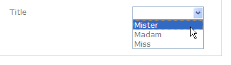
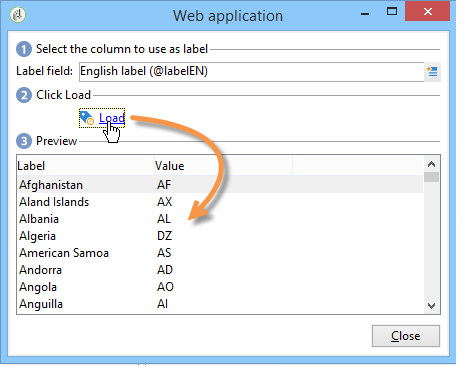
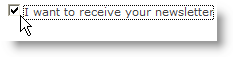
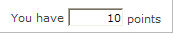
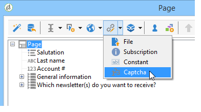
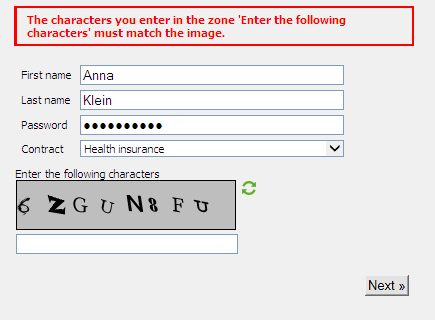

# Adición de campos a un formulario web{#adding-fields-to-a-web-form}

En un formulario web, los campos permiten a los usuarios introducir información y seleccionar opciones. Los formularios web pueden ofrecer campos de entrada, campos de selección, contenido estático y avanzado (captchas, suscripciones, etc.).

Cuando utiliza el asistente para añadir campos, el tipo de campo se detecta automáticamente en función del campo o de la variable de almacenamiento seleccionados. Puede editarlo mediante el cuadro desplegable **[!UICONTROL Type]** de la pestaña **[!UICONTROL General]**.

Al utilizar los botones de la barra de herramientas, seleccione el tipo de campo que desea añadir.

Están disponibles los siguientes tipos de campo:

* Entrada de texto/número. Consultar [Añadir campos de entrada](#adding-input-fields).
* Selección de lista desplegable. Consulte [Añadir listas desplegables](#adding-drop-down-lists).
* Opción múltiple mediante casillas de verificación. Consulte [Añadir casillas de verificación](#adding-checkboxes).
* Selección exclusiva mediante botones de opción. Consulte [Añadir de botones de radio](#adding-radio-buttons).
* Voto en una cuadrícula de opciones. Consulte [Añadir cuadrículas](#adding-grids).
* Números y fechas. Consulte [Añadir fechas y números](#adding-dates-and-numbers).
* Suscripción/cancelación de suscripciones a un servicio de información. Consulte [Casillas de verificación de suscripción](#subscription-checkboxes).
* Validación de captcha. Consulte [Inserción de un captcha](#inserting-a-captcha).
* Botón Descargar. [Carga de un archivo](#uploading-a-file).
* Constante oculta. Consulte [Inserción de una constante oculta](#inserting-a-hidden-constant).

Especifique el modo de registro de respuestas: actualice un campo de la base de datos (solo se almacena el último valor guardado) o almacénelo en una variable (la respuesta no está almacenada). Para obtener más información, consulte [Campos de almacenamiento de respuesta](../../web/using/web-forms-answers.md#response-storage-fields),

>[!NOTE]
>
>De forma predeterminada, el campo se inserta en la parte inferior del directorio actual. Utilice las flechas de la barra de herramientas para moverla hacia arriba o hacia abajo.

## Asistente de creación de campos {#field-creation-wizard}

Para cada página del formulario, puede añadir un campo mediante el primer botón de la barra de herramientas. Para ello, vaya al menú **[!UICONTROL Add using the wizard]**.

Seleccione el tipo de campo que desea crear: puede elegir añadir un campo en la base de datos, añadir una variable o importar un grupo de campos creados en otro formulario y recopilados en un contenedor.

Haga clic en **[!UICONTROL Next]** y seleccione el campo de almacenamiento o variable o el contenedor que desee importar.

Haga clic en **[!UICONTROL Finish]** para insertar el campo seleccionado en la página.

## Adición de campos de entrada {#adding-input-fields}

Para añadir un campo de entrada, haga clic en el botón **[!UICONTROL Input control]** y elija el tipo de campo que desea añadir.

### Tipos de campos de entrada {#types-of-input-fields}

Se pueden insertar cinco tipos diferentes de campos de texto en una página de formulario:

* **Texto**: permite al usuario introducir un texto en una línea.

   

* **Número**: permite al usuario introducir un texto en una línea. Para obtener más información, consulte [Añadir números](#adding-numbers).

   Cuando se aprueba la página, se comprueba el contenido del campo para asegurarse de que el valor introducido sea compatible con el campo. Para obtener más información, consulte [Definir configuraciones de control](../../web/using/form-rendering.md#defining-control-settings),

* **Contraseña**: permite al usuario introducir texto en una sola línea. Durante la entrada de texto, los caracteres se sustituyen por puntos:

   

   >[!CAUTION]
   >
   >Las contraseñas se almacenan sin encriptar en la base de datos.

* **Texto multilínea**: permite al usuario introducir texto en varias líneas.

   

   >[!CAUTION]
   >
   >Los campos de texto multilínea son campos específicos que pueden contener retornos de carro. Su espacio de almacenamiento debe estar asociado a un campo asignado a un elemento XML, no a un atributo XML. Para obtener más información sobre los tipos de datos en los esquemas, consulte el capítulo “Referencia de esquema” en [esta sección](../../configuration/using/about-schema-reference.md).
   >   
   >Si utiliza el módulo **Encuesta**, puede almacenar este tipo de campo en un campo archivado que se adapta automáticamente al formato. Para obtener más información, consulte [esta sección](../../web/using/about-surveys.md).

* **Texto enriquecido multilínea**: permite al usuario introducir texto con un diseño que se almacena en formato HTML.

   

   Se puede seleccionar el tipo de editor ofrecido a los usuarios. Para ello, en la pestaña **[!UICONTROL Advanced]**, utilice el cuadro desplegable del campo **[!UICONTROL HTML editor]**.

   

   El número de iconos mostrados varía en función del tipo de editor. Para un editor **[!UICONTROL Advanced]**, la renderización es la siguiente:

   

### Configuración de campos de entrada {#configure-input-fields}

Todos los campos de entrada se configuran en función del mismo modo, con las siguientes opciones:

La pestaña **[!UICONTROL General]** permite introducir el nombre del campo y el atributo como valor predeterminado si es necesario.

El modo de almacenamiento de respuestas se puede modificar mediante el enlace **[!UICONTROL Edit storage...]**. Los valores se pueden almacenar en un campo existente de la base de datos; o bien puede optar por no guardar información en la base de datos (utilice una variable local).

>[!NOTE]
>
>Los modos de almacenamiento se detallan en los [Campos de almacenamiento de respuesta](../../web/using/web-forms-answers.md#response-storage-fields)

La pestaña **[!UICONTROL Advanced]** permite definir parámetros de visualización para el campo (posición de etiquetas, alineación, etc.). Consulte [Definición del diseño de los formularios web](../../web/using/defining-web-forms-layout.md).

## Adición de listas desplegables {#adding-drop-down-lists}

Puede insertar una lista desplegable en una página de encuesta. Esto permite al usuario seleccionar un valor de los que se ofrecen en un menú desplegable.

Para agregar un cuadro desplegable a una página de formulario, haga clic en el botón **[!UICONTROL Selection controls > Drop-down list]** de la barra de herramientas del editor de páginas.

Seleccione el modo de almacenamiento de respuestas y confirme su selección.

Defina las etiquetas y los valores de la lista en la sección inferior de la pestaña **[!UICONTROL General]**. Si la información se almacena en un campo existente de la base de datos y es un campo de enumeración, puede rellenar los valores automáticamente haciendo clic en **[!UICONTROL Initialize the list of values from the database]**, como se muestra a continuación:

>[!NOTE]
>
>Utilice las flechas a la derecha de la lista de valores para cambiar su secuencia.

Si los datos se almacenan en una tabla vinculada, puede seleccionar el campo en el que se guardan los valores sugeridos en la lista. Por ejemplo, si selecciona la tabla de países, haga clic en **[!UICONTROL Initialize the list of values from the database...]** y seleccione el campo deseado.

A continuación, haga clic en el vínculo **[!UICONTROL Load]** para recuperar los valores:

>[!CAUTION]
>
>Repita esta operación siempre que la lista se actualice para actualizar los valores ofrecidos.

## Adición de casillas de verificación {#adding-checkboxes}

Para que el usuario seleccione una opción, debe utilizar una casilla de verificación.

Para añadir una casilla a un formulario, haga clic en el icono **[!UICONTROL Selection controls > Checkbox...]** de la barra de herramientas del editor de páginas.

Seleccione el modo de almacenamiento de respuestas y confirme su selección.

Introduzca la etiqueta de la casilla en el campo **[!UICONTROL Label]** de la pestaña **[!UICONTROL General]**.

Una casilla de verificación permite asignar un valor al campo (o valor) de almacenamiento en función de si se ha marcado o no la casilla. La sección **[!UICONTROL Values]** permite introducir el valor que se asigna si se marca la casilla (en el campo **[!UICONTROL Value]**) y el valor que se asigna si no se marca (en el campo **[!UICONTROL Empty value]**). Estos valores dependen del formato de almacenamiento de datos.

Si el campo de almacenamiento (o variable) es booleano, el valor que se asigna si la casilla no está marcada se deduce automáticamente. En este caso, solo se ofrece el campo **[!UICONTROL Value if checked]**, como se muestra a continuación:

## Asignación de un valor a un campo si se marca una casilla {#example--assign-a-value-to-a-field-if-a-box-is-checked}

Se busca insertar una casilla en un formulario para enviar una solicitud de mantenimiento, como se muestra a continuación:

La información se carga en la base de datos y en un campo existente (en este caso, el campo **[!UICONTROL Comment]**):

Si la casilla “Mantenimiento requerido” está marcada, la columna **[!UICONTROL Comment]** contiene “Mantenimiento requerido”. Si la casilla no está marcada, la columna contiene “Mantenimiento no requerido”. Para obtener este resultado, aplique la configuración siguiente a la casilla de verificación de la página del formulario:

## Adición de botones de opción {#adding-radio-buttons}

Los botones de opción le permiten ofrecer al usuario varias opciones exclusivas entre las que elegir. Estas opciones son valores diferentes para un mismo campo.

Puede crear botones de opción por separado (botones unitarios) o a través de una lista de selección múltiple, pero ya que el objetivo de los botones de opción es seleccionar una opción u otra, siempre creamos al menos un par de botones de opción en vez de uno solo.

>[!CAUTION]
>
>Para hacer la selección obligatoria, debe crear una lista de selección múltiple.

### Añadir botones de opción {#add-single-buttons}

Para añadir un botón de opción a una página de formulario, vaya al menú **[!UICONTROL Selection controls > Radio button]** de la barra de herramientas del editor de páginas y elija un modo de almacenamiento.

Los botones de opción se configuran de forma similar a las casillas de verificación (consulte). [Agregar casillas de verificación](#adding-checkboxes). Sin embargo, no se asigna ningún valor si no se selecciona la opción. Para que varios botones puedan ser interdependientes, es decir, que se deseleccione uno automáticamente si se selecciona el otro, se deben almacenar en el mismo campo. Si no se almacenan en la base de datos, se debe utilizar la misma variable local para el almacenamiento temporal. Consulte [Campos de almacenamiento de respuesta](../../web/using/web-forms-answers.md#response-storage-fields).

### Creación de una lista de botones {#add-a-list-of-buttons}

Para añadir botones de opción a través de una lista, vaya al menú **[!UICONTROL Selection controls>Multiple choice]** de la barra de herramientas del editor de páginas.

Añada tantos botones de opción como etiquetas. La ventaja de esta función es que puede importar valores de un campo existente (en el caso de un campo desglosado) y hacer que el usuario seleccione una opción. Sin embargo, el diseño de los botones es menos flexible.

>[!NOTE]
>
>Los formularios web no permiten la selección de varios valores. La selección múltiple solo se puede activar para los formularios de tipo **Encuesta.** Para obtener más información, consulte [esta sección](../../web/using/about-surveys.md).\
>Sin embargo, es posible insertar un campo de texto de tipo **[!UICONTROL Multiple choice]** en una aplicación web, pero sin autorizar la selección de varios valores: las opciones ofrecidas se pueden seleccionar mediante los botones de opción.

## Adición de cuadrículas {#adding-grids}

Las cuadrículas se utilizan para diseñar páginas de votación en aplicaciones web. Esto permite ofrecer listas de botones de opción para responder a los formularios web de tipo encuesta o evaluación, como se muestra a continuación:

Para utilizar este tipo de elemento en un formulario, cree una cuadrícula sencilla y añada una línea para cada elemento que desea evaluar.

El número de botones de opción de cada línea de la cuadrícula coincide con el número de valores definidos en la cuadrícula simple.

Solo se puede seleccionar una opción por cada línea de cuadrícula.

>[!NOTE]
>
>En este ejemplo, la etiqueta de la cuadrícula está oculta. Para ello, vaya a la pestaña **[!UICONTROL Advanced]**, y en ella puede comprobar que la pantalla **[!UICONTROL Label position]** se define como **[!UICONTROL Hidden]**. Consulte [Definición de la posición de etiquetas](../../web/using/defining-web-forms-layout.md#defining-the-position-of-labels).

## Adición de fechas y números {#adding-dates-and-numbers}

Se puede dar formato al contenido de los campos del formulario para que coincida con los datos almacenados en la base de datos o para satisfacer un requisito en particular. Puede crear campos adecuados para la introducción de números y fechas.

### Adición de fechas {#adding-dates}

Para permitir que el usuario escriba una fecha en una página de formulario, agregue un campo de entrada y seleccione el tipo **[!UICONTROL Date...]**.

Introduzca una etiqueta para el campo y configure el modo de almacenamiento de datos.

La sección inferior de la ventana permite seleccionar los formatos de fecha y hora para los valores almacenados en este campo.

También puede optar por no mostrar la fecha (o la hora).

Las fechas se pueden seleccionar mediante un calendario o casillas desplegables. También puede introducirlos directamente en el campo, pero tienen que coincidir con el formato especificado en la pantalla anterior.

>[!NOTE]
>
>De forma predeterminada, las fechas utilizadas en los formularios se introducen mediante un calendario. Para los formularios multilingües, compruebe que los calendarios están disponibles en todos los idiomas utilizados. Consulte [Traducción de un formulario web](../../web/using/translating-a-web-form.md).

Sin embargo, en algunos casos (para introducir fechas de nacimiento, por ejemplo), puede ser más fácil utilizar las listas desplegables.

Para ello, haga clic en la pestaña **[!UICONTROL Advanced]** y seleccione el modo de entrada mediante las **[!UICONTROL Drop-down lists]**.

A continuación, puede establecer límites de los valores ofrecidos en la lista.

### Adición de números {#adding-numbers}

Puede crear campos adecuados para introducir números.

En un campo numérico, el usuario solo puede introducir números. El control de introducción se aplica automáticamente cuando se aprueba la página.

Según el campo en el que se almacenen los datos en la base de datos, puede aplicar formatos especiales o determinadas restricciones. Asimismo, puede especificar valores máximos y mínimos. Este tipo de campo se configura de la siguiente manera:

El valor predeterminado es el valor mostrado en el campo cuando se publica el formulario. El usuario puede corregirlo.

Se puede añadir un prefijo o un sufijo al campo numérico mediante la pestaña **[!UICONTROL Advanced]**, como se muestra a continuación:

En el formulario, la renderización es la siguiente:

## Casillas de verificación de suscripción {#subscription-checkboxes}

Puede añadir controles para permitir a los usuarios suscribirse o dar de baja la suscripción de uno o más servicios de información (boletines informativos, avisos, notificaciones en tiempo real, etc.). Para suscribirse, el usuario comprueba el servicio correspondiente.

Para crear una casilla de verificación de suscripción, haga clic en **[!UICONTROL Advanced controls>Subscription]**.

Indique la etiqueta de la casilla de verificación y seleccione el servicio de información correspondiente mediante la casilla desplegable **[!UICONTROL Service]**.

>[!NOTE]
>
>Los servicios de información se describen en [esta página](../../delivery/using/managing-subscriptions.md).

El usuario se suscribe al servicio seleccionando la opción correspondiente.

>[!CAUTION]
>
>Si el usuario ya está suscrito a un servicio de información y la casilla vinculada a este servicio no está marcada al aprobar el formulario, se da de baja su suscripción.

En [esta sección](../../web/using/about-surveys.md) se encuentran disponibles ejemplos de suscripciones y reentregas.

## Inserción de un captcha {#inserting-a-captcha}

El propósito de las pruebas de **captcha** es evitar el uso fraudulento de los formularios web.

>[!CAUTION]
>
>Si el formulario contiene varias páginas, el captcha siempre debe colocarse en la última página, justo antes del cuadro de almacenamiento para evitar la elusión de las medidas de seguridad.

Para insertar un objeto captcha en un formulario, haga clic en el primer botón de la barra de herramientas y seleccione **[!UICONTROL Advanced controls>Captcha]**.

Introduzca la etiqueta del campo. Esta etiqueta se muestra delante del área de visualización del captcha. Puede cambiar la posición de esta etiqueta en la pestaña **[!UICONTROL Advanced]**.

>[!NOTE]
>
>Para los controles de tipo **[!UICONTROL captcha]** no es necesario indicar un campo de almacenamiento o una variable.

El componente captcha se inserta en la página con un campo de entrada situado bajo la ilustración. Estos dos elementos son inseparables y se consideran un solo elemento de cara al diseño de la página (ocupan una sola celda).

Cuando se confirma la página, el campo de entrada aparece en rojo si el contenido del captcha no se ha introducido correctamente.

Puede crear el mensaje de error que desea mostrar. Para ello, en la pestaña **[!UICONTROL General]**, utilice el enlace **[!UICONTROL Personalize the message]**.

>[!NOTE]
>
>Los captchas siempre tienen 8 caracteres de longitud. No puede modificar este valor.

## Carga de un archivo {#uploading-a-file}

Puede añadir un campo de carga a una página. Esta funcionalidad puede ser útil para compartir archivos de la intranet, por ejemplo.

Para insertar un campo de carga en una página de formulario, en la barra de herramientas del editor de páginas, seleccione el menú **[!UICONTROL Advanced controls > File...]**.

De forma predeterminada, los archivos cargados se almacenan en archivos de recursos a los que se puede acceder mediante el menú **[!UICONTROL Resources > Online > Public resources]**. Se puede utilizar una secuencia de comandos para cambiar este comportamiento. Esta secuencia de comandos puede utilizar las funciones definidas en [Campaign JSAPI documentation](https://docs.adobe.com/content/help/en/campaign-classic/technicalresources/api/index.html), incluidas las que afectan a la manipulación de archivos.

Se puede almacenar el vínculo a estos archivos en una variable local o en un campo de base de datos. Por ejemplo, se puede ampliar el esquema del destinatario para añadir un vínculo a recursos basados en archivos.

>[!CAUTION]
>
>* Este tipo de archivo debe reservarse para formularios con acceso seguro (con credenciales).
>* Adobe Campaign no controla el tamaño ni el tipo de recurso cargado: por lo tanto, se recomienda encarecidamente utilizar campos de carga únicamente para sitios de intranet de tipo seguro.
>* Si hay varios servidores vinculados a la instancia (“equilibrio de carga”), debe asegurarse de que las llamadas al formulario web lleguen al mismo servidor.
>* Estas implementaciones requieren la asistencia del equipo de consultoría de Adobe Campaign.
>

## Inserción de una constante oculta {#inserting-a-hidden-constant}

Cuando el usuario valida una de las páginas del formulario, puede establecer un valor específico en un campo de su perfil o en una variable.

Este campo no es visible para el usuario, pero puede utilizarse para enriquecer los datos en el perfil de usuario.

Para ello, coloque una **constante** en la página y especifique el valor y la ubicación de almacenamiento.

En el ejemplo siguiente, el campo de **origen** del perfil de destinatario se rellena automáticamente cada vez que un usuario aprueba esta página. La constante no se muestra en la página.

