<?xml version="1.0" encoding="UTF-8"?>
<xliff xmlns="urn:oasis:names:tc:xliff:document:1.2" xmlns:okp="okapi-framework:xliff-extensions" xmlns:its="http://www.w3.org/2005/11/its" xmlns:itsxlf="http://www.w3.org/ns/its-xliff/" version="1.2" its:version="2.0">
<file original="help/web/using/adding-fields-to-a-web-form.md.mdnouisc" source-language="en-US" target-language="en-XX" datatype="x-text/markdown">
<body>
<trans-unit id="tu186" xml:space="preserve">
<source xml:lang="en-US">https://experienceleague.adobe.com/en/tools/campaign-api</source>
<target xml:lang="en-XX">https://experienceleague.adobe.com/es/tools/campaign-api</target>
</trans-unit>
<trans-unit id="tu1" restype="x-YAML_METADATA_HEADER_VALUE" xml:space="preserve">
<source xml:lang="en-US">Add fields to a web form</source>
<target xml:lang="en-XX">Adición de campos a un formulario web</target>
</trans-unit>
<trans-unit id="tu2" restype="x-YAML_METADATA_HEADER_VALUE" xml:space="preserve">
<source xml:lang="en-US">Add fields to a web form</source>
<target xml:lang="en-XX">Adición de campos a un formulario web</target>
</trans-unit>
<trans-unit id="tu3" xml:space="preserve">
<source xml:lang="en-US">Also applies to v8</source>
<target xml:lang="en-XX">También se aplica a v8</target>
</trans-unit>
<trans-unit id="tu4" xml:space="preserve">
<source xml:lang="en-US">Also applies to Campaign v8</source>
<target xml:lang="en-XX">También se aplica a Campaign v8</target>
</trans-unit>
<trans-unit id="tu5" xml:space="preserve">
<source xml:lang="en-US">Add fields to a web form</source>
<target xml:lang="en-XX">Adición de campos a un formulario web</target>
</trans-unit>
<trans-unit id="tu6" xml:space="preserve">
<source xml:lang="en-US">In a Web form, fields enable users to enter information and select options. Web forms can offer input fields, selection fields, static and advanced content (captchas, subscriptions, etc.).</source>
<target xml:lang="en-XX">En un formulario web, los campos permiten a los usuarios introducir información y seleccionar opciones. Los formularios web pueden ofrecer campos de entrada, campos de selección, contenido estático y avanzado (captchas, suscripciones, etc.).</target>
</trans-unit>
<trans-unit id="tu7" xml:space="preserve">
<source xml:lang="en-US">When you use the assistant to add fields, the field type is detected automatically based on the selected field or storage variable. You can edit it using the <ph id="1" ctype="x-STRONG_EMPHASIS">**[!UICONTROL Type]**</ph> drop-down box in the <ph id="4" ctype="x-STRONG_EMPHASIS">**[!UICONTROL General]**</ph> tab.</source>
<target xml:lang="en-XX">Cuando se utiliza el asistente para añadir campos, el tipo de campo se detecta automáticamente en función del campo o de la variable de almacenamiento seleccionados. Puede editarlo mediante el cuadro desplegable <ph id="1" ctype="x-STRONG_EMPHASIS">**[!UICONTROL Type]**</ph> de la pestaña <ph id="4" ctype="x-STRONG_EMPHASIS">**[!UICONTROL General]**</ph>.</target>
</trans-unit>
<trans-unit id="tu8" xml:space="preserve">
<source xml:lang="en-US"><ph id="1" ctype="x-IMAGE">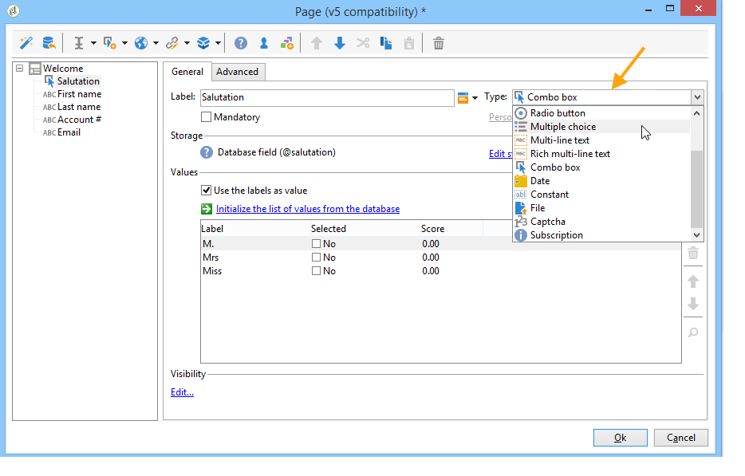</ph></source>
<target xml:lang="en-XX"><ph id="1" ctype="x-IMAGE"></ph></target>
</trans-unit>
<trans-unit id="tu9" xml:space="preserve">
<source xml:lang="en-US">When using the buttons in the toolbar, select the type of field you want to add.</source>
<target xml:lang="en-XX">Al utilizar los botones de la barra de herramientas, seleccione el tipo de campo que desea añadir.</target>
</trans-unit>
<trans-unit id="tu10" xml:space="preserve">
<source xml:lang="en-US">The following types of field are available:</source>
<target xml:lang="en-XX">Están disponibles los siguientes tipos de campo:</target>
</trans-unit>
<trans-unit id="tu11" xml:space="preserve">
<source xml:lang="en-US">Text/number input. See <ph id="1" ctype="x-LINK">[</ph>Adding input fields<ph id="2" ctype="x-LINK">](#adding-input-fields)</ph>.</source>
<target xml:lang="en-XX">Entrada de texto/número. Consultar <ph id="1" ctype="x-LINK">[</ph>Añadir campos de entrada<ph id="2" ctype="x-LINK">](#adding-input-fields)</ph>.</target>
</trans-unit>
<trans-unit id="tu12" xml:space="preserve">
<source xml:lang="en-US">Drop-down list selection. See <ph id="1" ctype="x-LINK">[</ph>Adding drop-down lists<ph id="2" ctype="x-LINK">](#adding-drop-down-lists)</ph>.</source>
<target xml:lang="en-XX">Selección de lista desplegable. Consulte <ph id="1" ctype="x-LINK">[</ph>Añadir listas desplegables<ph id="2" ctype="x-LINK">](#adding-drop-down-lists)</ph>.</target>
</trans-unit>
<trans-unit id="tu13" xml:space="preserve">
<source xml:lang="en-US">Multiple choice via checkboxes. See <ph id="1" ctype="x-LINK">[</ph>Adding checkboxes<ph id="2" ctype="x-LINK">](#adding-checkboxes)</ph>.</source>
<target xml:lang="en-XX">Opción múltiple mediante casillas de verificación. Consulte <ph id="1" ctype="x-LINK">[</ph>Añadir casillas de verificación<ph id="2" ctype="x-LINK">](#adding-checkboxes)</ph>.</target>
</trans-unit>
<trans-unit id="tu14" xml:space="preserve">
<source xml:lang="en-US">Exclusive selection via radio buttons. See <ph id="1" ctype="x-LINK">[</ph>Adding radio buttons<ph id="2" ctype="x-LINK">](#adding-radio-buttons)</ph>.</source>
<target xml:lang="en-XX">Selección exclusiva mediante botones de opción. Consulte <ph id="1" ctype="x-LINK">[</ph>Añadir de botones de radio<ph id="2" ctype="x-LINK">](#adding-radio-buttons)</ph>.</target>
</trans-unit>
<trans-unit id="tu15" xml:space="preserve">
<source xml:lang="en-US">Vote in an option grid. See <ph id="1" ctype="x-LINK">[</ph>Adding grids<ph id="2" ctype="x-LINK">](#adding-grids)</ph>.</source>
<target xml:lang="en-XX">Voto en una cuadrícula de opciones. Consulte <ph id="1" ctype="x-LINK">[</ph>Añadir cuadrículas<ph id="2" ctype="x-LINK">](#adding-grids)</ph>.</target>
</trans-unit>
<trans-unit id="tu16" xml:space="preserve">
<source xml:lang="en-US">Numbers and dates. See <ph id="1" ctype="x-LINK">[</ph>Adding dates and numbers<ph id="2" ctype="x-LINK">](#adding-dates-and-numbers)</ph>.</source>
<target xml:lang="en-XX">Números y fechas. Consulte <ph id="1" ctype="x-LINK">[</ph>Añadir fechas y números<ph id="2" ctype="x-LINK">](#adding-dates-and-numbers)</ph>.</target>
</trans-unit>
<trans-unit id="tu17" xml:space="preserve">
<source xml:lang="en-US">Subscription/unsubscription to an information service. See <ph id="1" ctype="x-LINK">[</ph>Subscription checkboxes<ph id="2" ctype="x-LINK">](#subscription-checkboxes)</ph>.</source>
<target xml:lang="en-XX">Suscripción/cancelación de suscripciones a un servicio de información. Consulte <ph id="1" ctype="x-LINK">[</ph>Casillas de verificación de suscripción<ph id="2" ctype="x-LINK">](#subscription-checkboxes)</ph>.</target>
</trans-unit>
<trans-unit id="tu18" xml:space="preserve">
<source xml:lang="en-US">Captcha validation. See <ph id="1" ctype="x-LINK">[</ph>Inserting a captcha<ph id="2" ctype="x-LINK">](#inserting-a-captcha)</ph>.</source>
<target xml:lang="en-XX">Validación de captcha. Consulte <ph id="1" ctype="x-LINK">[</ph>Inserción de un captcha<ph id="2" ctype="x-LINK">](#inserting-a-captcha)</ph>.</target>
</trans-unit>
<trans-unit id="tu19" xml:space="preserve">
<source xml:lang="en-US">Download button. <ph id="1" ctype="x-LINK">[</ph>Uploading a file<ph id="2" ctype="x-LINK">](#uploading-a-file)</ph>.</source>
<target xml:lang="en-XX">Botón Descargar. <ph id="1" ctype="x-LINK">[</ph>Carga de un archivo<ph id="2" ctype="x-LINK">](#uploading-a-file)</ph>.</target>
</trans-unit>
<trans-unit id="tu20" xml:space="preserve">
<source xml:lang="en-US">Hidden constant. See <ph id="1" ctype="x-LINK">[</ph>Inserting a hidden constant<ph id="2" ctype="x-LINK">](#inserting-a-hidden-constant)</ph>.</source>
<target xml:lang="en-XX">Constante oculta. Consulte <ph id="1" ctype="x-LINK">[</ph>Inserción de una constante oculta<ph id="2" ctype="x-LINK">](#inserting-a-hidden-constant)</ph>.</target>
</trans-unit>
<trans-unit id="tu21" xml:space="preserve">
<source xml:lang="en-US">Please specify the response storage mode: update a field in the database (stores only the last value saved) or store in a variable (the answer is not stored). For more on this, refer to <ph id="1" ctype="x-LINK">[</ph>Response storage fields<ph id="2" ctype="x-LINK">](web-forms-answers.md#response-storage-fields)</ph>.</source>
<target xml:lang="en-XX">Especifique el modo de registro de respuestas: actualice un campo de la base de datos (solo se almacena el último valor guardado) o almacénelo en una variable (la respuesta no está almacenada). Para obtener más información, consulte <ph id="1" ctype="x-LINK">[</ph>Campos de almacenamiento de respuesta<ph id="2" ctype="x-LINK">](web-forms-answers.md#response-storage-fields)</ph>,</target>
</trans-unit>
<trans-unit id="tu22" xml:space="preserve">
<source xml:lang="en-US"><ph id="1" ctype="x-regxph" equiv-text="&lbrack;!NOTE">[!NOTE]</ph></source>
<target xml:lang="en-XX"><ph id="1" ctype="x-regxph" equiv-text="&lbrack;!NOTE">[!NOTE]</ph></target>
</trans-unit>
<trans-unit id="tu23" xml:space="preserve">
<source xml:lang="en-US">By default, the field is inserted at the bottom of the current tree. Use the arrows in the toolbar to move it up or down.</source>
<target xml:lang="en-XX">De forma predeterminada, el campo se inserta en la parte inferior del directorio actual. Utilice las flechas de la barra de herramientas para moverla hacia arriba o hacia abajo.</target>
</trans-unit>
<trans-unit id="tu24" xml:space="preserve">
<source xml:lang="en-US">Field creation assistant</source>
<target xml:lang="en-XX">Asistente de creación de campos</target>
</trans-unit>
<trans-unit id="tu25" xml:space="preserve">
<source xml:lang="en-US">For each page of the form, you can add a field via the first button in the toolbar. To do this, go to the <ph id="1" ctype="x-STRONG_EMPHASIS">**[!UICONTROL Add using the assistant]**</ph> menu.</source>
<target xml:lang="en-XX">Para cada página del formulario, puede añadir un campo con el primer botón de la barra de herramientas. Para ello, vaya al menú <ph id="1" ctype="x-STRONG_EMPHASIS">**[!UICONTROL Add using the assistant]**</ph>.</target>
</trans-unit>
<trans-unit id="tu26" xml:space="preserve">
<source xml:lang="en-US"><ph id="1" ctype="x-IMAGE"></ph></source>
<target xml:lang="en-XX"><ph id="1" ctype="x-IMAGE"></ph></target>
</trans-unit>
<trans-unit id="tu27" xml:space="preserve">
<source xml:lang="en-US">Select the type of field you want to create: you can choose to add a field in the database, a variable or to import a group of fields created in another form and collected in a container.</source>
<target xml:lang="en-XX">Seleccione el tipo de campo que desea crear: puede elegir añadir un campo en la base de datos, añadir una variable o importar un grupo de campos creados en otro formulario y recopilados en un contenedor.</target>
</trans-unit>
<trans-unit id="tu28" xml:space="preserve">
<source xml:lang="en-US">Click <ph id="1" ctype="x-STRONG_EMPHASIS">**[!UICONTROL Next]**</ph> and select the storage field or variable, or the container you want to import.</source>
<target xml:lang="en-XX">Haga clic en <ph id="1" ctype="x-STRONG_EMPHASIS">**[!UICONTROL Next]**</ph> y seleccione el campo de almacenamiento o variable o el contenedor que desee importar.</target>
</trans-unit>
<trans-unit id="tu29" xml:space="preserve">
<source xml:lang="en-US"><ph id="1" ctype="x-IMAGE"></ph></source>
<target xml:lang="en-XX"><ph id="1" ctype="x-IMAGE"></ph></target>
</trans-unit>
<trans-unit id="tu30" xml:space="preserve">
<source xml:lang="en-US">Click <ph id="1" ctype="x-STRONG_EMPHASIS">**[!UICONTROL Finish]**</ph> to insert the selected field into the page.</source>
<target xml:lang="en-XX">Haga clic en <ph id="1" ctype="x-STRONG_EMPHASIS">**[!UICONTROL Finish]**</ph> para insertar el campo seleccionado en la página.</target>
</trans-unit>
<trans-unit id="tu31" xml:space="preserve">
<source xml:lang="en-US"><ph id="1" ctype="x-IMAGE"></ph></source>
<target xml:lang="en-XX"><ph id="1" ctype="x-IMAGE"></ph></target>
</trans-unit>
<trans-unit id="tu32" xml:space="preserve">
<source xml:lang="en-US">Adding input fields</source>
<target xml:lang="en-XX">Adición de campos de entrada</target>
</trans-unit>
<trans-unit id="tu33" xml:space="preserve">
<source xml:lang="en-US">To add an input field, click the <ph id="1" ctype="x-STRONG_EMPHASIS">**[!UICONTROL Input control]**</ph> button and choose the type of field you want to add.</source>
<target xml:lang="en-XX">Para añadir un campo de entrada, haga clic en el botón <ph id="1" ctype="x-STRONG_EMPHASIS">**[!UICONTROL Input control]**</ph> y elija el tipo de campo que desea añadir.</target>
</trans-unit>
<trans-unit id="tu34" xml:space="preserve">
<source xml:lang="en-US"><ph id="1" ctype="x-IMAGE">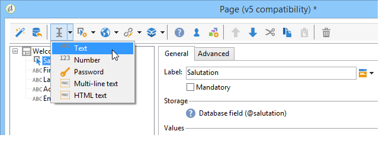</ph></source>
<target xml:lang="en-XX"><ph id="1" ctype="x-IMAGE"></ph></target>
</trans-unit>
<trans-unit id="tu35" xml:space="preserve">
<source xml:lang="en-US">Types of input fields</source>
<target xml:lang="en-XX">Tipos de campos de entrada</target>
</trans-unit>
<trans-unit id="tu36" xml:space="preserve">
<source xml:lang="en-US">Five different types of text fields can be inserted into a form page:</source>
<target xml:lang="en-XX">Se pueden insertar cinco tipos diferentes de campos de texto en una página de formulario:</target>
</trans-unit>
<trans-unit id="tu37" xml:space="preserve">
<source xml:lang="en-US"><ph id="1" ctype="x-STRONG_EMPHASIS">**</ph>Text<ph id="2" ctype="x-STRONG_EMPHASIS">**</ph>: lets the user enter a text on one line.</source>
<target xml:lang="en-XX"><ph id="1" ctype="x-STRONG_EMPHASIS">**</ph>Texto<ph id="2" ctype="x-STRONG_EMPHASIS">**</ph>: permite al usuario introducir un texto en una línea.</target>
</trans-unit>
<trans-unit id="tu38" xml:space="preserve">
<source xml:lang="en-US"><ph id="1" ctype="x-IMAGE">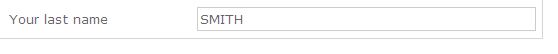</ph></source>
<target xml:lang="en-XX"><ph id="1" ctype="x-IMAGE"></ph></target>
</trans-unit>
<trans-unit id="tu39" xml:space="preserve">
<source xml:lang="en-US"><ph id="1" ctype="x-STRONG_EMPHASIS">**</ph>Number<ph id="2" ctype="x-STRONG_EMPHASIS">**</ph>: lets the user enter a number on one line. for more on this, refer to <ph id="3" ctype="x-LINK">[</ph>Adding numbers<ph id="4" ctype="x-LINK">](#adding-numbers)</ph>.</source>
<target xml:lang="en-XX"><ph id="1" ctype="x-STRONG_EMPHASIS">**</ph>Número<ph id="2" ctype="x-STRONG_EMPHASIS">**</ph>: permite al usuario introducir un texto en una línea. Para obtener más información, consulte <ph id="3" ctype="x-LINK">[</ph>Añadir números<ph id="4" ctype="x-LINK">](#adding-numbers)</ph>.</target>
</trans-unit>
<trans-unit id="tu40" xml:space="preserve">
<source xml:lang="en-US">When the page is approved, field content is checked to make sure the value entered is compatible with the field. For more on this, refer to <ph id="1" ctype="x-LINK">[</ph>Defining control settings<ph id="2" ctype="x-LINK">](form-rendering.md#defining-control-settings)</ph>.</source>
<target xml:lang="en-XX">Cuando se aprueba la página, se comprueba el contenido del campo para asegurarse de que el valor introducido sea compatible con el campo. Para obtener más información, consulte <ph id="1" ctype="x-LINK">[</ph>Definir configuraciones de control<ph id="2" ctype="x-LINK">](form-rendering.md#defining-control-settings)</ph>,</target>
</trans-unit>
<trans-unit id="tu41" xml:space="preserve">
<source xml:lang="en-US"><ph id="1" ctype="x-STRONG_EMPHASIS">**</ph>Password<ph id="2" ctype="x-STRONG_EMPHASIS">**</ph>: lets the user enter text on a single line. During text entry, the characters are replaced by periods:</source>
<target xml:lang="en-XX"><ph id="1" ctype="x-STRONG_EMPHASIS">**</ph>Contraseña<ph id="2" ctype="x-STRONG_EMPHASIS">**</ph>: permite al usuario introducir texto en una sola línea. Durante la entrada de texto, los caracteres se sustituyen por puntos:</target>
</trans-unit>
<trans-unit id="tu42" xml:space="preserve">
<source xml:lang="en-US"><ph id="1" ctype="x-IMAGE">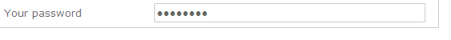</ph></source>
<target xml:lang="en-XX"><ph id="1" ctype="x-IMAGE"></ph></target>
</trans-unit>
<trans-unit id="tu43" xml:space="preserve">
<source xml:lang="en-US"><ph id="1" ctype="x-regxph" equiv-text="&lbrack;!CAUTION">[!CAUTION]</ph></source>
<target xml:lang="en-XX"><ph id="1" ctype="x-regxph" equiv-text="&lbrack;!CAUTION">[!CAUTION]</ph></target>
</trans-unit>
<trans-unit id="tu44" xml:space="preserve">
<source xml:lang="en-US">Passwords are stored unencrypted in the database.</source>
<target xml:lang="en-XX">Las contraseñas se almacenan sin cifrar en la base de datos.</target>
</trans-unit>
<trans-unit id="tu45" xml:space="preserve">
<source xml:lang="en-US"><ph id="1" ctype="x-STRONG_EMPHASIS">**</ph>Multi-line text<ph id="2" ctype="x-STRONG_EMPHASIS">**</ph>: lets the user enter text on several lines.</source>
<target xml:lang="en-XX"><ph id="1" ctype="x-STRONG_EMPHASIS">**</ph>Texto multilínea<ph id="2" ctype="x-STRONG_EMPHASIS">**</ph>: permite al usuario introducir texto en varias líneas.</target>
</trans-unit>
<trans-unit id="tu46" xml:space="preserve">
<source xml:lang="en-US"><ph id="1" ctype="x-IMAGE"></ph></source>
<target xml:lang="en-XX"><ph id="1" ctype="x-IMAGE"></ph></target>
</trans-unit>
<trans-unit id="tu47" xml:space="preserve">
<source xml:lang="en-US"><ph id="1" ctype="x-regxph" equiv-text="&lbrack;!CAUTION">[!CAUTION]</ph></source>
<target xml:lang="en-XX"><ph id="1" ctype="x-regxph" equiv-text="&lbrack;!CAUTION">[!CAUTION]</ph></target>
</trans-unit>
<trans-unit id="tu48" xml:space="preserve">
<source xml:lang="en-US">Multi-line text fields are specific fields that can contain carriage returns. Their storage space must be associated with a field mapped on an XML element, not an XML attribute.</source>
<target xml:lang="en-XX">Los campos de texto multilínea son campos específicos que pueden contener retornos de carro. Su espacio de almacenamiento debe estar asociado a un campo asignado a un elemento XML, no a un atributo XML.</target>
</trans-unit>
<trans-unit id="tu49" xml:space="preserve">
<source xml:lang="en-US"><ph id="1" ctype="x-STRONG_EMPHASIS">**</ph>Enriched multi-line text<ph id="2" ctype="x-STRONG_EMPHASIS">**</ph>: lets the user enter text with a layout which will be stored in HTML format.</source>
<target xml:lang="en-XX"><ph id="1" ctype="x-STRONG_EMPHASIS">**</ph>Texto enriquecido multilínea<ph id="2" ctype="x-STRONG_EMPHASIS">**</ph>: permite al usuario introducir texto con un diseño que se almacena en formato HTML.</target>
</trans-unit>
<trans-unit id="tu50" xml:space="preserve">
<source xml:lang="en-US"><ph id="1" ctype="x-IMAGE">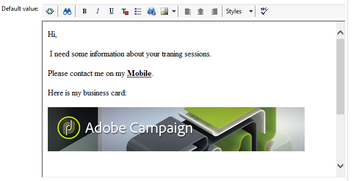</ph></source>
<target xml:lang="en-XX"><ph id="1" ctype="x-IMAGE"></ph></target>
</trans-unit>
<trans-unit id="tu51" xml:space="preserve">
<source xml:lang="en-US">You can select the type of editor offered to users. To do this, use the drop-down box of the <ph id="1" ctype="x-STRONG_EMPHASIS">**[!UICONTROL HTML editor]**</ph> field in the <ph id="4" ctype="x-STRONG_EMPHASIS">**[!UICONTROL Advanced]**</ph> tab.</source>
<target xml:lang="en-XX">Se puede seleccionar el tipo de editor ofrecido a los usuarios. Para ello, en la pestaña <ph id="4" ctype="x-STRONG_EMPHASIS">**[!UICONTROL Advanced]**</ph>, utilice el cuadro desplegable del campo <ph id="1" ctype="x-STRONG_EMPHASIS">**[!UICONTROL HTML editor]**</ph>.</target>
</trans-unit>
<trans-unit id="tu52" xml:space="preserve">
<source xml:lang="en-US"><ph id="1" ctype="x-IMAGE">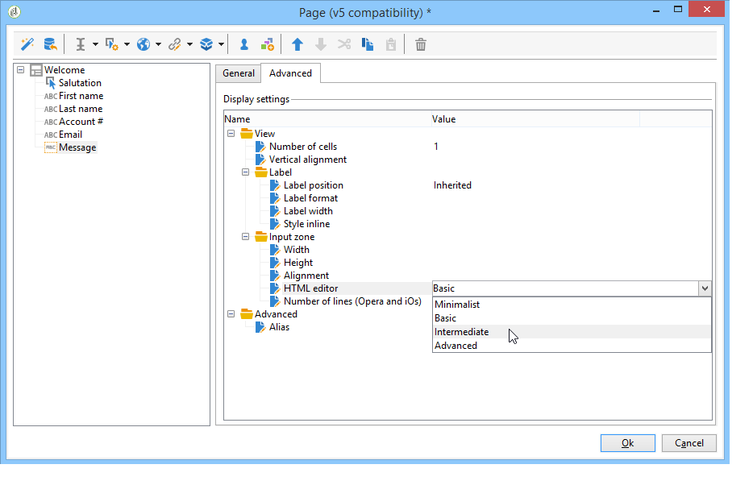</ph></source>
<target xml:lang="en-XX"><ph id="1" ctype="x-IMAGE"></ph></target>
</trans-unit>
<trans-unit id="tu53" xml:space="preserve">
<source xml:lang="en-US">The number of icons displayed varies depending on the type of editor. For an <ph id="1" ctype="x-STRONG_EMPHASIS">**[!UICONTROL Advanced]**</ph> editor, the rendering will be as follows:</source>
<target xml:lang="en-XX">El número de iconos mostrados varía en función del tipo de editor. Para un editor <ph id="1" ctype="x-STRONG_EMPHASIS">**[!UICONTROL Advanced]**</ph>, la renderización es la siguiente:</target>
</trans-unit>
<trans-unit id="tu54" xml:space="preserve">
<source xml:lang="en-US"><ph id="1" ctype="x-IMAGE">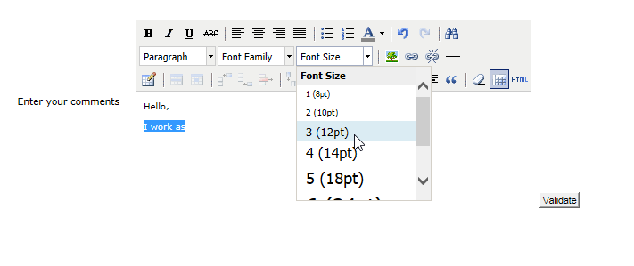</ph></source>
<target xml:lang="en-XX"><ph id="1" ctype="x-IMAGE"></ph></target>
</trans-unit>
<trans-unit id="tu55" xml:space="preserve">
<source xml:lang="en-US">Configure input fields</source>
<target xml:lang="en-XX">Configuración de los campos de entrada</target>
</trans-unit>
<trans-unit id="tu56" xml:space="preserve">
<source xml:lang="en-US">Input fields are all configured based on the same mode, using the following options:</source>
<target xml:lang="en-XX">Todos los campos de entrada se configuran del mismo modo, con las siguientes opciones:</target>
</trans-unit>
<trans-unit id="tu57" xml:space="preserve">
<source xml:lang="en-US"><ph id="1" ctype="x-IMAGE">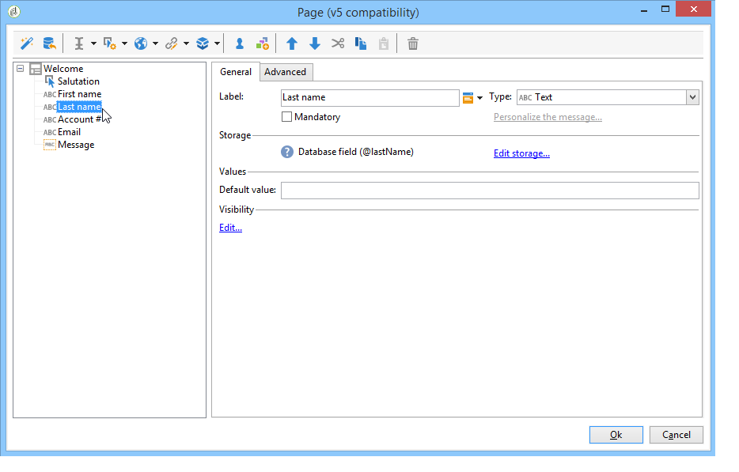</ph></source>
<target xml:lang="en-XX"><ph id="1" ctype="x-IMAGE"></ph></target>
</trans-unit>
<trans-unit id="tu58" xml:space="preserve">
<source xml:lang="en-US">The <ph id="1" ctype="x-STRONG_EMPHASIS">**[!UICONTROL General]**</ph> tab lets you enter the name of the field and attribute a default value to it if necessary.</source>
<target xml:lang="en-XX">La pestaña <ph id="1" ctype="x-STRONG_EMPHASIS">**[!UICONTROL General]**</ph> permite introducir el nombre del campo y el atributo como valor predeterminado si es necesario.</target>
</trans-unit>
<trans-unit id="tu59" xml:space="preserve">
<source xml:lang="en-US">The answer storage mode can be altered via the <ph id="1" ctype="x-STRONG_EMPHASIS">**[!UICONTROL Edit storage...]**</ph> link. Values can be stored in an existing field of the database; or you can choose not to save information in the database (use a local variable).</source>
<target xml:lang="en-XX">El modo de almacenamiento de respuestas se puede modificar mediante el enlace <ph id="1" ctype="x-STRONG_EMPHASIS">**[!UICONTROL Edit storage...]**</ph>. Los valores se pueden almacenar en un campo existente de la base de datos; o bien puede optar por no guardar información en la base de datos (utilice una variable local).</target>
</trans-unit>
<trans-unit id="tu60" xml:space="preserve">
<source xml:lang="en-US"><ph id="1" ctype="x-regxph" equiv-text="&lbrack;!NOTE">[!NOTE]</ph></source>
<target xml:lang="en-XX"><ph id="1" ctype="x-regxph" equiv-text="&lbrack;!NOTE">[!NOTE]</ph></target>
</trans-unit>
<trans-unit id="tu61" xml:space="preserve">
<source xml:lang="en-US">Storage modes are detailed in <ph id="1" ctype="x-LINK">[</ph>Response storage fields<ph id="2" ctype="x-LINK">](web-forms-answers.md#response-storage-fields)</ph></source>
<target xml:lang="en-XX">Los modos de almacenamiento se detallan en los <ph id="1" ctype="x-LINK">[</ph>Campos de almacenamiento de respuesta<ph id="2" ctype="x-LINK">](web-forms-answers.md#response-storage-fields)</ph></target>
</trans-unit>
<trans-unit id="tu62" xml:space="preserve">
<source xml:lang="en-US">The <ph id="1" ctype="x-STRONG_EMPHASIS">**[!UICONTROL Advanced]**</ph> tab lets you define display parameters for the field (position of labels, alignment, etc.). See <ph id="4" ctype="x-LINK">[</ph>Defining web forms layout<ph id="5" ctype="x-LINK">](defining-web-forms-layout.md)</ph>.</source>
<target xml:lang="en-XX">La pestaña <ph id="1" ctype="x-STRONG_EMPHASIS">**[!UICONTROL Advanced]**</ph> permite definir parámetros de visualización para el campo (posición de etiquetas, alineación, etc.). Consulte <ph id="4" ctype="x-LINK">[</ph>Definición del diseño de los formularios web<ph id="5" ctype="x-LINK">](defining-web-forms-layout.md)</ph>.</target>
</trans-unit>
<trans-unit id="tu63" xml:space="preserve">
<source xml:lang="en-US">Adding drop-down lists</source>
<target xml:lang="en-XX">Adición de listas desplegables</target>
</trans-unit>
<trans-unit id="tu64" xml:space="preserve">
<source xml:lang="en-US">You can insert a drop-down list into a survey page. This lets the user select a value from those on offer in a drop-down menu.</source>
<target xml:lang="en-XX">Puede insertar una lista desplegable en una página de encuesta. Esto permite al usuario seleccionar un valor de los que se ofrecen en un menú desplegable.</target>
</trans-unit>
<trans-unit id="tu65" xml:space="preserve">
<source xml:lang="en-US"><ph id="1" ctype="x-IMAGE"></ph></source>
<target xml:lang="en-XX"><ph id="1" ctype="x-IMAGE"></ph></target>
</trans-unit>
<trans-unit id="tu66" xml:space="preserve">
<source xml:lang="en-US">To add a drop-down box to a form page, click the <ph id="1" ctype="x-STRONG_EMPHASIS">**[!UICONTROL Selection controls > Drop-down list]**</ph> button in the toolbar of the page editor.</source>
<target xml:lang="en-XX">Para agregar un cuadro desplegable a una página de formulario, haga clic en el botón <ph id="1" ctype="x-STRONG_EMPHASIS">**[!UICONTROL Selection controls > Drop-down list]**</ph> de la barra de herramientas del editor de páginas.</target>
</trans-unit>
<trans-unit id="tu67" xml:space="preserve">
<source xml:lang="en-US"><ph id="1" ctype="x-IMAGE"></ph></source>
<target xml:lang="en-XX"><ph id="1" ctype="x-IMAGE"></ph></target>
</trans-unit>
<trans-unit id="tu68" xml:space="preserve">
<source xml:lang="en-US">Select the answer storage mode and confirm your choice.</source>
<target xml:lang="en-XX">Seleccione el modo de almacenamiento de respuestas y confirme su selección.</target>
</trans-unit>
<trans-unit id="tu69" xml:space="preserve">
<source xml:lang="en-US">Define the labels and values of the list in the lower section of the <ph id="1" ctype="x-STRONG_EMPHASIS">**[!UICONTROL General]**</ph> tab. If the information is stored in an existing field of the database and it is an enumeration field, you can fill in the values automatically by clicking <ph id="4" ctype="x-STRONG_EMPHASIS">**[!UICONTROL Initialize the list of values from the database]**</ph> , as shown below:</source>
<target xml:lang="en-XX">Defina las etiquetas y los valores de la lista en la sección inferior de la pestaña <ph id="1" ctype="x-STRONG_EMPHASIS">**[!UICONTROL General]**</ph>. Si la información se almacena en un campo existente de la base de datos y es un campo de enumeración, puede rellenar los valores automáticamente haciendo clic en <ph id="4" ctype="x-STRONG_EMPHASIS">**[!UICONTROL Initialize the list of values from the database]**</ph>, como se muestra a continuación:</target>
</trans-unit>
<trans-unit id="tu70" xml:space="preserve">
<source xml:lang="en-US"><ph id="1" ctype="x-IMAGE"></ph></source>
<target xml:lang="en-XX"><ph id="1" ctype="x-IMAGE"></ph></target>
</trans-unit>
<trans-unit id="tu71" xml:space="preserve">
<source xml:lang="en-US"><ph id="1" ctype="x-regxph" equiv-text="&lbrack;!NOTE">[!NOTE]</ph></source>
<target xml:lang="en-XX"><ph id="1" ctype="x-regxph" equiv-text="&lbrack;!NOTE">[!NOTE]</ph></target>
</trans-unit>
<trans-unit id="tu72" xml:space="preserve">
<source xml:lang="en-US">Use the arrows to the right of the list of values to change their sequence.</source>
<target xml:lang="en-XX">Utilice las flechas a la derecha de la lista de valores para cambiar su secuencia.</target>
</trans-unit>
<trans-unit id="tu73" xml:space="preserve">
<source xml:lang="en-US">If the data is stored in a linked table, you can select the field where the values to be suggested in the list are saved. For example, if you select the table of countries, click <ph id="1" ctype="x-STRONG_EMPHASIS">**[!UICONTROL Initialize the list of values from the database...]**</ph> and select the desired field.</source>
<target xml:lang="en-XX">Si los datos se almacenan en una tabla vinculada, puede seleccionar el campo en el que se guardan los valores sugeridos en la lista. Por ejemplo, si selecciona la tabla de países, haga clic en <ph id="1" ctype="x-STRONG_EMPHASIS">**[!UICONTROL Initialize the list of values from the database...]**</ph> y seleccione el campo deseado.</target>
</trans-unit>
<trans-unit id="tu74" xml:space="preserve">
<source xml:lang="en-US"><ph id="1" ctype="x-IMAGE"></ph></source>
<target xml:lang="en-XX"><ph id="1" ctype="x-IMAGE"></ph></target>
</trans-unit>
<trans-unit id="tu75" xml:space="preserve">
<source xml:lang="en-US">Next, click the <ph id="1" ctype="x-STRONG_EMPHASIS">**[!UICONTROL Load]**</ph> link to retrieve the values:</source>
<target xml:lang="en-XX">A continuación, haga clic en el vínculo <ph id="1" ctype="x-STRONG_EMPHASIS">**[!UICONTROL Load]**</ph> para recuperar los valores:</target>
</trans-unit>
<trans-unit id="tu76" xml:space="preserve">
<source xml:lang="en-US"><ph id="1" ctype="x-IMAGE"></ph></source>
<target xml:lang="en-XX"><ph id="1" ctype="x-IMAGE"></ph></target>
</trans-unit>
<trans-unit id="tu77" xml:space="preserve">
<source xml:lang="en-US"><ph id="1" ctype="x-regxph" equiv-text="&lbrack;!CAUTION">[!CAUTION]</ph></source>
<target xml:lang="en-XX"><ph id="1" ctype="x-regxph" equiv-text="&lbrack;!CAUTION">[!CAUTION]</ph></target>
</trans-unit>
<trans-unit id="tu78" xml:space="preserve">
<source xml:lang="en-US">Repeat this operation whenever the list is updated to refresh the values on offer.</source>
<target xml:lang="en-XX">Repita esta operación siempre que la lista se actualice para actualizar los valores ofrecidos.</target>
</trans-unit>
<trans-unit id="tu79" xml:space="preserve">
<source xml:lang="en-US">Adding checkboxes</source>
<target xml:lang="en-XX">Adición de casillas de verificación</target>
</trans-unit>
<trans-unit id="tu80" xml:space="preserve">
<source xml:lang="en-US">In order for the user to select an option, you need to use a checkbox.</source>
<target xml:lang="en-XX">Para que el usuario seleccione una opción, debe utilizar una casilla de verificación.</target>
</trans-unit>
<trans-unit id="tu81" xml:space="preserve">
<source xml:lang="en-US"><ph id="1" ctype="x-IMAGE">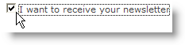</ph></source>
<target xml:lang="en-XX"><ph id="1" ctype="x-IMAGE"></ph></target>
</trans-unit>
<trans-unit id="tu82" xml:space="preserve">
<source xml:lang="en-US">To add a checkbox to a form, click the <ph id="1" ctype="x-STRONG_EMPHASIS">**[!UICONTROL Selection controls > Checkbox...]**</ph> icon in the toolbar of the page editor.</source>
<target xml:lang="en-XX">Para añadir una casilla a un formulario, haga clic en el icono <ph id="1" ctype="x-STRONG_EMPHASIS">**[!UICONTROL Selection controls > Checkbox...]**</ph> de la barra de herramientas del editor de páginas.</target>
</trans-unit>
<trans-unit id="tu83" xml:space="preserve">
<source xml:lang="en-US">Select the answer storage mode and confirm your choice.</source>
<target xml:lang="en-XX">Seleccione el modo de almacenamiento de respuestas y confirme su selección.</target>
</trans-unit>
<trans-unit id="tu84" xml:space="preserve">
<source xml:lang="en-US">Enter the label of the box in the <ph id="1" ctype="x-STRONG_EMPHASIS">**[!UICONTROL Label]**</ph> field of the <ph id="4" ctype="x-STRONG_EMPHASIS">**[!UICONTROL General]**</ph> tab.</source>
<target xml:lang="en-XX">Introduzca la etiqueta de la casilla en el campo <ph id="1" ctype="x-STRONG_EMPHASIS">**[!UICONTROL Label]**</ph> de la pestaña <ph id="4" ctype="x-STRONG_EMPHASIS">**[!UICONTROL General]**</ph>.</target>
</trans-unit>
<trans-unit id="tu85" xml:space="preserve">
<source xml:lang="en-US"><ph id="1" ctype="x-IMAGE">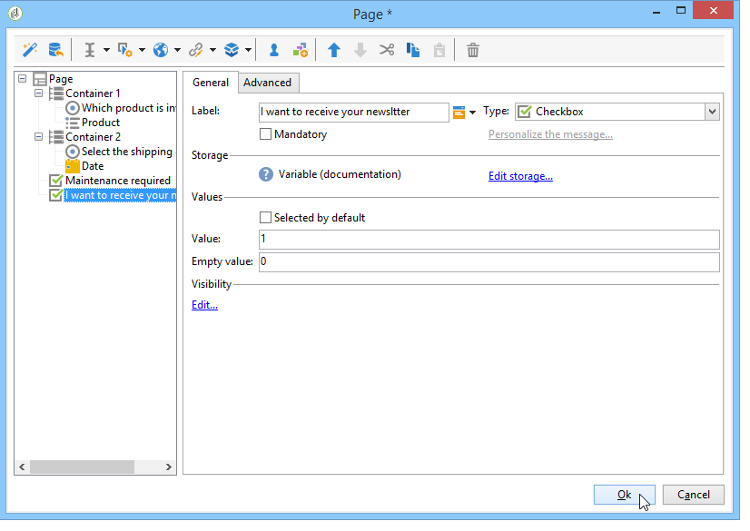</ph></source>
<target xml:lang="en-XX"><ph id="1" ctype="x-IMAGE"></ph></target>
</trans-unit>
<trans-unit id="tu86" xml:space="preserve">
<source xml:lang="en-US">A checkbox lets you assign a value to the storage field (or value) depending on whether or not the box is checked. The <ph id="1" ctype="x-STRONG_EMPHASIS">**[!UICONTROL Values]**</ph> section lets you enter the value to assign if the box is checked (in the <ph id="4" ctype="x-STRONG_EMPHASIS">**[!UICONTROL Value]**</ph> field), and the value to assign if it is not checked (in the <ph id="7" ctype="x-STRONG_EMPHASIS">**[!UICONTROL Empty value]**</ph> field). These values depend on the data storage format.</source>
<target xml:lang="en-XX">Una casilla de verificación permite asignar un valor al campo (o valor) de almacenamiento en función de si se ha marcado o no la casilla. La sección <ph id="1" ctype="x-STRONG_EMPHASIS">**[!UICONTROL Values]**</ph> permite introducir el valor que se asigna si se marca la casilla (en el campo <ph id="4" ctype="x-STRONG_EMPHASIS">**[!UICONTROL Value]**</ph>) y el valor que se asigna si no se marca (en el campo <ph id="7" ctype="x-STRONG_EMPHASIS">**[!UICONTROL Empty value]**</ph>). Estos valores dependen del formato de almacenamiento de datos.</target>
</trans-unit>
<trans-unit id="tu87" xml:space="preserve">
<source xml:lang="en-US">If the storage field (or variable) is boolean, the value to assign if the box is not checked will be deduced automatically. In this case, only the <ph id="1" ctype="x-STRONG_EMPHASIS">**[!UICONTROL Value if checked]**</ph> field is offered, as shown below:</source>
<target xml:lang="en-XX">Si el campo de almacenamiento (o variable) es booleano, el valor que se asigna si la casilla no está marcada se deduce automáticamente. En este caso, solo se ofrece el campo <ph id="1" ctype="x-STRONG_EMPHASIS">**[!UICONTROL Value if checked]**</ph>, como se muestra a continuación:</target>
</trans-unit>
<trans-unit id="tu88" xml:space="preserve">
<source xml:lang="en-US"><ph id="1" ctype="x-IMAGE">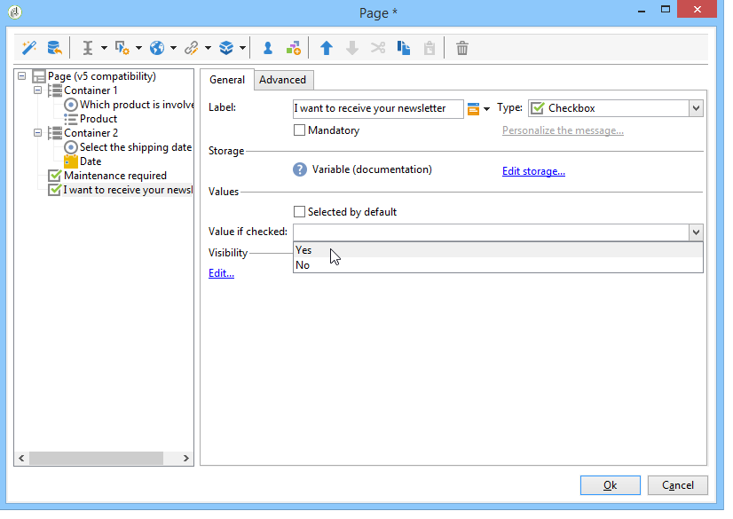</ph></source>
<target xml:lang="en-XX"><ph id="1" ctype="x-IMAGE"></ph></target>
</trans-unit>
<trans-unit id="tu89" xml:space="preserve">
<source xml:lang="en-US">Example: Assign a value to a field if a box is checked</source>
<target xml:lang="en-XX">Asignación de un valor a un campo si se marca una casilla</target>
</trans-unit>
<trans-unit id="tu90" xml:space="preserve">
<source xml:lang="en-US">We want to insert a checkbox into a form to send a maintenance request, as shown below:</source>
<target xml:lang="en-XX">Se busca insertar una casilla en un formulario para enviar una solicitud de mantenimiento, como se muestra a continuación:</target>
</trans-unit>
<trans-unit id="tu91" xml:space="preserve">
<source xml:lang="en-US"><ph id="1" ctype="x-IMAGE"></ph></source>
<target xml:lang="en-XX"><ph id="1" ctype="x-IMAGE"></ph></target>
</trans-unit>
<trans-unit id="tu92" xml:space="preserve">
<source xml:lang="en-US">The information will be uploaded to the database and into an existing field (in this case, the <ph id="1" ctype="x-STRONG_EMPHASIS">**[!UICONTROL Comment]**</ph> field):</source>
<target xml:lang="en-XX">La información se carga en la base de datos y en un campo existente (en este caso, el campo <ph id="1" ctype="x-STRONG_EMPHASIS">**[!UICONTROL Comment]**</ph>):</target>
</trans-unit>
<trans-unit id="tu93" xml:space="preserve">
<source xml:lang="en-US"><ph id="1" ctype="x-IMAGE"></ph></source>
<target xml:lang="en-XX"><ph id="1" ctype="x-IMAGE"></ph></target>
</trans-unit>
<trans-unit id="tu94" xml:space="preserve">
<source xml:lang="en-US">If the "Maintenance required" box is checked, the <ph id="1" ctype="x-STRONG_EMPHASIS">**[!UICONTROL Comment]**</ph> column will contain "Maintenance required". If the box isn't checked, the column will show "Maintenance not required". To obtain this result, apply the following configuration to the checkbox on the form page:</source>
<target xml:lang="en-XX">Si la casilla “Mantenimiento requerido” está marcada, la columna <ph id="1" ctype="x-STRONG_EMPHASIS">**[!UICONTROL Comment]**</ph> contiene “Mantenimiento requerido”. Si la casilla no está marcada, la columna contiene “Mantenimiento no requerido”. Para obtener este resultado, aplique la configuración siguiente a la casilla de verificación de la página del formulario:</target>
</trans-unit>
<trans-unit id="tu95" xml:space="preserve">
<source xml:lang="en-US"><ph id="1" ctype="x-IMAGE"></ph></source>
<target xml:lang="en-XX"><ph id="1" ctype="x-IMAGE"></ph></target>
</trans-unit>
<trans-unit id="tu96" xml:space="preserve">
<source xml:lang="en-US">Adding radio buttons</source>
<target xml:lang="en-XX">Adición de botones de opción</target>
</trans-unit>
<trans-unit id="tu97" xml:space="preserve">
<source xml:lang="en-US">Radio buttons let you offer the user a series of exclusive options to choose from. These are different values for the same field.</source>
<target xml:lang="en-XX">Los botones de opción le permiten ofrecer al usuario varias opciones exclusivas entre las que elegir. Estas opciones son valores diferentes para un mismo campo.</target>
</trans-unit>
<trans-unit id="tu98" xml:space="preserve">
<source xml:lang="en-US"><ph id="1" ctype="x-IMAGE"></ph></source>
<target xml:lang="en-XX"><ph id="1" ctype="x-IMAGE"></ph></target>
</trans-unit>
<trans-unit id="tu99" xml:space="preserve">
<source xml:lang="en-US">You can create radio buttons individually (unitary buttons) or via a multiple-choice list, but since the point of the radio buttons is to select one option or another, we will always create at least a pair of radio buttons, never just a single button.</source>
<target xml:lang="en-XX">Puede crear botones de opción por separado (botones unitarios) o a través de una lista de selección múltiple, pero ya que el objetivo de los botones de opción es seleccionar una opción u otra, siempre creamos al menos un par de botones de opción en vez de uno solo.</target>
</trans-unit>
<trans-unit id="tu100" xml:space="preserve">
<source xml:lang="en-US"><ph id="1" ctype="x-regxph" equiv-text="&lbrack;!CAUTION">[!CAUTION]</ph></source>
<target xml:lang="en-XX"><ph id="1" ctype="x-regxph" equiv-text="&lbrack;!CAUTION">[!CAUTION]</ph></target>
</trans-unit>
<trans-unit id="tu101" xml:space="preserve">
<source xml:lang="en-US">To make selection mandatory, you need to create a multiple choice list.</source>
<target xml:lang="en-XX">Para hacer la selección obligatoria, debe crear una lista de selección múltiple.</target>
</trans-unit>
<trans-unit id="tu102" xml:space="preserve">
<source xml:lang="en-US">Add single buttons</source>
<target xml:lang="en-XX">Añadir botones únicos</target>
</trans-unit>
<trans-unit id="tu103" xml:space="preserve">
<source xml:lang="en-US">To add a radio button to a form page, go to the <ph id="1" ctype="x-STRONG_EMPHASIS">**[!UICONTROL Selection controls > Radio button]**</ph> menu in the toolbar of the page editor and choose a storage mode.</source>
<target xml:lang="en-XX">Para añadir un botón de opción a una página de formulario, vaya al menú <ph id="1" ctype="x-STRONG_EMPHASIS">**[!UICONTROL Selection controls > Radio button]**</ph> de la barra de herramientas del editor de páginas y elija un modo de almacenamiento.</target>
</trans-unit>
<trans-unit id="tu104" xml:space="preserve">
<source xml:lang="en-US"><ph id="1" ctype="x-IMAGE"></ph></source>
<target xml:lang="en-XX"><ph id="1" ctype="x-IMAGE"></ph></target>
</trans-unit>
<trans-unit id="tu105" xml:space="preserve">
<source xml:lang="en-US">Radio buttons are configured in a similar way to checkboxes (see <ph id="1" ctype="x-LINK">[</ph>Adding checkboxes<ph id="2" ctype="x-LINK">](#adding-checkboxes)</ph>). However, no value is assigned if the option is not selected. In order for several buttons to be interdependent, i.e. selecting one automatically deselects the others, they must be stored in the same field. If they are not stored in the database, the same local variable must be used for temporary storage. See <ph id="3" ctype="x-LINK">[</ph>Response storage fields<ph id="4" ctype="x-LINK">](web-forms-answers.md#response-storage-fields)</ph>.</source>
<target xml:lang="en-XX">Los botones de opción se configuran de forma similar a las casillas de verificación (consulte). <ph id="1" ctype="x-LINK">[</ph>Agregar casillas de verificación<ph id="2" ctype="x-LINK">](#adding-checkboxes)</ph>. Sin embargo, no se asigna ningún valor si no se selecciona la opción. Para que varios botones puedan ser interdependientes, es decir, que se deseleccione uno automáticamente si se selecciona el otro, se deben almacenar en el mismo campo. Si no se almacenan en la base de datos, se debe utilizar la misma variable local para el almacenamiento temporal. Consulte <ph id="3" ctype="x-LINK">[</ph>Campos de almacenamiento de respuesta<ph id="4" ctype="x-LINK">](web-forms-answers.md#response-storage-fields)</ph>.</target>
</trans-unit>
<trans-unit id="tu106" xml:space="preserve">
<source xml:lang="en-US">Add a list of buttons</source>
<target xml:lang="en-XX">Adición de una lista de botones</target>
</trans-unit>
<trans-unit id="tu107" xml:space="preserve">
<source xml:lang="en-US">To add radio buttons via a list, go to the <ph id="1" ctype="x-STRONG_EMPHASIS">**[!UICONTROL Selection controls>Multiple choice]**</ph> menu in the toolbar of the page editor.</source>
<target xml:lang="en-XX">Para añadir botones de opción a través de una lista, vaya al menú <ph id="1" ctype="x-STRONG_EMPHASIS">**[!UICONTROL Selection controls>Multiple choice]**</ph> de la barra de herramientas del editor de páginas.</target>
</trans-unit>
<trans-unit id="tu108" xml:space="preserve">
<source xml:lang="en-US"><ph id="1" ctype="x-IMAGE"></ph></source>
<target xml:lang="en-XX"><ph id="1" ctype="x-IMAGE"></ph></target>
</trans-unit>
<trans-unit id="tu109" xml:space="preserve">
<source xml:lang="en-US">Add as many radio buttons as there are labels. The advantage of this feature is that you can import values from an existing field (in case of an itemized field) and make it for the user to choose one option. However, the layout of buttons is less flexible.</source>
<target xml:lang="en-XX">Añada tantos botones de opción como etiquetas. La ventaja de esta función es que puede importar valores de un campo existente (en el caso de un campo desglosado) y hacer que el usuario seleccione una opción. Sin embargo, el diseño de los botones es menos flexible.</target>
</trans-unit>
<trans-unit id="tu110" xml:space="preserve">
<source xml:lang="en-US"><ph id="1" ctype="x-regxph" equiv-text="&lbrack;!NOTE">[!NOTE]</ph></source>
<target xml:lang="en-XX"><ph id="1" ctype="x-regxph" equiv-text="&lbrack;!NOTE">[!NOTE]</ph></target>
</trans-unit>
<trans-unit id="tu111" xml:space="preserve">
<source xml:lang="en-US">You cannot enable multi-selection in a web application.
<ph id="1" ctype="x-BLOCK_QUOTE">></ph>It is possible, however, to insert a <ph id="2" ctype="x-STRONG_EMPHASIS">**[!UICONTROL Multiple choice]**</ph> type field into a Web application but this will not enable the user to select several values.</source>
<target xml:lang="en-XX">No se puede habilitar la selección múltiple en una aplicación web.
<ph id="1" ctype="x-BLOCK_QUOTE">></ph>Sin embargo, es posible insertar un campo de tipo <ph id="2" ctype="x-STRONG_EMPHASIS">**[!UICONTROL Multiple choice]**</ph> en una aplicación web, pero esto no permite al usuario seleccionar varios valores.</target>
</trans-unit>
<trans-unit id="tu112" xml:space="preserve">
<source xml:lang="en-US">Adding grids</source>
<target xml:lang="en-XX">Adición de cuadrículas</target>
</trans-unit>
<trans-unit id="tu113" xml:space="preserve">
<source xml:lang="en-US">Grids are used to design voting pages in Web applications. This lets you offer lists of radio buttons for answering survey or assessment type Web forms, as shown below:</source>
<target xml:lang="en-XX">Las cuadrículas se utilizan para diseñar páginas de votación en aplicaciones web. Esto permite ofrecer listas de botones de opción para responder a los formularios web de tipo encuesta o evaluación, como se muestra a continuación:</target>
</trans-unit>
<trans-unit id="tu114" xml:space="preserve">
<source xml:lang="en-US"><ph id="1" ctype="x-IMAGE"></ph></source>
<target xml:lang="en-XX"><ph id="1" ctype="x-IMAGE"></ph></target>
</trans-unit>
<trans-unit id="tu115" xml:space="preserve">
<source xml:lang="en-US">To use this type of element in a form, create a simple grid and add a line for each element to be assessed.</source>
<target xml:lang="en-XX">Para utilizar este tipo de elemento en un formulario, cree una cuadrícula sencilla y añada una línea para cada elemento que desea evaluar.</target>
</trans-unit>
<trans-unit id="tu116" xml:space="preserve">
<source xml:lang="en-US"><ph id="1" ctype="x-IMAGE">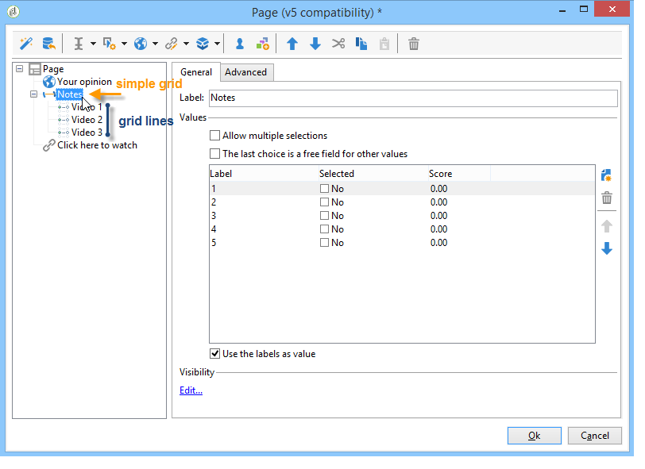</ph></source>
<target xml:lang="en-XX"><ph id="1" ctype="x-IMAGE"></ph></target>
</trans-unit>
<trans-unit id="tu117" xml:space="preserve">
<source xml:lang="en-US">The number of radio buttons in each line of the grid matches the number of values defined in the simple grid.</source>
<target xml:lang="en-XX">El número de botones de opción de cada línea de la cuadrícula coincide con el número de valores definidos en la cuadrícula simple.</target>
</trans-unit>
<trans-unit id="tu118" xml:space="preserve">
<source xml:lang="en-US"><ph id="1" ctype="x-IMAGE"></ph></source>
<target xml:lang="en-XX"><ph id="1" ctype="x-IMAGE"></ph></target>
</trans-unit>
<trans-unit id="tu119" xml:space="preserve">
<source xml:lang="en-US">Only one option can be selected per grid line.</source>
<target xml:lang="en-XX">Solo se puede seleccionar una opción por cada línea de cuadrícula.</target>
</trans-unit>
<trans-unit id="tu120" xml:space="preserve">
<source xml:lang="en-US"><ph id="1" ctype="x-regxph" equiv-text="&lbrack;!NOTE">[!NOTE]</ph></source>
<target xml:lang="en-XX"><ph id="1" ctype="x-regxph" equiv-text="&lbrack;!NOTE">[!NOTE]</ph></target>
</trans-unit>
<trans-unit id="tu121" xml:space="preserve">
<source xml:lang="en-US">In our example, the label of the grid is hidden. To do this, go to the <ph id="1" ctype="x-STRONG_EMPHASIS">**[!UICONTROL Advanced]**</ph> tab, the <ph id="4" ctype="x-STRONG_EMPHASIS">**[!UICONTROL Label position]**</ph> display is defined as <ph id="7" ctype="x-STRONG_EMPHASIS">**[!UICONTROL Hidden]**</ph> . See <ph id="10" ctype="x-LINK">[</ph>Defining the position of labels<ph id="11" ctype="x-LINK">](defining-web-forms-layout.md#defining-the-position-of-labels)</ph>.</source>
<target xml:lang="en-XX">En este ejemplo, la etiqueta de la cuadrícula está oculta. Para ello, vaya a la pestaña <ph id="1" ctype="x-STRONG_EMPHASIS">**[!UICONTROL Advanced]**</ph>, y en ella puede comprobar que la pantalla <ph id="4" ctype="x-STRONG_EMPHASIS">**[!UICONTROL Label position]**</ph> se define como <ph id="7" ctype="x-STRONG_EMPHASIS">**[!UICONTROL Hidden]**</ph>. Consulte <ph id="10" ctype="x-LINK">[</ph>Definición de la posición de etiquetas<ph id="11" ctype="x-LINK">](defining-web-forms-layout.md#defining-the-position-of-labels)</ph>.</target>
</trans-unit>
<trans-unit id="tu122" xml:space="preserve">
<source xml:lang="en-US">Adding dates and numbers</source>
<target xml:lang="en-XX">Adición de fechas y números</target>
</trans-unit>
<trans-unit id="tu123" xml:space="preserve">
<source xml:lang="en-US">The content of the form fields can be formatted to match the data stored in the database or to satisfy a particular requirement. You can create suitable fields for the entry of numbers and dates.</source>
<target xml:lang="en-XX">Se puede dar formato al contenido de los campos del formulario para que coincida con los datos almacenados en la base de datos o para satisfacer un requisito en particular. Puede crear campos adecuados para la introducción de números y fechas.</target>
</trans-unit>
<trans-unit id="tu124" xml:space="preserve">
<source xml:lang="en-US">Adding dates</source>
<target xml:lang="en-XX">Adición de fechas</target>
</trans-unit>
<trans-unit id="tu125" xml:space="preserve">
<source xml:lang="en-US"><ph id="1" ctype="x-IMAGE">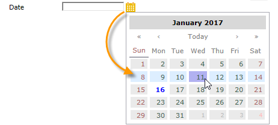</ph></source>
<target xml:lang="en-XX"><ph id="1" ctype="x-IMAGE"></ph></target>
</trans-unit>
<trans-unit id="tu126" xml:space="preserve">
<source xml:lang="en-US">To allow the user to enter a date in a form page, add an input field and select the type <ph id="1" ctype="x-STRONG_EMPHASIS">**[!UICONTROL Date...]**</ph>.</source>
<target xml:lang="en-XX">Para permitir que el usuario escriba una fecha en una página de formulario, agregue un campo de entrada y seleccione el tipo <ph id="1" ctype="x-STRONG_EMPHASIS">**[!UICONTROL Date...]**</ph>.</target>
</trans-unit>
<trans-unit id="tu127" xml:space="preserve">
<source xml:lang="en-US">Enter a label for the field and configure the data storage mode.</source>
<target xml:lang="en-XX">Introduzca una etiqueta para el campo y configure el modo de almacenamiento de datos.</target>
</trans-unit>
<trans-unit id="tu128" xml:space="preserve">
<source xml:lang="en-US"><ph id="1" ctype="x-IMAGE">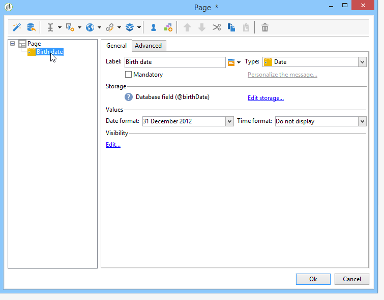</ph></source>
<target xml:lang="en-XX"><ph id="1" ctype="x-IMAGE"></ph></target>
</trans-unit>
<trans-unit id="tu129" xml:space="preserve">
<source xml:lang="en-US">The lower section of the window lets you select the date and time formats for the values stored in this field.</source>
<target xml:lang="en-XX">La sección inferior de la ventana permite seleccionar los formatos de fecha y hora para los valores almacenados en este campo.</target>
</trans-unit>
<trans-unit id="tu130" xml:space="preserve">
<source xml:lang="en-US"><ph id="1" ctype="x-IMAGE">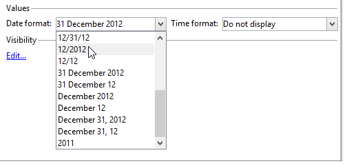</ph></source>
<target xml:lang="en-XX"><ph id="1" ctype="x-IMAGE"></ph></target>
</trans-unit>
<trans-unit id="tu131" xml:space="preserve">
<source xml:lang="en-US">You can also choose not to display the date (or time).</source>
<target xml:lang="en-XX">También puede optar por no mostrar la fecha (o la hora).</target>
</trans-unit>
<trans-unit id="tu132" xml:space="preserve">
<source xml:lang="en-US">Dates can be selected via a calendar or drop-down boxes. You can also enter them directly in the field, but they need to match the format specified in the screen above.</source>
<target xml:lang="en-XX">Las fechas se pueden seleccionar mediante un calendario o casillas desplegables. También puede introducirlos directamente en el campo, pero tienen que coincidir con el formato especificado en la pantalla anterior.</target>
</trans-unit>
<trans-unit id="tu133" xml:space="preserve">
<source xml:lang="en-US"><ph id="1" ctype="x-regxph" equiv-text="&lbrack;!NOTE">[!NOTE]</ph></source>
<target xml:lang="en-XX"><ph id="1" ctype="x-regxph" equiv-text="&lbrack;!NOTE">[!NOTE]</ph></target>
</trans-unit>
<trans-unit id="tu134" xml:space="preserve">
<source xml:lang="en-US">By default, dates used in forms are entered via a calendar. For multilingual forms, please check that calendars are available in all the languages used. See <ph id="1" ctype="x-LINK">[</ph>Translating a web form<ph id="2" ctype="x-LINK">](translating-a-web-form.md)</ph>.</source>
<target xml:lang="en-XX">De forma predeterminada, las fechas utilizadas en los formularios se introducen mediante un calendario. Para los formularios multilingües, compruebe que los calendarios están disponibles en todos los idiomas utilizados. Consulte <ph id="1" ctype="x-LINK">[</ph>Traducción de un formulario web<ph id="2" ctype="x-LINK">](translating-a-web-form.md)</ph>.</target>
</trans-unit>
<trans-unit id="tu135" xml:space="preserve">
<source xml:lang="en-US">However in some cases, (for entering dates of birth, for instance) it may be easier to use drop-down lists.</source>
<target xml:lang="en-XX">Sin embargo, en algunos casos (para introducir fechas de nacimiento, por ejemplo), puede ser más fácil utilizar las listas desplegables.</target>
</trans-unit>
<trans-unit id="tu136" xml:space="preserve">
<source xml:lang="en-US"><ph id="1" ctype="x-IMAGE">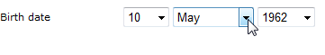</ph></source>
<target xml:lang="en-XX"><ph id="1" ctype="x-IMAGE"></ph></target>
</trans-unit>
<trans-unit id="tu137" xml:space="preserve">
<source xml:lang="en-US">To do this, click the <ph id="1" ctype="x-STRONG_EMPHASIS">**[!UICONTROL Advanced]**</ph> tab and choose the input mode using <ph id="4" ctype="x-STRONG_EMPHASIS">**[!UICONTROL Drop-down lists]**</ph>.</source>
<target xml:lang="en-XX">Para ello, haga clic en la pestaña <ph id="1" ctype="x-STRONG_EMPHASIS">**[!UICONTROL Advanced]**</ph> y seleccione el modo de entrada mediante las <ph id="4" ctype="x-STRONG_EMPHASIS">**[!UICONTROL Drop-down lists]**</ph>.</target>
</trans-unit>
<trans-unit id="tu138" xml:space="preserve">
<source xml:lang="en-US"><ph id="1" ctype="x-IMAGE"></ph></source>
<target xml:lang="en-XX"><ph id="1" ctype="x-IMAGE"></ph></target>
</trans-unit>
<trans-unit id="tu139" xml:space="preserve">
<source xml:lang="en-US">You can then set limits to the values offered in the list.</source>
<target xml:lang="en-XX">A continuación, puede establecer límites de los valores ofrecidos en la lista.</target>
</trans-unit>
<trans-unit id="tu140" xml:space="preserve">
<source xml:lang="en-US"><ph id="1" ctype="x-IMAGE"></ph></source>
<target xml:lang="en-XX"><ph id="1" ctype="x-IMAGE"></ph></target>
</trans-unit>
<trans-unit id="tu141" xml:space="preserve">
<source xml:lang="en-US">Adding numbers</source>
<target xml:lang="en-XX">Adición de números</target>
</trans-unit>
<trans-unit id="tu142" xml:space="preserve">
<source xml:lang="en-US">You can create suitable fields for the entry of numbers.</source>
<target xml:lang="en-XX">Puede crear campos adecuados para introducir números.</target>
</trans-unit>
<trans-unit id="tu143" xml:space="preserve">
<source xml:lang="en-US"><ph id="1" ctype="x-IMAGE"></ph></source>
<target xml:lang="en-XX"><ph id="1" ctype="x-IMAGE"></ph></target>
</trans-unit>
<trans-unit id="tu144" xml:space="preserve">
<source xml:lang="en-US">In a numeric field, the user can enter numbers only. Entry control is applied automatically when the page is approved.</source>
<target xml:lang="en-XX">En un campo numérico, el usuario solo puede introducir números. El control de introducción se aplica automáticamente cuando se aprueba la página.</target>
</trans-unit>
<trans-unit id="tu145" xml:space="preserve">
<source xml:lang="en-US">Depending on the field in which data is stored in the database, special formatting or certain restrictions may be applied. You can also specify maximum and minimum values. This type of field is configured as follows:</source>
<target xml:lang="en-XX">Según el campo en el que se almacenen los datos en la base de datos, puede aplicar formatos especiales o determinadas restricciones. Asimismo, puede especificar valores máximos y mínimos. Este tipo de campo se configura de la siguiente manera:</target>
</trans-unit>
<trans-unit id="tu146" xml:space="preserve">
<source xml:lang="en-US"><ph id="1" ctype="x-IMAGE"></ph></source>
<target xml:lang="en-XX"><ph id="1" ctype="x-IMAGE"></ph></target>
</trans-unit>
<trans-unit id="tu147" xml:space="preserve">
<source xml:lang="en-US">The default value is the value displayed in the field when the form is published. It can be corrected by the user.</source>
<target xml:lang="en-XX">El valor predeterminado es el valor mostrado en el campo cuando se publica el formulario. El usuario puede corregirlo.</target>
</trans-unit>
<trans-unit id="tu148" xml:space="preserve">
<source xml:lang="en-US">You can add a prefix and/or suffix to the numeric field via the <ph id="1" ctype="x-STRONG_EMPHASIS">**[!UICONTROL Advanced]**</ph> tab, as shown below:</source>
<target xml:lang="en-XX">Se puede añadir un prefijo o un sufijo al campo numérico mediante la pestaña <ph id="1" ctype="x-STRONG_EMPHASIS">**[!UICONTROL Advanced]**</ph>, como se muestra a continuación:</target>
</trans-unit>
<trans-unit id="tu149" xml:space="preserve">
<source xml:lang="en-US"><ph id="1" ctype="x-IMAGE"></ph></source>
<target xml:lang="en-XX"><ph id="1" ctype="x-IMAGE"></ph></target>
</trans-unit>
<trans-unit id="tu150" xml:space="preserve">
<source xml:lang="en-US">In the form, the rendering will be as follows:</source>
<target xml:lang="en-XX">En el formulario, la renderización es la siguiente:</target>
</trans-unit>
<trans-unit id="tu151" xml:space="preserve">
<source xml:lang="en-US"><ph id="1" ctype="x-IMAGE">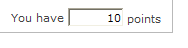</ph></source>
<target xml:lang="en-XX"><ph id="1" ctype="x-IMAGE"></ph></target>
</trans-unit>
<trans-unit id="tu152" xml:space="preserve">
<source xml:lang="en-US">Subscription checkboxes</source>
<target xml:lang="en-XX">Casillas de verificación de suscripción</target>
</trans-unit>
<trans-unit id="tu153" xml:space="preserve">
<source xml:lang="en-US">You can add controls to allow users to subscribe to or unsubscribe from one or more information services (newsletters, warnings, real-time notifications, etc.). To subscribe, the user checks the corresponding service.</source>
<target xml:lang="en-XX">Puede añadir controles para permitir a los usuarios suscribirse o dar de baja la suscripción de uno o más servicios de información (boletines informativos, avisos, notificaciones en tiempo real, etc.). Para suscribirse, el usuario comprueba el servicio correspondiente.</target>
</trans-unit>
<trans-unit id="tu154" xml:space="preserve">
<source xml:lang="en-US">To create a subscription checkbox, click <ph id="1" ctype="x-STRONG_EMPHASIS">**[!UICONTROL Advanced controls>Subscription]**</ph>.</source>
<target xml:lang="en-XX">Para crear una casilla de verificación de suscripción, haga clic en <ph id="1" ctype="x-STRONG_EMPHASIS">**[!UICONTROL Advanced controls>Subscription]**</ph>.</target>
</trans-unit>
<trans-unit id="tu155" xml:space="preserve">
<source xml:lang="en-US"><ph id="1" ctype="x-IMAGE"></ph></source>
<target xml:lang="en-XX"><ph id="1" ctype="x-IMAGE"></ph></target>
</trans-unit>
<trans-unit id="tu156" xml:space="preserve">
<source xml:lang="en-US">Indicate the label for the checkbox and select the information service concerned using the <ph id="1" ctype="x-STRONG_EMPHASIS">**[!UICONTROL Service]**</ph> drop-down box.</source>
<target xml:lang="en-XX">Indique la etiqueta de la casilla de verificación y seleccione el servicio de información correspondiente mediante la casilla desplegable <ph id="1" ctype="x-STRONG_EMPHASIS">**[!UICONTROL Service]**</ph>.</target>
</trans-unit>
<trans-unit id="tu157" xml:space="preserve">
<source xml:lang="en-US"><ph id="1" ctype="x-regxph" equiv-text="&lbrack;!NOTE">[!NOTE]</ph></source>
<target xml:lang="en-XX"><ph id="1" ctype="x-regxph" equiv-text="&lbrack;!NOTE">[!NOTE]</ph></target>
</trans-unit>
<trans-unit id="tu158" xml:space="preserve">
<source xml:lang="en-US">Information services are detailed in <ph id="1" ctype="x-LINK">[</ph>this page<ph id="2" ctype="x-LINK">](../../delivery/using/managing-subscriptions.md)</ph>.</source>
<target xml:lang="en-XX">Los servicios de información se describen en <ph id="1" ctype="x-LINK">[</ph>esta página<ph id="2" ctype="x-LINK">](../../delivery/using/managing-subscriptions.md)</ph>.</target>
</trans-unit>
<trans-unit id="tu159" xml:space="preserve">
<source xml:lang="en-US">The user subscribes to the service by checking the relevant option.</source>
<target xml:lang="en-XX">El usuario se suscribe al servicio seleccionando la opción correspondiente.</target>
</trans-unit>
<trans-unit id="tu160" xml:space="preserve">
<source xml:lang="en-US"><ph id="1" ctype="x-IMAGE"></ph></source>
<target xml:lang="en-XX"><ph id="1" ctype="x-IMAGE"></ph></target>
</trans-unit>
<trans-unit id="tu161" xml:space="preserve">
<source xml:lang="en-US"><ph id="1" ctype="x-regxph" equiv-text="&lbrack;!CAUTION">[!CAUTION]</ph></source>
<target xml:lang="en-XX"><ph id="1" ctype="x-regxph" equiv-text="&lbrack;!CAUTION">[!CAUTION]</ph></target>
</trans-unit>
<trans-unit id="tu162" xml:space="preserve">
<source xml:lang="en-US">If the user is already subscribed to an information service and the box linked to this service isn't checked when they approve the form, they will be unsubscribed.</source>
<target xml:lang="en-XX">Si el usuario ya está suscrito a un servicio de información y la casilla vinculada a este servicio no está marcada al aprobar el formulario, se da de baja su suscripción.</target>
</trans-unit>
<trans-unit id="tu163" xml:space="preserve">
<source xml:lang="en-US">Inserting a captcha</source>
<target xml:lang="en-XX">Inserción de un captcha</target>
</trans-unit>
<trans-unit id="tu164" xml:space="preserve">
<source xml:lang="en-US">The purpose of <ph id="1" ctype="x-STRONG_EMPHASIS">**</ph>captcha<ph id="2" ctype="x-STRONG_EMPHASIS">**</ph> tests is to prevent fraudulent use of your Web forms.</source>
<target xml:lang="en-XX">El propósito de las pruebas de <ph id="1" ctype="x-STRONG_EMPHASIS">**</ph>captcha<ph id="2" ctype="x-STRONG_EMPHASIS">**</ph> es evitar el uso fraudulento de los formularios web.</target>
</trans-unit>
<trans-unit id="tu165" xml:space="preserve">
<source xml:lang="en-US"><ph id="1" ctype="x-regxph" equiv-text="&lbrack;!CAUTION">[!CAUTION]</ph></source>
<target xml:lang="en-XX"><ph id="1" ctype="x-regxph" equiv-text="&lbrack;!CAUTION">[!CAUTION]</ph></target>
</trans-unit>
<trans-unit id="tu166" xml:space="preserve">
<source xml:lang="en-US">If your form contains several pages, the Captcha must always be placed on the last page, just before the storage box, to prevent any circumvention of the security measures.</source>
<target xml:lang="en-XX">Si el formulario contiene varias páginas, el captcha siempre debe colocarse en la última página, justo antes del cuadro de almacenamiento para evitar la elusión de las medidas de seguridad.</target>
</trans-unit>
<trans-unit id="tu167" xml:space="preserve">
<source xml:lang="en-US">To insert a Captcha into a form, click the first button on the toolbar and Select <ph id="1" ctype="x-STRONG_EMPHASIS">**[!UICONTROL Advanced controls>Captcha]**</ph>.</source>
<target xml:lang="en-XX">Para insertar un objeto captcha en un formulario, haga clic en el primer botón de la barra de herramientas y seleccione <ph id="1" ctype="x-STRONG_EMPHASIS">**[!UICONTROL Advanced controls>Captcha]**</ph>.</target>
</trans-unit>
<trans-unit id="tu168" xml:space="preserve">
<source xml:lang="en-US"><ph id="1" ctype="x-IMAGE">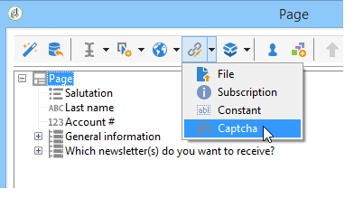</ph></source>
<target xml:lang="en-XX"><ph id="1" ctype="x-IMAGE"></ph></target>
</trans-unit>
<trans-unit id="tu169" xml:space="preserve">
<source xml:lang="en-US">Enter the label of the field. This label will be displayed in front of the Captcha display area. You can change the position of this label in the <ph id="1" ctype="x-STRONG_EMPHASIS">**[!UICONTROL Advanced]**</ph> tab.</source>
<target xml:lang="en-XX">Introduzca la etiqueta del campo. Esta etiqueta se muestra delante del área de visualización del captcha. Puede cambiar la posición de esta etiqueta en la pestaña <ph id="1" ctype="x-STRONG_EMPHASIS">**[!UICONTROL Advanced]**</ph>.</target>
</trans-unit>
<trans-unit id="tu170" xml:space="preserve">
<source xml:lang="en-US"><ph id="1" ctype="x-IMAGE"></ph></source>
<target xml:lang="en-XX"><ph id="1" ctype="x-IMAGE"></ph></target>
</trans-unit>
<trans-unit id="tu171" xml:space="preserve">
<source xml:lang="en-US"><ph id="1" ctype="x-regxph" equiv-text="&lbrack;!NOTE">[!NOTE]</ph></source>
<target xml:lang="en-XX"><ph id="1" ctype="x-regxph" equiv-text="&lbrack;!NOTE">[!NOTE]</ph></target>
</trans-unit>
<trans-unit id="tu172" xml:space="preserve">
<source xml:lang="en-US">For <ph id="1" ctype="x-STRONG_EMPHASIS">**[!UICONTROL captcha]**</ph> type controls, there is no need to indicate a storage field or variable.</source>
<target xml:lang="en-XX">Para los controles de tipo <ph id="1" ctype="x-STRONG_EMPHASIS">**[!UICONTROL captcha]**</ph> no es necesario indicar un campo de almacenamiento o una variable.</target>
</trans-unit>
<trans-unit id="tu173" xml:space="preserve">
<source xml:lang="en-US">The Captcha is inserted into the page with an input field placed under the visual. These two elements are inseparable and are considered as a single item for the purpose of page layout (they occupy a single cell).</source>
<target xml:lang="en-XX">El componente captcha se inserta en la página con un campo de entrada situado bajo la ilustración. Estos dos elementos son inseparables y se consideran un solo elemento de cara al diseño de la página (ocupan una sola celda).</target>
</trans-unit>
<trans-unit id="tu174" xml:space="preserve">
<source xml:lang="en-US"><ph id="1" ctype="x-IMAGE"></ph></source>
<target xml:lang="en-XX"><ph id="1" ctype="x-IMAGE"></ph></target>
</trans-unit>
<trans-unit id="tu175" xml:space="preserve">
<source xml:lang="en-US">When the page is confirmed, the input field is displayed in red if the content of the Captcha was not entered correctly.</source>
<target xml:lang="en-XX">Cuando se confirma la página, el campo de entrada aparece en rojo si el contenido del captcha no se ha introducido correctamente.</target>
</trans-unit>
<trans-unit id="tu176" xml:space="preserve">
<source xml:lang="en-US"><ph id="1" ctype="x-IMAGE">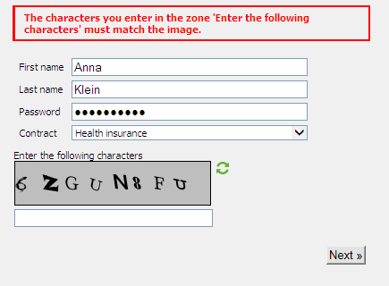</ph></source>
<target xml:lang="en-XX"><ph id="1" ctype="x-IMAGE"></ph></target>
</trans-unit>
<trans-unit id="tu177" xml:space="preserve">
<source xml:lang="en-US">You can create an error message to display. To do that, use the <ph id="1" ctype="x-STRONG_EMPHASIS">**[!UICONTROL Personalize the message]**</ph> link in the <ph id="4" ctype="x-STRONG_EMPHASIS">**[!UICONTROL General]**</ph> tab.</source>
<target xml:lang="en-XX">Puede crear el mensaje de error que desea mostrar. Para ello, en la pestaña <ph id="4" ctype="x-STRONG_EMPHASIS">**[!UICONTROL General]**</ph>, utilice el enlace <ph id="1" ctype="x-STRONG_EMPHASIS">**[!UICONTROL Personalize the message]**</ph>.</target>
</trans-unit>
<trans-unit id="tu178" xml:space="preserve">
<source xml:lang="en-US"><ph id="1" ctype="x-IMAGE"></ph></source>
<target xml:lang="en-XX"><ph id="1" ctype="x-IMAGE"></ph></target>
</trans-unit>
<trans-unit id="tu179" xml:space="preserve">
<source xml:lang="en-US"><ph id="1" ctype="x-regxph" equiv-text="&lbrack;!NOTE">[!NOTE]</ph></source>
<target xml:lang="en-XX"><ph id="1" ctype="x-regxph" equiv-text="&lbrack;!NOTE">[!NOTE]</ph></target>
</trans-unit>
<trans-unit id="tu180" xml:space="preserve">
<source xml:lang="en-US">Captchas are always 8 characters long. You cannot modify this value.</source>
<target xml:lang="en-XX">Los captchas siempre tienen 8 caracteres de longitud. No puede modificar este valor.</target>
</trans-unit>
<trans-unit id="tu181" xml:space="preserve">
<source xml:lang="en-US">Uploading a file</source>
<target xml:lang="en-XX">Carga de un archivo</target>
</trans-unit>
<trans-unit id="tu182" xml:space="preserve">
<source xml:lang="en-US">You can add an upload field to a page. This functionality can be useful for intranet file sharing, for instance.</source>
<target xml:lang="en-XX">Puede añadir un campo de carga a una página. Esta funcionalidad puede ser útil para compartir archivos de la intranet, por ejemplo.</target>
</trans-unit>
<trans-unit id="tu183" xml:space="preserve">
<source xml:lang="en-US"><ph id="1" ctype="x-IMAGE">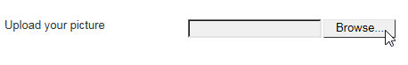</ph></source>
<target xml:lang="en-XX"><ph id="1" ctype="x-IMAGE"></ph></target>
</trans-unit>
<trans-unit id="tu184" xml:space="preserve">
<source xml:lang="en-US">To insert an upload field to a form page, select the <ph id="1" ctype="x-STRONG_EMPHASIS">**[!UICONTROL Advanced controls > File...]**</ph> menu in the toolbar of the page editor.</source>
<target xml:lang="en-XX">Para insertar un campo de carga en una página de formulario, en la barra de herramientas del editor de páginas, seleccione el menú <ph id="1" ctype="x-STRONG_EMPHASIS">**[!UICONTROL Advanced controls > File...]**</ph>.</target>
</trans-unit>
<trans-unit id="tu185" xml:space="preserve">
<source xml:lang="en-US">By default, the uploaded files are stored in resource files accessible via the <ph id="1" ctype="x-STRONG_EMPHASIS">**[!UICONTROL Resources > Online > Public resources]**</ph> menu. You can use a script to change this behavior. This script can use the functions defined in <ph id="4" ctype="x-LINK">&lbrack;</ph>Campaign JSAPI documentation<ph id="5" ctype="x-LINK">[#$tu186]</ph>, including those that concern file manipulation.</source>
<target xml:lang="en-XX">De forma predeterminada, los archivos cargados se almacenan en archivos de recursos a los que se puede acceder mediante el menú <ph id="1" ctype="x-STRONG_EMPHASIS">**[!UICONTROL Resources > Online > Public resources]**</ph>. Se puede utilizar una secuencia de comandos para cambiar este comportamiento. Esta secuencia de comandos puede utilizar las funciones definidas en <ph id="4" ctype="x-LINK">&lbrack;</ph>Campaign JSAPI documentation<ph id="5" ctype="x-LINK">[#$tu186]</ph>, incluidas las que afectan a la manipulación de archivos.</target>
</trans-unit>
<trans-unit id="tu187" xml:space="preserve">
<source xml:lang="en-US">You can store the link to these files in a local variable or in a database field. For example, you can extend the recipient schema to add a link to file-based resources.</source>
<target xml:lang="en-XX">Se puede almacenar el vínculo a estos archivos en una variable local o en un campo de base de datos. Por ejemplo, se puede ampliar el esquema del destinatario para añadir un vínculo a recursos basados en archivos.</target>
</trans-unit>
<trans-unit id="tu188" xml:space="preserve">
<source xml:lang="en-US"><ph id="1" ctype="x-regxph" equiv-text="&lbrack;!CAUTION">[!CAUTION]</ph></source>
<target xml:lang="en-XX"><ph id="1" ctype="x-regxph" equiv-text="&lbrack;!CAUTION">[!CAUTION]</ph></target>
</trans-unit>
<trans-unit id="tu189" xml:space="preserve">
<source xml:lang="en-US">This type of file must be reserved for forms with secure access (using credentials).</source>
<target xml:lang="en-XX">Este tipo de archivo debe reservarse para formularios con acceso seguro (con credenciales).</target>
</trans-unit>
<trans-unit id="tu190" xml:space="preserve">
<source xml:lang="en-US">Adobe Campaign does not control the size or the type of resource uploaded: we therefore highly recommend using upload fields for secure type intranet sites only.</source>
<target xml:lang="en-XX">Adobe Campaign no controla el tamaño ni el tipo de recurso cargado: por lo tanto, se recomienda encarecidamente utilizar campos de carga únicamente para sitios de intranet de tipo seguro.</target>
</trans-unit>
<trans-unit id="tu191" xml:space="preserve">
<source xml:lang="en-US">If several servers are linked to the instance (load balancing architecture), you need to make sure calls to the Web form arrive on the same server.</source>
<target xml:lang="en-XX">Si hay varios servidores vinculados a la instancia (“equilibrio de carga”), debe asegurarse de que las llamadas al formulario web lleguen al mismo servidor.</target>
</trans-unit>
<trans-unit id="tu192" xml:space="preserve">
<source xml:lang="en-US">These implementations require the assistance of the Adobe Campaign Consulting team.</source>
<target xml:lang="en-XX">Estas implementaciones requieren la asistencia del equipo de consultoría de Adobe Campaign.</target>
</trans-unit>
<trans-unit id="tu193" xml:space="preserve">
<source xml:lang="en-US">Inserting a hidden constant</source>
<target xml:lang="en-XX">Inserción de una constante oculta</target>
</trans-unit>
<trans-unit id="tu194" xml:space="preserve">
<source xml:lang="en-US">When the user validates one of the pages of the form, you can set a specific value to a field of their profile or to a variable.</source>
<target xml:lang="en-XX">Cuando el usuario valida una de las páginas del formulario, puede establecer un valor específico en un campo de su perfil o en una variable.</target>
</trans-unit>
<trans-unit id="tu195" xml:space="preserve">
<source xml:lang="en-US">This field is not visible to the user, but can be used to enrich the data in the user profile.</source>
<target xml:lang="en-XX">Este campo no es visible para el usuario, pero puede utilizarse para enriquecer los datos en el perfil de usuario.</target>
</trans-unit>
<trans-unit id="tu196" xml:space="preserve">
<source xml:lang="en-US">To do this, place a <ph id="1" ctype="x-STRONG_EMPHASIS">**</ph>constant<ph id="2" ctype="x-STRONG_EMPHASIS">**</ph> in the page and specify the value and the storage location.</source>
<target xml:lang="en-XX">Para ello, coloque una <ph id="1" ctype="x-STRONG_EMPHASIS">**</ph>constante<ph id="2" ctype="x-STRONG_EMPHASIS">**</ph> en la página y especifique el valor y la ubicación de almacenamiento.</target>
</trans-unit>
<trans-unit id="tu197" xml:space="preserve">
<source xml:lang="en-US">In the following example, the <ph id="1" ctype="x-STRONG_EMPHASIS">**</ph>origin<ph id="2" ctype="x-STRONG_EMPHASIS">**</ph> field of the recipient profile is filled in automatically whenever a user approves this page. The constant is not displayed on the page.</source>
<target xml:lang="en-XX">En el ejemplo siguiente, el campo de <ph id="1" ctype="x-STRONG_EMPHASIS">**</ph>origen<ph id="2" ctype="x-STRONG_EMPHASIS">**</ph> del perfil de destinatario se rellena automáticamente cada vez que un usuario aprueba esta página. La constante no se muestra en la página.</target>
</trans-unit>
<trans-unit id="tu198" xml:space="preserve">
<source xml:lang="en-US"><ph id="1" ctype="x-IMAGE">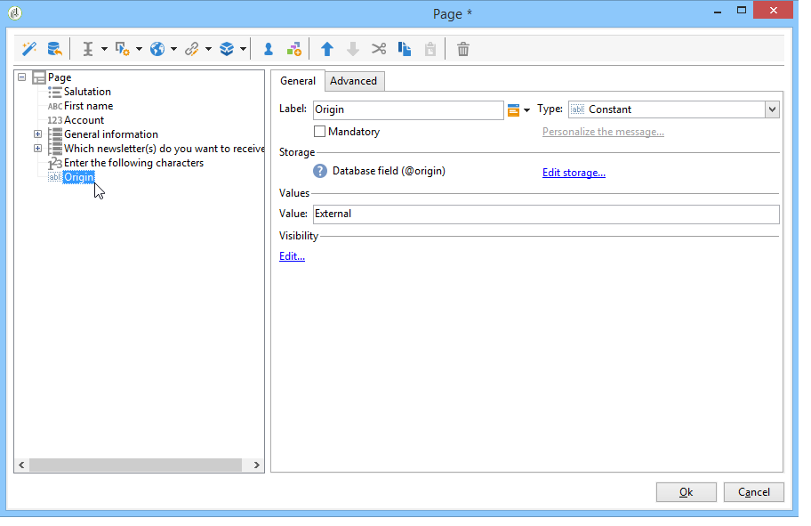</ph></source>
<target xml:lang="en-XX"><ph id="1" ctype="x-IMAGE"></ph></target>
</trans-unit>
</body>
</file>
</xliff>