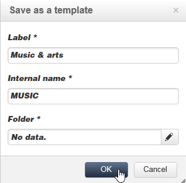
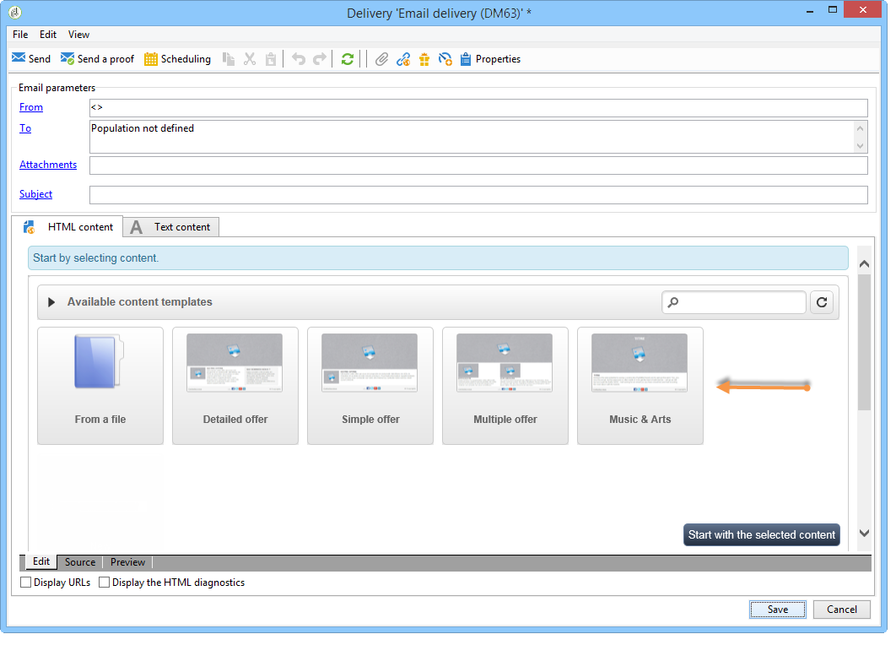
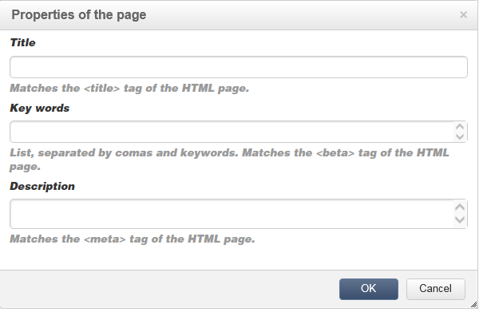

# Interfaz del editor de contenido{#content-editor-interface}

## Ventana de edición {#editing-window}

La ventana de edición de DCE se desglosa en tres secciones diferentes. Permiten ver, modificar y comprobar el estado del contenido.

1. La sección **superior** es un área de visualización para mensajes al usuario. Estos mensajes indican el estado de la aplicación web o de la entrega que se está creando, así como advertencias y mensajes de error relacionados con el contenido. Para obtener más información, consulte [Estados de contenido HTML](../../web/using/content-editing-best-practices.md#html-content-statuses).
1. La sección a la **izquierda** de la ventana es el área para editar contenido. Desde esta área, el usuario puede interactuar directamente con el contenido mediante la barra de herramientas emergente: insertar un vínculo en una imagen, cambiar la fuente, eliminar un campo, etc. Para obtener más información, consulte [Edición de formularios](../../web/using/editing-content.md#editing-forms).
1. La sección a la **derecha** de la ventana es el área del panel de control. Esta área agrupa las distintas opciones del editor, especialmente aquellas relacionadas con la configuración del encabezado de página y las opciones generales de un bloque: añadir un borde, relacionar un campo de base de datos con una zona de entrada, acceder a las propiedades de página web, etc. Para obtener más información, consulte las secciones [Opciones globales](#global-options) y [Edición de contenido](../../web/using/editing-content.md).

## Opciones globales {#global-options}

La sección superior derecha del editor da acceso a las opciones globales que permiten controlar el contenido que se está creando.

Tiene cuatro iconos:

* El icono **Display/Hide blocks** permite mostrar marcos azules alrededor de los bloques de contenido (correspondiente a la etiqueta `
` HTML).

* El icono **Seleccionar otro contenido** permite al usuario cargar contenido nuevo desde una plantilla (plantilla existente o plantilla predeterminada).

   

   >[!CAUTION]
   >
   >El contenido seleccionado reemplaza al contenido actual.

* El icono **Guardar como plantilla** permite guardar el contenido actual como una plantilla. Debe indicar la etiqueta y el nombre interno de la plantilla. Las plantillas se almacenan en el nodo **[!UICONTROL Resources > Templates > Content templates]**.

   

   Una vez guardada, la plantilla está disponible y se puede seleccionar al crear contenido nuevo.

   

* El icono de **Propiedades de página** permite seleccionar información de contenido en la parte superior de la página HTML.

   

   >[!NOTE]
   >
   >Esta información corresponde a las etiquetas HTML **`<title>`** y **`<meta>`** de la página.
   >
   >Las palabras clave deben estar separadas por comas.

## Opciones de bloque {#block-options}

La sección a la derecha del editor agrupa las opciones principales que permiten actuar sobre el contenido. Para mostrar estas opciones, debe seleccionar un bloque: las características de estas opciones dependen del bloque seleccionado.

Se puede:

* Determine la visualización para uno o varios bloques, consulte [Definición de una condición de visibilidad](../../web/using/editing-content.md#defining-a-visibility-condition),
* Defina los bordes y marcos, consulte [Adición de un borde y un fondo](../../web/using/editing-content.md#adding-a-border-and-background),
* Defina atributos de imagen (tamaño, pie de ilustración), consulte [Edición de propiedades de imágenes](../../web/using/editing-content.md#editing-image-properties),
* Relacione la base de datos con un elemento de formulario (zona de entrada, casilla de verificación), consulte [Cambio de las propiedades de datos de un formulario](../../web/using/editing-content.md#changing-the-data-properties-for-a-form),
* Haga que una parte de un formulario sea obligatoria, consulte [Cambio de las propiedades de datos de un formulario](../../web/using/editing-content.md#changing-the-data-properties-for-a-form),
* Defina una acción para un botón, consulte [Adición de una acción a un botón](../../web/using/editing-content.md#adding-an-action-to-a-button).

## Barra de herramientas de contenido {#content-toolbar}

La barra de herramientas es un **elemento emergente** de la interfaz del DCE que muestra distintas funciones según el bloque seleccionado.

>[!CAUTION]
>
>Algunas funciones de la barra de herramientas permiten dar formato al contenido HTML. Sin embargo, si la página contiene una hoja de estilos CSS, las **instrucciones** de la hoja de estilo pueden tener **prioridad** sobre las instrucciones especificadas con la barra de herramientas.

