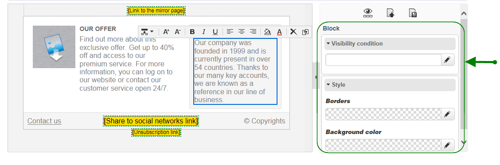

# Interfaz del editor de contenido{#content-editor-interface}

## Ventana de edición {#editing-window}

La ventana de edición de DCE se desglosa en tres secciones diferentes. Permiten ver, modificar y comprobar el estado del contenido.

1. La sección **superior** es un área de visualización para mensajes al usuario. Estos mensajes indican el estado de la aplicación web o del envío que se está creando, así como advertencias y mensajes de error relacionados con el contenido. Para obtener más información sobre esto, consulte los estados [de contenido](#html-content-statuses)HTML.
1. La sección a la **izquierda** de la ventana es el área para editar contenido. Desde esta área, el usuario puede interactuar directamente con el contenido mediante la barra de herramientas emergente: insertar un vínculo en una imagen, cambiar la fuente, eliminar un campo, etc. For more on this refer to [Editing forms](../../web/using/editing-content.md#editing-forms).
1. La sección a la **derecha** de la ventana es el área del panel de control. Esta área agrupa las diferentes opciones para el editor, en particular las relacionadas con la configuración del encabezado de página y las opciones generales para un bloque: agregue un borde, vincule un campo de base de datos con una zona de entrada, acceda a las propiedades de la página Web, etc. Para obtener más información sobre esto, consulte las secciones Opciones  globales y [Edición de contenido](../../web/using/editing-content.md) .

## Opciones globales {#global-options}

La sección superior derecha del editor da acceso a las opciones globales que permiten controlar el contenido que se está creando.

Tiene cuatro iconos:

* The **Display/Hide blocks** icon lets you display blue frames around the content blocks (corresponding to the `
` HTML tag).

* El icono **Seleccionar otro contenido** permite al usuario cargar contenido nuevo desde una plantilla (plantilla existente o plantilla predeterminada).

   

   >[!CAUTION]
   >
   >El contenido seleccionado reemplaza al contenido actual.

* El icono **Guardar como plantilla** permite guardar el contenido actual como una plantilla. Debe indicar la etiqueta y el nombre interno de la plantilla. Las plantillas se almacenan en el **[!UICONTROL Resources > Templates > Content templates]** nodo.

   

   Una vez guardada, la plantilla está disponible y se puede seleccionar al crear contenido nuevo.

   

* El icono de **Propiedades de página** permite seleccionar información de contenido en la parte superior de la página HTML.

   

   >[!NOTE]
   >
   >This information corresponds to the **`<title>`** and **`<meta>`** HTML tags on the page.
   >
   >Las palabras clave deben estar separadas por comas.

## Opciones de bloque {#block-options}

La sección a la derecha del editor agrupa las opciones principales que permiten actuar sobre el contenido. Para mostrar estas opciones, debe seleccionar un bloque: las características de estas opciones dependen del bloque seleccionado.

Se puede:

* Determine la visualización de uno o varios bloques, consulte [Definición de una condición](../../web/using/editing-content.md#defining-a-visibility-condition)de visibilidad,
* Defina los bordes y marcos, consulte [Adición de un borde y un fondo](../../web/using/editing-content.md#adding-a-border-and-background),
* Definir atributos de imagen (tamaño, rótulo), consulte [Edición de propiedades](../../web/using/editing-content.md#editing-image-properties)de imagen,
* Vincule la base de datos a un elemento de formulario (zona de entrada, casilla de verificación), consulte [Cambio de las propiedades de datos de un formulario](../../web/using/editing-content.md#changing-the-data-properties-for-a-form),
* Conversión de una parte de un formulario en obligatoria, consulte [Cambio de las propiedades de datos de un formulario](../../web/using/editing-content.md#changing-the-data-properties-for-a-form),
* Defina una acción para un botón, consulte [Adición de una acción a un botón](../../web/using/editing-content.md#adding-an-action-to-a-button).

## Barra de herramientas de contenido {#content-toolbar}

La barra de herramientas es un **elemento emergente** de la interfaz del DCE que muestra distintas funciones según el bloque seleccionado.

>[!CAUTION]
>
>Algunas funciones de la barra de herramientas permiten dar formato al contenido HTML. Sin embargo, si la página contiene una hoja de estilos CSS, las **instrucciones** de la hoja de estilo pueden tener **prioridad** sobre las instrucciones especificadas con la barra de herramientas.

