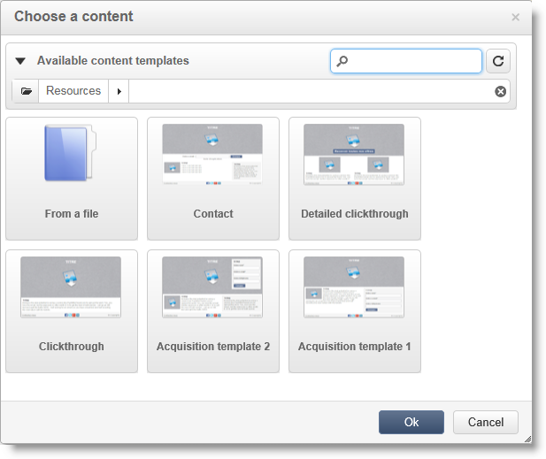
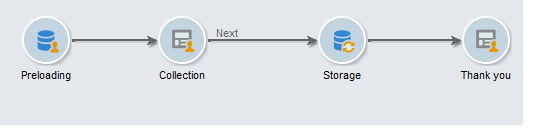

# Creación de una página de destino{#creating-a-landing-page}

## Acerca de la creación de páginas de destino {#about-landing-pages-creation}

Este ejemplo de uso muestra el uso del editor digital para crear una página de destino desde la consola de Adobe Campaign.

Antes de empezar a configurar la página de destino en Adobe Campaign, asegúrese de tener **una o más plantillas** para representar las páginas HTML.

El objetivo principal de este ejemplo de uso es hacer que los campos de formulario de la página de destino se correspondan con los campos internos de Adobe Campaign mediante las funciones del DCE.

## Creación de la página de destino {#creating-the-landing-page}

Para crear una nueva aplicación web de tipo página de destino, siga estos pasos:

1. Vaya a la ficha **[!UICONTROL Campaigns]**, haga clic en el vínculo **[!UICONTROL Web application]** y, a continuación, haga clic en el botón **[!UICONTROL Create]**.
1. Seleccione la plantilla **[!UICONTROL New landing page]**, introduzca una etiqueta y luego haga clic en **[!UICONTROL Save]**.

   

1. Seleccione la pestaña **[!UICONTROL Edit]**.
1. Elimine la actividad **End**.
1. Añada una actividad **[!UICONTROL Page]** después de la actividad **[!UICONTROL Storage]**.
1. Edite la actividad **Page 2** y, a continuación, en la pestaña **[!UICONTROL Activate outbound transitions]**, desactive la opción **[!UICONTROL Properties]**.

   

1. Guarde los cambios.

A continuación, se obtiene la siguiente secuencia:

>[!NOTE]
>
>Para obtener más información sobre la creación de una aplicación web, consulte [esta sección](../../web/using/creating-a-new-web-application.md).

## Paso 1: Selección y carga de plantillas {#step-1---selecting-and-loading-templates}

En esta sección, se muestra cómo **importar contenido HTML** para cada página de la aplicación web.

Una plantilla debe contener:

* un archivo **HTML** (obligatorio).
* uno o varios archivos **CSS** (opcionales).
* una o varias **imágenes** (opcionales).

Para cargar la plantilla en la primera página, realice los pasos siguientes:

1. Abra la primera actividad **[!UICONTROL Page]** de la aplicación web.
1. Seleccione **[!UICONTROL From a file]** para buscar la plantilla de contenido.

   

1. Seleccione el archivo HTML que desea utilizar.
1. Haga clic en **Abrir** para iniciar la importación.

   Durante la carga se muestra la lista de archivos compartidos. El sistema de importación comprueba que todos los archivos relacionados con el HTML seleccionado estén presentes (CSS, imágenes, etc.).

   Haga clic en el botón **[!UICONTROL Close]** cuando haya finalizado la importación.

   

   >[!CAUTION]
   >
   >Debe esperar hasta que reciba el siguiente mensaje antes de cerrar: **[!UICONTROL The external resources have been successfully published]**.

1. Seleccione la pestaña **[!UICONTROL Properties]**.
1. Escriba una **etiqueta** para cada página (por ejemplo: Página 1= Recopilar, Página 2=Gracias).

   

Realice estos pasos para cada página insertada en la aplicación web.

>[!CAUTION]
>
>**El DCE ejecuta el código JavaScript para la página HTML cargada.** Errores de JavaScript en la plantilla HTML que pueden aparecer en la interfaz de Adobe Campaign. Estos errores no están relacionados con el editor. Para comprobar que no haya errores en los archivos importados, se recomienda probarlos en un navegador (Internet Explorer, Firefox, Chrome) antes de importar los archivos al DCE.

## Paso 2: Configuración del contenido {#step-2---configuring-the-content}

En esta sección, se muestra cómo ajustar el contenido importado y relacionar los campos de la base de datos al formulario de la página web. La aplicación web creada anteriormente es:

### Modificación del contenido {#modifying-content}

Comencemos por cambiar los colores de la página. Para ello:

1. Abra la página **[!UICONTROL Collection]**.
1. Haga clic en el fondo.
1. Haga clic en **Color de fondo**, en el lado derecho.
1. Seleccione un nuevo color de fondo.
1. Haga clic en **Aceptar** para confirmar el cambio.

   

1. Aplique estos mismos procesos para cambiar el color del botón.

   

### Vinculación de campos de formulario {#linking-form-fields}

Enlacemos los campos de la página a los de la base de datos para poder guardar la información proporcionada.

1. Seleccione un campo del formulario.
1. Edite la sección **[!UICONTROL Field]** en el lado derecho del editor.
1. Seleccione el campo de base de datos que desea vincular con el campo seleccionado.

   

1. Repita este proceso para cada campo de la página.

Puede hacer que un campo sea obligatorio: por ejemplo, haga clic en el campo **[!UICONTROL Email]** y active la opción **Mandatory**.

### Creación de un vínculo a la página siguiente {#creating-a-link-to-the-next-page}

Este paso es obligatorio porque permite a la aplicación web determinar la secuencia de los siguientes pasos: Guardar los datos recopilados en la base de datos y mostrar la página siguiente (página de **agradecimiento**).

1. Seleccione el botón **[!UICONTROL Send it!]** de la página **[!UICONTROL Collection]**.
1. Haga clic en el menú desplegable **[!UICONTROL Action]**.
1. Seleccione la acción **[!UICONTROL Next page]**.

   

### Inserción de un campo personalizado {#inserting-a-personalization-field}

Este paso le permite personalizar la página de agradecimiento. Para ello:

1. Abra la página **[!UICONTROL Thank you]**.
1. Coloque el cursor en un área de texto donde desee insertar el nombre del destinatario.
1. En el menú **[!UICONTROL Personalization field]** de la barra de herramientas, seleccione **[!UICONTROL Insert]**.
1. Seleccione el nombre.

   

El campo de personalización aparece con fondo amarillo en el editor.

## Paso 3: Publicación de contenidos {#step-3---publishing-content}

El contenido se publica desde el panel de aplicaciones web. Haga clic en el botón **[!UICONTROL Publish]** para ejecutarlo.

Durante la publicación se muestra un “log”. El sistema de publicación analiza todo el contenido encontrado en la aplicación web.

>[!NOTE]
>
>En el “log” de publicación, las advertencias y los errores se ordenan por actividad.

El formulario ya está disponible: la dirección URL está disponible en el panel de aplicaciones y se puede enviar a los destinatarios.
