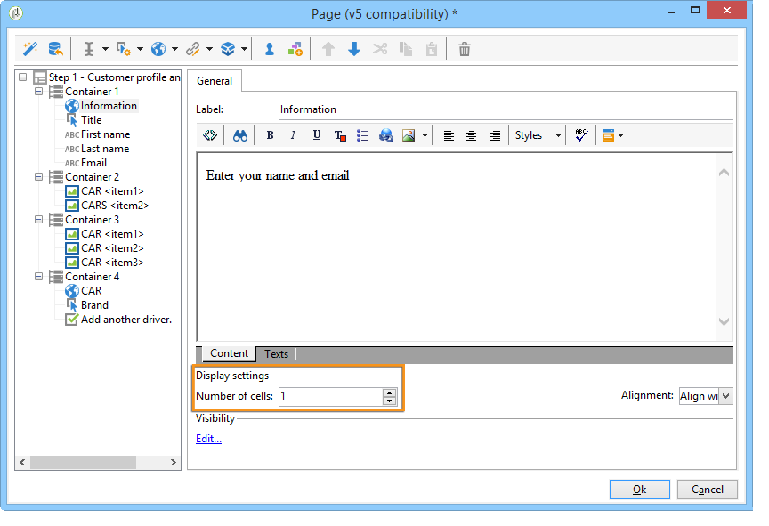
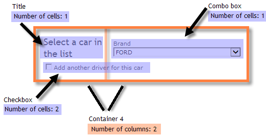

# Definición del diseño de los formularios web{#defining-web-forms-layout}

## Creación de contenedores {#creating-containers}

Los contenedores permiten combinar los campos de una página y configurar su diseño para organizar los elementos de la página.

Para cada página del formulario, los contenedores se crean mediante el botón **[!UICONTROL Containers]** de la barra de herramientas.

Utilice un contenedor para agrupar los elementos de la página sin añadir una etiqueta al procesamiento final. Los elementos se agrupan en el subdirectorio del contenedor. Los contenedores estándar permiten administrar el diseño.

Por ejemplo:

La posición de las etiquetas se aplica a los elementos situados bajo el contenedor en la jerarquía. Puede sobrecargarse para cada elemento si es necesario. Añada o quite columnas para cambiar el diseño. Consulte [Colocación de los campos en la página](#positioning-the-fields-on-the-page).

En el ejemplo anterior, la renderización es la siguiente:

## Colocación de los campos en la página {#positioning-the-fields-on-the-page}

El diseño del formulario web se define página por página en cada contenedor y se puede sobrecargar si es necesario.

Las páginas se dividen en columnas: cada página contiene un determinado número de columnas. Cada campo de la página ocupa **n** celdas. Los contenedores también ocupan un determinado número de columnas y los campos que contienen ocupan un determinado número de celdas..

De forma predeterminada, las páginas se crean en una única columna y cada elemento ocupa una celda. Esto significa que los campos se muestran uno debajo de otro, cada uno de los cuales ocupa una línea entera, como se muestra a continuación:

En el siguiente ejemplo, se ha conservado la configuración predeterminada. La página ocupa una sola columna que incluye cuatro contenedores.

Cada contenedor ocupa una columna y cada elemento ocupa una celda:

La renderización es la siguiente:

Se pueden adaptar los parámetros de visualización para obtener la siguiente renderización:

En el ejemplo de renderización anterior, cada campo de entrada, título e imagen ocupa una celda en las columnas de los contenedores.

Se puede modificar el formato en cada contenedor. En este ejemplo, se puede extender el contenido del contenedor 4 en dos columnas y distribuir los elementos.

El título y la lista ocupan una celda cada uno (y, por tanto, una línea completa del contenedor) y la casilla de verificación se extiende por dos celdas. El número de celdas atribuido al campo de entrada se define en la pestaña **[!UICONTROL General]** o en la pestaña **[!UICONTROL Advanced]**, según el tipo de campo:

## Definición de la posición de etiquetas {#defining-the-position-of-labels}

Puede definir la alineación de campos y etiquetas en el formulario.

De forma predeterminada, los parámetros de visualización para campos y otro contenido de la página se heredan de la configuración general del formulario, la configuración de la página o la configuración del contenedor principal, si existe.

Los parámetros de visualización globales para todo el formulario se especifican en el cuadro de propiedades del formulario. La pestaña **[!UICONTROL Rendering]** permite seleccionar la posición de las etiquetas.

Esta posición se puede sobrecargar para cada página, cada contenedor y cada campo, a través de la pestaña **[!UICONTROL Advanced]**.

Se admiten las siguientes alineaciones:

* Heredado: la alineación se hereda del elemento principal (valor predeterminado), es decir, el contenedor principal si existe, o de lo contrario, la página.
* Izquierda/derecha: la etiqueta se coloca a la derecha o a la izquierda del campo,
* Encima/debajo: la etiqueta se coloca encima o debajo del campo,
* Oculta: la etiqueta no se muestra.

