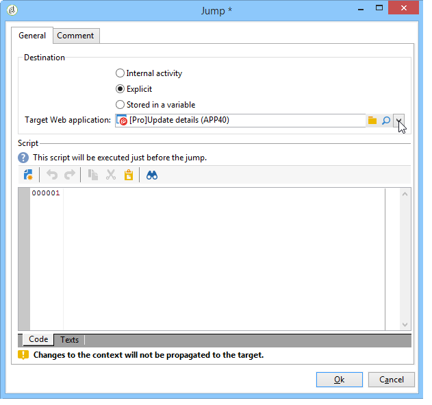
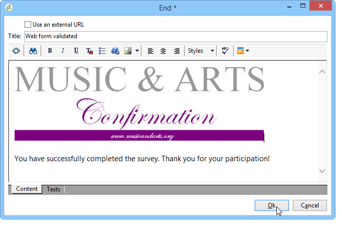

# Definición de la secuenciación de la página de formularios web{#defining-web-forms-page-sequencing}

El formulario puede contener una o más páginas. Se crea mediante un diagrama que permite secuenciar las páginas y las pruebas, la ejecución de scripts, los saltos de página y los pasos de registro. El modo del diseño del diagrama global es el mismo que para un flujo de trabajo de la campaña.

## Sobre la página anterior y la página siguiente {#about-previous-page-and-next-page}

Para cada página, puede eliminar los botones **[!UICONTROL Next]** o **[!UICONTROL Previous]**. Para ello, seleccione la página que desee y seleccione la opción **[!UICONTROL Disable next page]** o **[!UICONTROL Disallow returning to the previous page]**.


Puede reemplazar estos botones con vínculos. Consulte [Inserción de contenido HTML](../../web/using/static-elements-in-a-web-form.md#inserting-html-content).

## Inserción de un salto {#inserting-a-jump}

El objeto **[!UICONTROL Jump]** proporciona acceso a otra página u otro formulario cuando el usuario hace clic en **[!UICONTROL Next]**.

El destino puede ser:

* otra página del formulario. Para ello, seleccione **[!UICONTROL Internal activity]** y luego especifique la página deseada, como se muestra a continuación:

   

* otro formulario. Para esto, haga clic en la opción **[!UICONTROL Explicit]** y especifique el formulario de destino.

   

* El destino se puede almacenar en una variable. En este caso, selecciónelo en la lista desplegable, como se muestra a continuación:

   

* La pestaña **[!UICONTROL Comment]** permite introducir información que puede ver el operador cuando haga clic en el objeto del diagrama.

   

## Ejemplo: acceso a otro formulario de acuerdo con un parámetro de la URL {#example--accessing-another-form-according-to-a-parameter-of-the-url}

En el ejemplo siguiente, se desea configurar un formulario web que, cuando está aprobado, muestra otro formulario designado por un parámetro de la dirección URL. Para ello, siga los siguientes pasos:

1. Inserte un salto al final de un formulario: este reemplaza la casilla **[!UICONTROL End]**.

   

1. En las propiedades del formulario, añada un parámetro (**siguiente**) almacenado en una variable local (**siguiente**). Las variables locales se detallan en [Almacenamiento de datos en una variable local](../../web/using/web-forms-answers.md#storing-data-in-a-local-variable).

   

1. Edite el objeto **[!UICONTROL Jump]**, seleccione la opción **[!UICONTROL Stored in a variable]** y seleccione la variable **siguiente** en el cuadro desplegable.

   

1. La dirección URL de envío debe incluir el nombre interno del formulario de destino, por ejemplo:

   ```
   https://[myserver]/webForm/APP62?&next=APP22
   ```

   Cuando el usuario hace clic en el botón **[!UICONTROL Approve]**, se muestra el formulario **APP22**.

## Inserción de un vínculo a otra página del formulario {#inserting-a-link-to-another-page-of-the-form}

Puede insertar vínculos a otras páginas del formulario. Para ello, añada un elemento estático de tipo **[!UICONTROL Link]** a la página. Para obtener más información, consulte [Inserción de un vínculo](../../web/using/static-elements-in-a-web-form.md#inserting-a-link).

## Visualización condicional de la página {#conditional-page-display}

### Mostrar según las respuestas {#display-based-on-responses}

La casilla **[!UICONTROL Test]** permite condicionar la secuenciación de páginas en un formulario. Permite definir varias líneas de ramificación según los resultados de la prueba. Esto permite mostrar diferentes páginas según las respuestas de los usuarios.

Por ejemplo, se puede mostrar una página diferente para los clientes que ya hayan realizado un pedido en línea y otra para aquellos que hayan realizado más de diez pedidos. Para ello, en la primera página del formulario, inserte un campo de entrada de tipo **[!UICONTROL Number]** para que el usuario declare cuántas solicitudes ha realizado.


Se puede almacenar esta información en un campo de la base de datos o utilizar una variable local.

>[!NOTE]
>
>Los modos de almacenamiento se detallan en los campos [Response storage fields](../../web/using/web-forms-answers.md#response-storage-fields).

En este ejemplo, se desea utilizar una variable:


En el diagrama del formulario, inserte un cuadro de prueba para definir las condiciones. Para cada condición, se añade una nueva rama en la salida del cuadro de prueba.


Seleccione la opción **[!UICONTROL Activate the default branching]** para añadir una transición en casos en los que ninguna de las condiciones sea verdadera. Esta opción no es necesaria si las condiciones abarcan cada caso posible.

A continuación, defina la secuenciación de la página cuando una o varias de las condiciones sean verdaderas, por ejemplo:


### Mostrar según los parámetros {#display-based-on-parameters}

Asimismo, se puede personalizar la secuenciación de la página según los parámetros de inicialización del formulario web o según los valores almacenados en la base de datos. Consulte [Parámetros de URL del formulario](../../web/using/defining-web-forms-properties.md#form-url-parameters).

## Adición de secuencias de comandos {#adding-scripts}

El objeto **[!UICONTROL Script]** permite introducir una secuencia de comandos JavaScript directamente, por ejemplo para modificar el valor de un campo, recuperar datos de la base de datos o llamar a una API de Adobe Campaign.

## Personalización de la página final {#personalizing-the-end-page}

Se debe colocar una página final al final del diagrama. La página final se muestra cuando el usuario hace clic en el botón **[!UICONTROL Approve]** del formulario web.

Para personalizar esta página, haga doble clic en **[!UICONTROL End]** e introduzca el contenido de la página en el editor central.



* Puede copiar y pegar contenido HTML existente. Para ello, haga clic en **[!UICONTROL Display source code]** e inserte el código HTML.
* Se puede utilizar una URL externa. Para ello, seleccione la opción correspondiente e introduzca la dirección URL de la página que desea mostrar.

