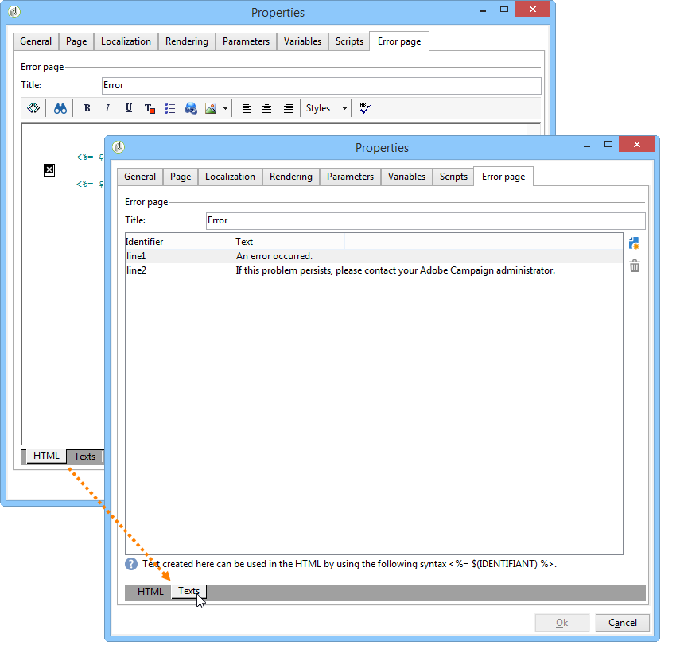
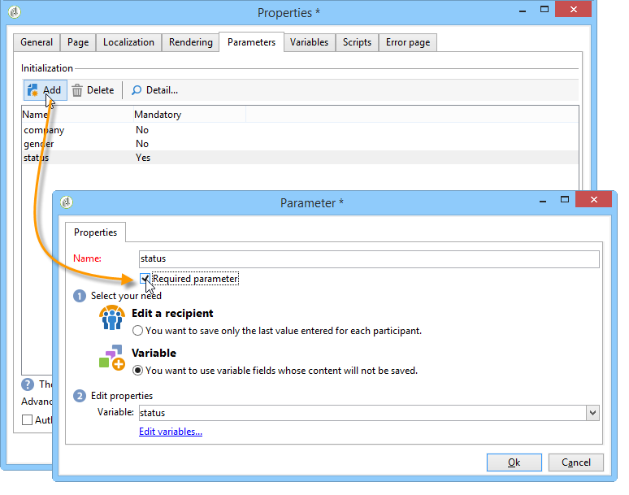
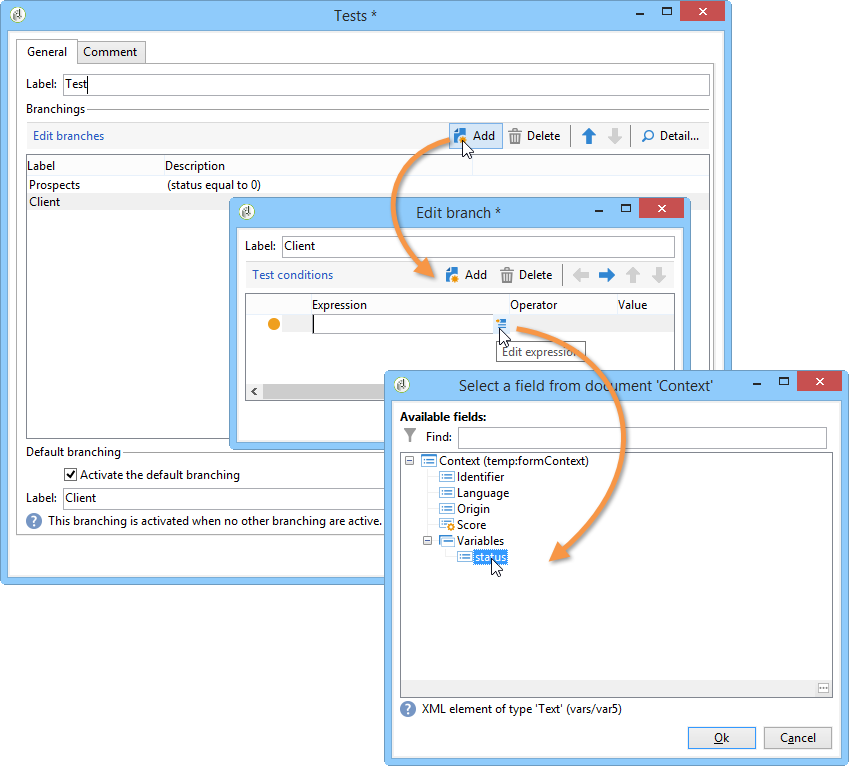

# Definición de las propiedades de los formularios web{#defining-web-forms-properties}

Los formularios web se pueden configurar y personalizar completamente para satisfacer sus necesidades. Los parámetros deben introducirse en la ventana de propiedades.

Se puede acceder a la ventana de propiedades mediante el botón **[!UICONTROL Properties]** de la barra de herramientas del formulario web. Esta ventana permite acceder a diversas configuraciones específicas del formulario web. Algunos ajustes pueden proceder de la configuración de la plantilla.

## Propiedades generales del formulario {#overall-form-properties}

En la pestaña **[!UICONTROL General]** de la ventana de propiedades, se puede modificar la **etiqueta** del formulario. Se recomienda no cambiar el **nombre interno**.

La plantilla de formulario se elige durante la creación del formulario. No se puede cambiar más tarde. Para obtener más información sobre la creación y administración de plantillas de formulario, consulte [Uso de una plantilla de formulario web](../../web/using/using-a-web-form-template.md).

## Almacenamiento de datos de formulario {#form-data-storage}

Los campos de los formularios web se almacenan en la tabla de destinatarios de forma predeterminada. Puede cambiar la tabla utilizada seleccionando una nueva tabla del campo **[!UICONTROL Document type]**. El icono **[!UICONTROL Zoom]** le permite ver el contenido de la tabla seleccionada.

De forma predeterminada, las respuestas se almacenan en la tabla **Answer to a recipient form**.

## Configuración de una página de error {#setting-up-an-error-page}

Puede configurar una página de error: esta página se muestra en caso de errores durante la ejecución del formulario.

La página de error se define en la pestaña correspondiente de la ventana de propiedades del formulario.

Muestra la siguiente información de forma predeterminada:

El contenido de las cadenas mostradas se define en la pestaña **[!UICONTROL Error page]** de la ventana de propiedades. La pestaña **[!UICONTROL HTML]** muestra la renderización y la pestaña **[!UICONTROL Texts]** permite modificar las cadenas de texto y añadir texto si es necesario:

## Localización del formulario {#form-localization}

La pestaña **[!UICONTROL Localization]** permite seleccionar los idiomas de diseño y visualización del formulario web.

Consulte [Traducción de un formulario web](../../web/using/translating-a-web-form.md).

## Exploración y renderización de formularios {#form-browsing-and-rendering}

La pestaña **[!UICONTROL Rendering]** permite definir el tipo de exploración entre las páginas del formulario web y la plantilla de renderización utilizada.

Se puede escoger navegar mediante vínculos o botones.

Los botones son los elementos de navegación de forma predeterminada. Permiten realizar las siguientes acciones:

* Apruebe la página actual y muestre la página siguiente haciendo clic en **[!UICONTROL Next]**. Este botón se muestra en todas las páginas excepto en la última.
* Muestre la página anterior haciendo clic en **[!UICONTROL Previous]**. Este botón se muestra en todas las páginas excepto en la primera.
* Guarde las respuestas del formulario haciendo clic en el botón **[!UICONTROL Approve]**. Este botón solo se muestra en la última página.

Estos elementos se muestran en la parte inferior de cada página. Sus posiciones se pueden cambiar. Para ello, debe modificar la hoja de estilos.

>[!NOTE]
>
>Es posible ocultar el botón **[!UICONTROL Previous]** en algunas páginas. Para ello, vaya a la página correspondiente y marque la opción **[!UICONTROL Disallow returning to the previous page]**. Se puede acceder a esta opción cuando se seleccione la raíz del directorio de páginas.

El campo **[!UICONTROL Template]** de la pestaña **[!UICONTROL Rendering]** permite seleccionar un tema de los que se encuentran disponibles.

Los temas se guardan en el nodo **[!UICONTROL Administration>Configuration>Form rendering]** del árbol. Consulte [Selección de la plantilla de renderización del formulario](../../web/using/form-rendering.md#selecting-the-form-rendering-template).

En la parte inferior de la ventana de propiedades se muestra una renderización de muestra. El icono **[!UICONTROL Edit link]** permite ver la configuración del tema seleccionado:

## Textos en el formulario {#texts-in-the-form}

La pestaña **[!UICONTROL Page]** permite definir el contenido del encabezado y del pie de página del formulario. Consulte [Definición de encabezados y pies de página](../../web/using/form-rendering.md#defining-headers-and-footers).

También permite administrar las traducciones. Consulte [Traducción de un formulario web](../../web/using/translating-a-web-form.md).

## Accesibilidad del formulario {#accessibility-of-the-form}

Los usuarios pueden acceder a un formulario web si está **[!UICONTROL Online]** y si la fecha actual se encuentra dentro de su periodo de validez. El estado del formulario se modifica durante la fase de publicación (consulte [Publicación de un formulario](../../web/using/publishing-a-web-form.md#publishing-a-form)). El estado se muestra en la sección **Project** de la pestaña **[!UICONTROL General]** de la ventana de propiedades.

El periodo de validez se ejecuta desde la fecha **[!UICONTROL Start]** hasta **[!UICONTROL End date]**. Si no se especifica ninguna fecha en estos campos, el formulario tiene validez permanente.

>[!NOTE]
>
>Si el formulario está cerrado y, por lo tanto, su periodo de validez no se ha alcanzado o ha caducado, o si lo ha cerrado el operador de Adobe Campaign, aparece un mensaje cuando el usuario intenta acceder a él. Puede personalizar este mensaje haciendo clic en **[!UICONTROL Personalize the message displayed if the form is closed...]**.

## Control de acceso a formularios {#form-access-control}

De forma predeterminada, el acceso a los formularios web se realiza en modo anónimo: todos los operadores que acceden al formulario tienen derechos de operador de WebApp.

Puede activar el control de acceso para la visualización del formulario, por ejemplo, al enviar un formulario en un sitio de intranet para autenticar a los usuarios. Para ello, muestre la ventana **[!UICONTROL Properties]** del formulario correspondiente y haga clic en la opción **[!UICONTROL Enable access control]** como se muestra a continuación:

Cuando se accede a la página, aparece el siguiente formulario de autenticación:

El inicio de sesión y la contraseña son los que utilizan los operadores de Adobe Campaign. Para obtener más información, consulte [esta sección](../../platform/using/access-management.md).

La opción **[!UICONTROL Use a specific account]** permite limitar el permiso de lectura o escritura del operador que accede al formulario. Utilice el cuadro desplegable para seleccionar un operador o un grupo de operadores que estén a cargo de la concesión de estos permisos.

## Parámetros de URL del formulario {#form-url-parameters}

Se pueden agregar parámetros adicionales en la dirección URL de un formulario para personalizar su contenido e inicializar un contexto (idioma, ID de destinatario encriptada, empresa, fórmula calculada almacenada en una variable, etc.). Esto permite dar acceso a un formulario a través de distintas direcciones URL y personalizar el contenido de la página según el valor de los parámetros mostrados en la dirección URL.

De forma predeterminada, Adobe Campaign ofrece parámetros para previsualizar el formulario y comprobar errores. Se pueden crear nuevas configuraciones vinculadas al formulario que pueden utilizar los valores de un campo en la base de datos o de una variable local.

## Parámetros estándar {#standard-parameters}

Los siguientes parámetros están disponibles de forma predeterminada:

* **id** para indicar el identificador encriptado.
* **Divide** para cambiar el idioma de visualización.
* **origin** para especificar el origen del encuestado.
* **_uuid** permite la visualización de formularios antes de la publicación y el seguimiento de errores. Este parámetro es para uso interno (creación y depuración): cuando se accede al formulario web a través de esta dirección URL, los registros creados no se tienen en cuenta en el seguimiento (informes). Se fuerza el valor **[!UICONTROL Adobe Campaign]** en el origen.

   Se utiliza con los parámetros **_preview** o **_debug**:

   **_preview** para mostrar la última versión guardada. Este parámetro solo debe utilizarse en la fase de prueba.

   **_debug** para mostrar el rastro de la entrada de datos o calculados en las páginas del formulario. Se utiliza para obtener más información sobre los errores, incluso una vez que se ha publicado el formulario.

   >[!CAUTION]
   >
   >Cuando el formulario se muestra a través de una dirección URL con el parámetro **_uuid**, se fuerza el valor **[!UICONTROL origin]** Adobe Campaign **en el parámetro**.

## Adición de parámetros {#adding-parameters}

 En la ventana Properties del formulario, se pueden añadir parámetros a través de la pestaña **[!UICONTROL Parameters...]**. Pueden hacerse obligatorios, como se muestra a continuación:

Debe especificar una ubicación de almacenamiento desde la que se recupera el valor del parámetro. Para ello, seleccione una de las opciones de almacenamiento y haga clic en la pestaña **[!UICONTROL Storage]** para seleccionar el campo o la variable que desee. Las opciones de almacenamiento se detallan en los [campos de almacenamiento de respuestas](../../web/using/web-forms-answers.md#response-storage-fields).

Después se puede añadir el estado del encuestado (0, 1 o cualquier otro valor) a la URL para acceder al formulario. Esta información se puede reutilizar en las páginas del formulario o en una casilla de prueba. Las páginas mostradas se pueden condicionar según el valor del contexto, como se muestra a continuación:

1. Página de inicio para los clientes (**estado=1**):

   

1. Página de inicio para los posibles clientes (**estado=0**):

   

1. Página de inicio de otros perfiles (por ejemplo: **status=12**):

   

Para configurar este formulario, cree un cuadro de prueba y colóquelo al principio del diagrama, como se muestra a continuación:

El cuadro de prueba permite configurar las condiciones de secuenciación de página:

