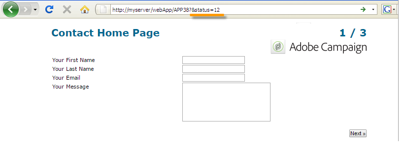

# Definición de las propiedades de los formularios web{#defining-web-forms-properties}

Los formularios web se pueden configurar y personalizar completamente para satisfacer sus necesidades. Los parámetros deben introducirse en la ventana de propiedades.

The properties window is accessible via the **[!UICONTROL Properties]** button in the toolbar of the Web form. Esta ventana permite acceder a diversas configuraciones específicas del formulario web. Algunos ajustes pueden proceder de la configuración de la plantilla.

## Propiedades generales del formulario {#overall-form-properties}

In the **[!UICONTROL General]** tab of the properties window, you can modify the **Label** of the form. Se recomienda no cambiar el **nombre interno**.

La plantilla de formulario se elige durante la creación del formulario. No se puede cambiar más tarde. Para obtener más información sobre la creación y administración de plantillas de formulario, consulte [Uso de una plantilla](../../web/using/using-a-web-form-template.md)de formulario web.

## Almacenamiento de datos de formulario {#form-data-storage}

Los campos de los formularios web se almacenan en la tabla de destinatarios de forma predeterminada. You can change the table used by selecting a new table from the **[!UICONTROL Document type]** field. The **[!UICONTROL Zoom]** icon lets you view the content of the selected table.

De forma predeterminada, las respuestas se almacenan en la **[!UICONTROL Answer to a recipient form]** tabla.

## Configuración de una página de error {#setting-up-an-error-page}

Puede configurar una página de error: esta página se muestra en caso de errores durante la ejecución del formulario.

La página de error se define en la pestaña correspondiente de la ventana de propiedades del formulario.

Muestra la siguiente información de forma predeterminada:

The content of the strings displayed is defined in the **[!UICONTROL Error page]** tab of the properties window. The **[!UICONTROL HTML]** tab displays the rendering and the **[!UICONTROL Texts]** tab lets you modify the text strings and add some text if necessary:

## Localización del formulario {#form-localization}

The **[!UICONTROL Localization]** tab lets you select the design and display languages for the Web form.

See [Translating a web form](../../web/using/translating-a-web-form.md).

## Exploración y renderización de formularios {#form-browsing-and-rendering}

The **[!UICONTROL Rendering]** tab lets you define the type of browsing between pages of the Web form and the rendering template used.

Se puede escoger navegar mediante enlaces o botones.

Los botones son los elementos de navegación de forma predeterminada. Permiten realizar las siguientes acciones:

* Approve the current page and display the next page by clicking **[!UICONTROL Next]**. Este botón se muestra en todas las páginas excepto en la última.
* Display the previous page by clicking **[!UICONTROL Previous]**. Este botón se muestra en todas las páginas excepto en la primera.
* Save the form responses by clicking the **[!UICONTROL Approve]** button. Este botón solo se muestra en la última página.

Estos elementos se muestran en la parte inferior de cada página. Sus posiciones se pueden cambiar. Para ello, debe modificar la hoja de estilos.

>[!NOTE]
>
>It&#39;s possible to hide the **[!UICONTROL Previous]** button on some pages. To do this, go to the concerned page and check the **[!UICONTROL Disallow returning to the previous page]** option. Se puede acceder a esta opción cuando se seleccione la raíz del directorio de páginas.

The **[!UICONTROL Template]** field of the **[!UICONTROL Rendering]** tab lets you select a theme from those available.

Themes are saved in the **[!UICONTROL Administration>Configuration>Form rendering]** node of the tree. See [Selecting the form rendering template](../../web/using/form-rendering.md#selecting-the-form-rendering-template)

En la parte inferior de la ventana de propiedades se muestra una renderización de muestra. The **[!UICONTROL Edit link]** icon lets you view the configuration for the selected theme.

## Textos en el formulario {#texts-in-the-form}

The **[!UICONTROL Page]** tab lets you define the content of the form header and footer. See [Defining headers and footers](../../web/using/form-rendering.md#defining-headers-and-footers).

También permite administrar las traducciones. See [Translating a web form](../../web/using/translating-a-web-form.md).

## Accesibilidad del formulario {#accessibility-of-the-form}

A Web form is accessible to users if it is **[!UICONTROL Online]** and if the current date is within its validity period. The status of the form is modified during the publication stage (see [Publishing a form](../../web/using/publishing-a-web-form.md#publishing-a-form)). The status is displayed in the **Project** section of the **[!UICONTROL General]** tab of the properties window.

El período de validez se ejecuta desde la **[!UICONTROL Start]** fecha hasta la **[!UICONTROL End date]**. Si no se especifica ninguna fecha en estos campos, el formulario tiene validez permanente.

>[!NOTE]
>
>Si el formulario está cerrado y, por lo tanto, su periodo de validez no se ha alcanzado o ha caducado, o si lo ha cerrado el operador de Adobe Campaign, aparece un mensaje cuando el usuario intenta acceder a él. Puede personalizar este mensaje haciendo clic en **[!UICONTROL Personalize the message displayed if the form is closed...]**.

## Control de acceso a formularios {#form-access-control}

De forma predeterminada, el acceso a los formularios web se realiza en modo anónimo: todos los operadores que acceden al formulario tienen derechos de operador de WebApp.

Puede activar el control de acceso para la visualización del formulario, por ejemplo, al enviar un formulario en un sitio de intranet para autenticar a los usuarios. To do this, display the **[!UICONTROL Properties]** window of the concerned form and click the **[!UICONTROL Enable access control]** option, as shown below:

Cuando se accede a la página, aparece el siguiente formulario de autenticación:

El inicio de sesión y la contraseña son los que utilizan los operadores de Adobe Campaign. Para obtener más información, consulte [esta sección](../../platform/using/access-management.md).

The **[!UICONTROL Use a specific account]** option lets you limit the read or write permission of the operator who accesses the form. Utilice el cuadro desplegable para seleccionar un operador o un grupo de operadores que estén a cargo de la concesión de estos permisos.

## Parámetros de URL del formulario {#form-url-parameters}

Se pueden agregar parámetros adicionales en la dirección URL de un formulario para personalizar su contenido e inicializar un contexto (idioma, ID de destinatario encriptada, empresa, fórmula calculada almacenada en una variable, etc.). Esto permite dar acceso a un formulario a través de distintas direcciones URL y personalizar el contenido de la página según el valor de los parámetros mostrados en la dirección URL.

De forma predeterminada, Adobe Campaign ofrece parámetros para previsualizar el formulario y comprobar errores. Se pueden crear nuevas configuraciones vinculadas al formulario que pueden utilizar los valores de un campo en la base de datos o de una variable local.

## Parámetros estándar {#standard-parameters}

Los siguientes parámetros están disponibles de forma predeterminada:

* **id** para indicar el identificador encriptado.
* **Divide** para cambiar el idioma de visualización.
* **origin** para especificar el origen del encuestado.
* **_uuid** permite la visualización de formularios antes de la publicación y el seguimiento de errores. Este parámetro es para uso interno (creación y depuración): cuando se accede al formulario web a través de esta dirección URL, los registros creados no se tienen en cuenta en el seguimiento (informes). The origin is forced to the **[!UICONTROL Adobe Campaign]** value.

   It is used with the **_preview** parameters and/or ** _debug**:

   **_preview** para mostrar la última versión guardada. Este parámetro solo debe utilizarse en la fase de prueba.

   **_debug** para mostrar el rastro de la entrada de datos o calculados en las páginas del formulario. Se utiliza para obtener más información sobre los errores, incluso una vez que se ha publicado el formulario.

   >[!CAUTION]
   >
   >When the form is displayed via a URL with the **_uuid** parameter, the value of the **[!UICONTROL origin]** parameter is forced to **Adobe Campaign**.

## Adición de parámetros {#adding-parameters}

Parameters can be added via the **[!UICONTROL Parameters...]** tab in the Properties window of the form. Pueden hacerse obligatorios, como se muestra a continuación:

Debe especificar una ubicación de almacenamiento desde la que se recupera el valor del parámetro. To do this, select one of the storage options and then click the **[!UICONTROL Storage]** tab to select the field or the variable concerned. Las opciones de almacenamiento se detallan en los campos [de almacenamiento de](../../web/using/web-forms-answers.md#response-storage-fields)respuesta.

Después se puede añadir el estado del encuestado (0, 1 o cualquier otro valor) a la URL para acceder al formulario. Esta información se puede reutilizar en las páginas del formulario o en una casilla de prueba. Las páginas mostradas se pueden condicionar según el valor del contexto, como se muestra a continuación:

1. Página de inicio para los clientes (**estado=1**):

   

1. Página de inicio para los posibles clientes (**estado=0**):

   

1. Página de inicio de otros perfiles (por ejemplo: **status=12**):

   

Para configurar este formulario, cree un cuadro de prueba y colóquelo al principio del diagrama, como se muestra a continuación:

El cuadro de prueba permite configurar las condiciones de secuenciación de página:

