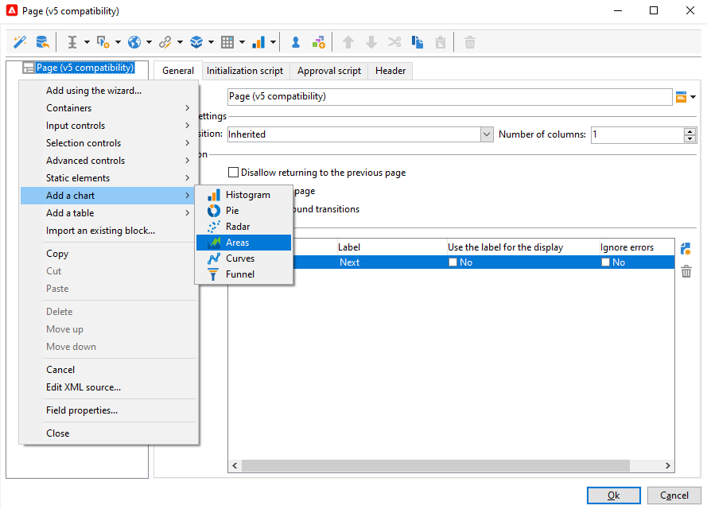

# Diseñar una aplicación web{#designing-a-web-application}

Las aplicaciones web se crean y se administran según el mismo principio que las [encuestas en línea](../../web/using/about-surveys.md).

Sin embargo, las diferencias funcionales son las siguientes:

* Las aplicaciones web no utilizan campos archivados. Por lo tanto, los datos solo se pueden almacenar en campos de base de datos o en variables locales.
* No hay informes incorporados en las aplicaciones web.
* Se ofrecen campos adicionales, principalmente para crear tablas y diagramas.

>[!CAUTION]
>
>Es muy recomendable comprobar continuamente las configuraciones aplicadas para detectar cualquier error al comienzo del proceso de construcción de la aplicación web. Para comprobar la renderización de una modificación, guarde la aplicación y, a continuación, haga clic en la subpestaña **[!UICONTROL Preview]**.
>
>El usuario final no puede visualizar los cambios hasta que se publique la aplicación web.

## Inserción de gráficos en una aplicación web {#inserting-charts-in-a-web-application}

Se pueden incluir gráficos en las aplicaciones web. Para ello, utilice la lista desplegable de la barra de herramientas para seleccionar el tipo de gráfico que desea insertar.

También puede seleccionar el menú **[!UICONTROL Add a chart]**.

## Inserción de tablas en una aplicación web {#inserting-tables-in-a-web-application}

Para añadir una tabla, utilice la lista desplegable de la barra de herramientas para seleccionar el tipo de tabla que desea utilizar.

También puede seleccionar el tipo de tabla en el menú desplegable.

## Aplicaciones web de tipo “descripción general”{#overview-type-web-applications}

La interfaz de Adobe Campaign utiliza muchas aplicaciones web para acceder, gestionar e interactuar con destinatarios, envíos, campañas, inventarios, etc.

Se visualizan en la interfaz en forma de paneles con una sola página.

Las aplicaciones web listas para su uso se almacenan en el nodo **[!UICONTROL Administration > Configuration > Web applications]**.

## Editar aplicaciones web de tipo de formulario {#edit-forms-type-web-applications}

Las aplicaciones web de edición de formularios para una extranet se caracterizan por:

* Un cuadro de precarga

   En la mayoría de los casos, los datos a visualizar deben estar precargados. Dado que los usuarios que acceden a estos formularios se han identificado (mediante un control de acceso), la precarga no tiene por qué estar cifrada.

* Un cuadro de guardado
* Adición de páginas

   Mientras que las aplicaciones web de tipo “descripción general” tienen una sola página, los formularios de edición pueden ofrecer una secuencia de páginas según criterios específicos (testeo, variables, perfil del operador conectado, etc.).

El funcionamiento de este tipo de aplicación web es similar a la de **Encuestas**, pero sin gestión del historial o archivo de campos. Los usuarios suelen acceder a ellas a través de una página de inicio de sesión donde deben identificarse.
