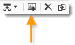

# Edición de contenido{#editing-content}

## Definición de una condición de visibilidad {#defining-a-visibility-condition}

Puede especificar una condición de visibilidad en un elemento de la página web: este elemento solo se puede ver si se respeta la condición.

Para añadir una condición de visibilidad, seleccione un bloque e introduzca la condición en el campo **[!UICONTROL Visibility condition]** con el editor de expresiones.

>[!NOTE]
>
>La edición de expresiones avanzadas se muestra en [esta página](../../platform/using/defining-filter-conditions.md#list-of-functions).

Estas condiciones adoptan la sintaxis de la expresión XTK (por ejemplo: **ctx.recipient.@email != &quot;&quot;** o **ctx.recipient.@status==“0”**). De forma predeterminada, todos los campos son visibles.

>[!NOTE]
>
>Los bloques dinámicos no visibles, como los menús desplegables, no se pueden editar.

## Adición de un borde y un fondo {#adding-a-border-and-background}

Se puede añadir un **borde** a un bloque seleccionado. Los bordes se definen con tres opciones: estilo, tamaño y color.

Asimismo, se puede definir un **color de fondo** seleccionando un color en la tabla de colores.

## Edición de formularios {#editing-forms}

### Modificación de las propiedades de datos de un formulario {#changing-the-data-properties-for-a-form}

Puede vincular campos de base de datos con la zona de entrada, el botón de opción o los bloques de tipo casilla de verificación.

>[!NOTE]
>
>Los campos predeterminados son los del esquema de almacenamiento de la aplicación web.

La zona de entrada de **campo** permite seleccionar un campo de base de datos para vincularlo al campo de formulario.

De forma predeterminada, los campos ofrecidos son los que se encuentran en la tabla **nms:recipient**.

La opción **Campo requerido** permite autorizar la aprobación de la página únicamente si el usuario ha rellenado el campo. Si no se rellena un campo obligatorio, aparece un mensaje de error.

**Se requiere configuración adicional** para los botones de opción y las casillas de verificación.

De hecho, si la plantilla utilizada no contiene un valor de forma predeterminada, debe completarla en el editor.

Para ello:

* Haga clic en el icono **[!UICONTROL Edit]**.

   

* Introduzca el valor de lista desglosada (definido por el campo seleccionado) en el campo **[!UICONTROL Value]**.

   

### Modificación de campos del formulario {#modifying-form-fields}

Los campos de formulario, como los botones de opción, las zonas de entrada, las listas desplegables, etc., se pueden modificar desde sus barras de herramientas.

Esto significa que se puede:

* Eliminar el bloque que contiene los campos del formulario con el icono **[!UICONTROL Delete]**.
* Duplique el campo seleccionado creando un nuevo bloque con el icono **[!UICONTROL Duplicate]**.
* Edite la ventana **[!UICONTROL Form data]** para relacionar un campo de base de datos con la zona de formulario mediante el icono **[!UICONTROL Edit]**.

   

## Adición de una acción a un botón {#adding-an-action-to-a-button}

Puede definir una acción asociada para cuando el usuario hace clic en un botón. Para ello, seleccione de la lista desplegable la acción que desea ejecutar.

Las acciones disponibles son las siguientes:

* **[!UICONTROL Refresh]**: actualiza la página actual.
* **[!UICONTROL Next page]**: crea un vínculo a la página siguiente en la aplicación web.
* **[!UICONTROL Previous page]**: crea un vínculo a la página anterior en la aplicación web.

>[!NOTE]
>
>El valor **[!UICONTROL None]** permite no activar el botón.

Se puede modificar la etiqueta vinculada al botón en el campo correspondiente.

## Adición de un vínculo {#adding-a-link}

Puede insertar un vínculo en cualquier elemento de página: imagen, palabra, grupo de palabras, bloque de texto, etc.

Para ello, seleccione el elemento y utilice el primer icono del menú emergente.

Este icono le permite acceder a todos los tipos de vínculos disponibles.

Los bloques y campos de personalización solo se pueden insertar en bloques de tipo texto.

>[!NOTE]
>
>Para cada tipo de vínculo, se puede configurar el modo de apertura: seleccione la ventana de destino en la lista desplegable **Objetivo.** Este valor corresponde a la etiqueta HTML **`<target>`**.
>
>La lista de **objetivos** disponibles es la siguiente:
>
>* Otro (IFrame)
>* Ventana superior (_top)
>* Ventana principal (_parent)
>* Nueva ventana (_blank)
>* Ventana actual (_self)
>* Comportamiento predeterminado del navegador

>

### Enlace a una URL {#link-to-a-url}

La opción **Enlace a una URL externa** permite abrir cualquier dirección URL del contenido de origen.

Introduzca la dirección del vínculo en cuestión en el campo **URL.** El campo URL debe introducirse como: **https://www.myURL.com**.

### Enlace a una aplicación web {#link-to-a-web-application}

La opción **Enlace a una aplicación web** permite acceder a una aplicación web de Adobe Campaign.

Seleccione la aplicación web en el campo correspondiente.

La lista de aplicaciones web sugeridas corresponde a las aplicaciones disponibles en el nodo **[!UICONTROL Resources > Online > Web Applications]**.

### Enlace a una acción {#link-to-an-action}

La opción **Enlace que define una acción** permite configurar una acción al hacer clic en un elemento de origen.

>[!NOTE]
>
>Las acciones disponibles se detallan en la sección [Adición de una acción a un botón](#adding-an-action-to-a-button).

### Eliminación de un vínculo {#delete-a-link}

Cuando se inserta un vínculo, la barra de herramientas ofrece dos nuevos iconos: **Edit link** y **Break the link** que le permiten interactuar con el vínculo creado.

* **[!UICONTROL Edit link]** permite mostrar una ventana con todos los parámetros del vínculo.
* **[!UICONTROL Break the link]** permite eliminar, tras una confirmación, el vínculo y todos los parámetros relacionados.

>[!NOTE]
>
>Si se elimina el vínculo, el contenido se mantiene.

## Modificación de los atributos de fuente {#changing-font-attributes}

Al seleccionar un elemento de texto, se puede modificar los atributos de fuente (estilo, formato).

Las opciones disponibles son las siguientes:

* Icono **Aumentar fuente**: aumenta el tamaño del texto seleccionado (añada ``)
* Icono **Reducir fuente**: reduce el tamaño del texto seleccionado (añada ``)
* Icono **Negrita**: hace que el texto seleccionado se ponga en negrita (ajuste de texto con la etiqueta `<strong> </strong>`).
* Icono **Cursiva**: hace que el texto seleccionado sea en cursiva (ajuste de texto con la etiqueta `<em> </em>`).
* Icono **Subrayado**: hace que el texto seleccionado aparezca subrayado (ajuste de texto con la etiqueta ``).
* Icono **Alinear a la izquierda**: alinea el texto a la izquierda del bloque seleccionado (añadir estilo=&quot;text-align: left;&quot;)
* Icono **Centrar**: centra el texto del bloque seleccionado (añadir estilo=&quot;text-align: center;&quot;)
* Icono **Alinear a la derecha**: alinea el texto a la derecha del bloque seleccionado (añadir estilo=&quot;text-align: right;&quot;)
* Icono **Cambiar el color del fondo**: permite cambiar el color de fondo del bloque seleccionado (añadir estilo=&quot;background-color: rgba(170, 86, 255, 0.87))
* Icono **Cambiar el color del texto**: permite cambiar el color del texto del bloque seleccionado o solo el texto seleccionado (``)

>[!NOTE]
>
>* Icono **Eliminar**: elimina el bloque y todo su contenido.
   >
   >
* Icono **Duplicar**: duplica el bloque y todos los estilos relacionados con el bloque.

## Administración de imágenes y animaciones {#managing-images-and-animations}

El editor de contenido permite trabajar con **cualquier tipo de imagen** compatible con los navegadores.

>[!CAUTION]
>
>No es necesario llamar a los archivos externos en una etiqueta **script** de la página HTML. Estos archivos no se importan en el servidor de Adobe Campaign.

### Adición, eliminación o duplicación de una imagen {#adding---deleting---duplicating-an-image}

Para insertar una imagen, seleccione un bloque de tipo imagen y haga clic en el icono **Imagen**.

Seleccione un archivo de imagen guardado localmente.

El icono **Eliminar** elimina la etiqueta  que contiene la imagen.

El icono **Duplicar** duplica la etiqueta  y su contenido.

>[!CAUTION]
>
>Al duplicar una imagen, se eliminan los identificadores relacionados con la nueva imagen.

### Edición de las propiedades de imagen {#editing-image-properties}

Cuando se selecciona un bloque que contiene una imagen, puede acceder a las siguientes propiedades:

* **Pie de ilustración**: permite definir el pie de ilustración vinculado a la imagen (corresponde al atributo HTML **alt**).
* **Dimensiones**: permite especificar el tamaño de la imagen en píxeles.

   

## Adición de contenido personalizado {#adding-personalization-content}

### Inserción de un campo personalizado {#inserting-a-personalization-field}

La opción **Campo personalizado** del icono de inserción permite añadir un campo de base de datos al contenido, como el nombre del destinatario. Esta opción solo está disponible para bloques de tipo texto.

De forma predeterminada, los campos que se ofrecen proceden de la tabla **[!UICONTROL Recipient]**. Si es necesario, puede editar las propiedades de la aplicación web para seleccionar otra tabla.

El nombre del campo aparece en el editor resaltado en amarillo. Se reemplaza por el perfil del destinatario objetivo cuando se genere la personalización (por ejemplo, al previsualizar una página de destino).

Se presenta un ejemplo en la sección [Inserción de un campo de personalización](../../web/using/creating-a-landing-page.md#inserting-a-personalization-field).

### Inserción de bloques personalizados {#inserting-a-personalization-block}

La opción **Bloque personalizado** permite insertar bloques dinámicos y personalizados en el contenido. Por ejemplo, se puede añadir un logotipo o un mensaje de saludo. No está disponible para bloques de tipo texto.

Una vez insertado, el nombre del bloque personalizado aparece en el editor resaltado en amarillo. Se adapta automáticamente al perfil de destinatario cuando se genera la personalización.

Para obtener más información sobre los bloques de personalización integrados y cómo definirlos, consulte [esta página](../../delivery/using/personalization-blocks.md).
