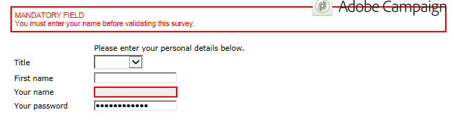

# Renderización de formularios{#form-rendering}

## Selección de la plantilla de renderización del formulario {#selecting-the-form-rendering-template}

La configuración de formulario permite seleccionar la plantilla utilizada para generar las páginas. Para acceder a ellas, haga clic en el botón **[!UICONTROL Settings]** de la barra de herramientas de detalles del formulario y seleccione la pestaña **[!UICONTROL Rendering]**. Existe una cantidad de plantillas (hojas de estilo) disponibles de forma predeterminada.

La sección inferior del editor permite ver una renderización de la plantilla seleccionada.

La funcionalidad de zoom permite editar la plantilla seleccionada.

Puede modificar o desactivar estas plantillas. Para ello, haga clic en el vínculo **[!UICONTROL Page layout...]** y personalice la información.

Se puede:

* Cambiar la imagen utilizada como logotipo y adaptar su tamaño,
* Especificar también la ruta para acceder a la imagen de previsualización cuando los usuarios seleccionen esta plantilla de renderización.

La pestaña **[!UICONTROL Headers/Footers]** permite cambiar la información que se muestra en los encabezados y pies de página de cada página de formulario que use esta plantilla.

Cada línea de las secciones **[!UICONTROL Page headers]** y **[!UICONTROL Page footers]** corresponde a una línea de la página HTML. Haga clic en **[!UICONTROL Add]** para crear una línea nueva.

Seleccione una línea existente y haga clic en el botón **[!UICONTROL Detail]** para personalizarlo.

Puede cambiar el contenido de la línea, añadir bordes y cambiar los atributos de fuente a través de las pestañas correspondientes. Haga clic en **[!UICONTROL OK]** para confirmar estos cambios.

Los campos **[!UICONTROL Position]** permiten definir la posición de los elementos en el encabezado y pie de página de la página.

>[!NOTE]
>
>Las plantillas de renderización se guardan en el nodo **[!UICONTROL Administration > Configuration > Form rendering]**.\
>Para obtener más información, consulte [Personalización de la renderización de formularios](#customizing-form-rendering).

## Personalización de la renderización de formularios {#customizing-form-rendering}

### Modificación del diseño de los elementos {#changing-the-layout-of-elements}

Se puede sobrecargar la hoja de estilo para cada elemento del formulario (campos de entrada, imágenes, botones de opción, etc.).

Para ello, utilice la pestaña **[!UICONTROL Advanced]**.

Permite definir las siguientes propiedades:

* **[!UICONTROL Label position]**: consulte [Definición de la posición de etiquetas](../../web/using/defining-web-forms-layout.md#defining-the-position-of-labels),
* **[!UICONTROL Label format]**: Ajuste de palabra o sin ajuste de palabra,
* **[!UICONTROL Number of cells]** : consulte [Colocación de los campos en la página](../../web/using/defining-web-forms-layout.md#positioning-the-fields-on-the-page),
* **[!UICONTROL Horizontal alignment]** (izquierda, derecha, centrado) y **[!UICONTROL Vertical alignment]** (alto, bajo, centrado),
* **[!UICONTROL Width]** de la zona: esto puede expresarse como porcentaje o en ems, puntos o píxeles (valor predeterminado),
* **[!UICONTROL Length]** máxima: número máximo de caracteres permitidos (para controles de tipo texto, número y contraseña),
* **[!UICONTROL Lines]**: número de líneas de una zona del tipo **[!UICONTROL Multi-line text]**.
* **[!UICONTROL Style inline]**: permite sobrecargar la hoja de estilos CSS con ajustes adicionales. Estos se separan con caracteres **;** como se muestra en el ejemplo siguiente:

   

### Definición de encabezados y pies de página {#defining-headers-and-footers}

Los campos se agrupan en una estructura de directorio cuya raíz tiene el mismo nombre que la página. Selecciónela para modificar el nombre.

El título de la ventana se debe introducir en la pestaña **[!UICONTROL Page]** de la ventana de propiedad del formulario. También puede agregar un contenido definido al encabezado y al pie de la página (esta información se muestra en todas las páginas). Este contenido se introduce en las secciones coincidentes de la pestaña **[!UICONTROL Texts]**, como se muestra a continuación:

### Adición de elementos al encabezado HTML {#adding-elements-to-html-header}

Puede introducir elementos adicionales para su inserción en el encabezado HTML de una página de formulario. Para ello, introduzca los elementos en la pestaña **[!UICONTROL Header]** de la página correspondiente.

Esto permite hacer referencia a un icono que se muestra en la barra de título de la página, por ejemplo.

## Definición de una configuración de control {#defining-control-settings}

Cuando el usuario rellena el formulario, se realiza una comprobación automática de ciertos campos según su formato o configuración. Esto permite hacer que ciertos campos sean obligatorios (consulte [Definición de campos obligatorios](#defining-mandatory-fields)) o comprobar el formato de los datos introducidos (consulte [Comprobación del formato de datos](#checking-data-format)). Las comprobaciones se realizan durante la aprobación de la página (haciendo clic en un vínculo o en un botón que habilita una transición de salida).

### Definición de campos obligatorios {#defining-mandatory-fields}

Para hacer que ciertos campos sean obligatorios, seleccione esta opción al crear el campo.

Si el usuario aprueba esta página sin haber introducido el campo, se muestra el siguiente mensaje:

Puede personalizar este mensaje haciendo clic en el vínculo **[!UICONTROL Personalize this message]**.

Si el usuario aprueba esta página sin haber introducido el campo, se muestra el siguiente mensaje:

### Comprobación del formato de datos {#checking-data-format}

Para las comprobaciones de formularios cuyos valores se almacenen en un campo existente de la base de datos, se aplican las reglas del campo de almacenamiento.

Para las comprobaciones de formularios cuyos valores se almacenan en una variable, las reglas de aprobación dependen del formato de la variable.

Por ejemplo, si crea una comprobación **[!UICONTROL Number]** para almacenar el número de clientes como se muestra a continuación:

El usuario debe introducir un número entero en el campo de formulario.

## Definición de la visualización condicional de campos {#defining-fields-conditional-display}

Se puede configurar la visualización de campos en la página para que se muestren en función de los valores que el usuario elija. Esto se puede aplicarse a un campo o a un grupo de campos (cuando se agrupan en un contenedor).

Para cada elemento de la página, la sección **[!UICONTROL Visibility]** permite definir las condiciones de visualización.

Las condiciones pueden afectar al valor de los campos o de las variables de la base de datos.

En la ventana de selección de campos, se puede elegir entre los siguientes datos:

* El directorio principal contiene los parámetros del contexto del formulario. Los parámetros predeterminados son el identificador (que coincide con el identificador encriptado del destinatario), idioma y origen.

   Para obtener más información, consulte [esta página](../../web/using/defining-web-forms-properties.md#form-url-parameters).

* El subdirectorio **[!UICONTROL Recipients]** contiene los campos de entrada insertados en el formulario y almacenados en la base de datos.

   Para obtener más información, consulte [Almacenamiento de datos en la base de datos](../../web/using/web-forms-answers.md#storing-data-in-the-database).

* El subdirectorio **[!UICONTROL Variables]** contiene las variables disponibles para este formulario. Para obtener más información, consulte [Almacenamiento de datos en una variable local](../../web/using/web-forms-answers.md#storing-data-in-a-local-variable).

Para obtener más información sobre este tema, consulte el caso de uso disponible aquí: [Mostrar diferentes opciones en función de los valores seleccionados](../../web/using/use-cases--web-forms.md#displaying-different-options-depending-on-the-selected-values).

También puede condicionar la visualización de las páginas del formulario con el objeto **[!UICONTROL Test]**. Para obtener más información, consulte [esta página](../../web/using/defining-web-forms-page-sequencing.md#conditional-page-display).

## Importación de elementos desde un formulario existente {#importing-elements-from-an-existing-form}

Se pueden importar campos o contenedores de otros formularios web. Esto permite crear una biblioteca de bloques reutilizables que se insertan en formularios, como el bloque de direcciones, el área de suscripción del boletín informativo, etc.

Para importar un elemento en un formulario, siga los siguientes pasos:

1. Edite la página en la que desea insertar uno o más elementos y, a continuación, haga clic en **[!UICONTROL Import an existing block]** en la barra de herramientas.

   

1. Seleccione el formulario web que contiene los campos que desea importar y seleccione los contenedores y campos que desea importar.

   

   >[!NOTE]
   >
   >El icono **[!UICONTROL Edit link]** a la derecha del nombre del formulario de origen permite ver el formulario web seleccionado.

1. Haga clic en **[!UICONTROL Ok]** para confirmar la inserción.

   
