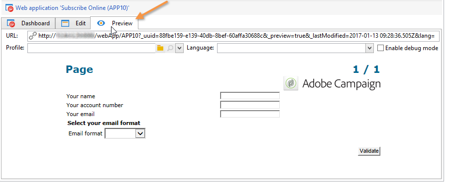
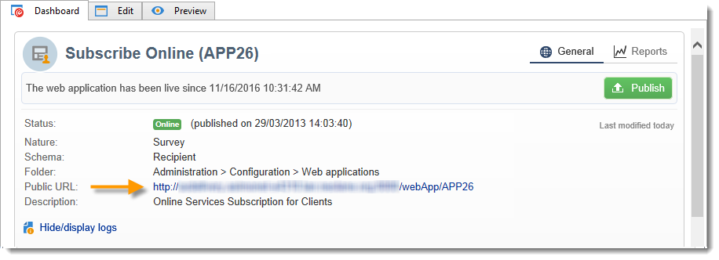

# Pasos clave para crear una encuesta{#getting-started-with-surveys}

A continuación se muestra una breve descripción general de los pasos principales para crear una encuesta sencilla mediante la siguiente plantilla:

Estos pasos son:

1. [Paso 1: Creación de una encuesta](#step-1---creating-a-survey),
1. [Paso 2: Selección de la plantilla](#step-2---selecting-the-template),
1. [Paso 3: Generación de una encuesta](#step-3---building-the-survey),
1. [Paso 4: Creación de una página de contenido](#step-4---creating-the-page-content),
1. [Paso 5: Almacenamiento de los datos de la encuesta](#step-5---storing-the-survey-data-),
1. [Paso 6: Publicación de las páginas](#step-6---publishing-the-pages),
1. [Paso 7: Compartir la encuesta en línea](#step-7---sharing-your-online-survey).

## Paso 1: Creación de una encuesta {#step-1---creating-a-survey}

Para crear una nueva encuesta, vaya a la pestaña **[!UICONTROL Campaigns]** o **[!UICONTROL Profiles and targets]** y haga clic en el menú **[!UICONTROL Web Applications]**. Haga clic en el botón **[!UICONTROL Create]** situado sobre la lista de formularios.

## Paso 2: Selección de la plantilla {#step-2---selecting-the-template}

Seleccione una plantilla de encuesta y después asígnele un nombre. Los usuarios finales no ven este nombre, pero permite identificar la encuesta dentro de Adobe Campaign. Haga clic en **[!UICONTROL Save]** y añada la encuesta a la lista de aplicaciones web.

## Paso 3: Generación de una encuesta {#step-3---building-the-survey}

Las encuestas se generan en un diagrama en el que se colocan los siguientes elementos: las páginas en las que se crea el contenido, los datos de precarga y los pasos para guardar, y las fases de prueba. También se pueden insertar secuencias de comandos y consultas.

Para crear el gráfico, haga clic en el formulario **[!UICONTROL Edit]** de la encuesta.

Una encuesta debe contener **al menos** los tres componentes siguientes: una página, un cuadro de almacenamiento y una página final.

* Para crear una página, seleccione el objeto **[!UICONTROL Page]** en la sección izquierda del editor y suéltelo en la sección central, como se muestra a continuación:

   

* A continuación, seleccione el objeto **[!UICONTROL Storage]** y colóquelo en la transición de salida de la página.
* Finalmente, seleccione el objeto **[!UICONTROL End]** y colóquelo al final de la transición de salida del cuadro de almacenamiento para obtener el siguiente diagrama:

   

## Paso 4: Creación de una página de contenido {#step-4---creating-the-page-content}

En el siguiente ejemplo se utiliza una página de tipo **[!UICONTROL Page (v5 compatibility)]**. Se accede a este tipo de página a través del menú avanzado de la pestaña **[!UICONTROL Edit]**.

* Adición de campos de entrada

   Para crear el contenido de la página, debe editarlo; para hacerlo, haga doble clic en el objeto **[!UICONTROL Page]**. Haga clic en el primer icono de la barra de herramientas para abrir el asistente de creación de campos. Para crear un campo de entrada para almacenar el nombre de usuario en el campo correspondiente del perfil del destinatario, seleccione **[!UICONTROL Edit a recipient]**.

   

   Haga clic en el botón **[!UICONTROL Next]** para seleccionar el campo dedicado al almacenamiento de datos en la base de datos. En este caso, el campo es “Apellidos”.

   

   Haga clic en **[!UICONTROL Finish]** para confirmar la creación del campo.

   De forma predeterminada, cuando la información se almacena en un campo que ya existe en la base de datos, el campo adopta el nombre del campo seleccionado, es decir, “Apellidos” en este caso. Puede modificar esta etiqueta como se muestra a continuación:

   

   Ahora cree un campo de entrada para el número de cuenta de usuario. Repita la operación y seleccione el campo “n.º de cuenta”.

   Aplique el mismo procedimiento para añadir un campo para que el usuario introduzca una dirección de correo electrónico.

* Para crear una pregunta, haga clic con el botón derecho en el último elemento del árbol y seleccione **[!UICONTROL Containers > Question]** o haga clic en el icono **[!UICONTROL Containers]** y seleccione **[!UICONTROL Question]**.

   

   Introduzca la etiqueta de la pregunta e inserte los campos de respuesta como una subcategoría de la pregunta. Para ello, se debe seleccionar el nodo vinculado a la pregunta al crear el campo de respuesta. Agregue un **[!UICONTROL drop-down listx]** mediante el icono **[!UICONTROL Selection controls]** o haciendo clic con el botón secundario, como se muestra a continuación:

   

   Seleccione un espacio de almacenamiento: seleccione un campo de enumeración para recuperar los valores automáticamente (en este caso, el formato de correo electrónico).

   

   En la pestaña **[!UICONTROL General]**, haga clic en el vínculo **[!UICONTROL Initialize the list of values from the database]**: la tabla de valores se introduce automáticamente.

   

   Haga clic en **[!UICONTROL OK]** para cerrar el editor y en **[!UICONTROL Save]** para guardar los cambios.

   >[!NOTE]
   >
   >Para cada campo o pregunta, puede adaptar el diseño de página según sus necesidades, gracias a las opciones de la pestaña **[!UICONTROL Advanced]**. El diseño de las pantallas de encuestas se explica en [esta sección](../../web/using/about-web-forms.md).

   En la pantalla de detalles, haga clic en la pestaña **[!UICONTROL Preview]** para ver la renderización de la encuesta que acaba de crear.

   

## Paso 5: Almacenamiento de los datos de la encuesta {#step-5---storing-the-survey-data-}

El cuadro de almacenamiento le permite guardar las respuestas del usuario en la base de datos. Debe seleccionar una clave de reconciliación para identificar los perfiles que ya se encuentran en la base de datos.

Para ello, edite el cuadro y seleccione el campo que desea utilizar como clave de reconciliación cuando se almacenen los datos.

En el ejemplo que se muestra a continuación, cuando se guarda (confirmación), si un perfil se guarda en la base de datos con el mismo número de cuenta que la entrada del formulario, el perfil se actualiza. Si el perfil no existe, se crea.

Haga clic en **[!UICONTROL OK]** para confirmar y luego haga clic en **[!UICONTROL Save]** para guardar la encuesta.

## Paso 6: Publicación de las páginas {#step-6---publishing-the-pages}

Para que los usuarios puedan acceder a las páginas HTML, la aplicación debe estar disponible. No debe estar en fase de edición, sino de producción. Para que una encuesta pase a producción, debe publicarla. Para ello:

* Haga clic en el botón **[!UICONTROL Publish]** situado encima del panel de encuesta.
* Haga clic en **[!UICONTROL Start]** para iniciar la publicación y cerrar el asistente.

   

   El estado de la encuesta cambia a **En línea**.

   

## Paso 7: uso compartido de la encuesta en línea {#step-7---sharing-your-online-survey}

Cuando esté en producción, se puede acceder a la encuesta en el servidor y se puede enviar. La dirección URL para acceder a la encuesta se muestra en el panel.

Para enviar la encuesta, puede enviar un mensaje a la población objetivo que contenga un vínculo de acceso o colocar la URL de acceso a la encuesta en una página web, por ejemplo.

Puede monitorizar las respuestas del usuario a través de informes y “logs”. Consulte [Seguimiento de respuestas](../../web/using/publish--track-and-use-collected-data.md#response-tracking).

>[!CAUTION]
>
>La dirección URL pública incluye el nombre interno de la encuesta. Cuando se modifica el nombre interno, la dirección URL se actualiza automáticamente: todos los vínculos a la encuesta deben actualizarse.
>
>Si las entregas que contenían el vínculo al formulario ya se han enviado, este vínculo deja de funcionar.
