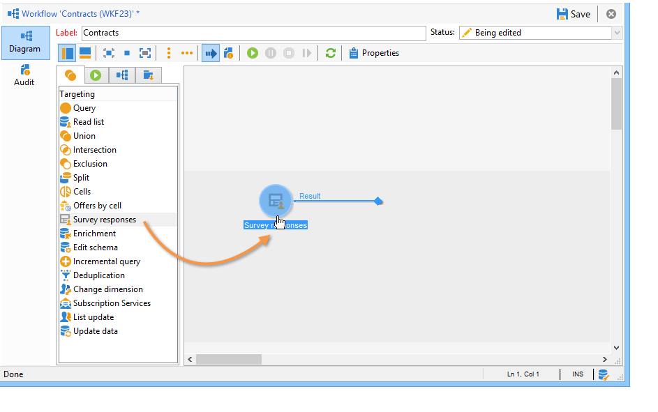

# Gestión de respuestas{#managing-answers}

## Almacenamiento de respuestas recopiladas {#storing-collected-answers}

Además de los modos de almacenamiento estándar comunes a todos los formularios web en Adobe Campaign (campo de base de datos y variable local), las encuestas permiten la ampliación dinámica del modelo de datos utilizando campos archivados.

>[!CAUTION]
>
>Esta opción está disponible solo para las aplicaciones web de tipo **Encuesta.** No se ofrece para otros tipos de formularios Web.

### Almacenamiento en un campo archivado {#storing-in-an-archived-field}

Es fácil ampliar la plantilla de datos mediante la adición de nuevos espacios de almacenamiento para guardar las respuestas que se proporcionan en las encuestas. Para ello, seleccione la opción **[!UICONTROL Store answers to a question]** al crear el campo de entrada. Haga clic en el vínculo **[!UICONTROL New field...]** y proporcione sus propiedades:


Introduzca la etiqueta y el nombre del campo y seleccione el tipo de campo: Texto, Booleano, Número entero o decimal, Fecha, etc.

El tipo de campo seleccionado implica un control de los datos cuando los usuarios introducen respuestas. Para los campos de **texto**, puede añadir una restricción (mayúsculas y minúsculas, formato) o un vínculo a una enumeración existente para forzar la selección.

Para añadir una restricción, selecciónela en la lista desplegable. Hay dos tipos de restricciones:

1. De caracteres

   La información introducida se puede almacenar en el campo en los siguientes formatos: todas mayúsculas, todas minúsculas o todas con inicial mayúscula. Esta restricción no requiere que el usuario introduzca los datos del formato seleccionado, pero el contenido introducido en el campo se convierte después de guardarlo.

1. Formato de datos

Si este campo se utiliza en una lista, los valores de la enumeración pueden recuperarse automáticamente en la tabla de valores con el vínculo **[!UICONTROL Initialize the list of values from the database]** situado sobre la lista de valores.

Por ejemplo, puede crear una lista desplegable para que el usuario seleccione su lengua materna. El campo archivado correspondiente se puede asociar a la enumeración **idioma** que contiene una lista de idiomas:


El icono **[!UICONTROL Edit link]** situado a la derecha del campo permite editar el contenido de esta enumeración:


En la pestaña **[!UICONTROL General]** del campo, el vínculo **[!UICONTROL Initialize the list of values from the database]** permite introducir automáticamente la lista de etiquetas ofrecidas.


**Ejemplo**: almacene los contratos de un destinatario en un campo

Para almacenar distintos tipos de contratos en un campo, cree un campo de entrada **[!UICONTROL Text]** y seleccione la opción **[!UICONTROL Store answers to a question]**.

Haga clic en el vínculo **[!UICONTROL New field...]** para introducir las propiedades del campo. Seleccione la opción **[!UICONTROL Multiple values]** para habilitar el almacenamiento de varios valores.


Cree campos de entrada para los demás contratos y almacene los datos en el mismo campo archivado.


Cuando los usuarios aprueban la encuesta, sus respuestas se almacenan en el campo **[!UICONTROL Contracts]**.

En nuestro ejemplo, para las siguientes respuestas:


El perfil del encuestado contiene los cuatro contratos especificados.

Se pueden ver en la pestaña **[!UICONTROL Answers]** de la encuesta mostrando las columnas relevantes.


También puede filtrar los destinatarios en función de las respuestas para mostrar solo los usuarios que le interesen. Para ello, cree un flujo de trabajo de objetivos y haga clic en la casilla **[!UICONTROL Survey responses]**.



Cree la consulta en función de los perfiles que desee recuperar. En el ejemplo siguiente, la consulta permite seleccionar perfiles con al menos dos contratos, incluido un contrato de tipo A.


Para cada formulario, las respuestas proporcionadas pueden utilizarse en campos o etiquetas. Utilice la siguiente sintaxis para el contenido almacenado en un campo archivado:

```
<%= ctx.webAppLogRcpData.name of the archived field %
```

>[!NOTE]
>
>Para otros tipos de campos, la sintaxis se detalla en [esta sección](../../platform/using/about-queries-in-campaign.md).

### Ajustes de almacenamiento {#storage-settings}

Es posible archivar las respuestas a las encuestas en formato XML. Esto permite guardar una copia sin procesar de las respuestas recopiladas, lo que puede resultar útil en caso de una estandarización excesiva de los datos en una lista desglosada (para obtener más información, consulte [Estandarización de datos](../../web/using/publish--track-and-use-collected-data.md#standardizing-data)).

>[!CAUTION]
>
>El archivado de las respuestas en sin procesar aumenta considerablemente el espacio de almacenamiento necesario. Utilice esta opción con cuidado.

Para ello:

* En la pestaña **[!UICONTROL Properties]**, edite las propiedades de la encuesta con el botón **[!UICONTROL Edit]**.
* Haga clic en el vínculo **[!UICONTROL Advanced parameters]** y marque la opción **[!UICONTROL Save a copy of raw answers]**.


Puede activarlo de manera predeterminada para todas las encuestas (esta opción se aplica cuando se publica la encuesta). Para ello, cree la opción **[!UICONTROL NmsWebApp_XmlBackup]** y asígnele un valor **[!UICONTROL 1]**, como se muestra a continuación:


## Gestión de la puntuación {#score-management}

Puede asignar una puntuación a las opciones ofrecidas en las páginas del formulario. Solo pueden vincularse con preguntas cerradas: casilla de verificación, valor de una lista desplegable, suscripción, etc.

>[!CAUTION]
>
>La gestión de puntuación solo está disponible para las **Encuestas**.


Las puntuaciones se acumulan y se guardan en el servidor cuando se confirma la página, es decir, cuando el usuario hace clic en el botón **[!UICONTROL Next]** o **[!UICONTROL Finish]**.

>[!NOTE]
>
>Puede utilizar valores positivos o negativos, enteros o no enteros.

Las puntuaciones se pueden utilizar en pruebas o secuencias de comandos.

>[!CAUTION]
>
>Las puntuaciones no se pueden utilizar en las condiciones de visibilidad de los campos que se encuentran en la misma página. Sin embargo, se pueden utilizar en páginas posteriores.

* Para utilizar puntuaciones en pruebas, utilice el campo **[!UICONTROL Score]** de la fórmula de cálculo de prueba, como se muestra a continuación:

   

* Puede utilizar la puntuación en una secuencia de comandos.

**Ejemplo**: calcule una puntuación y utilícela como una condición para la visualización de la página siguiente:

* En una encuesta, la siguiente página permite asignar distintas puntuaciones a los usuarios según el valor seleccionado en la lista desplegable:

   

* Puede combinar esta puntuación con un segundo valor, en función de la opción seleccionada:

   

* Cuando el usuario hace clic en el botón **[!UICONTROL Next]**, se añaden dos valores.

   

* Se pueden aplicar condiciones para que la página se muestre según la puntuación. Se configura de la siguiente manera:

   

   
