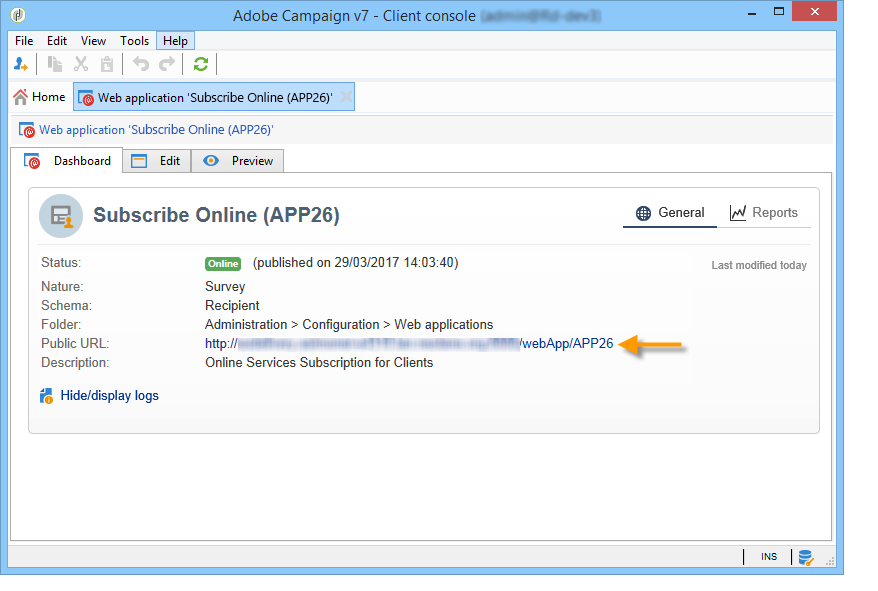
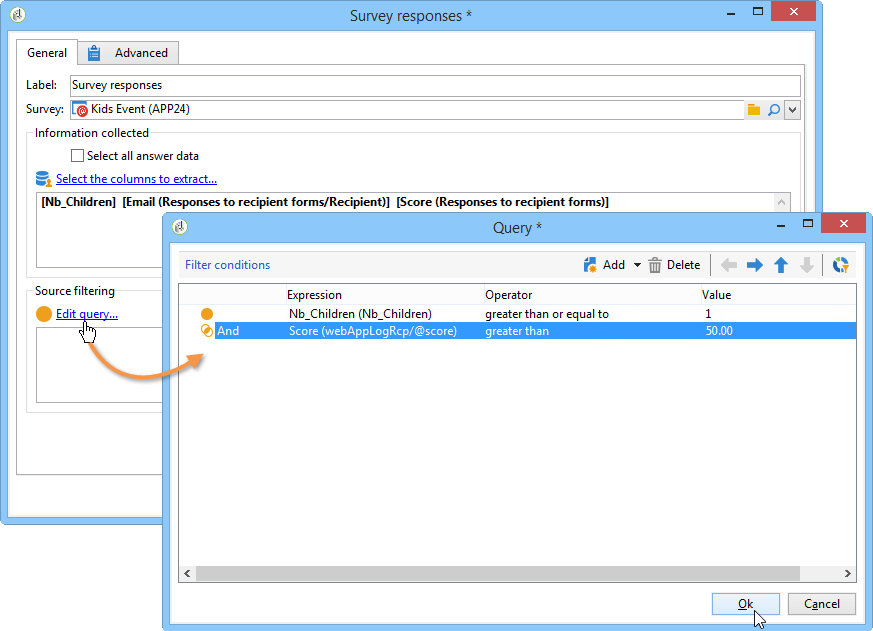

# Publicación, seguimiento y utilización de datos recopilados{#publish-track-and-use-collected-data}

Cuando se haya creado, configurado y publicado el formulario, puede publicarlo en línea, compartir el vínculo con los perfiles de la base de datos y realizar un seguimiento de las respuestas.

>[!NOTE]
>
>El ciclo de vida de una encuesta en Adobe Campaign, así como sus modos de publicación y envío, son similares a los de los formularios web: estos se detallan en [esta sección](../../web/using/about-web-forms.md).

## Panel de encuesta {#survey-dashboard}

Cada encuesta tiene su propio panel que le permite ver su estado, descripción, dirección URL pública y programación de disponibilidad. También le permite ver los informes disponibles. Para obtener más información, consulte [Informes sobre encuestas](#reports-on-surveys).

La URL pública de la encuesta se muestra en el panel:



## Seguimiento de respuestas {#response-tracking}

Puede realizar un seguimiento de las respuestas a la encuesta en los “logs” e informes.

### “Logs” de encuesta{#survey-logs}

Para cada encuesta enviada, puede realizar un seguimiento de las respuestas en la pestaña **[!UICONTROL Logs]**. Esta pestaña muestra la lista de usuarios que han completado la encuesta y su origen:


Haga doble clic en una línea para mostrar el formulario de la encuesta tal y como lo ha rellenado el encuestado. Puede examinar la encuesta y acceder a las respuestas en su totalidad. Se pueden exportar en un archivo externo. Para obtener más información, consulte [Exportación de respuestas](#exporting-answers).

El origen se indica en la dirección URL de la encuesta añadiendo los caracteres siguientes:

```
?origin=xxx
```

mientras se edita la encuesta, su URL contiene el parámetro **[!UICONTROL __uuid]**, que indica que se encuentra en una fase de prueba y que todavía no está en línea. Al acceder a la encuesta a través de esta dirección URL, los archivos creados no se tienen en cuenta en el seguimiento (informes). Se fuerza el valor  en el origen **[!UICONTROL Adobe Campaign]**.

Para obtener más información sobre los parámetros URL, consulte [esta página](../../web/using/defining-web-forms-properties.md#form-url-parameters).

### Informes sobre las encuestas {#reports-on-surveys}

La pestaña del panel le permite acceder a los informes sobre las encuestas. Haga clic en el nombre del informe para verlo.


La estructura de la encuesta se puede ver en el informe **[!UICONTROL Documentation]**.

Hay otros dos informes disponibles en la pestaña **[!UICONTROL Reports]** de los estudios: **[!UICONTROL General]** y **[!UICONTROL Breakdown of responses]**.

* General

   Este informe contiene información general sobre la encuesta: cómo cambia el número de respuestas con el tiempo y la distribución por origen e idioma.

   Ejemplo de informe general:

   

* Desglose de respuestas

   Este informe muestra el desglose de las respuestas por cada pregunta. Este desglose solo está disponible para las respuestas dadas a campos almacenados en contenedores de tipo **[!UICONTROL Question]**. Solo es válido para controles de selección (sin desglose en campos de texto, por ejemplo).

   

## Exportación de respuestas {#exporting-answers}

Las respuestas a una encuesta se pueden exportar a un archivo externo para su procesado posterior. Hay dos formas de hacerlo:

1. Exportación de datos del informe

   Para exportar los datos del informe, haga clic en el botón **[!UICONTROL Export]** y seleccione el formato de exportación.

   Para obtener más información sobre la exportación de los datos de un informe, consulte [esta sección](../../reporting/using/about-reports-creation-in-campaign.md).

1. Exportación de respuestas

   Para exportar respuestas, haga clic en la pestaña **[!UICONTROL Responses]** de la encuesta y haga clic con el botón derecho del ratón. Seleccione **[!UICONTROL Export...]**.

   

   A continuación, introduzca la información que desea exportar y el archivo de almacenamiento.

   Puede configurar el contenido y el formato del archivo de salida en el asistente de exportación.

   Esto le permite:

   * añadir columnas al archivo de salida y recuperar la información sobre el destinatario (que se almacena en la base de datos).
   * formatear los datos exportados,
   * seleccionar el formato de codificación para la información del archivo.

   Si la encuesta que desea exportar contiene varios campos **[!UICONTROL Multi-line text]** o **[!UICONTROL HTML text]**, debe exportarse en formato **[!UICONTROL XML]**. Para ello, seleccione este formato en la lista desplegable del campo **[!UICONTROL Output format]**, como se muestra a continuación:

   

   Haga clic en **[!UICONTROL Start]** para ejecutar la exportación.

   >[!NOTE]
   >
   >En [esta sección](../../platform/using/about-generic-imports-exports.md) se describen las exportaciones de datos y las fases de su configuración.

## Uso de los datos recopilados {#using-the-collected-data}

La información recopilada mediante encuestas en línea se puede recuperar dentro del marco de un flujo de trabajo de objetivos. Para ello, utilice la casilla **[!UICONTROL Survey responses]**.

En el siguiente ejemplo, queremos crear una oferta web especialmente para los cinco destinatarios con al menos dos hijos y con las puntuaciones más altas en la encuesta en línea. Las respuestas a esta encuesta son:


En el flujo de trabajo de objetivos, **[!UICONTROL Survey responses]** se configura de la siguiente manera:


Comience por seleccionar la encuesta que le interese y los datos que desea extraer en la sección central de la ventana. En este caso necesitamos extraer al menos la columna puntuación, ya que pretendemos usarla en el cuadro de división para recuperar las cinco puntuaciones más altas.

Especifique las condiciones de filtrado para las respuestas haciendo clic en el vínculo **[!UICONTROL Edit query...]**.



Inicio de un flujo de trabajo de objetivos La consulta recupera 8 destinatarios.


Haga clic con el botón derecho en la transición de salida del cuadro de recopilación para verlas.


A continuación, coloque un cuadro de división en el flujo de trabajo para recuperar los 5 destinatarios con la máxima puntuación.

Edite el cuadro de división para configurarlo:

* Para empezar, seleccione el esquema adecuado en la pestaña **[!UICONTROL General]** y, a continuación, configure el subconjunto:

   

* Vaya a la pestaña **[!UICONTROL Sub-sets]** y seleccione la opción **[!UICONTROL Limit the selected records]**, y después haga clic en el vínculo **[!UICONTROL Edit...]**.

   

* Seleccione la opción **[!UICONTROL Keep only the first records after sorting]** y seleccione ordenar columna. Marque la opción **[!UICONTROL Descending sort]**.

   

* Haga clic en el botón **[!UICONTROL Next]** y limite el número de registros a 5.

   

* Haga clic en **[!UICONTROL Finish]** y reinicie el flujo de trabajo para aprobar el destinatario.

## Estandarización de datos {#standardizing-data}

Se pueden configurar procesos de estandarización en Adobe Campaign para los datos recopilados mediante alias. Esto permite estandarizar los datos almacenados en la base de datos: para ello, defina alias en la lista desglosada que contengan la información relevante.

Para obtener más información, consulte [esta página](../../platform/using/managing-enumerations.md#about-enumerations).
