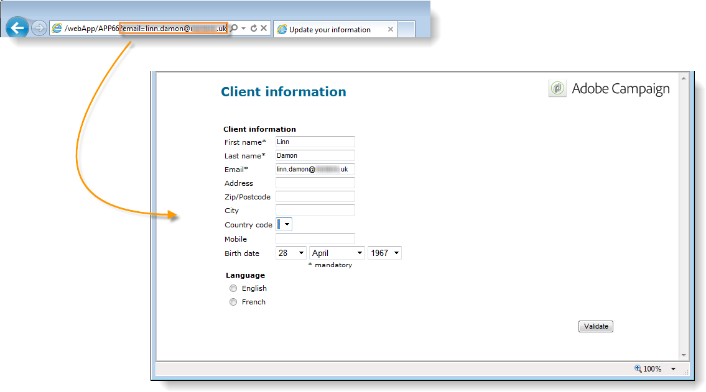
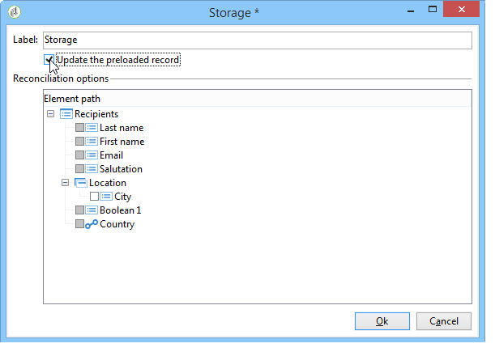

# Publicación de un formulario web{#publishing-a-web-form}

## Precarga de los datos del formulario {#pre-loading-the-form-data}

Si desea actualizar los perfiles almacenados en la base de datos mediante un formulario web, puede utilizar una casilla de precarga. La casilla de precarga le permite indicar cómo buscar el registro que se actualiza en la base de datos.

Puede utilizar los siguientes métodos de identificación:

* **[!UICONTROL Adobe Campaign Encryption]**

   Este método de encriptado utiliza el identificador (ID) cifrado de Adobe Campaign. Este método solamente se aplica a un objeto de Adobe Campaign y la ID encriptada solo se puede generar mediante la plataforma de Adobe Campaign.

   When using this method, you need to adapt the URL of the form to deliver to the email address by adding the **`<%=escapeUrl(recipient.cryptedId) %>`** parameter. Para obtener más información sobre esto, consulte [Envío de un formulario por correo electrónico](#delivering-a-form-via-email).

* **[!UICONTROL DES encryption]**

   

   Este método de encriptado utiliza un identificador (ID) proporcionado externamente, vinculado a una clave compartida por Adobe Campaign y el proveedor externo. The **[!UICONTROL Des key]** field lets you enter this encryption key.

* **[!UICONTROL List of fields]**

   Esta opción le permite elegir entre los campos del contexto actual del formulario, los que se utilizan para encontrar el perfil correspondiente en la base de datos.

   

   Fields can be added to the form properties via the **[!UICONTROL Parameters]** tab (refer to [Adding parameters](../../web/using/defining-web-forms-properties.md#adding-parameters)). Se ubican en la dirección URL del formulario o en las zonas de entrada.

   >[!CAUTION]
   >
   >Los datos de los campos seleccionados no están encriptados. It must not be provided in an encrypted form because Adobe Campaign will not be able to decrypt it if the **[!UICONTROL Field list]** option is selected.

   En el ejemplo siguiente, la precarga del perfil se basa en la dirección de correo electrónico.

   La dirección URL puede incluir la dirección de correo electrónico sin encriptar, en cuyo caso los usuarios tienen acceso directo a las páginas que les afectan.

   

   De no ser así, se les pide su contraseña.

   

   >[!CAUTION]
   >
   >Si se especifican varios campos en la lista, los datos de **TODOS LOS CAMPOS** deben coincidir con los datos almacenados en la base de datos para que se actualice el perfil. De lo contrario, se crea un perfil nuevo.
   > 
   >Esta función es especialmente útil para aplicaciones web, pero no se recomienda para formularios públicos. La opción de control de acceso seleccionada debe ser “Activar control de acceso”.

The **[!UICONTROL Skip preloading if identification is empty]** option must be selected if you do not wish to update profiles. En este caso, cada perfil introducido se añade a la base de datos después de la aprobación del formulario. Esta opción se utiliza, por ejemplo, cuando se publica el formulario en un sitio web.

The **[!UICONTROL Auto-load data referenced in the form]** option lets you automatically preload the data that matches input and merge fields in the form. Sin embargo, no se trata de los datos a los que se hace referencia en **[!UICONTROL Script]** y en las **[!UICONTROL Test]** actividades. If this option isn&#39;t selected, you need to define the fields using the **[!UICONTROL Load additional data]** option.

The **[!UICONTROL Load additional data]** option lets you add information which is not used in the pages of the form, but will nonetheless be preloaded.

Por ejemplo, se puede precargar el género del destinatario y dirigirlo automáticamente a la página adecuada a través de un cuadro de prueba.


## Administración del envío y seguimiento de formularios web {#managing-web-forms-delivery-and-tracking}

Una vez que se ha creado, configurado y publicado el formulario, se puede enviar y realizar un seguimiento de las respuestas del usuario.

### Ciclo de vida de un formulario {#life-cycle-of-a-form}

Existen tres fases en el ciclo de vida de un formulario:

1. **Formulario que se está editando**

   Esta es la fase inicial de diseño: Cuando se crea un nuevo formulario, se encuentra en fase de edición. Access to the form, for testing purposes only, then requires the parameter **[!UICONTROL __uuid]** to be used in its URL. This URL is accessible in the **[!UICONTROL Preview]** sub-tab. Consulte Parámetros [de URL del formulario](../../web/using/defining-web-forms-properties.md#form-url-parameters).

   >[!CAUTION]
   >
   >Siempre que se edite el formulario, su dirección URL de acceso es una dirección URL especial.

1. **Formulario en línea**

   Cuando se haya completado la fase de diseño, se puede enviar el formulario. En primer lugar, debe publicarse. For more on this, refer to [Publishing a form](#publishing-a-form).

   The form will be **[!UICONTROL Live]** until it expires.

   >[!CAUTION]
   >
   >To be delivered, the URL of the survey must not contain the **[!UICONTROL __uuid]** parameter.

1. **Formulario no disponible**

   Una vez cerrado el formulario, la fase de envío termina y el formulario deja de estar disponible: ya no es accesible para los usuarios.

   La fecha de caducidad se puede definir en la ventana de propiedades del formulario. Para obtener más información sobre esto, consulte [Hacer que un formulario esté disponible en línea](#making-a-form-available-online)

El estado de publicación de un formulario se muestra en la lista de formularios.


### Publicación de un formulario {#publishing-a-form}

Para cambiar el estado de un formulario, debe publicarlo. To do this, click the **[!UICONTROL Publication]** button above the list of Web forms and select the state in the drop-down box.


### Disponibilidad de un formulario en línea {#making-a-form-available-online}

Para que los usuarios puedan acceder, el formulario debe estar en producción e iniciado, es decir, dentro de su periodo de validez. The validity dates are entered via the **[!UICONTROL Properties]** link of the form.

* Use the fields in the **[!UICONTROL Project]** section to enter start and end dates for the form.

   

* Click the **[!UICONTROL Personalize the message displayed if the form is closed...]** link to define the error message to display if the user tries to access the form while it isn&#39;t valid.

   See [Accessibility of the form](../../web/using/defining-web-forms-properties.md#accessibility-of-the-form).

### Envío de un formulario por correo electrónico {#delivering-a-form-via-email}

When you deliver an invitation via email, you can use the **[!UICONTROL Adobe Campaign Encryption]** option for data reconciliation. Para ello, vaya al asistente de envío y adapte el enlace al formulario añadiendo el parámetro siguiente:

```
<a href="https://server/webApp/APP264?&id=<%=escapeUrl(recipient.cryptedId) %>">
```

En este caso, la clave de reconciliación para el almacenamiento de datos debe ser el identificador encriptado del destinatario. Para obtener más información sobre esto, consulte [Carga previa de los datos](#pre-loading-the-form-data)del formulario.

In this case, you need to check the **[!UICONTROL Update the preloaded record]** option in the record box. Para obtener más información sobre esto, consulte [Guardar respuestas](../../web/using/web-forms-answers.md#saving-web-forms-answers)de formularios Web.



### Respuestas al registro {#log-responses}

El seguimiento de respuestas puede activarse en una pestaña específica para controlar el impacto del formulario web. To do this, click the **[!UICONTROL Advanced parameters...]** link in the form properties window and select the **[!UICONTROL Log responses]** option.


The **[!UICONTROL Responses]** tab appears to let you view the identity of respondents.


Select a recipient and click the **[!UICONTROL Detail...]** button to view the responses provided.


Puede procesar los “logs” de respuesta proporcionados en las consultas, por ejemplo para dirigirse solo a los no encuestados para enviarles recordatorios o para ofrecer comunicaciones específicas únicamente a los encuestados.

>[!NOTE]
>
>Para obtener un seguimiento completo de las respuestas proporcionadas, exportar las respuestas y ver o crear informes específicos, utilice el módulo opcional de **Encuesta.** Para obtener más información, consulte [esta sección](../../web/using/about-surveys.md).

