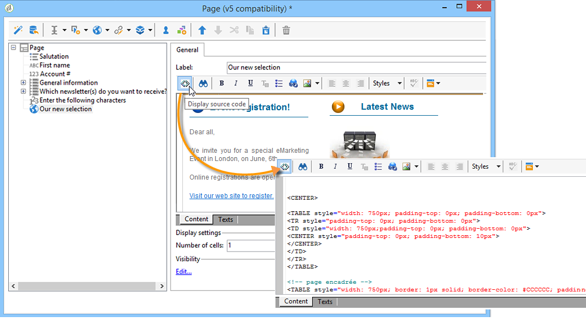
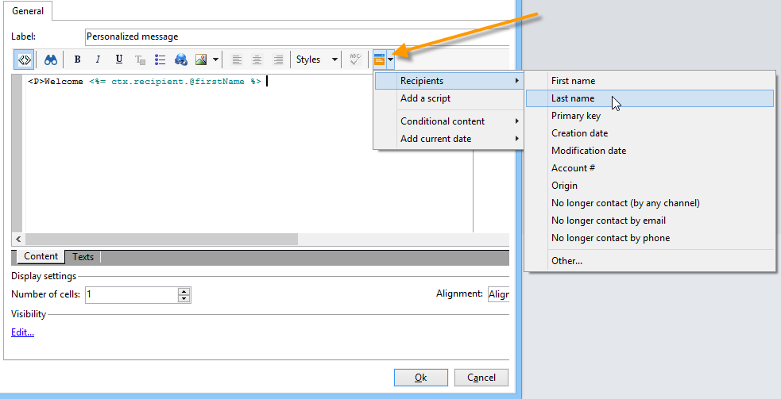
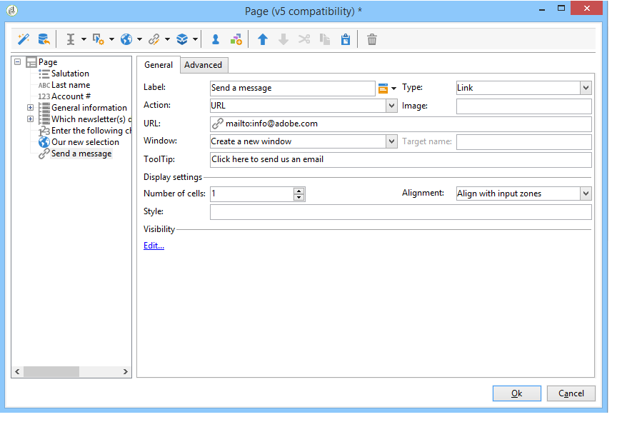
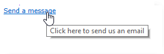
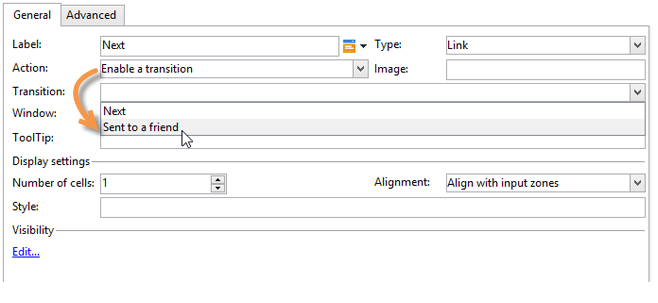
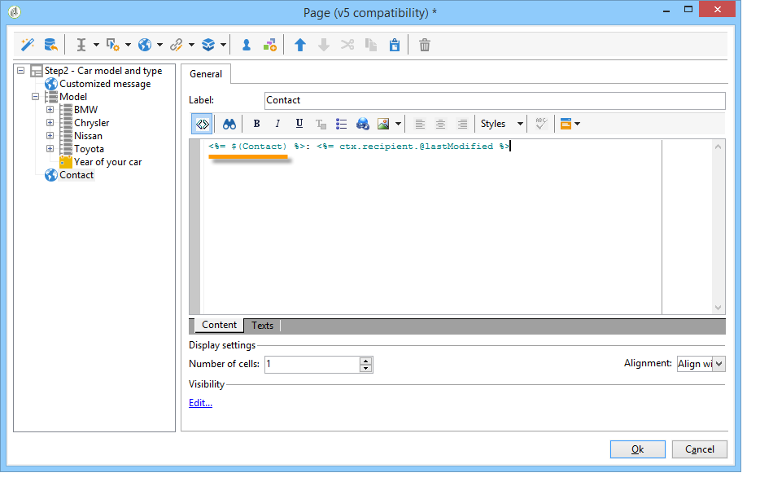
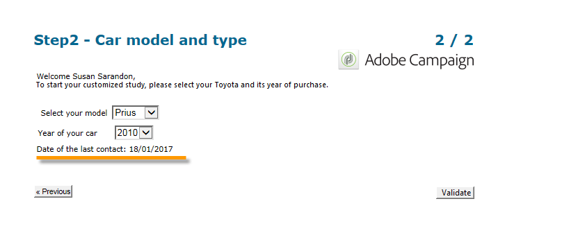
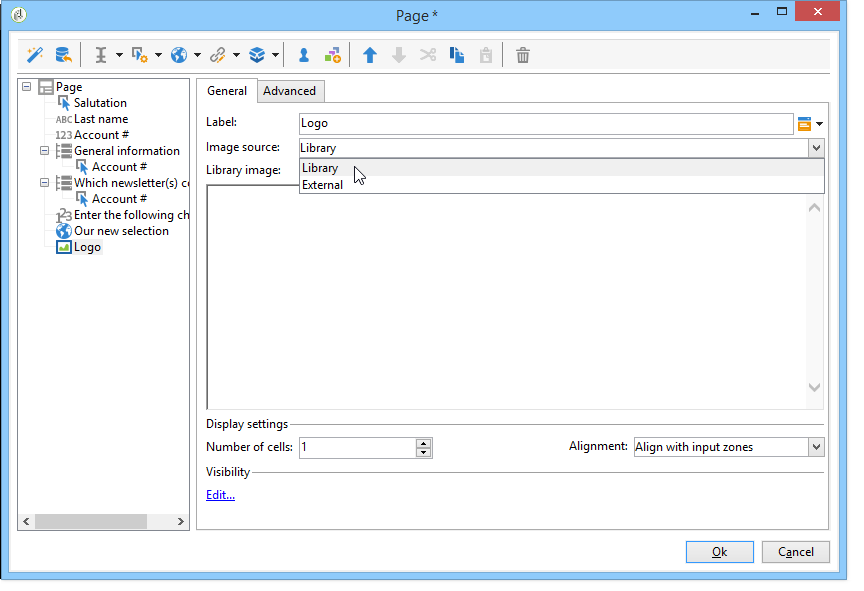

<?xml version="1.0" encoding="UTF-8"?>
<xliff xmlns="urn:oasis:names:tc:xliff:document:1.2" xmlns:okp="okapi-framework:xliff-extensions" xmlns:its="http://www.w3.org/2005/11/its" xmlns:itsxlf="http://www.w3.org/ns/its-xliff/" version="1.2" its:version="2.0">
<file original="help/web/using/static-elements-in-a-web-form.md.mdnouisc" source-language="en-US" target-language="en-XX" datatype="x-text/markdown">
<body>
<trans-unit id="tu15" xml:space="preserve">
<source xml:lang="en-US">https://experienceleague.adobe.com/en/tools/campaign-api</source>
<target xml:lang="en-XX">https://experienceleague.adobe.com/es/tools/campaign-api</target>
</trans-unit>
<trans-unit id="tu31" xml:space="preserve">
<source xml:lang="en-US">https://www.adobe.com</source>
<target xml:lang="en-XX">https://www.adobe.com</target>
</trans-unit>
<trans-unit id="tu1" restype="x-YAML_METADATA_HEADER_VALUE" xml:space="preserve">
<source xml:lang="en-US">Static elements in a web form</source>
<target xml:lang="en-XX">Elementos estáticos de un formulario web</target>
</trans-unit>
<trans-unit id="tu2" restype="x-YAML_METADATA_HEADER_VALUE" xml:space="preserve">
<source xml:lang="en-US">Static elements in a web form</source>
<target xml:lang="en-XX">Elementos estáticos de un formulario web</target>
</trans-unit>
<trans-unit id="tu3" xml:space="preserve">
<source xml:lang="en-US">Also applies to v8</source>
<target xml:lang="en-XX">También se aplica a v8</target>
</trans-unit>
<trans-unit id="tu4" xml:space="preserve">
<source xml:lang="en-US">Also applies to Campaign v8</source>
<target xml:lang="en-XX">También se aplica a Campaign v8</target>
</trans-unit>
<trans-unit id="tu5" xml:space="preserve">
<source xml:lang="en-US">Static elements in a web form</source>
<target xml:lang="en-XX">Elementos estáticos de un formulario web</target>
</trans-unit>
<trans-unit id="tu6" xml:space="preserve">
<source xml:lang="en-US">You can include elements with which the user has no interaction in the pages of the form; these are static elements such as images, HTML content, a horizontal bar, or a hypertext link. These elements are created via the first button in the toolbar, by selecting <ph id="1" ctype="x-STRONG_EMPHASIS">**[!UICONTROL Static elements]**</ph>.</source>
<target xml:lang="en-XX">Puede incluir elementos con los que el usuario no interactúa en las páginas del formulario; son elementos estáticos como imágenes, contenido HTML, barras horizontales o un vínculo de hipertexto. Estos elementos se crean mediante el primer botón de la barra de herramientas, seleccionando <ph id="1" ctype="x-STRONG_EMPHASIS">**[!UICONTROL Static elements]**</ph>.</target>
</trans-unit>
<trans-unit id="tu7" xml:space="preserve">
<source xml:lang="en-US"><ph id="1" ctype="x-IMAGE"></ph></source>
<target xml:lang="en-XX"><ph id="1" ctype="x-IMAGE"></ph></target>
</trans-unit>
<trans-unit id="tu8" xml:space="preserve">
<source xml:lang="en-US">The following types of field are available:</source>
<target xml:lang="en-XX">Están disponibles los siguientes tipos de campo:</target>
</trans-unit>
<trans-unit id="tu9" xml:space="preserve">
<source xml:lang="en-US">Value based on previously provided answers (in the context of the form) or on the database.</source>
<target xml:lang="en-XX">Valor basado en las respuestas proporcionadas anteriormente (en el contexto del formulario) o en la base de datos.</target>
</trans-unit>
<trans-unit id="tu10" xml:space="preserve">
<source xml:lang="en-US">Hypertext link, HTML, horizontal bar. See <ph id="1" ctype="x-LINK">[</ph>Inserting HTML content<ph id="2" ctype="x-LINK">](#inserting-html-content)</ph>.</source>
<target xml:lang="en-XX">Enlace de hipertexto, HTML, barra horizontal. Consulte <ph id="1" ctype="x-LINK">[</ph>Inserción de contenido HTML<ph id="2" ctype="x-LINK">](#inserting-html-content)</ph>.</target>
</trans-unit>
<trans-unit id="tu11" xml:space="preserve">
<source xml:lang="en-US">Image saved in the resource library or on a server accessible by users. See <ph id="1" ctype="x-LINK">[</ph>Inserting images<ph id="2" ctype="x-LINK">](#inserting-images)</ph>.</source>
<target xml:lang="en-XX">Imagen guardada en la biblioteca de recursos o en un servidor accesible a los usuarios. Consulte <ph id="1" ctype="x-LINK">[</ph>Inserción de imágenes<ph id="2" ctype="x-LINK">](#inserting-images)</ph>.</target>
</trans-unit>
<trans-unit id="tu12" xml:space="preserve">
<source xml:lang="en-US">Script executed on client side and/or server side. It must be written in JavaScript and be compatible with most browsers to ensure correct execution on the client side.</source>
<target xml:lang="en-XX">Secuencia de comandos ejecutada del lado del cliente o del servidor. Debe estar escrita en JavaScript y ser compatible con la mayoría de los navegadores para garantizar la ejecución correcta del lado del cliente.</target>
</trans-unit>
<trans-unit id="tu13" xml:space="preserve">
<source xml:lang="en-US"><ph id="1" ctype="x-regxph" equiv-text="&lbrack;!NOTE">[!NOTE]</ph></source>
<target xml:lang="en-XX"><ph id="1" ctype="x-regxph" equiv-text="&lbrack;!NOTE">[!NOTE]</ph></target>
</trans-unit>
<trans-unit id="tu14" xml:space="preserve">
<source xml:lang="en-US">On the server side, the script can use the functions defined in <ph id="1" ctype="x-LINK">&lbrack;</ph>Campaign JSAPI documentation<ph id="2" ctype="x-LINK">[#$tu15]</ph>.</source>
<target xml:lang="en-XX">En el lado del servidor, la secuencia de comandos puede utilizar las funciones definidas en <ph id="1" ctype="x-LINK">&lbrack;</ph>Campaign JSAPI documentation<ph id="2" ctype="x-LINK">[#$tu15]</ph>.</target>
</trans-unit>
<trans-unit id="tu16" xml:space="preserve">
<source xml:lang="en-US">Insert HTML content</source>
<target xml:lang="en-XX">Inserción de contenido HTML</target>
</trans-unit>
<trans-unit id="tu17" xml:space="preserve">
<source xml:lang="en-US">You can include HTML content in a form page: hypertext links, images, formatted paragraphs, videos, etc.</source>
<target xml:lang="en-XX">Se puede incluir contenido HTML en una página de formulario: vínculos de hipertexto, imágenes, párrafos con formato, vídeos, etc.</target>
</trans-unit>
<trans-unit id="tu18" xml:space="preserve">
<source xml:lang="en-US">The HTML editor lets you enter the content to insert into the form page. To open the editor, click <ph id="1" ctype="x-STRONG_EMPHASIS">**[!UICONTROL Static elements]**</ph> > <ph id="4" ctype="x-STRONG_EMPHASIS">**[!UICONTROL HTML]**</ph> .</source>
<target xml:lang="en-XX">El editor HTML permite introducir el contenido que se inserta en la página del formulario. Para abrir el editor, haga clic en <ph id="1" ctype="x-STRONG_EMPHASIS">**[!UICONTROL Static elements]**</ph> > <ph id="4" ctype="x-STRONG_EMPHASIS">**[!UICONTROL HTML]**</ph> .</target>
</trans-unit>
<trans-unit id="tu19" xml:space="preserve">
<source xml:lang="en-US">You can enter and format your content directly or display the source code window to paste in some external content. To switch to "source code" mode, click the first icon in the toolbar:</source>
<target xml:lang="en-XX">Puede introducir y dar formato al contenido directamente o mostrar la ventana del código fuente para pegar algún contenido externo. Para cambiar al modo “Código fuente”, haga clic en el primer icono de la barra de herramientas:</target>
</trans-unit>
<trans-unit id="tu20" xml:space="preserve">
<source xml:lang="en-US"><ph id="1" ctype="x-IMAGE"></ph></source>
<target xml:lang="en-XX"><ph id="1" ctype="x-IMAGE"></ph></target>
</trans-unit>
<trans-unit id="tu21" xml:space="preserve">
<source xml:lang="en-US">To insert a database field, use the personalization button.</source>
<target xml:lang="en-XX">Para insertar un campo de base de datos, utilice el botón de personalización.</target>
</trans-unit>
<trans-unit id="tu22" xml:space="preserve">
<source xml:lang="en-US"><ph id="1" ctype="x-IMAGE"></ph></source>
<target xml:lang="en-XX"><ph id="1" ctype="x-IMAGE"></ph></target>
</trans-unit>
<trans-unit id="tu23" xml:space="preserve">
<source xml:lang="en-US"><ph id="1" ctype="x-regxph" equiv-text="&lbrack;!NOTE">[!NOTE]</ph></source>
<target xml:lang="en-XX"><ph id="1" ctype="x-regxph" equiv-text="&lbrack;!NOTE">[!NOTE]</ph></target>
</trans-unit>
<trans-unit id="tu24" xml:space="preserve">
<source xml:lang="en-US">The strings entered in the HTML editor are only translated if they are defined in the <ph id="1" ctype="x-STRONG_EMPHASIS">**[!UICONTROL Texts]**</ph> sub-tab. Otherwise they will not be collected. For more on this, refer to <ph id="4" ctype="x-LINK">[</ph>Translating a web form<ph id="5" ctype="x-LINK">](translating-a-web-form.md)</ph>.</source>
<target xml:lang="en-XX">Las cadenas introducidas en el editor HTML solo se traducen si se definen en la subpestaña <ph id="1" ctype="x-STRONG_EMPHASIS">**[!UICONTROL Texts]**</ph>. De lo contrario, no se recopilan. Para obtener más información, consulte <ph id="4" ctype="x-LINK">[</ph>Traducción de un formulario web<ph id="5" ctype="x-LINK">](translating-a-web-form.md)</ph>.</target>
</trans-unit>
<trans-unit id="tu25" xml:space="preserve">
<source xml:lang="en-US">Insert a link</source>
<target xml:lang="en-XX">Inserción de un vínculo</target>
</trans-unit>
<trans-unit id="tu26" xml:space="preserve">
<source xml:lang="en-US">Fill in the fields in the editing window as shown in the following example:</source>
<target xml:lang="en-XX">Rellene los campos en la ventana de edición como se muestra en el siguiente ejemplo:</target>
</trans-unit>
<trans-unit id="tu27" xml:space="preserve">
<source xml:lang="en-US">To add a hypertext link, go to <ph id="1" ctype="x-STRONG_EMPHASIS">**[!UICONTROL Static elements]**</ph> > <ph id="4" ctype="x-STRONG_EMPHASIS">**[!UICONTROL Link]**</ph>.</source>
<target xml:lang="en-XX">Para añadir un vínculo de hipertexto, vaya a <ph id="1" ctype="x-STRONG_EMPHASIS">**[!UICONTROL Static elements]**</ph> > <ph id="4" ctype="x-STRONG_EMPHASIS">**[!UICONTROL Link]**</ph>.</target>
</trans-unit>
<trans-unit id="tu28" xml:space="preserve">
<source xml:lang="en-US"><ph id="1" ctype="x-IMAGE"></ph></source>
<target xml:lang="en-XX"><ph id="1" ctype="x-IMAGE"></ph></target>
</trans-unit>
<trans-unit id="tu29" xml:space="preserve">
<source xml:lang="en-US">The <ph id="1" ctype="x-STRONG_EMPHASIS">**[!UICONTROL Label]**</ph> is the content of the hypertext link as it will be displayed on the form page.</source>
<target xml:lang="en-XX"><ph id="1" ctype="x-STRONG_EMPHASIS">**[!UICONTROL Label]**</ph> es el contenido del vínculo de hipertexto tal como muestra en la página del formulario.</target>
</trans-unit>
<trans-unit id="tu30" xml:space="preserve">
<source xml:lang="en-US">The <ph id="1" ctype="x-STRONG_EMPHASIS">**[!UICONTROL URL]**</ph> is the desired address, e.g.: <ph id="4" ctype="x-LINK">&lbrack;</ph>https://www.adobe.com<ph id="5" ctype="x-LINK">[#$tu31]</ph> for a website, or <ph id="6" ctype="x-LINK">[</ph>info@adobe.com<ph id="7" ctype="x-LINK">](mailto:info@adobe.com)</ph> to send a message.</source>
<target xml:lang="en-XX"><ph id="1" ctype="x-STRONG_EMPHASIS">**[!UICONTROL URL]**</ph> es la dirección deseada, por ejemplo: <ph id="4" ctype="x-LINK">&lbrack;</ph>https://www.adobe.com<ph id="5" ctype="x-LINK">[#$tu31]</ph> para un sitio web o <ph id="6" ctype="x-LINK">[</ph>info@adobe.com<ph id="7" ctype="x-LINK">](mailto:info@adobe.com)</ph> para enviar un mensaje.</target>
</trans-unit>
<trans-unit id="tu32" xml:space="preserve">
<source xml:lang="en-US">The <ph id="1" ctype="x-STRONG_EMPHASIS">**[!UICONTROL Window]**</ph> field lets you select the display mode for the link in the case of a site. You can decide to open the link in a new window, the current window, or another window.</source>
<target xml:lang="en-XX">El campo <ph id="1" ctype="x-STRONG_EMPHASIS">**[!UICONTROL Window]**</ph> permite seleccionar el modo de visualización para el vínculo en el caso de un sitio. Puede decidir abrir el vínculo en una nueva ventana, en la ventana actual o en otra ventana.</target>
</trans-unit>
<trans-unit id="tu33" xml:space="preserve">
<source xml:lang="en-US">You can add a ToolTip, as shown below:</source>
<target xml:lang="en-XX">Puede añadir una descripción emergente sobre herramientas, como se muestra a continuación:</target>
</trans-unit>
<trans-unit id="tu34" xml:space="preserve">
<source xml:lang="en-US"><ph id="1" ctype="x-IMAGE"></ph></source>
<target xml:lang="en-XX"><ph id="1" ctype="x-IMAGE"></ph></target>
</trans-unit>
<trans-unit id="tu35" xml:space="preserve">
<source xml:lang="en-US">You can choose to display the link as a button or an image. To do this, select the type of display in the <ph id="1" ctype="x-STRONG_EMPHASIS">**[!UICONTROL Type]**</ph> field.</source>
<target xml:lang="en-XX">Puede elegir mostrar el vínculo como botón o como imagen. Para ello, seleccione el tipo de visualización en el campo <ph id="1" ctype="x-STRONG_EMPHASIS">**[!UICONTROL Type]**</ph>.</target>
</trans-unit>
<trans-unit id="tu36" xml:space="preserve">
<source xml:lang="en-US">Types of links</source>
<target xml:lang="en-XX">Tipos de vínculos</target>
</trans-unit>
<trans-unit id="tu37" xml:space="preserve">
<source xml:lang="en-US">By default, the links are associated with a URL-type action, so that a link destination address can be entered in the URL field.</source>
<target xml:lang="en-XX">De forma predeterminada, los vínculos están asociados a una acción de tipo URL, por lo que se puede introducir una dirección de destino de vínculo en el campo URL.</target>
</trans-unit>
<trans-unit id="tu38" xml:space="preserve">
<source xml:lang="en-US"><ph id="1" ctype="x-IMAGE"></ph></source>
<target xml:lang="en-XX"><ph id="1" ctype="x-IMAGE"></ph></target>
</trans-unit>
<trans-unit id="tu39" xml:space="preserve">
<source xml:lang="en-US">You can define other actions for the link, so that the user can click the link to do the following:</source>
<target xml:lang="en-XX">Puede definir otras acciones para el vínculo, de modo que el usuario pueda hacer clic en él para realizar las siguientes acciones:</target>
</trans-unit>
<trans-unit id="tu40" xml:space="preserve">
<source xml:lang="en-US">Refresh the page</source>
<target xml:lang="en-XX">Actualizar la página</target>
</trans-unit>
<trans-unit id="tu41" xml:space="preserve">
<source xml:lang="en-US">To do this, select the <ph id="1" ctype="x-STRONG_EMPHASIS">**[!UICONTROL Refresh page]**</ph> option in the drop-down box of the <ph id="4" ctype="x-STRONG_EMPHASIS">**[!UICONTROL Action]**</ph> field.</source>
<target xml:lang="en-XX">Para ello, seleccione la opción <ph id="1" ctype="x-STRONG_EMPHASIS">**[!UICONTROL Refresh page]**</ph> en el cuadro desplegable del campo <ph id="4" ctype="x-STRONG_EMPHASIS">**[!UICONTROL Action]**</ph>.</target>
</trans-unit>
<trans-unit id="tu42" xml:space="preserve">
<source xml:lang="en-US"><ph id="1" ctype="x-IMAGE"></ph></source>
<target xml:lang="en-XX"><ph id="1" ctype="x-IMAGE"></ph></target>
</trans-unit>
<trans-unit id="tu43" xml:space="preserve">
<source xml:lang="en-US">Display the next/previous page</source>
<target xml:lang="en-XX">Mostrar la página siguiente/anterior</target>
</trans-unit>
<trans-unit id="tu44" xml:space="preserve">
<source xml:lang="en-US">To do this, select the <ph id="1" ctype="x-STRONG_EMPHASIS">**[!UICONTROL Next page]**</ph> or <ph id="4" ctype="x-STRONG_EMPHASIS">**[!UICONTROL Previous page]**</ph> option in the drop-down box of the <ph id="7" ctype="x-STRONG_EMPHASIS">**[!UICONTROL Action]**</ph> field.</source>
<target xml:lang="en-XX">Para ello, seleccione la opción <ph id="1" ctype="x-STRONG_EMPHASIS">**[!UICONTROL Next page]**</ph> o <ph id="4" ctype="x-STRONG_EMPHASIS">**[!UICONTROL Previous page]**</ph> en el cuadro desplegable del campo <ph id="7" ctype="x-STRONG_EMPHASIS">**[!UICONTROL Action]**</ph>.</target>
</trans-unit>
<trans-unit id="tu45" xml:space="preserve">
<source xml:lang="en-US"><ph id="1" ctype="x-IMAGE"></ph></source>
<target xml:lang="en-XX"><ph id="1" ctype="x-IMAGE"></ph></target>
</trans-unit>
<trans-unit id="tu46" xml:space="preserve">
<source xml:lang="en-US">You can hide the <ph id="1" ctype="x-STRONG_EMPHASIS">**[!UICONTROL Next]**</ph> and/or <ph id="4" ctype="x-STRONG_EMPHASIS">**[!UICONTROL Back]**</ph> buttons if they are to be replaced by a link. Refer to this <ph id="7" ctype="x-LINK">[</ph>page<ph id="8" ctype="x-LINK">](defining-web-forms-page-sequencing.md)</ph>.</source>
<target xml:lang="en-XX">Puede ocultar los botones <ph id="1" ctype="x-STRONG_EMPHASIS">**[!UICONTROL Next]**</ph> o <ph id="4" ctype="x-STRONG_EMPHASIS">**[!UICONTROL Back]**</ph> si desea reemplazarlos por un vínculo. Consulte <ph id="7" ctype="x-LINK">[</ph>esta página<ph id="8" ctype="x-LINK">](defining-web-forms-page-sequencing.md)</ph>.</target>
</trans-unit>
<trans-unit id="tu47" xml:space="preserve">
<source xml:lang="en-US">The link will replace the <ph id="1" ctype="x-STRONG_EMPHASIS">**[!UICONTROL Next]**</ph> button used by default.</source>
<target xml:lang="en-XX">El vínculo reemplaza el botón <ph id="1" ctype="x-STRONG_EMPHASIS">**[!UICONTROL Next]**</ph> utilizado de forma predeterminada.</target>
</trans-unit>
<trans-unit id="tu48" xml:space="preserve">
<source xml:lang="en-US"><ph id="1" ctype="x-IMAGE"></ph></source>
<target xml:lang="en-XX"><ph id="1" ctype="x-IMAGE"></ph></target>
</trans-unit>
<trans-unit id="tu49" xml:space="preserve">
<source xml:lang="en-US">Display another page</source>
<target xml:lang="en-XX">Mostrar otra página</target>
</trans-unit>
<trans-unit id="tu50" xml:space="preserve">
<source xml:lang="en-US">The <ph id="1" ctype="x-STRONG_EMPHASIS">**[!UICONTROL Enable a transition]**</ph> option lets you display a specific page associated with the outgoing transition selected in the <ph id="4" ctype="x-STRONG_EMPHASIS">**[!UICONTROL Transition]**</ph> field.</source>
<target xml:lang="en-XX">La opción <ph id="1" ctype="x-STRONG_EMPHASIS">**[!UICONTROL Enable a transition]**</ph> permite mostrar una página específica asociada con la transición saliente seleccionada en el campo <ph id="4" ctype="x-STRONG_EMPHASIS">**[!UICONTROL Transition]**</ph>.</target>
</trans-unit>
<trans-unit id="tu51" xml:space="preserve">
<source xml:lang="en-US"><ph id="1" ctype="x-IMAGE"></ph></source>
<target xml:lang="en-XX"><ph id="1" ctype="x-IMAGE"></ph></target>
</trans-unit>
<trans-unit id="tu52" xml:space="preserve">
<source xml:lang="en-US">By default, a page has only one output transition. To create new transitions, select the page and then click the <ph id="1" ctype="x-STRONG_EMPHASIS">**[!UICONTROL Add]**</ph> button in the <ph id="4" ctype="x-STRONG_EMPHASIS">**[!UICONTROL Output transitions]**</ph> section, as shown below:</source>
<target xml:lang="en-XX">De forma predeterminada, una página solo tiene una transición de salida. Para crear nuevas transiciones, seleccione la página y, en la sección <ph id="1" ctype="x-STRONG_EMPHASIS">**[!UICONTROL Add]**</ph>, haga clic en <ph id="4" ctype="x-STRONG_EMPHASIS">**[!UICONTROL Output transitions]**</ph> como se muestra a continuación:</target>
</trans-unit>
<trans-unit id="tu53" xml:space="preserve">
<source xml:lang="en-US"><ph id="1" ctype="x-IMAGE"></ph></source>
<target xml:lang="en-XX"><ph id="1" ctype="x-IMAGE"></ph></target>
</trans-unit>
<trans-unit id="tu54" xml:space="preserve">
<source xml:lang="en-US">In the diagram, this addition will look like this:</source>
<target xml:lang="en-XX">En el diagrama, esta adición tiene el siguiente aspecto:</target>
</trans-unit>
<trans-unit id="tu55" xml:space="preserve">
<source xml:lang="en-US"><ph id="1" ctype="x-IMAGE"></ph></source>
<target xml:lang="en-XX"><ph id="1" ctype="x-IMAGE"></ph></target>
</trans-unit>
<trans-unit id="tu56" xml:space="preserve">
<source xml:lang="en-US"><ph id="1" ctype="x-regxph" equiv-text="&lbrack;!NOTE">[!NOTE]</ph></source>
<target xml:lang="en-XX"><ph id="1" ctype="x-regxph" equiv-text="&lbrack;!NOTE">[!NOTE]</ph></target>
</trans-unit>
<trans-unit id="tu57" xml:space="preserve">
<source xml:lang="en-US">For more on page sequencing in a Web form, refer to <ph id="1" ctype="x-LINK">[</ph>Defining web forms page sequencing<ph id="2" ctype="x-LINK">](defining-web-forms-page-sequencing.md)</ph>.</source>
<target xml:lang="en-XX">Para obtener más información sobre la secuenciación de páginas en un formulario web, consulte <ph id="1" ctype="x-LINK">[</ph>Definición de secuenciación de páginas de formularios web<ph id="2" ctype="x-LINK">](defining-web-forms-page-sequencing.md)</ph>.</target>
</trans-unit>
<trans-unit id="tu58" xml:space="preserve">
<source xml:lang="en-US">Personalize HTML content</source>
<target xml:lang="en-XX">Personalización del contenido HTML</target>
</trans-unit>
<trans-unit id="tu59" xml:space="preserve">
<source xml:lang="en-US">You can personalize the HTML content of a form page with data recorded in a previous page. For example, you can create a car insurance Web form whose first page lets you provide contact information and the brand of the car.</source>
<target xml:lang="en-XX">Puede personalizar el contenido HTML de una página de formulario con datos registrados en una página anterior. Por ejemplo, puede crear un formulario web de seguro para el coche cuya primera página le permita proporcionar información de contacto y la marca del coche.</target>
</trans-unit>
<trans-unit id="tu60" xml:space="preserve">
<source xml:lang="en-US"><ph id="1" ctype="x-IMAGE"></ph></source>
<target xml:lang="en-XX"><ph id="1" ctype="x-IMAGE"></ph></target>
</trans-unit>
<trans-unit id="tu61" xml:space="preserve">
<source xml:lang="en-US">Use personalization fields to re-inject the user name and selected brand into the next page. The syntax to use depends on the information storage mode. For more on this, refer to <ph id="1" ctype="x-LINK">[</ph>Using collected information<ph id="2" ctype="x-LINK">](web-forms-answers.md#using-collected-information)</ph>.</source>
<target xml:lang="en-XX">Utilice los campos de personalización para volver a introducir el nombre de usuario y la marca seleccionada en la página siguiente. La sintaxis que se utiliza depende del modo de almacenamiento de la información. Para obtener más información, consulte <ph id="1" ctype="x-LINK">[</ph>Uso de información recopilada<ph id="2" ctype="x-LINK">](web-forms-answers.md#using-collected-information)</ph>.</target>
</trans-unit>
<trans-unit id="tu62" xml:space="preserve">
<source xml:lang="en-US"><ph id="1" ctype="x-regxph" equiv-text="&lbrack;!NOTE">[!NOTE]</ph></source>
<target xml:lang="en-XX"><ph id="1" ctype="x-regxph" equiv-text="&lbrack;!NOTE">[!NOTE]</ph></target>
</trans-unit>
<trans-unit id="tu63" xml:space="preserve">
<source xml:lang="en-US">For security reasons, the value entered in the <ph id="1" ctype="x-STRONG_EMPHASIS">**`&lt;%=`**</ph> formula is replaced with escaped characters.</source>
<target xml:lang="en-XX">Por motivos de seguridad, el valor ingresado en la fórmula <ph id="1" ctype="x-STRONG_EMPHASIS">**`&lt;%=`**</ph> se reemplaza por caracteres de escape.</target>
</trans-unit>
<trans-unit id="tu64" xml:space="preserve">
<source xml:lang="en-US">In our example, the first and last name of the recipient are stored in a field of the database, while the brand of their car is stored in a variable. The syntax of the message personalized on page 2 will be as follows:</source>
<target xml:lang="en-XX">En nuestro ejemplo, el nombre y los apellidos del destinatario se almacenan en un campo de la base de datos, mientras que la marca de su coche se almacena en una variable. La sintaxis del mensaje personalizado en la página 2 es la siguiente:</target>
</trans-unit>
<trans-unit id="tu65" xml:space="preserve">
<source xml:lang="en-US"><ph id="1" ctype="x-IMAGE"></ph></source>
<target xml:lang="en-XX"><ph id="1" ctype="x-IMAGE"></ph></target>
</trans-unit>
<trans-unit id="tu66" xml:space="preserve">
<source xml:lang="en-US">This produces the following result:</source>
<target xml:lang="en-XX">Esto produce el resultado siguiente:</target>
</trans-unit>
<trans-unit id="tu67" xml:space="preserve">
<source xml:lang="en-US"><ph id="1" ctype="x-IMAGE"></ph></source>
<target xml:lang="en-XX"><ph id="1" ctype="x-IMAGE"></ph></target>
</trans-unit>
<trans-unit id="tu68" xml:space="preserve">
<source xml:lang="en-US">Use text variables</source>
<target xml:lang="en-XX">Uso de las variables de texto</target>
</trans-unit>
<trans-unit id="tu69" xml:space="preserve">
<source xml:lang="en-US">The <ph id="1" ctype="x-STRONG_EMPHASIS">**[!UICONTROL Text]**</ph> tab lets you create variable fields which can be used in the HTML between the &lt;%= and %> characters with the following syntax: <ph id="4" ctype="x-STRONG_EMPHASIS">**</ph>$(IDENTIFIER)<ph id="5" ctype="x-STRONG_EMPHASIS">**</ph>.</source>
<target xml:lang="en-XX">La pestaña <ph id="1" ctype="x-STRONG_EMPHASIS">**[!UICONTROL Text]**</ph> permite crear campos variables que pueden utilizarse en el HTML entre los caracteres &lt;%= y %> con la siguiente sintaxis: <ph id="4" ctype="x-STRONG_EMPHASIS">**</ph>$(IDENTIFIER)<ph id="5" ctype="x-STRONG_EMPHASIS">**</ph>.</target>
</trans-unit>
<trans-unit id="tu70" xml:space="preserve">
<source xml:lang="en-US">Use this method to easily have your strings localized. See <ph id="1" ctype="x-LINK">[</ph>Translating a web form<ph id="2" ctype="x-LINK">](translating-a-web-form.md)</ph></source>
<target xml:lang="en-XX">Utilice este método para localizar fácilmente sus cadenas. Consulte <ph id="1" ctype="x-LINK">[</ph>Traducción de un formulario web<ph id="2" ctype="x-LINK">](translating-a-web-form.md)</ph>.</target>
</trans-unit>
<trans-unit id="tu71" xml:space="preserve">
<source xml:lang="en-US">For example, you can create a <ph id="1" ctype="x-STRONG_EMPHASIS">**</ph>Contact<ph id="2" ctype="x-STRONG_EMPHASIS">**</ph> field that will enable you to display the "Date of last contact:" string to the HTML content. To do this, follow the steps below:</source>
<target xml:lang="en-XX">Por ejemplo, puede crear un campo de <ph id="1" ctype="x-STRONG_EMPHASIS">**</ph>Contacto<ph id="2" ctype="x-STRONG_EMPHASIS">**</ph> que le permita mostrar la cadena “Fecha del último contacto:” al contenido HTML. Para realizar esto, siga los pasos a continuación:</target>
</trans-unit>
<trans-unit id="tu72" xml:space="preserve">
<source xml:lang="en-US">Click on the <ph id="1" ctype="x-STRONG_EMPHASIS">**[!UICONTROL Text]**</ph> tab of the HTML text.</source>
<target xml:lang="en-XX">Haga clic en la pestaña <ph id="1" ctype="x-STRONG_EMPHASIS">**[!UICONTROL Text]**</ph> del texto HTML..</target>
</trans-unit>
<trans-unit id="tu73" xml:space="preserve">
<source xml:lang="en-US">Click the <ph id="1" ctype="x-STRONG_EMPHASIS">**[!UICONTROL Add]**</ph> icon.</source>
<target xml:lang="en-XX">Haga clic en el icono <ph id="1" ctype="x-STRONG_EMPHASIS">**[!UICONTROL Add]**</ph>.</target>
</trans-unit>
<trans-unit id="tu74" xml:space="preserve">
<source xml:lang="en-US">In the <ph id="1" ctype="x-STRONG_EMPHASIS">**[!UICONTROL Identifier]**</ph> column, enter the name of the variable</source>
<target xml:lang="en-XX">En la columna <ph id="1" ctype="x-STRONG_EMPHASIS">**[!UICONTROL Identifier]**</ph>, introduzca el nombre de la variable.</target>
</trans-unit>
<trans-unit id="tu75" xml:space="preserve">
<source xml:lang="en-US">In the <ph id="1" ctype="x-STRONG_EMPHASIS">**[!UICONTROL Text]**</ph> column, enter the default value.</source>
<target xml:lang="en-XX">En la columna <ph id="1" ctype="x-STRONG_EMPHASIS">**[!UICONTROL Text]**</ph>, introduzca el valor predeterminado.</target>
</trans-unit>
<trans-unit id="tu76" xml:space="preserve">
<source xml:lang="en-US"><ph id="1" ctype="x-IMAGE"></ph></source>
<target xml:lang="en-XX"><ph id="1" ctype="x-IMAGE"></ph></target>
</trans-unit>
<trans-unit id="tu77" xml:space="preserve">
<source xml:lang="en-US">In the HTML content, insert this text variable via the <ph id="1" ctype="x-STRONG_EMPHASIS">**</ph>&lt;%= $(Contact) %><ph id="2" ctype="x-STRONG_EMPHASIS">**</ph> syntax.</source>
<target xml:lang="en-XX">En el contenido HTML, inserte esta variable de texto mediante la sintaxis <ph id="1" ctype="x-STRONG_EMPHASIS">**</ph>&lt;%= $(Contact) %><ph id="2" ctype="x-STRONG_EMPHASIS">**</ph>.</target>
</trans-unit>
<trans-unit id="tu78" xml:space="preserve">
<source xml:lang="en-US"><ph id="1" ctype="x-IMAGE"></ph></source>
<target xml:lang="en-XX"><ph id="1" ctype="x-IMAGE"></ph></target>
</trans-unit>
<trans-unit id="tu79" xml:space="preserve">
<source xml:lang="en-US"><ph id="1" ctype="x-regxph" equiv-text="&lbrack;!CAUTION">[!CAUTION]</ph></source>
<target xml:lang="en-XX"><ph id="1" ctype="x-regxph" equiv-text="&lbrack;!CAUTION">[!CAUTION]</ph></target>
</trans-unit>
<trans-unit id="tu80" xml:space="preserve">
<source xml:lang="en-US">If you enter these characters in the HTML editor, the <ph id="1" ctype="x-STRONG_EMPHASIS">**</ph>&lt;<ph id="2" ctype="x-STRONG_EMPHASIS">**</ph> and <ph id="3" ctype="x-STRONG_EMPHASIS">**</ph>><ph id="4" ctype="x-STRONG_EMPHASIS">**</ph> fields will be replaced with their escaped characters. In this case, you need to correct the source code by clicking the <ph id="5" ctype="x-STRONG_EMPHASIS">**[!UICONTROL Display source code]**</ph> icon of the HTML text editor.</source>
<target xml:lang="en-XX">Si ingresa estos caracteres en el editor HTML, los campos <ph id="1" ctype="x-STRONG_EMPHASIS">**</ph>&lt;<ph id="2" ctype="x-STRONG_EMPHASIS">**</ph> y <ph id="3" ctype="x-STRONG_EMPHASIS">**</ph>><ph id="4" ctype="x-STRONG_EMPHASIS">**</ph> se sustituyen con los caracteres de escape. En este caso, debe corregir el código fuente haciendo clic en el icono <ph id="5" ctype="x-STRONG_EMPHASIS">**[!UICONTROL Display source code]**</ph> del editor de texto HTML.</target>
</trans-unit>
<trans-unit id="tu81" xml:space="preserve">
<source xml:lang="en-US">Open the <ph id="1" ctype="x-STRONG_EMPHASIS">**[!UICONTROL Preview]**</ph> label of the form to view the value entered in the HTML:</source>
<target xml:lang="en-XX">Abra la etiqueta <ph id="1" ctype="x-STRONG_EMPHASIS">**[!UICONTROL Preview]**</ph> del formulario para ver el valor introducido en el HTML:</target>
</trans-unit>
<trans-unit id="tu82" xml:space="preserve">
<source xml:lang="en-US"><ph id="1" ctype="x-IMAGE"></ph></source>
<target xml:lang="en-XX"><ph id="1" ctype="x-IMAGE"></ph></target>
</trans-unit>
<trans-unit id="tu83" xml:space="preserve">
<source xml:lang="en-US">This operating mode lets you define the text of Web forms only once, and manage translations using the integrated translation tool. For more on this, refer to <ph id="1" ctype="x-LINK">[</ph>Translating a web form<ph id="2" ctype="x-LINK">](translating-a-web-form.md)</ph>.</source>
<target xml:lang="en-XX">Este modo operativo permite definir el texto de los formularios web solo una vez y administrar las traducciones mediante la herramienta de traducción integrada. Para obtener más información, consulte <ph id="1" ctype="x-LINK">[</ph>Traducción de un formulario web<ph id="2" ctype="x-LINK">](translating-a-web-form.md)</ph>.</target>
</trans-unit>
<trans-unit id="tu84" xml:space="preserve">
<source xml:lang="en-US">Insert images</source>
<target xml:lang="en-XX">Inserción de imágenes</target>
</trans-unit>
<trans-unit id="tu85" xml:space="preserve">
<source xml:lang="en-US">For images to be included in forms, they must be saved on a server that is accessible from outside.</source>
<target xml:lang="en-XX">Para que las imágenes se incluyan en los formularios, deben guardarse en un servidor que sea accesible de forma externa.</target>
</trans-unit>
<trans-unit id="tu86" xml:space="preserve">
<source xml:lang="en-US">Select the <ph id="1" ctype="x-STRONG_EMPHASIS">**[!UICONTROL Static elements]**</ph> > <ph id="4" ctype="x-STRONG_EMPHASIS">**[!UICONTROL Image]**</ph> menu.</source>
<target xml:lang="en-XX">Seleccione el menú <ph id="1" ctype="x-STRONG_EMPHASIS">**[!UICONTROL Static elements]**</ph> > <ph id="4" ctype="x-STRONG_EMPHASIS">**[!UICONTROL Image]**</ph> .</target>
</trans-unit>
<trans-unit id="tu87" xml:space="preserve">
<source xml:lang="en-US">Select the source of the image to be inserted: it can come from the public resource library or be stored on an external server accessible from outside.</source>
<target xml:lang="en-XX">Seleccione el origen de la imagen que desea insertar: puede proceder de la biblioteca de recursos públicos o estar almacenada en un servidor externo accesible externamente.</target>
</trans-unit>
<trans-unit id="tu88" xml:space="preserve">
<source xml:lang="en-US"><ph id="1" ctype="x-IMAGE"></ph></source>
<target xml:lang="en-XX"><ph id="1" ctype="x-IMAGE"></ph></target>
</trans-unit>
<trans-unit id="tu89" xml:space="preserve">
<source xml:lang="en-US">If this is an image from the library, select it in the combo-box of the field; if it is located in an external file, enter the access path. The label will be displayed by passing the cursor over the image (coincides with an ALT field in HTML), or when the image isn't displayed.</source>
<target xml:lang="en-XX">Si es una imagen de la biblioteca, selecciónela en el cuadro combinado del campo; si se encuentra en un archivo externo, introduzca la ruta de acceso. La etiqueta se muestra pasando el cursor sobre la imagen (coincide con un campo ALT en HTML) o cuando no se muestra la imagen.</target>
</trans-unit>
<trans-unit id="tu90" xml:space="preserve">
<source xml:lang="en-US">The image can be viewed in the central section of the editor.</source>
<target xml:lang="en-XX">La imagen se puede ver en la sección central del editor.</target>
</trans-unit>
</body>
</file>
</xliff>