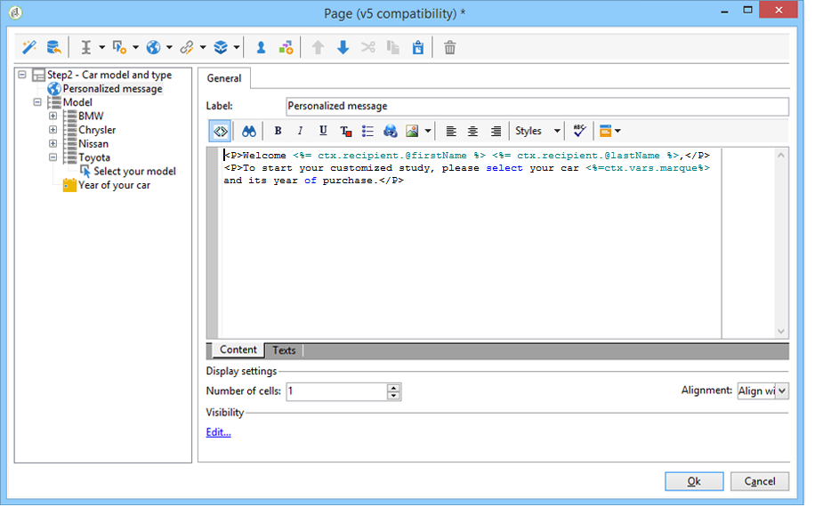

# Elementos estáticos de un formulario web{#static-elements-in-a-web-form}


Puede incluir elementos con los que el usuario no interactúa en las páginas del formulario; son elementos estáticos como imágenes, contenido HTML, barras horizontales o un vínculo de hipertexto. Estos elementos se crean mediante el primer botón de la barra de herramientas, seleccionando **[!UICONTROL Static elements]**.


Están disponibles los siguientes tipos de campo:

* Valor basado en las respuestas proporcionadas anteriormente (en el contexto del formulario) o en la base de datos.
* Enlace de hipertexto, HTML, barra horizontal. Consulte [Inserción de contenido HTML](#inserting-html-content).
* Imagen guardada en la biblioteca de recursos o en un servidor accesible a los usuarios. Consulte [Inserción de imágenes](#inserting-images).
* Secuencia de comandos ejecutada del lado del cliente o del servidor. Debe estar escrita en JavaScript y ser compatible con la mayoría de los navegadores para garantizar la ejecución correcta del lado del cliente.

  >[!NOTE]
  >
  >En el lado del servidor, la secuencia de comandos puede utilizar las funciones definidas en [Campaign JSAPI documentation](https://experienceleague.adobe.com/developer/campaign-api/api/index.html?lang=es).

## Inserción de contenido HTML {#inserting-html-content}

Se puede incluir contenido HTML en una página de formulario: vínculos de hipertexto, imágenes, párrafos con formato, vídeos, etc.

El editor HTML permite introducir el contenido que se inserta en la página del formulario. Para abrir el editor, haga clic en **[!UICONTROL Static elements]** > **[!UICONTROL HTML]** .

Puede introducir y dar formato al contenido directamente o mostrar la ventana del código fuente para pegar algún contenido externo. Para cambiar al modo “Código fuente”, haga clic en el primer icono de la barra de herramientas:


Para insertar un campo de base de datos, utilice el botón de personalización.


>[!NOTE]
>
>Las cadenas introducidas en el editor HTML solo se traducen si se definen en la subpestaña **[!UICONTROL Texts]**. De lo contrario, no se recopilan. Para obtener más información, consulte [Traducción de un formulario web](translating-a-web-form.md).

### Inserción de un vínculo {#inserting-a-link}

Rellene los campos en la ventana de edición como se muestra en el siguiente ejemplo:

Para añadir un vínculo de hipertexto, vaya a **[!UICONTROL Static elements]** > **[!UICONTROL Link]**.


* **[!UICONTROL Label]** es el contenido del vínculo de hipertexto tal como muestra en la página del formulario.
* **[!UICONTROL URL]** es la dirección deseada, por ejemplo: [https://www.adobe.com](https://www.adobe.com) para un sitio web o [info@adobe.com](mailto:info@adobe.com) para enviar un mensaje.
* El campo **[!UICONTROL Window]** permite seleccionar el modo de visualización para el vínculo en el caso de un sitio. Puede decidir abrir el vínculo en una nueva ventana, en la ventana actual o en otra ventana.
* Puede añadir una descripción emergente sobre herramientas, como se muestra a continuación:

  

* Puede elegir mostrar el vínculo como botón o como imagen. Para ello, seleccione el tipo de visualización en el campo **[!UICONTROL Type]**.

### Tipos de vínculos {#types-of-links}

De forma predeterminada, los vínculos están asociados a una acción de tipo URL, por lo que se puede introducir una dirección de destino de vínculo en el campo URL.


Puede definir otras acciones para el vínculo, de modo que el usuario pueda hacer clic en él para realizar las siguientes acciones:

* Actualizar la página

  Para ello, seleccione la opción **[!UICONTROL Refresh page]** en el cuadro desplegable del campo **[!UICONTROL Action]**.

  

* Mostrar la página siguiente/anterior

  Para ello, seleccione la opción **[!UICONTROL Next page]** o **[!UICONTROL Previous page]** en el cuadro desplegable del campo **[!UICONTROL Action]**.

  

  Puede ocultar los botones **[!UICONTROL Next]** o **[!UICONTROL Back]** si desea reemplazarlos por un vínculo. Consulte [esta página](defining-web-forms-page-sequencing.md).

  El vínculo reemplaza el botón **[!UICONTROL Next]** utilizado de forma predeterminada.

  

* Mostrar otra página

  La opción **[!UICONTROL Enable a transition]** permite mostrar una página específica asociada con la transición saliente seleccionada en el campo **[!UICONTROL Transition]**.

  

  De forma predeterminada, una página solo tiene una transición de salida. Para crear nuevas transiciones, seleccione la página y, en la sección **[!UICONTROL Add]**, haga clic en **[!UICONTROL Output transitions]** como se muestra a continuación:

  

  En el diagrama, esta adición tiene el siguiente aspecto:

  

  >[!NOTE]
  >
  >Para obtener más información sobre la secuenciación de páginas en un formulario web, consulte [Definición de secuenciación de páginas de formularios web](defining-web-forms-page-sequencing.md).

### Personalización del contenido HTML {#personalizing-html-content}

Puede personalizar el contenido HTML de una página de formulario con datos registrados en una página anterior. Por ejemplo, puede crear un formulario web de seguro para el coche cuya primera página le permita proporcionar información de contacto y la marca del coche.


Utilice los campos de personalización para volver a introducir el nombre de usuario y la marca seleccionada en la página siguiente. La sintaxis que se utiliza depende del modo de almacenamiento de la información. Para obtener más información, consulte [Uso de información recopilada](web-forms-answers.md#using-collected-information).

>[!NOTE]
>
>Por motivos de seguridad, el valor ingresado en la fórmula **`<%=`** se reemplaza por caracteres de escape.

En nuestro ejemplo, el nombre y los apellidos del destinatario se almacenan en un campo de la base de datos, mientras que la marca de su coche se almacena en una variable. La sintaxis del mensaje personalizado en la página 2 es la siguiente:



```
<P>Welcome <%= ctx.recipient.@firstName %> <%= ctx.recipient.@lastName %>,</P>
<P>To start your customized study, please select your car <%=ctx.vars.marque%> and its year of purchase.</P>
```

Esto produce el resultado siguiente:


### Uso de las variables de texto {#using-text-variables}

La pestaña **[!UICONTROL Text]** permite crear campos variables que pueden utilizarse en el HTML entre los caracteres &lt;%= y %> con la siguiente sintaxis: **$(IDENTIFIER)**.

Utilice este método para localizar fácilmente sus cadenas. Consulte [Traducción de un formulario web](translating-a-web-form.md).

Por ejemplo, puede crear un campo de **Contacto** que le permita mostrar la cadena “Fecha del último contacto:” al contenido HTML. Para realizar esto, siga los pasos a continuación:

1. Haga clic en la pestaña **[!UICONTROL Text]** del texto HTML..
1. Haga clic en el icono **[!UICONTROL Add]**.
1. En la columna **[!UICONTROL Identifier]**, introduzca el nombre de la variable.
1. En la columna **[!UICONTROL Text]**, introduzca el valor predeterminado.

   

1. En el contenido HTML, inserte esta variable de texto mediante la sintaxis **&lt;%= $(Contact) %>**.

   

   >[!CAUTION]
   >
   >Si ingresa estos caracteres en el editor HTML, los campos **&lt;** y **>** se sustituyen con los caracteres de escape. En este caso, debe corregir el código fuente haciendo clic en el icono **[!UICONTROL Display source code]** del editor de texto HTML.

1. Abra la etiqueta **[!UICONTROL Preview]** del formulario para ver el valor introducido en el HTML:

   

Este modo operativo permite definir el texto de los formularios web solo una vez y administrar las traducciones mediante la herramienta de traducción integrada. Para obtener más información, consulte [Traducción de un formulario web](translating-a-web-form.md).

## Inserción de imágenes {#inserting-images}

Para que las imágenes se incluyan en los formularios, deben guardarse en un servidor que sea accesible de forma externa.

Seleccione el menú **[!UICONTROL Static elements]** > **[!UICONTROL Image]** .

Seleccione el origen de la imagen que desea insertar: puede proceder de la biblioteca de recursos públicos o estar almacenada en un servidor externo accesible externamente.


Si es una imagen de la biblioteca, selecciónela en el cuadro combinado del campo; si se encuentra en un archivo externo, introduzca la ruta de acceso. La etiqueta se muestra pasando el cursor sobre la imagen (coincide con un campo ALT en HTML) o cuando no se muestra la imagen.

La imagen se puede ver en la sección central del editor.
