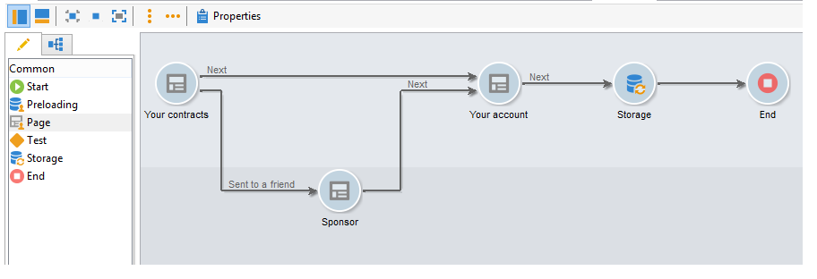
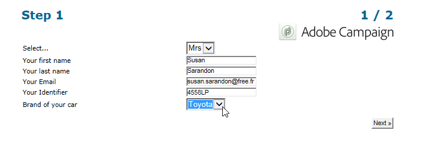

# Elementos estáticos de un formulario web{#static-elements-in-a-web-form}

Puede incluir elementos con los que el usuario no interactúa en las páginas del formulario; son elementos estáticos como imágenes, contenido HTML, barras horizontales o un enlace de hipertexto. These elements are created via the first button in the toolbar, by clicking the **[!UICONTROL Add static element]** menu.


Están disponibles los siguientes tipos de campo:

* Valor basado en las respuestas proporcionadas anteriormente (en el contexto del formulario) o en la base de datos.
* Enlace de hipertexto, HTML, barra horizontal. Consulte [Inserción de contenido](#inserting-html-content)HTML.
* Imagen guardada en la biblioteca de recursos o en un servidor accesible a los usuarios. Consulte [Inserción de imágenes](#inserting-images).
* Secuencia de comandos ejecutada del lado del cliente o del servidor. Debe estar escrita en JavaScript y ser compatible con la mayoría de los navegadores para garantizar la ejecución correcta del lado del cliente.

   >[!NOTE]
   >
   >En el lado del servidor, la secuencia de comandos puede utilizar las funciones definidas en [Campaign JSAPI documentation](http://docs.campaign.adobe.com/doc/AC/en/jsapi/index.html).

## Inserción de contenido HTML {#inserting-html-content}

Se puede incluir contenido HTML en una página de formulario: enlaces de hipertexto, imágenes, párrafos con formato, objetos de vídeo o Flash, etc.

El editor HTML permite introducir el contenido que se inserta en la página del formulario. Para abrir el editor, vaya a **[!UICONTROL Static elements>HTML]** .

Puede introducir y dar formato al contenido directamente o mostrar la ventana del código fuente para pegar algún contenido externo. Para cambiar al modo “Código fuente”, haga clic en el primer icono de la barra de herramientas:


Para insertar un campo de base de datos, utilice el botón de personalización.


>[!NOTE]
>
>The strings entered in the HTML editor are only translated if they are defined in the **[!UICONTROL Texts]** sub-tab. De lo contrario, no se recopilan. Para obtener más información sobre esto, consulte [Traducir un formulario](../../web/using/translating-a-web-form.md)web.

### Inserción de un enlace {#inserting-a-link}

Rellene los campos en la ventana de edición como se muestra en el siguiente ejemplo:

To add a hypertext link, go to **[!UICONTROL Static elements>Link]**.


* The **[!UICONTROL Label]** is the content of the hypertext link as it will be displayed on the form page.
* La dirección **[!UICONTROL URL]** es la dirección deseada, por ejemplo: [https://www.adobe.com](https://www.adobe.com) para un sitio web o [mailto:info@adobe.com](mailto:info@adobe.com) para enviar un mensaje.
* The **[!UICONTROL Window]** field lets you select the display mode for the link in the case of a site. Puede decidir abrir el enlace en una nueva ventana, en la ventana actual o en otra ventana.
* Puede añadir una descripción emergente sobre herramientas, como se muestra a continuación:

   

* Puede elegir mostrar el enlace como botón o como imagen. To do this, select the type of display in the **[!UICONTROL Type]** field.

### Tipos de enlaces {#types-of-links}

De forma predeterminada, los enlaces están asociados a una acción de tipo URL, por lo que se puede introducir una dirección de destino de enlace en el campo URL.


Puede definir otras acciones para el enlace, de modo que el usuario pueda hacer clic en él para realizar las siguientes acciones:

* Actualizar la página

   To do this, select the **[!UICONTROL Refresh page]** option in the drop-down box of the **[!UICONTROL Action]** field.

   

* Mostrar la página siguiente/anterior

   Para ello, seleccione la **[!UICONTROL Next page]** opción o **[!UICONTROL Previous page]** en el cuadro desplegable del **[!UICONTROL Action]** campo.

   

   You can hide the **[!UICONTROL Next]** and/or **[!UICONTROL Back]** buttons if they are to be replaced by a link. Consulte [esta página](../../web/using/defining-web-forms-page-sequencing.md).

   The link will replace the **[!UICONTROL Next]** button used by default.

   

* Mostrar otra página

   The **[!UICONTROL Enable a transition]** option lets you display a specific page associated with the outgoing transition selected in the **[!UICONTROL Transition]** field.

   

   De forma predeterminada, una página solo tiene una transición de salida. To create new transitions, select the page and then click the **[!UICONTROL Add]** button in the **[!UICONTROL Output transitions]** section, as shown below:

   

   En el diagrama, esta adición tiene el siguiente aspecto:

   

   >[!NOTE]
   >
   >Para obtener más información sobre la secuenciación de páginas en un formulario Web, consulte [Definición de secuencias](../../web/using/defining-web-forms-page-sequencing.md)de páginas de formularios Web.

* Precargar los campos del formulario con datos tomados del perfil de Facebook

   >[!CAUTION]
   >
   >This function is only available if you have installed the **[!UICONTROL Social Marketing]** application. To use this option, you need to create a Facebook application along with a **[!UICONTROL Facebook Connect]** type external account. Para obtener más información, consulte [esta página](../../social/using/creating-a-facebook-application.md#configuring-external-accounts).

   The **[!UICONTROL Preload with Facebook]** option lets you insert a button into a form to preload fields using Facebook profile information.

   

   When a user clicks the **[!UICONTROL Fill in automatically]** button, the Facebook request for permission window opens.

   

   >[!NOTE]
   >
   >Se puede cambiar la lista de derechos ampliados al configurar la cuenta externa. Si no se introduce ningún derecho ampliado, Facebook envía la información básica del perfil de forma predeterminada.\
   >Para ver la lista de derechos extendidos y su sintaxis, haga clic aquí: [https://developers.facebook.com/docs/reference/api/permissions/](https://developers.facebook.com/docs/reference/api/permissions/)

   Si el usuario acepta compartir su información, los campos del formulario se precargan.

   

Para este ejemplo de uso, se ha creado una aplicación web compuesta por los siguientes elementos:

* una página que contiene el formulario
* a **[!UICONTROL Record]** activity
* una **[!UICONTROL End]** actividad


Para añadir un botón de precarga, siga los siguientes pasos:

1. Cree un formulario.

   

1. Vaya al mismo nivel que los campos del formulario y añada un enlace.

   

1. Enter the label and select the **[!UICONTROL Button]** type.

   

1. Vaya al **[!UICONTROL Action]** campo y seleccione **[!UICONTROL Preload with Facebook]**.

   

1. Go to the **[!UICONTROL Application]** field and select the **[!UICONTROL Facebook Connect]** type external account created previously. Para obtener más información, consulte [esta página](../../social/using/creating-a-facebook-application.md#configuring-external-accounts).

   

### Personalización de contenido HTML {#personalizing-html-content}

Puede personalizar el contenido HTML de una página de formulario con datos registrados en una página anterior. Por ejemplo, puede crear un formulario web de seguro para el coche cuya primera página le permita proporcionar información de contacto y la marca del coche.



Utilice los campos de personalización para volver a introducir el nombre de usuario y la marca seleccionada en la página siguiente. La sintaxis que se utiliza depende del modo de almacenamiento de la información. Para obtener más información sobre esto, consulte [Uso de la información](../../web/using/web-forms-answers.md#using-collected-information)recopilada.

>[!NOTE]
>
>For security reasons, the value entered in the **`<%=`** formula is replaced with escape characters. Para evitarlo, y solo cuando sea necesario, utilice la siguiente sintaxis: **`<%=`**.

En nuestro ejemplo, el nombre y los apellidos del destinatario se almacenan en un campo de la base de datos, mientras que la marca de su coche se almacena en una variable. La sintaxis del mensaje personalizado en la página 2 es la siguiente:


```
<P>Welcome <%= ctx.recipient.@firstName %> <%= ctx.recipient.@lastName %>,</P>
<P>To start your customized study, please select your car <%=ctx.vars.marque%> and its year of purchase.</P>
```

Esto produce el resultado siguiente:


### Uso de variables de texto {#using-text-variables}

The **[!UICONTROL Text]** tab lets you create variable fields which can be used in the HTML between the &lt;%= and %> characters with the following syntax: **$(IDENTIFIER)**.

Utilice este método para localizar fácilmente sus cadenas. See [Translating a web form](../../web/using/translating-a-web-form.md)

Por ejemplo, puede crear un campo de **Contacto** que le permita mostrar la cadena “Fecha del último contacto:” al contenido HTML. Para realizar esto, siga los pasos a continuación:

1. Click on the **[!UICONTROL Text]** tab of the HTML text.
1. Haga clic en el **[!UICONTROL Add]** icono.
1. In the **[!UICONTROL Identifier]** column, enter the name of the variable
1. In the **[!UICONTROL Text]** column, enter the default value.

   

1. En el contenido HTML, inserte esta variable de texto mediante la sintaxis **&lt;%= $(Contact) %>**.

   

   >[!CAUTION]
   >
   >Si introduce estos caracteres en el editor HTML, los campos **&lt;** y **>** se sustituyen por sus caracteres de escape. In this case, you need to correct the source code by clicking the **[!UICONTROL Display source code]** icon of the HTML text editor.

1. Open the **[!UICONTROL Preview]** label of the form to view the value entered in the HTML:

   

Este modo operativo permite factorizar el texto de los formularios web y administrar las traducciones mediante la herramienta de traducción integrada. Para obtener más información sobre esto, consulte [Traducir un formulario](../../web/using/translating-a-web-form.md)web.

## Inserción de imágenes {#inserting-images}

Para que las imágenes se incluyan en los formularios, deben guardarse en un servidor que sea accesible externamente.

Seleccione el **[!UICONTROL Static elements>Image]** menú.

Seleccione el origen de la imagen que desea insertar: puede proceder de la biblioteca de recursos públicos o estar almacenada en un servidor externo accesible externamente.


Si es una imagen de la biblioteca, selecciónela en el cuadro combinado del campo; si se encuentra en un archivo externo, introduzca la ruta de acceso. La etiqueta se muestra pasando el cursor sobre la imagen (coincide con un campo ALT en HTML) o cuando no se muestra la imagen.

La imagen se puede ver en la sección central del editor.
