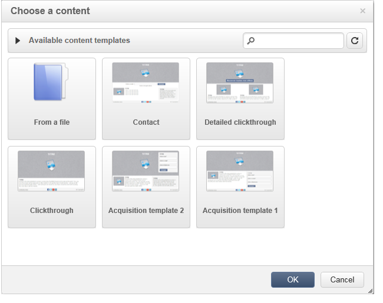

# Administración de plantillas{#template-management}

El editor de contenido digital ofrece **plantillas estándar** para las aplicaciones web y las entregas.

Al crear una aplicación web de tipo página de destino, el usuario puede elegir una de estas plantillas. Asimismo, se puede importar una plantilla HTML creada fuera de Adobe Campaign.

Para añadir una plantilla, consulte [Opciones globales](content-editor-interface.md#global-options).

## Guardado de una entrega como plantilla {#saving-a-delivery-as-a-template}

Después de configurar una entrega, puede guardarla como plantilla para reutilizarla en futuras entregas.

En la pestaña **Campañas**, abra la entrega seleccionada. Haga clic en el botón **Guardar como plantilla**, asigne un nombre a la plantilla y guárdela.

La nueva plantilla se guarda en el nodo **Resources > Templates > Content templates** de Explorer.
