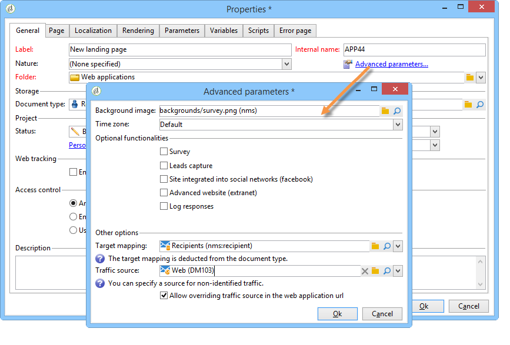

# Seguimiento de visitas en una aplicación web{#tracking-a-web-application}

Esta versión de Adobe Campaign permite realizar un seguimiento y medir las visitas en las páginas de las aplicaciones web mediante la inserción de etiquetas de seguimiento. Esta funcionalidad se puede utilizar para todos los tipos de aplicaciones web (formularios, encuestas en línea, páginas web creadas con DCE, etc.).

De este modo, se pueden definir varias rutas de navegación y evaluar su eficacia. Los datos obtenidos están disponibles en los informes de cada aplicación.

Las principales mejoras incluidas en esta versión son las siguientes:

* Posibilidad de insertar varias etiquetas de seguimiento en una misma página para facilitar la definición de las rutas de navegación (por ejemplo: compras, suscripciones, devoluciones, etc.).
* Visualización de rutas de navegación y las etiquetas de seguimiento de las diferentes páginas en el panel de control de la aplicación web.

   

* Generación de un informe de seguimiento completo.

   

   Los indicadores principales son los siguientes:

   * **Tasa de conversión**: número de personas que han realizado todos los pasos de una ruta de navegación.
   * **Tasa de rechazo**: número de personas que solo han realizado el primer paso.
   * **Canal de conversión**: tasa de pérdida entre cada paso.

   Además, un gráfico de tipo sectorial muestra la población según su origen.****

## Identificación del origen de tráfico {#identifying-the-traffic-source}

Se pueden utilizar dos modos diferentes para identificar de dónde proviene el visitante al acceder a una aplicación Web:

1. Al realizar una entrega específica para conceder acceso a las páginas de la aplicación web: en este caso, la fuente de tráfico es la entrega.
1. Al asociar la aplicación web a una fuente de tráfico específica: en este caso, debe ser una entrega del tipo fuente de tráfico externa. Se puede seleccionar desde las propiedades de la aplicación web o desde la asignación de destino.

   

Para identificar el origen del tráfico en una aplicación web, Adobe Campaign espera sucesivamente la siguiente información:

1. el identificador de la entrega de origen, si existe (cookie nlId),
1. el identificador de la entrega externo definido en las propiedades de la aplicación web, si existe,
1. el identificador de la entrega externo definido en la asignación de destino, si existe.

>[!NOTE]
>
>Recuerde que el seguimiento anónimo solo es posible si se ha activado la opción correspondiente en el asistente de implementación.
>
>Para obtener más información, consulte la [Guía de instalación](../../installation/using/deploying-an-instance.md).

## Aplicaciones web diseñadas con el editor de contenido (DCE) {#web-applications-designed-with-digital-content-editor--dce-}

Cuando se crea una aplicación web con el editor de contenido HTML **Editor de contenido digital (DCE)**, las etiquetas de seguimiento se insertan desde la pestaña **[!UICONTROL Properties]** del editor. Para obtener más información sobre el editor de contenido (DCE), consulte [esta sección](../../web/using/about-campaign-html-editor.md).

Al utilizar la interfaz web, se deben insertar las etiquetas de seguimiento desde las propiedades de la página.

El icono **[!UICONTROL Display blocks]** permite ver el número de etiquetas de seguimiento establecidas para la página.

