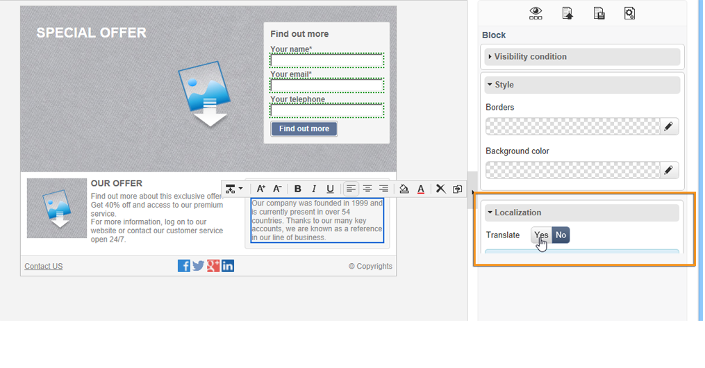
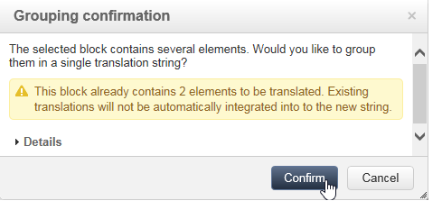
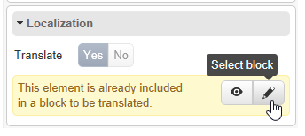

# Traducción de una aplicación web{#translating-a-web-application}

Puede traducir páginas de aplicaciones web creadas con el editor de contenido digital (DCE) de Adobe Campaign.

Si, en la opción **[!UICONTROL Localization]** de una aplicación web, selecciona al menos un idioma adicional en la pestaña **[!UICONTROL Properties]**, se muestra una nueva opción al añadir un bloque de contenido HTML en una página editada con DCE.

Esta opción le permite indicar si el contenido del bloque debe traducirse o no.

Las cadenas que desea traducir se recopilan del mismo modo que las otras cadenas de la aplicación web, a través de la pestaña **[!UICONTROL Translations]** de la aplicación. Para obtener más información, consulte [esta página](../../web/using/translating-a-web-form.md).

Para marcar las cadenas que se deben traducir:

1. Abra una página de contenido editada con DCE en una aplicación web.

   

1. Seleccione un bloque HTML.
1. En el bloque de parámetros de la derecha, la opción **[!UICONTROL Localization]** le permite marcar el contenido del bloque seleccionado. De forma predeterminada, solo se debe traducir el título de la página.

   

   >[!NOTE]
   >
   >Las cadenas no deben superar los 1023 caracteres.

   Hay tres casos específicos:

   * Cuando el bloque seleccionado contiene varias cadenas o bloques, se marca como una sola cadena que se debe traducir. Entonces, la cadena contiene el código HTML de los elementos de este bloque.
   * Cuando se desea marcar un bloque que contiene varias cadenas y al menos una de ellas está marcada, se muestra un mensaje de advertencia. A continuación, se puede eliminar la marca de la cadena aislada y añadir el bloque completo.

      

   * Si desea eliminar la marca de una cadena contenida en un bloque que ya está marcado, no se puede modificar directamente la opción de traducción de la cadena. Sin embargo, puede acceder al bloque que contiene la cadena para cambiarla.

      

1. Cuando haya terminado de marcar las cadenas, vuelva a la aplicación web y seleccione la pestaña **[!UICONTROL Translations]**.
1. Seleccione **[!UICONTROL Collect the strings to translate]**. Las cadenas marcadas en el DCE se añaden a las cadenas de la aplicación web.

   >[!NOTE]
   >
   >Una vez que estén recopiladas las cadenas, estas no se quitan de la lista si se elimina la marca de traducción en el DCE. Esto permite mantenerlos en la memoria de traducción.

1. Traducción y aprobación de las cadenas.

   Se pueden previsualizar las traducciones seleccionando el idioma deseado en la pestaña **[!UICONTROL Preview]** de la aplicación Web.

