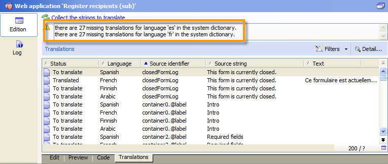

# Traducción de un formulario web{#translating-a-web-form}

Se puede localizar una aplicación web en varios idiomas.

Puede realizar traducciones directamente en la consola de Adobe Campaign (consulte [Gestión de traducciones en el editor](#managing-translations-in-the-editor)) o exportar e importar unidades para [externalizar las traducciones (consulte](#externalizing-translation)).

La lista de idiomas de traducción predeterminada se detalla en [Cambio del idioma de visualización de los formularios](#changing-forms-display-language).

La aplicación web está diseñada en un idioma de edición: este es el idioma de referencia utilizado para introducir etiquetas y otro contenido que se deba traducir.

El idioma predeterminado es el idioma en el que se muestra la aplicación web si no se añade ninguna configuración de idioma a su dirección URL de acceso.

>[!NOTE]
>
>De forma predeterminada, el idioma de edición y el idioma predeterminado son los mismos que el idioma de la consola.

## Elección de idiomas {#choosing-languages}

Para definir uno o más idiomas de traducción, haga clic en el botón **[!UICONTROL Properties]** de la aplicación web y, a continuación, en la pestaña **[!UICONTROL Localization]**. Haga clic en el botón **[!UICONTROL Add]** para definir un nuevo idioma de traducción para la aplicación web.

>[!NOTE]
>
>Esta ventana también permite cambiar el idioma predeterminado y el idioma de edición.


Cuando se añaden idiomas de traducción para una aplicación web (o cuando el idioma predeterminado y el idioma de edición son diferentes), se añade una subpestaña **[!UICONTROL Translation]** a la pestaña **[!UICONTROL Edit]** para administrar las traducciones.

Adobe Campaign incluye una herramienta para traducir y administrar traducciones multilingües. Este editor permite ver las cadenas que se deben traducir o aprobar, introducir traducciones directamente en la interfaz e importar o exportar cadenas de caracteres para externalizar traducciones.

## Administración de traducciones en el editor {#managing-translations-in-the-editor}

### Recopilación de cadenas {#collecting-strings}

La pestaña **[!UICONTROL Translations]** permite introducir traducciones para las unidades de caracteres que conforman la aplicación web.

La primera vez que abre esta pestaña, puede ver que no contiene datos. Haga clic en el enlace **[!UICONTROL Collect the strings to translate]** para actualizar las unidades en la aplicación web.

Adobe Campaign recopila etiquetas de campos y unidades definidas en las pestañas **[!UICONTROL Texts]** de todos los elementos estáticos: Bloques HTML, Javascript, etc. Los elementos estáticos se detallan en [elementos estáticos en un formulario web](../../web/using/static-elements-in-a-web-form.md).


>[!CAUTION]
>
>Este proceso puede tardar varios minutos en procesarse en función del volumen de datos procesados.
> 
>Si aparece una advertencia que indica que faltan algunas traducciones en el diccionario del sistema, consulte [Traducción de unidades del sistema](#translating-the-system-strings).

Cada vez que se traduce una cadena, la traducción se añade al diccionario de traducción.

Cuando el proceso de recopilación detecta que ya existe una traducción, la muestra en la columna **[!UICONTROL Text]** de la unidad. El estado de la cadena cambia a **[!UICONTROL Translated]**.

Para unidades de caracteres que no se hayan traducido nunca, el campo **[!UICONTROL Text]** está vacío y el estado es **[!UICONTROL To translate]**.

### Filtrado de cadenas {#filtering-strings}

De forma predeterminada, se muestra cada idioma de traducción de la aplicación web. Existen dos filtros predeterminados: idioma y estado. Haga clic en el botón **[!UICONTROL Filters]** y, a continuación, haga clic en **[!UICONTROL By language or status]** para mostrar los cuadros desplegables coincidentes. También puede crear un filtro avanzado. Para obtener más información, consulte [esta página](../../platform/using/creating-filters.md#creating-an-advanced-filter).


Vaya al cuadro desplegable **[!UICONTROL Language]** para seleccionar el idioma de traducción.

Para mostrar solo las unidades sin traducir, seleccione **[!UICONTROL To translate]** en el cuadro desplegable **[!UICONTROL Status]**. También puede mostrar solamente cadenas traducidas o aprobadas.

### Traducción de cadenas {#translating-strings}

1. Para traducir una palabra, haga doble clic en su línea de la lista de cadenas.

   

   La cadena de origen se muestra en la sección superior de la ventana.

1. Introduzca su traducción en la sección inferior. Para aprobarla, marque la opción **[!UICONTROL Translation approved]**.

   >[!NOTE]
   >
   >La aprobación de la traducción es opcional y no bloquea el proceso.

   Las traducciones no aprobadas se muestran como **[!UICONTROL Translated]**. Las traducciones aprobadas se muestran como **[!UICONTROL Approved]**.

## Externalización de una traducción {#externalizing-translation}

Es posible exportar e importar cadenas de caracteres para traducirlas con una herramienta distinta a la de Adobe Campaign.

>[!CAUTION]
>
>Una vez que haya exportado las cadenas, no debe llevar a cabo ninguna traducción con la herramienta integrada. Esto podría provocar un conflicto cuando vuelva a importar las traducciones y causar que se pierdan algunas de ellas.

### Exportación de archivos {#exporting-files}

1. Seleccione las aplicaciones web cuyas unidades desee exportar, haga clic con el botón derecho del ratón y seleccione **[!UICONTROL Actions > Export strings for translation...]**.

   

1. Seleccione un **[!UICONTROL Export strategy]** :

   * **[!UICONTROL One file per language]**: la exportación genera un archivo por cada idioma de traducción. Cada archivo es común a todas las aplicaciones web seleccionadas.
   * **[!UICONTROL One file per Web application]**: la exportación genera un archivo por cada aplicación web seleccionada. Cada archivo contiene todos los idiomas de traducción.

      >[!NOTE]
      >
      >Este tipo de exportación no está disponible para exportaciones XLIFF.

   * **[!UICONTROL One file per language and per Web application]**: la exportación genera varios archivos. Cada archivo contiene un idioma de traducción por cada aplicación web.
   * **[!UICONTROL One file for all]**: la exportación genera un solo archivo multilingüe para todas las aplicaciones web. Contiene todos los idiomas de traducción para todas las aplicaciones web seleccionadas.

      >[!NOTE]
      >
      >Este tipo de exportación no está disponible para exportaciones XLIFF.

1. A continuación, elija la **[!UICONTROL Target folder]** donde desea registrar los archivos.
1. Seleccione el formato de archivo ( **[!UICONTROL CSV]** o **[!UICONTROL XLIFF]** ) y haga clic en **[!UICONTROL Start]**.


>[!NOTE]
>
>Los nombres de los archivos de exportación se generan automáticamente. Si realiza la misma exportación varias veces, los archivos nuevos reemplazan a los existentes. Si es necesario conservar los archivos anteriores, cambie la **[!UICONTROL Target folder]**, luego haga clic en **[!UICONTROL Start]** de nuevo para ejecutar la exportación.

Al exportar archivos en **formato CSV**, cada idioma se vincula a un estado y a un estado de aprobación. La columna **¿Aprobar?** permite aprobar una traducción. Esta columna puede contener los valores **Sí** o **No**. En cuanto al editor integrado (consulte [Administración de traducciones en el editor](#managing-translations-in-the-editor)), la aprobación de las traducciones es opcional y no bloquea el proceso.

### Importación de archivos {#importing-files}

Una vez finalizada la traducción externa, puede importar los archivos traducidos.

1. Vaya a la lista de aplicaciones web, haga clic con el botón derecho del ratón y seleccione **[!UICONTROL Actions > Import translated strings...]**.

   >[!NOTE]
   >
   >No es necesario seleccionar las aplicaciones web afectadas por la traducción. Coloque el cursor en cualquier lugar de la lista de aplicaciones web.

   

1. Seleccione el archivo que desea importar y haga clic en **[!UICONTROL Upload]**.

   

>[!NOTE]
>
>Las traducciones externas siempre tienen prioridad sobre las traducciones internas. En caso de conflicto, la traducción externa sobrescribe la traducción interna.

## Cambio de idioma de visualización de formularios {#changing-forms-display-language}

Los formularios web se muestran en el idioma predeterminado especificado en la pestaña **[!UICONTROL Localization]** de las propiedades de la aplicación web. Para cambiar de idioma, debe añadir los siguientes caracteres al final de la dirección URL (donde **xx** es el símbolo del idioma):

```
?lang=xx
```

si el idioma es el primer o único parámetro de la dirección URL. Por ejemplo: **https://myserver/webApp/APP34?lang=en**

```
&lang=xx
```

si hay otros parámetros antes del idioma en la dirección URL. Por ejemplo: **https://myserver/webApp/APP34?status=1&amp;lang=en**

A continuación se enumeran los idiomas y diccionarios de traducción disponibles de forma predeterminada.

**Diccionario predeterminado del sistema**: algunos idiomas incluyen un diccionario predeterminado que contiene la traducción de las cadenas del sistema. Para más información, consulte [Traducción de unidades del sistema](#translating-the-system-strings).

**Administración del calendario**: las páginas de una aplicación web pueden incluir un calendario para introducir fechas. De forma predeterminada, este calendario está disponible en varios idiomas (traducción de días, formato de fecha).

<table> 
 <tbody> 
  <tr> 
   <td> <strong>Idioma (símbolos)</strong><br /> </td> 
   <td> <strong>Diccionario predeterminado del sistema</strong><br /> </td> 
   <td> <strong>Administración del calendario</strong><br /> </td> 
  </tr> 
  <tr> 
   <td> Alemán (de)<br /> </td> 
   <td> Sí<br /> </td> 
   <td> Sí<br /> </td> 
  </tr> 
  <tr> 
   <td> Inglés (en)<br /> </td> 
   <td> Sí<br /> </td> 
   <td> Sí<br /> </td> 
  </tr> 
  <tr> 
   <td> Inglés (Estados Unidos) (en_US)<br /> </td> 
   <td> </td> 
   <td> </td> 
  </tr> 
  <tr> 
   <td> Inglés (Reino Unido) (en_GB)<br /> </td> 
   <td> </td> 
   <td> </td> 
  </tr> 
  <tr> 
   <td> Árabe (ar)<br /> </td> 
   <td> </td> 
   <td> </td> 
  </tr> 
  <tr> 
   <td> Chino (zh)<br /> </td> 
   <td> </td> 
   <td> </td> 
  </tr> 
  <tr> 
   <td> Coreano (ko)<br /> </td> 
   <td> </td> 
   <td> </td> 
  </tr> 
  <tr> 
   <td> Danés (da)<br /> </td> 
   <td> Sí<br /> </td> 
   <td> Sí<br /> </td> 
  </tr> 
  <tr> 
   <td> Español (es)<br /> </td> 
   <td> Sí<br /> </td> 
   <td> Sí<br /> </td> 
  </tr> 
  <tr> 
   <td> Estonio (et)<br /> </td> 
   <td> </td> 
   <td> </td> 
  </tr> 
  <tr> 
   <td> Finés (fi)<br /> </td> 
   <td> </td> 
   <td> Sí<br /> </td> 
  </tr> 
  <tr> 
   <td> Francés (fr)<br /> </td> 
   <td> Sí<br /> </td> 
   <td> Sí<br /> </td> 
  </tr> 
  <tr> 
   <td> Francés (Bélgica) (fr_BE)<br /> </td> 
   <td> </td> 
   <td> </td> 
  </tr> 
  <tr> 
   <td> Francés (Francia) (fr_FR)<br /> </td> 
   <td> </td> 
   <td> </td> 
  </tr> 
  <tr> 
   <td> Griego (el)<br /> </td> 
   <td> </td> 
   <td> Sí<br /> </td> 
  </tr> 
  <tr> 
   <td> Hebreo (he)<br /> </td> 
   <td> </td> 
   <td> </td> 
  </tr> 
  <tr> 
   <td> Húngaro (hu)<br /> </td> 
   <td> </td> 
   <td> Sí<br /> </td> 
  </tr> 
  <tr> 
   <td> Indonesio (id)<br /> </td> 
   <td> </td> 
   <td> </td> 
  </tr> 
  <tr> 
   <td> Irlandés (ga)<br /> </td> 
   <td> </td> 
   <td> </td> 
  </tr> 
  <tr> 
   <td> Italiano (it)<br /> </td> 
   <td> Sí<br /> </td> 
   <td> Sí<br /> </td> 
  </tr> 
  <tr> 
   <td> Italiano (Italia) (it_IT)<br /> </td> 
   <td> </td> 
   <td> </td> 
  </tr> 
  <tr> 
   <td> Italiano (Suiza) (it_CH)<br /> </td> 
   <td> </td> 
   <td> </td> 
  </tr> 
  <tr> 
   <td> Japonés (ja)<br /> </td> 
   <td> </td> 
   <td> </td> 
  </tr> 
  <tr> 
   <td> Letón (lv)<br /> </td> 
   <td> </td> 
   <td> Sí<br /> </td> 
  </tr> 
  <tr> 
   <td> Lituano (lt)<br /> </td> 
   <td> </td> 
   <td> </td> 
  </tr> 
  <tr> 
   <td> Maltés (mt)<br /> </td> 
   <td> </td> 
   <td> </td> 
  </tr> 
  <tr> 
   <td> Holandés (nl)<br /> </td> 
   <td> </td> 
   <td> Sí<br /> </td> 
  </tr> 
  <tr> 
   <td> Holandés (Bélgica) (nl_BE)<br /> </td> 
   <td> </td> 
   <td> </td> 
  </tr> 
  <tr> 
   <td> Holandés (Holanda) (nl_NL)<br /> </td> 
   <td> </td> 
   <td> </td> 
  </tr> 
  <tr> 
   <td> Noruego (Noruega) (no_NO)<br /> </td> 
   <td> </td> 
   <td> Sí<br /> </td> 
  </tr> 
  <tr> 
   <td> Polaco (pl)<br /> </td> 
   <td> </td> 
   <td> Sí<br /> </td> 
  </tr> 
  <tr> 
   <td> Portugués (pt)<br /> </td> 
   <td> </td> 
   <td> Sí<br /> </td> 
  </tr> 
  <tr> 
   <td> Portugués (Brasil) (pt_BR)<br /> </td> 
   <td> </td> 
   <td> </td> 
  </tr> 
  <tr> 
   <td> Portugués (Portugal) (pt_PT)<br /> </td> 
   <td> </td> 
   <td> </td> 
  </tr> 
  <tr> 
   <td> Ruso (ru)<br /> </td> 
   <td> </td> 
   <td> Sí<br /> </td> 
  </tr> 
  <tr> 
   <td> Esloveno (sl)<br /> </td> 
   <td> </td> 
   <td> </td> 
  </tr> 
  <tr> 
   <td> Eslovaco (sk)<br /> </td> 
   <td> </td> 
   <td> </td> 
  </tr> 
  <tr> 
   <td> Sueco (sv)<br /> </td> 
   <td> Sí<br /> </td> 
   <td> Sí<br /> </td> 
  </tr> 
  <tr> 
   <td> Sueco (Finlandia) (sv_FI)<br /> </td> 
   <td> </td> 
   <td> </td> 
  </tr> 
  <tr> 
   <td> Sueco (Suecia) (sv_SE)<br /> </td> 
   <td> </td> 
   <td> </td> 
  </tr> 
  <tr> 
   <td> Checo (cs)<br /> </td> 
   <td> </td> 
   <td> </td> 
  </tr> 
  <tr> 
   <td> Tailandés (th)<br /> </td> 
   <td> </td> 
   <td> </td> 
  </tr> 
  <tr> 
   <td> Vietnamita (vi)<br /> </td> 
   <td> </td> 
   <td> </td> 
  </tr> 
  <tr> 
   <td> Valón (wa)<br /> </td> 
   <td> </td> 
   <td> </td> 
  </tr> 
 </tbody> 
</table>

>[!NOTE]
>
>Para agregar otros idiomas que no sean los predeterminados, consulte [Adición de un idioma de traducción](#adding-a-translation-language)

## Ejemplo: visualización de una aplicación web en varios idiomas {#example--displaying-a-web-application-in-several-languages}

El siguiente formulario web está disponible en cuatro idiomas: inglés, francés, alemán y español. Las unidades de caracteres se han traducido mediante la pestaña **[!UICONTROL Translation]** del formulario web. Dado que el idioma predeterminado es inglés, al publicar la encuesta, utilice la dirección URL estándar para mostrarlo en inglés.


Añada **?lang=fr** al final de la dirección URL para mostrarlo en francés:

>[!NOTE]
>
>La lista de símbolos para cada idioma se detalla en [Cambio del idioma de visualización de los formularios](#changing-forms-display-language).


Puede añadir **?lang=es** o **?lang=de** para mostrarlo en español o alemán.

>[!NOTE]
>
>Si ya se han añadido otros parámetros a esta aplicación web, añada **&amp;lang=**.\
>Por ejemplo: **https://myserver/webApp/APP34?status=1&amp;lang=en**

## Configuración avanzada de traducción {#advanced-translation-configuration}

>[!CAUTION]
>
>Esta sección es solo para usuarios expertos.

### Traducción de cadenas del sistema {#translating-the-system-strings}

Las cadenas del sistema son cadenas de caracteres predeterminadas que se utilizan en todas las aplicaciones web. Por ejemplo: los botones **[!UICONTROL Next]** , **[!UICONTROL Previous]**, **[!UICONTROL Approve]**, mensajes **[!UICONTROL Loading]**, etc. De forma predeterminada, algunos idiomas contienen un diccionario con traducciones para estas unidades. La lista de idiomas se detalla en [Cambio del idioma de visualización de los formularios](#changing-forms-display-language).

Si se traduce la aplicación web a un idioma al que no se ha traducido el diccionario del sistema, aparece un mensaje de advertencia indicando que faltan algunas traducciones.



Para añadir un idioma, siga los pasos siguientes:

1. Vaya al árbol de Adobe Campaign y haga clic en **[!UICONTROL Administration > Configuration > Global dictionary > System dictionary]** .
1. En la sección superior de la ventana, seleccione la unidades del sistema que desea traducir y, a continuación, haga clic en **[!UICONTROL Add]** en la sección inferior.

   

1. Seleccione el idioma de traducción e introduzca una traducción para la cadena. Se puede aprobar la traducción marcando la opción **[!UICONTROL Translation approved]**.

   

   >[!NOTE]
   >
   >La aprobación de la traducción es opcional y no bloquea el proceso.

>[!CAUTION]
>
>No debe eliminar las cadenas predeterminadas del sistema.

### Adición de un idioma de traducción {#adding-a-translation-language}

Para traducir aplicaciones web a idiomas distintos de los predeterminados (consulte [Cambio de idioma de visualización de formularios](#changing-forms-display-language)), se debe agregar un nuevo idioma de traducción.

1. Haga clic en el nodo **[!UICONTROL Administration > Platform > Enumerations]** del árbol de Adobe Campaign y seleccione **[!UICONTROL Languages available for translation]** en la lista. La lista de traducciones disponibles se muestra en la sección inferior de la ventana.

   

1. Haga clic en el botón **[!UICONTROL Add]** y, a continuación, introduzca el **[!UICONTROL Internal name]**, **[!UICONTROL Label]** y el identificador de la imagen (indicador). Para añadir una nueva imagen, póngase en contacto con el administrador.

   

