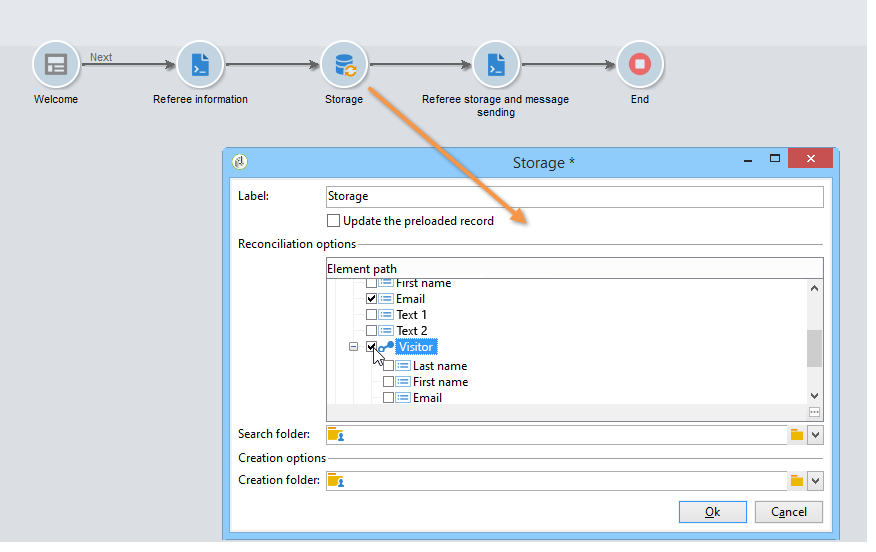
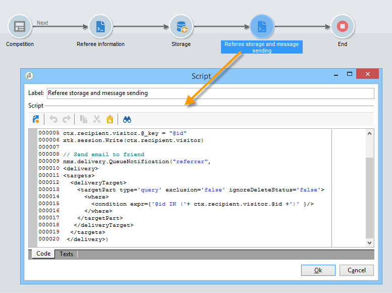

# Caso de uso: crear un formulario de referencia{#use-case-creating-a-refer-a-friend-form}

En este ejemplo queremos ofrecer una competencia a los destinatarios de la base de datos. El formulario web incluye una sección para introducir respuestas y otra para recomendar a un amigo introduciendo su dirección de correo electrónico.


Los bloques de identificación y competencia se crean siguiendo los procesos descritos anteriormente.

Para configurar y crear el bloque de recomendación, siga estos pasos:

1. Cree un formulario web de competencia con preguntas y un campo para introducir la información de contacto de un amigo, como se muestra a continuación:

   

   El campo **Su mensaje** le permite introducir un mensaje para el destinatario del reenvío. El remitente de la entrega debe también introducir su **Apellido**, **Nombre** y **Correo electrónico**.

   La información introducida en los campos se almacena en una tabla específica conocida como tabla de visitante.

   >[!NOTE]
   >
   >Si el destinatario no ha dado su consentimiento, no puede almacenarlas con los destinatarios de la base de datos. Se almacenan temporalmente en la tabla **visitante** (**nms:visitor**) diseñada para las campañas de marketing viral. Esta tabla se purga periódicamente gracias a las operaciones de **limpieza**.
   >
   >En este ejemplo, queremos dirigirnos a los destinatarios para sugerirles que participen en la competición recomendada por el remitente del reenvío. Sin embargo, en este mensaje también deseamos ofrecerles una suscripción a uno de nuestros servicios de información. Si se suscriben, se los puede almacenar en la base de datos.

   

   El contenido de los campos relativos al destinatario del reenvío se utilizan en la secuencia de comandos de creación de perfiles y en el mensaje enviado a ellos.

1. Comience creando una secuencia de comandos para vincular al remitente del reenvío con el destinatario del mismo.

   Contiene las siguientes instrucciones:

   

   ```
   ctx.recipient.visitor.@id = xtk.session.GetNewIds(1)
   ctx.recipient.visitor.@forwardUrl = "APP5"
   ctx.recipient.visitor.@referrerEmail = ctx.recipient.@email
   ctx.recipient.visitor.@referrerFirstName = ctx.recipient.@firstName
   ctx.recipient.visitor.@referrerLastName = ctx.recipient.@lastName
   ```

   El apellido, el nombre y la dirección de correo electrónico introducidos en el bloque de identificación de página se identifican como el apellido, el nombre y la dirección de correo electrónico del remitente del reenvío. Estos campos se vuelven a introducir en el cuerpo del mensaje enviado al destinatario del reenvío.

   El valor APP5 coincide con el nombre interno del formulario web: esta información le permite conocer el origen del destinatario del reenvío, es decir, vincular al visitante al formulario web en función del que se crearon.

1. El cuadro de almacenamiento le permite recopilar información y almacenarla en la base de datos.

   

1. A continuación, cree la plantilla de envío relacionada con el servicio de información creado durante el paso 1. Se selecciona en el campo **[!UICONTROL Choose scenario]** del servicio de información.

   La plantilla de envío utilizada para crear el mensaje de oferta de reenvío contiene la siguiente información:

   

   Esta plantilla tiene las siguientes características:

   * Seleccione la tabla de visitantes como asignación de destino.

      

   * La información de contacto del destinatario del reenvío, así como la información sobre el remitente del reenvío, se toma de la tabla del visitante. Se inserta mediante el botón de personalización.

      

   * Esta plantilla contiene un vínculo al formulario de competencia y el vínculo de suscripción para que el destinatario del reenvío se suscriba al boletín informativo.

      El vínculo de suscripción se inserta mediante un bloque de personalización. De forma predeterminada, permite suscribir los perfiles al servicio del **boletín informativo.** Este bloque de personalización se puede cambiar para adaptarse a sus necesidades, por ejemplo para suscribirse a un servicio diferente.

   * El nombre interno (remitente del reenvío) se utiliza en la secuencia de comandos de envío de mensajes como se muestra a continuación.
   >[!NOTE]
   >
   >Consulte [esta página](../../delivery/using/about-templates.md) para obtener más información sobre las plantillas de envío.

1. Cree la segunda secuencia de comandos para enviar los mensajes de suscripción.

   

   ```
   // Updtate visitor to have a link to the referrer recipient
   ctx.recipient.visitor.@referrerId = ctx.recipient.@id
   ctx.recipient.visitor.@xtkschema = "nms:visitor"
   ctx.recipient.visitor.@_operation = "update" 
   ctx.recipient.visitor.@_key = "@id" 
   xtk.session.Write(ctx.recipient.visitor)
   
   // Send email to friend
   nms.delivery.QueueNotification("referrer",
   <delivery>
   <targets>
     <deliveryTarget>
       <targetPart type='query' exclusion='false' ignoreDeleteStatus='false'>
         <where>
           <condition expr={'@id IN ('+ ctx.recipient.visitor.@id +')' }/>
         </where>
       </targetPart>
      </deliveryTarget>
     </targets>
    </delivery>)
   ```

1. Publique el formulario de competencia y envíe una invitación a los destinatarios del objetivo inicial. Cuando uno de ellos invita a un amigo, se crea una entrega basado en la plantilla de **oferta de reenvío**.

   

   El destinatario del reenvío se añade a la carpeta del visitante en el **[!UICONTROL Administration > Visitors node]**:

   

   Su perfil contiene la información introducida por el remitente del reenvío. Se almacena en función de las configuraciones introducidas en la secuencia de comandos del formulario. Si decide suscribirse al boletín informativo, se guardan en la tabla de destinatarios.

