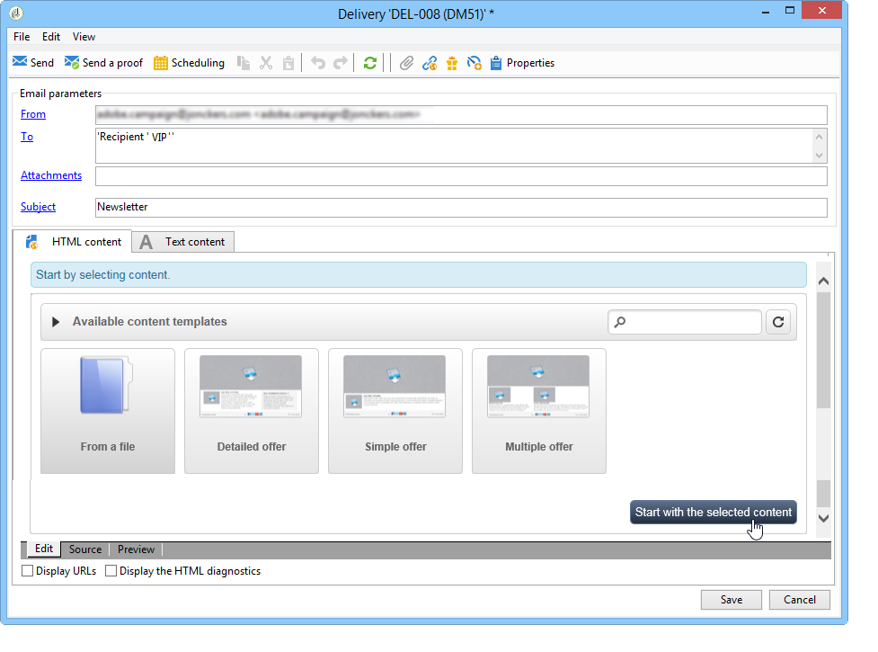
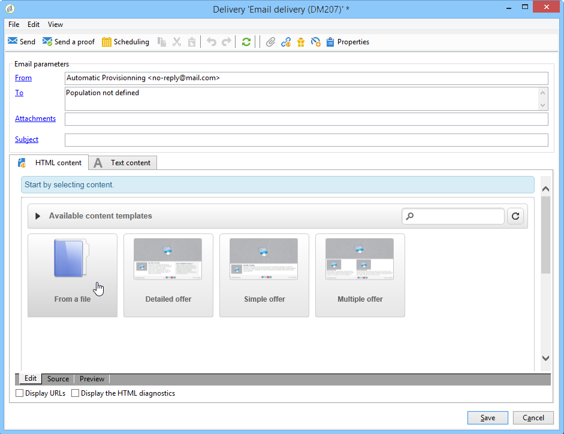
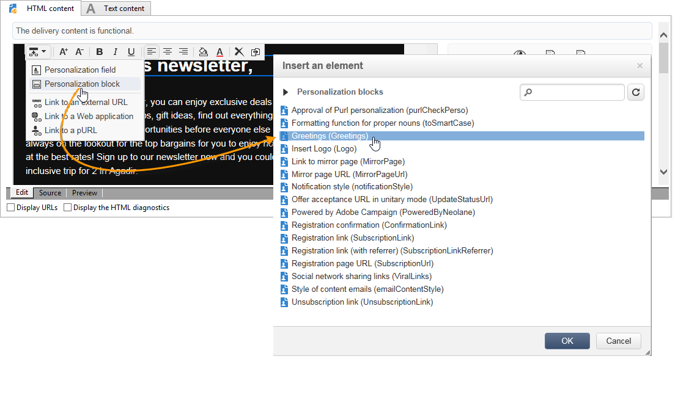
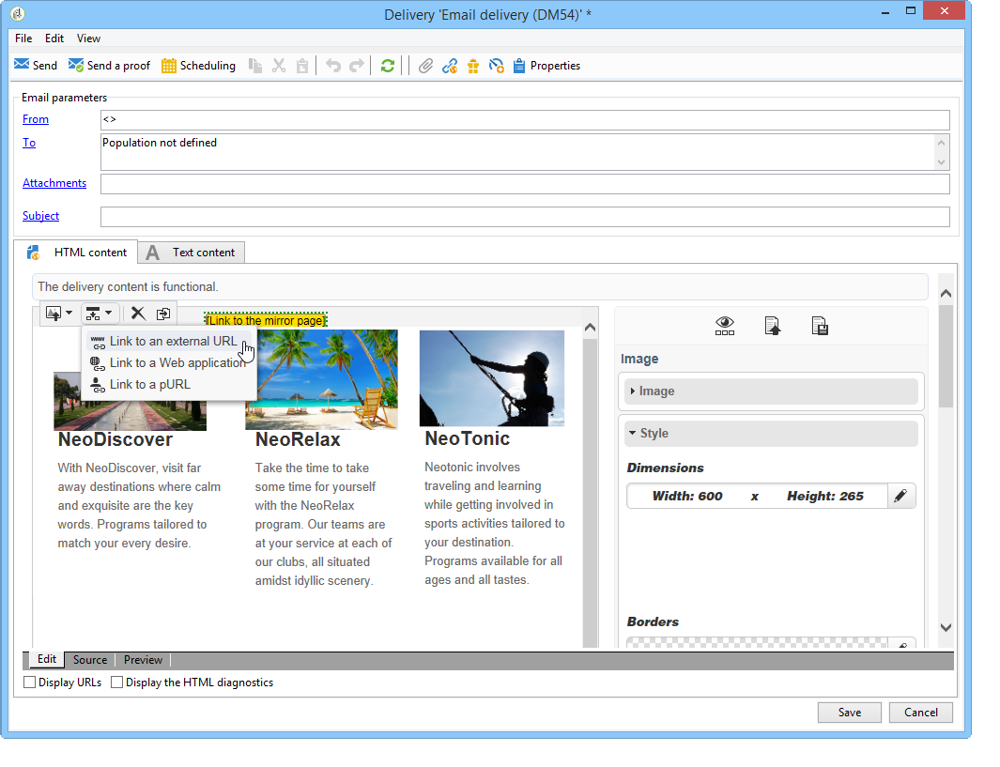
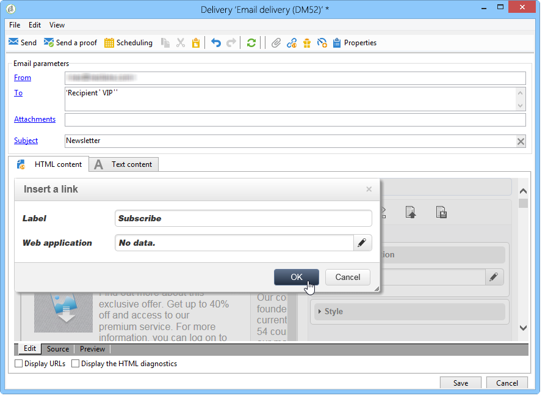

# Ejemplo de uso: creación de una entrega por correo electrónico{#use-case-creating-an-email-delivery}

En este caso de uso, aprenderá los pasos para diseñar una entrega por correo electrónico con el Editor de contenido digital (DCE) de Adobe Campaign.

El objetivo final es crear una entrega con una plantilla personalizada que contenga:

* Una dirección postal para un destinatario (con nombre completo).
* Dos tipos de vínculos a una dirección URL externa
* Una página espejo
* Un vínculo a una aplicación web

>[!NOTE]
>
>Antes de empezar, debe tener al menos una **plantilla HTML** configurada para alojar el contenido de las entregas futuros.
>
>En las **[!UICONTROL Properties]** de la entrega, asegúrese de que **[!UICONTROL Content editing mode]** (pestaña **[!UICONTROL Advanced]**) está configurada como **[!UICONTROL DCE]**. Para garantizar el funcionamiento óptimo del editor, consulte las [Recomendaciones para la edición de contenido](../../web/using/content-editing-best-practices.md).

## Paso 1: Creación de una entrega {#step-1---creating-a-delivery}

Para crear un nuevo envío, coloque el cursor en la pestaña **Campaigns** y haga clic en **Deliveries**. Después, haga clic en el botón **Crear** situado encima de la lista de envíos existentes. Para obtener más información sobre la creación de envíos, consulte [esta página](../../delivery/using/about-email-channel.md).

## Paso 2: Selección de una plantilla {#step-2---selecting-a-template}

Seleccione una plantilla de envío y asigne un nombre a la entrega. Este nombre solo está visible para los usuarios de la consola de Adobe Campaign y no para los destinatarios. Sin embargo, este título se muestra en la lista de envíos. Haga clic en **[!UICONTROL Continue]**.

## Paso 3: Selección de contenido {#step-3---selecting-a-content}

El editor de contenido incluye varias plantillas predeterminadas con distintas estructuras (columnas, áreas de texto, etc.).

Seleccione la plantilla de contenido que desea utilizar y haga clic en el botón **[!UICONTROL Start with the selected content]** para mostrar la plantilla en la entrega creada.

Asimismo, se puede importar un contenido HTML creado fuera de Adobe Campaign seleccionando **[!UICONTROL From a file]**.

Se puede guardar este contenido como una plantilla para su uso futuro. Una vez creada una plantilla de contenido personalizada, se puede obtener una vista previa de la misma en la lista de plantillas. Para obtener más información, consulte [Administración de plantillas](../../web/using/template-management.md).

>[!CAUTION]
>
>Si utiliza la **interfaz web de Adobe Campaign**, debe importar un archivo .zip que incluya el contenido HTML y las imágenes relacionadas.

## Paso 4: Diseño del mensaje {#step-4---designing-the-message}

* Mostrar el nombre completo de los destinatarios

   Para insertar el primer y el segundo nombre de los destinatarios en un campo de texto de su envío, haga clic en el campo de texto seleccionado y, a continuación, coloque el cursor donde desee mostrarlos. Haga clic en el primer icono de la barra de herramientas emergente y, a continuación, haga clic en **[!UICONTROL Personalization block]**. Seleccione **[!UICONTROL Greetings]** y haga clic en **[!UICONTROL OK]**.

   

* Inserción de un vínculo en una imagen

   Para transferir los destinatarios de envíos a una dirección externa a través de una imagen, haga clic en la imagen correspondiente para mostrar la barra de herramientas emergente, coloque el cursor en el primer icono y haga clic en **[!UICONTROL Link to an external URL]**. Para obtener más información, consulte [Adición de un vínculo](../../web/using/editing-content.md#adding-a-link).

   

   Introduzca la dirección URL del vínculo en el campo **URL** con el formato **https://www.myURL.com** y, a continuación, confirme la acción.

   El vínculo se puede cambiar en cualquier momento con la sección a la derecha de la ventana.

* Inserción de un vínculo en el texto

   Para integrar un vínculo externo en el texto de la entrega, seleccione un texto o un bloque de texto y, a continuación, haga clic en el primer icono de la barra de herramientas emergente. Haga clic en **[!UICONTROL Link to an external URL]** e introduzca la dirección del vínculo en el campo **[!UICONTROL URL]**. Para obtener más información, consulte [Adición de un vínculo](../../web/using/editing-content.md#adding-a-link).

   El vínculo se puede cambiar en cualquier momento con la sección a la derecha de la ventana.

   >[!CAUTION]
   >
   >El texto introducido en el campo **[!UICONTROL Label]** reemplaza al texto original.

* Adición de una página espejo

   Para permitir a los destinatarios ver el contenido de la entrega en un navegador web, se puede integrar un vínculo a una página espejo en la entrega.

   Haga clic en el campo de texto en el que desea ver el vínculo publicado. Haga clic en el primer icono de la barra de herramientas emergente, seleccione **[!UICONTROL Personalization block]** y luego **[!UICONTROL Link to Mirror Page (MirrorPage)]**. Haga clic en **[!UICONTROL Save]** para confirmar.

   

   >[!CAUTION]
   >
   >La etiqueta de bloque de personalización sustituye automáticamente el texto original de la entrega.

* Integración de un vínculo a una aplicación web

   El editor de contenido permite integrar vínculos a aplicaciones web desde la consola de Adobe Campaign, como una página de destino o una página de formulario. Para obtener más información, consulte [Vínculo a una aplicación web](../../web/using/editing-content.md#link-to-a-web-application).

   Seleccione un campo de texto para enlazar a una aplicación web y, a continuación, haga clic en el primer icono. Seleccione **[!UICONTROL Link to a Web application]** y luego seleccione la aplicación deseada haciendo clic en el icono situado al final del campo **Web Application**.

   

   Haga clic en **Guardar** para confirmar.

   >[!NOTE]
   >
   >Este paso requiere haber guardado al menos una aplicación web previamente. Se pueden encontrar en la pestaña **[!UICONTROL Campaigns > Web applications]** de la consola.

## Paso 5: Guardado de una entrega {#step-5---saving-the-delivery}

Una vez que el contenido esté integrado, guarde la entrega haciendo clic en **Guardar**. A partir de entonces se muestra en la lista de envíos, que se encuentra en la pestaña **[!UICONTROL Campaigns > Deliveries]**.
