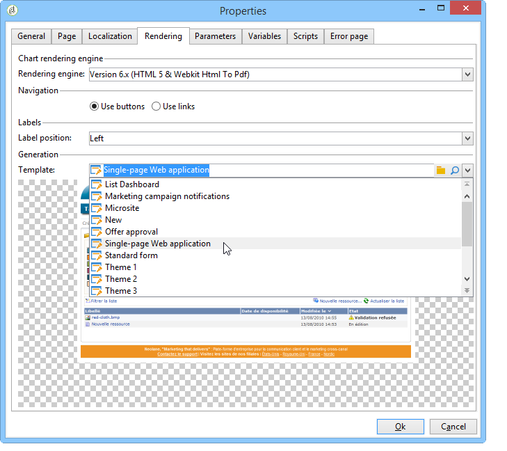
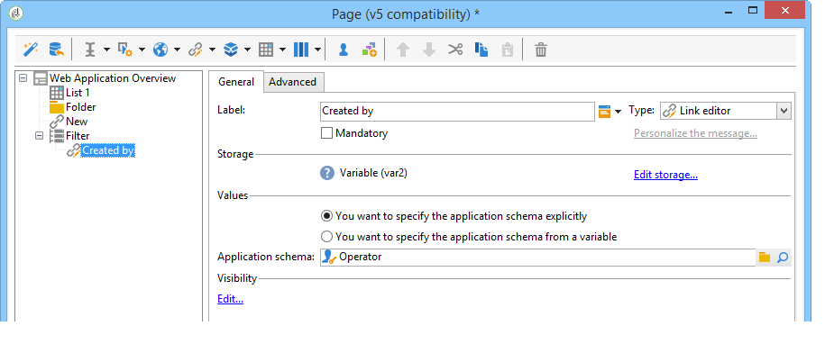
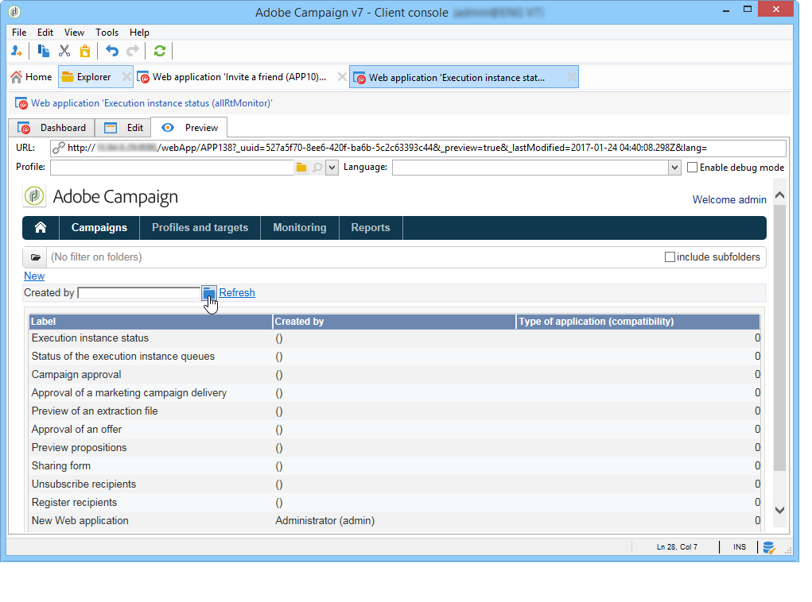

# Ejemplos de uso: creación de descripciones generales{#use-cases-creating-overviews}

En el siguiente ejemplo, se crean aplicaciones web de tipo “descripción general” para visualizar todas las que se encuentren en la base de datos. Configure los siguientes elementos:

* un filtro en la carpeta (consulte [Añadir un filtro en una carpeta](#adding-a-filter-on-a-folder)),
* un botón para crear una nueva aplicación Web (consulte [Añadir un botón para configurar una nueva aplicación Web](#adding-a-button-to-configure-a-new-web-application)),
* visualización de detalles para cada entrada de la lista (consulte [Añadir detalles a una lista](#adding-detail-to-a-list)),
* un filtro por herramienta de edición de vínculos (consulte [Crear un filtro con un editor de vínculos](#creating-a-filter-using-a-link-editor)),
* un vínculo de actualización (consulte [Crear un vínculo de actualización](#creating-a-refresh-link)).


## Creación de una aplicación web de una sola página {#creating-a-single-page-web-application}

1. Cree una aplicación web **[!UICONTROL Page]** y deshabilite las transiciones salientes y las transiciones a la página siguiente.

   

1. Modificación del título de la página.

   Este título aparece en el encabezado de la descripción general y en la descripción general de la aplicación web.

1. En las propiedades de la aplicación web, modifique la renderización de la aplicación seleccionando la plantilla **[!UICONTROL Single-page Web application]**.

   

1. Abra la actividad **[!UICONTROL Page]** de la aplicación web y abra una lista (**[!UICONTROL Static element > List]**).
1. En la pestaña **[!UICONTROL Data]** de la lista, seleccione el tipo de documento **[!UICONTROL Web applications]** y las columnas de salida **[!UICONTROL Creation date]****[!UICONTROL Label]**, y **[!UICONTROL Type of application]**.
1. En la subpestaña **[!UICONTROL Filter]**, cree el siguiente filtro, tal y como se muestra a continuación, para visualizar las aplicaciones web y excluir las plantillas de la vista.

   

1. Cierre la ventana de configuración de la página y haga clic en **[!UICONTROL Preview]**.

   Se muestra la lista de aplicaciones web disponibles en la base de datos.

   

## Adición de un filtro a una carpeta {#adding-a-filter-on-a-folder}

En una descripción general, tiene la opción de acceder a los datos según su ubicación en el directorio de Adobe Campaign. Esto es un filtro en una carpeta. Siga el siguiente proceso para añadirlo a su descripción general.

1. Coloque el cursor en el nodo **[!UICONTROL Page]** de la aplicación web y añada un elemento **[!UICONTROL Select folder]** (**[!UICONTROL Advanced controls > Select folder]**).
1. En la ventana **[!UICONTROL Storage]** que aparece, haga clic en el vínculo **[!UICONTROL Edit variables]**.
1. Cambie la etiqueta de variables según sus necesidades.
1. Cambie el nombre de la variable con el valor **folder**.

   >[!NOTE]
   >
   >El nombre de la variable debe coincidir con el nombre del elemento relacionado con la carpeta (definido en el esquema), por ejemplo **folder** en este caso. Debe volver a utilizar este nombre cuando haga referencia a la tabla.

1. Aplicar el tipo **[!UICONTROL XML]** a la variable.

   

1. Seleccione la interacción **[!UICONTROL Refresh page]**.

   

1. Coloque el cursor en la lista y en la pestaña **[!UICONTROL Advanced]** haga referencia a la variable creada previamente en la pestaña **[!UICONTROL Folder filter XPath]** de la lista. Debe utilizar el nombre del elemento al que hace referencia el vínculo de carpeta, por ejemplo **folder**.

   

   >[!NOTE]
   >
   >En esta fase, la aplicación web no está dentro del contexto de la aplicación; por lo que el filtro no se puede probar en la carpeta.

## Adición de un botón para configurar una nueva aplicación web {#adding-a-button-to-configure-a-new-web-application}

1. Coloque el cursor en el elemento **[!UICONTROL Page]** y añada un vínculo (**[!UICONTROL Static elements > Link]**).
1. Modifique la etiqueta del vínculo, ya que esta aparece en el botón de la descripción general.

   En el ejemplo, la etiqueta es **New**.

1. Inserte la siguiente URL en el campo URL: **xtk://open/?schema=nms:webApp&amp;form=nms:newWebApp**.

   >[!NOTE]
   >
   >**nms:webApp** coincide con el esquema de la aplicación web.
   >
   >**nms:newWebApp** coincide con el nuevo asistente de creación de aplicaciones web.

1. Seleccione esta opción para visualizar la URL en la misma ventana.
1. Agregue el icono de la aplicación Web en el campo de imagen: **/nms/img/webApp.png**.

   Este icono aparece en el botón **[!UICONTROL New]**.

1. Introduzca **button** en el campo **[!UICONTROL Style]**.

   Se hace referencia a este estilo en la plantilla **[!UICONTROL Single-page Web application]** seleccionada previamente.

   

## Adición de detalles a una lista {#adding-detail-to-a-list}

Al configurar una lista en la descripción general, puede elegir visualizar detalles adicionales para cada entrada en la lista.

1. Coloque el cursor en el elemento de lista creado previamente.
1. En la pestaña **[!UICONTROL General]**, seleccione el modo de visualización **[!UICONTROL Columns and additional detail]** en la lista desplegable.

   

1. En la pestaña **[!UICONTROL Data]**, añada las columnas **[!UICONTROL Internal name]****[!UICONTROL Primary key]**, y **[!UICONTROL Description]** y seleccione la opción **[!UICONTROL Hidden field]** para cada una de ellas.

   

   De este modo, esta información solo se puede ver en el detalle de cada entrada.

1. En la pestaña **[!UICONTROL Additional detail]**, añada el siguiente código:

   ```
   <div class="detailBox">
     <div class="actionBox">
       <span class="action"><a title="Open" class="linkAction" href="xtk://open/?schema=nms:webApp&form=nms:webApp&pk=
       <%=webApp.id%>">Open...</a></span>
       <% 
       if( webApp.@appType == 1 ) { //survey
       %>
       <span class="action"><a target="_blank" title="Reports" class="linkAction" href="/xtk/report.jssp?_context=selection&
         _schema=nms:webApp&_selection=<%=webApp.@id%>
         &__sessiontoken=<%=document.controller.getSessionToken()%>">Reports</a></span>
       <% 
       } 
       %>
     </div>
     <div>
       Internal name: <%= webApp.@internalName %>
     </div>
     <%
     if( webApp.desc != "" )
     {
     %>
     <div>
       Description: <%= webApp.desc %>
     </div>
     <% 
     } 
     %>
   </div>
   ```

>[!NOTE]
>
>Las bibliotecas de JavaScript tardan cinco minutos en actualizarse en el servidor. Se puede reiniciar el servidor para evitar que se produzca este retraso.

## Filtrado y actualización de la lista {#filtering-and-updating-the-list}

En esta sección, se crea un filtro para mostrar la descripción general de las aplicaciones web creadas por un operador específico. Este filtro se crea con un editor de vínculos. Una vez seleccionado un operador, actualice la lista para aplicar el filtro; esto requiere la creación de un vínculo de actualización.

Estos dos elementos se agrupan en el mismo contenedor para que se clasifiquen gráficamente en la descripción general.

1. Coloque el cursor en el elemento **[!UICONTROL Page]** y seleccione **[!UICONTROL Container > Standard]**.
1. Especifique el número de columnas en **2**, de modo que el editor de vínculos y el vínculo estén uno junto al otro.

   

   Para obtener más información sobre la disposición de elementos, consulte [esta sección](../../web/using/about-web-forms.md).

1. Aplicar **dottedFilter**.

   Este estilo se menciona en la plantilla **[!UICONTROL Single-page Web applicatio]** seleccionada anteriormente.

   

### Creación de un filtro mediante un editor de vínculos {#creating-a-filter-using-a-link-editor}

1. Coloque el cursor en el contenedor creado durante la fase anterior e inserte un editor de vínculos mediante el menú **[!UICONTROL Advanced controls]**.
1. En la ventana de almacenamiento que se abre automáticamente, seleccione la opción **[!UICONTROL Variables]** y, a continuación, haga clic en el vínculo **[!UICONTROL Edit variables]** y cree una variable XML para filtrar los datos.

   

1. Modifique la etiqueta.

   Esta aparece junto al campo **[!UICONTROL Filter]** en la descripción general.

1. Seleccione la tabla Operador como esquema de aplicación.

   

1. Coloque el cursor en el elemento de la lista y cree un filtro a través de la pestaña **[!UICONTROL Data > Filter]**:

   * **Expression:** Clave externa del vínculo “Creado por”
   * **Operador:** es igual a
   * **Value:** Variables (variables)
   * **Taken into account if:** &#39;$(var2/@id)&#39;!=&#39;&#39;&#39;

   

>[!CAUTION]
>
>El usuario de la aplicación web debe ser un operador identificado con los derechos adecuados de Adobe Campaign para acceder a la información. Este tipo de configuración no funciona para aplicaciones web anónimas.

### Creación de un vínculo de actualización {#creating-a-refresh-link}

1. Sitúe el cursor sobre el contenedor e inserte un **[!UICONTROL Link]** mediante el menú **[!UICONTROL Static elements]**.
1. Modifique la etiqueta.
1. Seleccione **[!UICONTROL Refresh data in a list]**.
1. Añada la lista creada previamente.

   

1. Agregue el icono de actualización en el campo **[!UICONTROL Image]**: **/xtk/img/refresh.png**.
1. Con las flechas de selección, reorganice los distintos elementos de la aplicación web como se muestra a continuación.

   

La aplicación web ya está configurada. Se puede hacer clic en la pestaña **[!UICONTROL Preview]** para previsualizarla.



