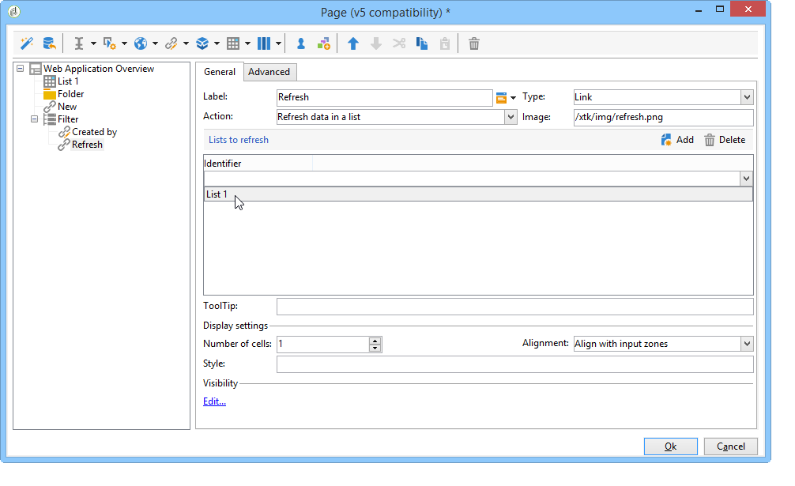

# Ejemplos de uso: creación de descripciones generales{#use-cases-creating-overviews}

En el siguiente ejemplo, se crean aplicaciones web de tipo “descripción general” para visualizar todas las que se encuentren en la base de datos. Configure los siguientes elementos:

* un filtro en la carpeta (consulte [Adición de un filtro en una carpeta](#adding-a-filter-on-a-folder)),
* un botón para crear una nueva aplicación Web (consulte [Adición de un botón para configurar una nueva aplicación](#adding-a-button-to-configure-a-new-web-application)Web),
* visualización de detalles para cada entrada de la lista (consulte [Adición de detalles a una lista](#adding-detail-to-a-list)),
* un filtro por herramienta de edición de vínculos (consulte [Creación de un filtro con un editor](#creating-a-filter-using-a-link-editor)de vínculos),
* un vínculo de actualización (consulte [Creación de un vínculo](#creating-a-refresh-link)de actualización).


## Creación de una aplicación web de una sola página {#creating-a-single-page-web-application}

1. Create a single **[!UICONTROL Page]** Web application and disable outbound transitions and transitions to the next page.

   

1. Modificación del título de la página.

   Este título aparece en el encabezado de la descripción general y en la descripción general de la aplicación web.

1. In the Web application properties, modify the rendering of your application by selecting the **[!UICONTROL Single-page Web application]** template.

   

1. Abra la **[!UICONTROL Page]** actividad de la aplicación Web y abra una lista (**[!UICONTROL Static element > List]**).
1. En la **[!UICONTROL Data]** ficha de la lista, seleccione el tipo de **[!UICONTROL Web applications]** documento y las columnas **[!UICONTROL Label]** , **[!UICONTROL Creation date]** y **[!UICONTROL Type of application]** de salida.
1. In the **[!UICONTROL Filter]** sub-tab, create the following filter as shown below in order to display Web applications only and exclude templates from your view.

   

1. Close the configuration window of your page and click **[!UICONTROL Preview]**.

   Se muestra la lista de aplicaciones web disponibles en la base de datos.

   

## Adición de un filtro a una carpeta {#adding-a-filter-on-a-folder}

En una descripción general, tiene la opción de acceder a los datos según su ubicación en el directorio de Adobe Campaign. Esto es un filtro en una carpeta. Siga el siguiente proceso para añadirlo a su descripción general.

1. Coloque el cursor en el nodo de la **[!UICONTROL Page]** aplicación Web y agregue un **[!UICONTROL Select folder]** elemento (**[!UICONTROL Advanced controls > Select folder]**).
1. En la **[!UICONTROL Storage]** ventana que aparece, haga clic en el **[!UICONTROL Edit variables]** vínculo.
1. Cambie la etiqueta de variables según sus necesidades.
1. Cambie el nombre de la variable con el valor **folder**.

   >[!NOTE]
   >
   >The name of the variable must match the name of the element linked to the folder (defined in the schema), i.e. **folder** in this case. Debe volver a utilizar este nombre cuando haga referencia a la tabla.

1. Apply the **[!UICONTROL XML]** type to the variable.

   

1. Seleccione la **[!UICONTROL Refresh page]** interacción.

   

1. Place your cursor on your list, and in the **[!UICONTROL Advanced]** tab, reference the variable previously created in the **[!UICONTROL Folder filter XPath]** tab of the list. You must use the name of the element concerned by the folder link, i.e. **folder**.

   

   >[!NOTE]
   >
   >En esta fase, la aplicación web no está dentro del contexto de la aplicación; por lo que el filtro no se puede probar en la carpeta.

## Adición de un botón para configurar una nueva aplicación web {#adding-a-button-to-configure-a-new-web-application}

1. Coloque el cursor en el **[!UICONTROL Page]** elemento y agregue un vínculo (**[!UICONTROL Static elements > Link]**).
1. Modifique la etiqueta del enlace, ya que esta aparece en el botón de la descripción general.

   En el ejemplo, la etiqueta es **New**.

1. Inserte la siguiente URL en el campo URL: **xtk://open/?schema=nms:webApp&amp;form=nms:newWebApp**.

   >[!NOTE]
   >
   >**nms:webApp** coincide con el esquema de la aplicación web.
   >
   >**nms:newWebApp** coincide con el nuevo asistente para la creación de aplicaciones Web.

1. Seleccione esta opción para visualizar la URL en la misma ventana.
1. Agregue el icono de la aplicación Web en el campo de imagen: **/nms/img/webApp.png**.

   This icon will appear on the **[!UICONTROL New]** button.

1. Enter **button** in the **[!UICONTROL Style]** field.

   This style is referred to in the **[!UICONTROL Single-page Web application]** template selected previously.

   

## Adición de detalles a una lista {#adding-detail-to-a-list}

Al configurar una lista en la descripción general, puede elegir visualizar detalles adicionales para cada entrada en la lista.

1. Coloque el cursor en el elemento de lista creado previamente.
1. En la **[!UICONTROL General]** ficha, seleccione el modo de **[!UICONTROL Columns and additional detail]** visualización en la lista desplegable.

   

1. En la **[!UICONTROL Data]** ficha, agregue la columna **[!UICONTROL Primary key]** , **[!UICONTROL Internal name]** y **[!UICONTROL Description]** y seleccione la **[!UICONTROL Hidden field]** opción para cada una.

   

   De este modo, esta información solo se puede ver en el detalle de cada entrada.

1. In the **[!UICONTROL Additional detail]** tab, add the following code:

   ```
   <div class="detailBox">
     <div class="actionBox">
       <span class="action"><a title="Open" class="linkAction" href="xtk://open/?schema=nms:webApp&form=nms:webApp&pk=
       <%=webApp.id%>">Open...</a></span>
       <% 
       if( webApp.@appType == 1 ) { //survey
       %>
       <span class="action"><a target="_blank" title="Reports" class="linkAction" href="/xtk/report.jssp?_context=selection&
         _schema=nms:webApp&_selection=<%=webApp.@id%>
         &__sessiontoken=<%=document.controller.getSessionToken()%>">Reports</a></span>
       <% 
       } 
       %>
     </div>
     <div>
       Internal name: <%= webApp.@internalName %>
     </div>
     <%
     if( webApp.desc != "" )
     {
     %>
     <div>
       Description: <%= webApp.desc %>
     </div>
     <% 
     } 
     %>
   </div>
   ```

>[!NOTE]
>
>Las bibliotecas de JavaScript tardan cinco minutos en actualizarse en el servidor. Se puede reiniciar el servidor para evitar que se produzca este retraso.

## Filtrado y actualización de la lista {#filtering-and-updating-the-list}

En esta sección, se crea un filtro para mostrar la descripción general de las aplicaciones web creadas por un operador específico. Este filtro se crea con un editor de enlaces. Una vez seleccionado un operador, actualice la lista para aplicar el filtro; esto requiere la creación de un enlace de actualización.

Estos dos elementos se agrupan en el mismo contenedor para que se clasifiquen gráficamente en la descripción general.

1. Coloque el cursor en el **[!UICONTROL Page]** elemento y seleccione **[!UICONTROL Container > Standard]**.
1. Especifique el número de columnas en **2**, de modo que el editor de enlaces y el enlace estén uno junto al otro.

   

   Para obtener más información sobre la disposición de elementos, consulte [esta sección](../../web/using/about-web-forms.md).

1. Aplicar **dottedFilter**.

   This style is referred to in the **[!UICONTROL Single-page Web applicatio]** n template selected previously.

   

### Creación de un filtro mediante un editor de enlaces {#creating-a-filter-using-a-link-editor}

1. Place your cursor on the container created during the previous stage and insert a link editor via the **[!UICONTROL Advanced controls]** menu.
1. In the storage window which opens automatically, select the **[!UICONTROL Variables]** option, then click the **[!UICONTROL Edit variables]** link and create an XML variable for filtering data.

   

1. Modifique la etiqueta.

   It will appear next to the **[!UICONTROL Filter]** field in the overview.

1. Seleccione la tabla Operador como esquema de aplicación.

   

1. Place your cursor on the list element and create a filter via the **[!UICONTROL Data > Filter]** tab:

   * **** Expresión: Clave externa del vínculo &#39;Creado por&#39;
   * **Operador:** es igual a
   * **** Valor: Variables (variables)
   * **** Se tendrá en cuenta si: &#39;$(var2/@id)&#39;!=&#39;&#39;&#39;
   

>[!CAUTION]
>
>El usuario de la aplicación web debe ser un operador identificado con los derechos adecuados de Adobe Campaign para acceder a la información. Este tipo de configuración no funciona para aplicaciones web anónimas.

### Creación de un enlace de actualización {#creating-a-refresh-link}

1. Place the cursor on the container and insert a **[!UICONTROL Link]** via the **[!UICONTROL Static elements]** menu.
1. Modifique la etiqueta.
1. Select **[!UICONTROL Refresh data in a list]**.
1. Añada la lista creada previamente.

   

1. Agregue el icono de actualización en el **[!UICONTROL Image]** campo: **/xtk/img/refresh.png **.
1. Con las flechas de selección, reorganize los distintos elementos de la aplicación web como se muestra a continuación.

   

La aplicación web ya está configurada. You can click the **[!UICONTROL Preview]** tab to preview it.


