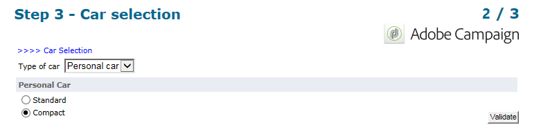

# Ejemplos de uso: formularios web{#use-cases-web-forms}

## Creación de un formulario de suscripción con doble adhesión {#create-a-subscription--form-with-double-opt-in}

Al ofrecer servicios de información, es necesario que los destinatarios se suscriban para recibir todas las comunicaciones vinculadas. Para evitar comunicaciones incorrectas y asegurarse de que el destinatario se ha suscrito intencionadamente, se recomienda enviar una solicitud de confirmación de suscripción para crear una adhesión doble. Así, la suscripción solo es efectiva una vez que el usuario hace clic en el vínculo incluido en el mensaje de confirmación.

Este ejemplo se basa en el siguiente supuesto:

1. Creación de un formulario de suscripción a un boletín informativo en un sitio web que contiene una casilla de verificación para suscribirse a un servicio temporal. Este servicio permite enviar mensajes de confirmación de suscripción.
1. Creación de la entrega de confirmación de suscripción con una plantilla de envío vinculada al formulario web. Contiene el vínculo de confirmación que llama al formulario para la suscripción al boletín informativo y muestra un mensaje de aprobación de la suscripción.

### Paso 1: Creación de servicios de información {#step-1---creating-information-services}

1. Cree el servicio de suscripción al boletín informativo que desea ofrecer a los destinatarios. Para obtener más información sobre la creación de boletines informativos, consulte [esta sección](../../delivery/using/about-services-and-subscriptions.md).

   

1. Cree un segundo servicio de información, un servicio temporal vinculado a una plantilla de envío que se encargue de enviar mensajes de confirmación de suscripción.

   

### Paso 2: Creación de mensajes de confirmación {#step-2---creating-confirmation-messages}

Los mensajes de confirmación se envían a través de una plantilla de envío dedicada a nivel de servicio temporal.

1. En **[!UICONTROL Explorer]**, seleccione **[!UICONTROL Resources > Templates > Delivery templates]**
1. Cree una plantilla de envío para enviar los mensajes de confirmación de suscripción.
1. En **[!UICONTROL To]**, haga clic en el botón **[!UICONTROL Email parameters]** para asociar la plantilla de envío con la asignación de destino de suscripciones en lugar de con los destinatarios.

   

1. Debido a que los destinatarios de este envío no han confirmado su aprobación, aún se encuentran en la lista de bloqueados de la base de datos. Para que reciban esta comunicación, debe autorizar las entregas basadas en esta plantilla para dirigirse a los destinatarios en la lista de bloqueados.

   Para ello, haga clic en la pestaña **[!UICONTROL Exclusions]**.

1. Haga clic en el vínculo **[!UICONTROL Edit...]** y desmarque la opción **[!UICONTROL Exclude recipients who no longer want to be contacted]**.

   <!-- -->

   >[!IMPORTANT]
   >
   >Esta opción solo puede desactivarse en este tipo de contexto.

1. Personalice la entrega e inserte el vínculo de confirmación en el contenido del mensaje. Este vínculo permite acceder al formulario web para registrar la confirmación de suscripción.

   

1. Con el DCE, vincule la dirección URL al formulario web. Dado que el formulario web aún no se ha creado, reemplace el valor en cuanto lo cree.

   

1. Por último, vincule esta plantilla al servicio temporal creado anteriormente.

   

### Paso 3: Creación del formulario de suscripción {#step-3---creating-the-subscription-form}

El formulario web permite la suscripción del destinatario y la confirmación de la suscripción.

El flujo de trabajo del formulario web incluye las siguientes actividades:


Para realizar esto, siga los pasos a continuación:

1. Cree un formulario web y seleccione la plantilla **[!UICONTROL Newsletter subscription (subNewsletter)]**.

   

1. En la pestaña **[!UICONTROL Edit]**, se debe configurar el flujo de trabajo existente, ya que el objetivo es añadir un mensaje de confirmación a los destinatarios que deseen suscribirse.

   Para ello, haga doble clic en la casilla **[!UICONTROL Preloading]** y configúrela de la siguiente manera:

   

   Esto significa que si el usuario accede a este formulario mediante el vínculo del mensaje de confirmación, se carga su información de perfil. Si accede al formulario web a través de una página del sitio web, no se carga ninguna información.

1. Añada una actividad **[!UICONTROL Test]** al flujo de trabajo.

   

   La actividad **[!UICONTROL Test]** puede involucrar al correo electrónico del destinatario. En este caso, configúrelo de la siguiente manera:

   

1. Añada dos actividades **[!UICONTROL Script]** al flujo de trabajo.

   

   La primera actividad **[!UICONTROL Script]** coloca en la lista de bloqueados a los destinatarios hasta que confirmen su suscripción al boletín informativo. El contenido debe ser el siguiente:

   ```
   ctx.recipient.@blackList=1
   ```

   

   La segunda actividad **[!UICONTROL Script]** autoriza las entregas a los usuarios y los suscribe al boletín informativo. Las dos últimas líneas de la secuencia de comandos permiten transferir los destinatarios de la carpeta temporal a otra carpeta y reconciliarlos con perfiles existentes justo tras confirmar la suscripción.

   ```
   ctx.recipient.@blackList=0
   nms.subscription.Subscribe("INTERNAL_NAME_OF_THE_NEWSLETTER", ctx.recipient, false)
   ctx.recipient.folder = <folder name="nmsRootRecipient"/>
   nms.subscription.Unsubscribe("TEMP", ctx.recipient)
   ```

   >[!NOTE]
   >
   >La partición **[!UICONTROL Temp]** también se puede eliminar de forma regular mediante un flujo de trabajo.

   

1. Haga doble clic en la actividad **[!UICONTROL Subscription]** para personalizar el formulario de suscripción y relacionar una casilla de verificación con el servicio temporal creado anteriormente.

   

1. Configure la actividad **[!UICONTROL Storage]** para guardar la información introducida en la página del formulario.

   Esta actividad permite crear perfiles de destinatario en una carpeta provisional específica para separarlos de los perfiles de la base de datos a los que se pueden enviar comunicaciones.

   

   >[!NOTE]
   >
   >No se debe definir ninguna opción de reconciliación.

1. Añada dos actividades **[!UICONTROL End]** para mostrar un mensaje para el usuario.

   La segunda casilla **[!UICONTROL End]** muestra el mensaje de confirmación una vez que se haya completado la suscripción.

   

1. Una vez creado y configurado el formulario web, se puede hacer referencia a él en la plantilla de envío para enviar mensajes de confirmación.

   

### Paso 4: Publicación y prueba del formulario {#step-4---publishing-and-testing-the-form}

Ahora se puede publicar el formulario para que los usuarios puedan acceder a él.


La suscripción al boletín informativo implica los pasos siguientes:

1. El usuario del sitio web inicia sesión en la página de suscripción y aprueba el formulario.

   

   Reciben una notificación a través de un mensaje en el explorador en el que se ha tenido en cuenta su solicitud.

   

   El usuario se añade a la base de datos de Adobe Campaign en la carpeta **[!UICONTROL Temp]** y su perfil se añade a la lista de bloqueados hasta que confirme su suscripción con el correo electrónico.

   

1. Se les envía un mensaje de confirmación que incluye un vínculo para aprobar su suscripción.

   

1. Al hacer clic en este vínculo, la página de aprobación se muestra en el explorador.

   

   En Adobe Campaign se actualiza el perfil de usuario:

   * ya no están en lista de bloqueados,
   * están suscritos al servicio de información.

      

## Visualización de distintas opciones en función de los valores seleccionados {#displaying-different-options-depending-on-the-selected-values}

En el ejemplo siguiente, se solicita al usuario que seleccione un tipo de vehículo. Puede mostrar las categorías de vehículo disponibles según el tipo seleccionado. Esto significa que los elementos que se muestran en la columna derecha dependen de la selección del usuario:


* Cuando el usuario selecciona “vehículo privado”, se ofrecen las opciones “compacto” y “monovolumen”.

   

* Cuando el usuario selecciona “vehículo comercial”, se muestra una selección en una lista desplegable:

   

En este ejemplo, el tipo de vehículo no se almacena en la base de datos. La lista desplegable se configura de la siguiente manera:


Esta información se almacena en una variable local.

La visualización condicional de la columna derecha se configura en los contenedores:


* Visibilidad condicional de campos para un vehículo privado:

   

* Visibilidad condicional de campos para un vehículo comercial:

   

