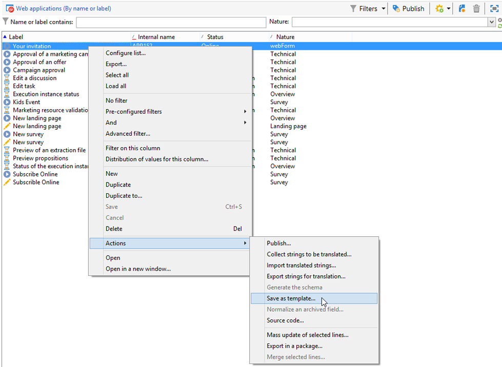

# Uso de una plantilla de formulario web{#using-a-web-form-template}

Las plantillas de formulario son configuraciones reutilizables que permiten crear formularios nuevos. De forma predeterminada, las plantillas de formulario se almacenan con las plantillas de aplicación web en el nodo **[!UICONTROL Resources > Templates > Web application templates]**.

Desde aquí puede crear nuevas plantillas o convertir un formulario existente en una plantilla.

## Conversión de un formulario existente en una plantilla {#convert-an-existing-form-into-a-template}

Un formulario se puede convertir en una plantilla y su configuración se reutiliza. Para ello, seleccione el formulario, haga clic con el botón derecho del ratón y seleccione **[!UICONTROL Actions > Save as template...]**

Esta acción abre la ventana para crear aplicaciones web. Puede introducir el nombre y la descripción de la plantilla y seleccionar la carpeta donde se guarda.

## Creación de una nueva plantilla de formulario {#create-a-new-form-template}

Para crear una plantilla de formulario web, haga clic con el botón derecho en la lista de plantillas de aplicaciones web y seleccione **[!UICONTROL New]**. También puede utilizar el botón **[!UICONTROL New]** situado sobre la lista de plantillas.

Introduzca el nombre de la plantilla. En el campo **[!UICONTROL Instance folder]**, seleccione la carpeta donde se guardan los formularios web creados basándose en esta plantilla. El campo **[!UICONTROL Nature]** permite añadir información descriptiva para ordenar y filtrar las distintas plantillas de aplicación web.

Haga clic en el botón **[!UICONTROL Save]** para crear la plantilla y después cree el contenido de esta plantilla y defina sus parámetros.

Ahora puede seleccionar esta plantilla al crear un formulario nuevo.
