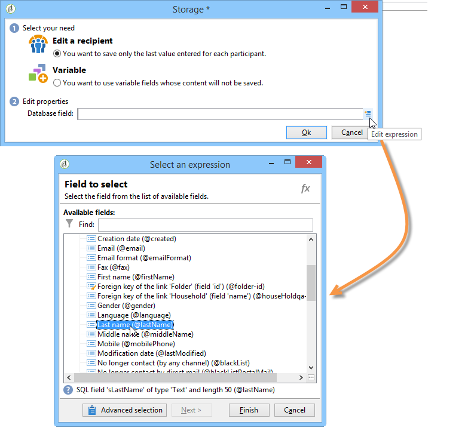

# Respuestas de formularios web{#web-forms-answers}

## Campos de almacenamiento de respuestas {#response-storage-fields}

Las respuestas a los formularios se pueden guardar en un campo de la base de datos o temporalmente en una variable local. El modo de almacenamiento de las respuestas se elige durante la creación del campo. Se puede editar mediante el vínculo **[!UICONTROL Edit storage...]**.

Para cada campo de entrada de un formulario, están disponibles las siguientes opciones de almacenamiento:


* **[!UICONTROL Edit a recipient]**

   Se puede seleccionar un campo de la base de datos: las respuestas de los usuarios se almacenan en este campo. Para cada usuario, solo se guarda el último valor introducido: se añade a su perfil: Consulte [Almacenamiento de datos en la base de datos](#storing-data-in-the-database).

* **[!UICONTROL Variable]**

   Si no desea almacenar información en la base de datos, puede utilizar una variable. Las variables locales se pueden declarar en sentido ascendente. Consulte [Almacenamiento de datos en una variable local ](#storing-data-in-a-local-variable).

### Almacenamiento de información en la base de datos {#storing-data-in-the-database}

Para guardar la información en un campo existente de la base de datos, haga clic en el icono **[!UICONTROL Edit expression]** y selecciónela en la lista de campos disponibles.



>[!NOTE]
>
>El documento de referencia predeterminado es el esquema **nms:recipient.** Para verla o elegir una nuevo, seleccione el formulario en la lista y haga clic en el botón **[!UICONTROL Properties]**.

### Almacenamiento de datos en una variable local {#storing-data-in-a-local-variable}

Puede utilizar variables locales para que, aun cuando los datos no estén almacenados en la base de datos, se puedan reutilizar en la página o en otras páginas, por ejemplo, para colocar condiciones en la visualización de un campo o para personalizar un mensaje.

Esto significa que se puede utilizar el valor de un campo sin guardar para autorizar la visualización de un grupo de opciones en la página. En la página siguiente, el tipo de vehículo no se almacena en la base de datos:


Se almacena en una variable que se debe seleccionar cuando se crea la casilla desplegable o a través del vínculo **[!UICONTROL Edit storage...]**.


Puede mostrar las variables existentes y crear variables nuevas mediante el vínculo **[!UICONTROL Edit variables...]**. Haga clic en el botón **[!UICONTROL Add]** para crear una variable nueva.


La variable añadida está disponible en la lista de variables locales cuando se crean los campos de entrada de la página.

>[!NOTE]
>
>Para cada formulario, se pueden crear variables de subida. Para ello, seleccione el formulario y haga clic en el botón **[!UICONTROL Properties]**. La pestaña **[!UICONTROL Variables]** contiene las variables locales del formulario.

**Ejemplo de almacenamiento local con condicionamiento**

En el ejemplo anterior, el contenedor que incluye los datos sobre los vehículos privados solo se muestra si la opción **[!UICONTROL Private]** está seleccionada en la lista desplegable, como se indica en la condición de visibilidad:


Si el usuario selecciona un vehículo privado, el formulario web ofrece las siguientes opciones:


El contenedor que contiene los datos sobre los vehículos comerciales se muestra si se selecciona la opción Profesional, tal como expresa la condición de visibilidad:


Esto significa que, si el usuario selecciona un vehículo comercial, el formulario ofrece las siguientes opciones:


## Uso de información recopilada {#using-collected-information}

Para cada formulario, las respuestas proporcionadas pueden reutilizarse en los campos o en las etiquetas. Se deben utilizar las siguientes sintaxis:

* Para un contenido almacenado en un campo de la base de datos:

   ```
   <%=ctx.recipient.@field name%
   ```

* Para un contenido almacenado en una variable local:

   ```
   <%= ctx.vars.variable name %
   ```

* Para un contenido almacenado en un campo de texto HTML:

   ```
   <%== HTML field name %
   ```

   >[!NOTE]
   >
   >A diferencia de los demás campos para los que los caracteres `<%=` se sustituyen por caracteres de escape, el contenido HTML se guarda tal cual con la sintaxis `<%==`.

## Almacenamiento de respuestas de formularios web {#saving-web-forms-answers}

Para guardar la información recopilada en las páginas de un formulario, se debe colocar un cuadro de almacenamiento en el diagrama.


Este cuadro se puede utilizar de dos formas:

* Si se accede al formulario web a través de un vínculo enviado en un correo electrónico y si el usuario que accede a la aplicación ya está en la base de datos, se puede seleccionar la opción **[!UICONTROL Update the preloaded record]**. Para obtener más información, consulte [Envío de un formulario por correo electrónico](../../web/using/publishing-a-web-form.md#delivering-a-form-via-email).

   En este caso, Adobe Campaign utiliza la clave principal encriptada del perfil de usuario, un identificador único asignado a cada perfil mediante Adobe Campaign. Se debe configurar la información para precargarla mediante el cuadro de precarga. Para obtener más información, consulte [Precarga de los datos del formulario](../../web/using/publishing-a-web-form.md#pre-loading-the-form-data).

   >[!CAUTION]
   >
   >Esta opción anula los datos del usuario, incluso la dirección de correo electrónico si hay un campo en el que pueda introducirla. No se puede utilizar para crear perfiles nuevos y requiere el uso de un cuadro de precarga en el formulario.

* Para enriquecer los datos de los destinatarios en la base de datos, edite el cuadro de almacenamiento y seleccione la clave de reconciliación. Para uso interno (normalmente un sistema intranet) o para un formulario utilizado para crear perfiles nuevos, se pueden seleccionar los campos de reconciliación. El cuadro ofrece todos los campos de la base de datos utilizados en las distintas páginas de la aplicación web:

   

De forma predeterminada, los datos se importan en la base de datos mediante una operación **[!UICONTROL Update or insertion]**: si existe en la base de datos, el elemento se actualiza (por ejemplo, el boletín informativo seleccionado o la dirección de correo electrónico ingresada). Si no existe, se añade la información.

Sin embargo, se puede cambiar este comportamiento. Para ello, seleccione la raíz del elemento y la operación que desea ejecutar en la lista desplegable:


Puede seleccionar una carpeta de búsqueda para la reconciliación y una carpeta de creación de nuevos perfiles. Si estos campos están vacíos, los perfiles se buscan y se crean en la carpeta predeterminada del operador.

>[!NOTE]
>
>Las operaciones posibles son: **[!UICONTROL Simple reconciliation]**, **[!UICONTROL Update or insertion]**, **[!UICONTROL Insertion]**, **[!UICONTROL Update]**, **[!UICONTROL Deletion]**.\
>La carpeta predeterminada de un operador es la primera carpeta para la que el operador tiene permiso de escritura.\
>Consulte [esta sección](../../platform/using/access-management.md).
