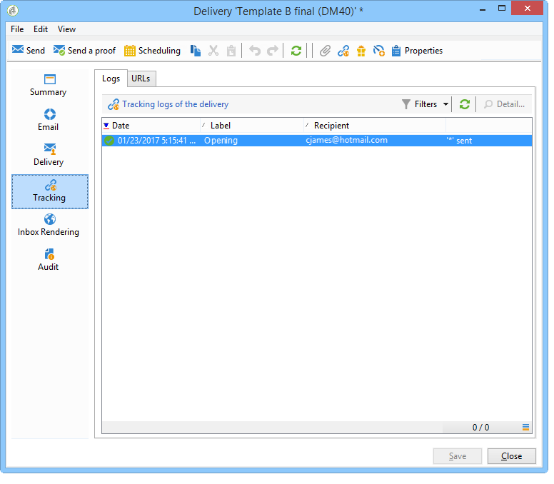

# Prueba A/B{#a-b-testing}

Si se tiene varios contenidos para una entrega de correo electrónico y se desea conocer qué versión tiene el mayor impacto en la población objetivo, se puede enviar las distintas versiones a algunos de los destinatarios y, a continuación, seleccionar la que tenga la tasa de éxito más alta y enviarla al resto de destinatarios.

En este caso de uso, se desea comparar dos contenidos de entrega por correo electrónico a través de un flujo de trabajo de objetivo. El mensaje y el texto son idénticos en ambos envíos: solo cambia el diseño.

La población objetivo se divide en tres: dos grupos de prueba y la población restante. Se envía una versión diferente a cada grupo de prueba. Después de la entrega, se configura un periodo de espera de 5 días antes de recolectar los resultados de las mejores tasas de apertura. El contenido de la entrega con la puntuación más alta se recupera mediante una secuencia de comandos y se envía a la población no utilizada como grupo de prueba.

Tenga en cuenta que los criterios que determinan cuál entrega es el mejor se pueden alterar para satisfacer las necesidades. Puede ser la tasa de apertura, la tasa de clics, la tasa de suscripción, la reactividad, etc.

Además, la prueba detallada en este caso de uso implica solo dos entregas, pero se pueden probar tantas versiones como sea necesario. Simplemente, agregue actividades al flujo de trabajo.

Para crear la prueba A/B, siga los siguientes pasos:

* [Paso 1: Creación de un flujo de trabajo de objetivos](#step-1--creating-a-targeting-workflow)
* [Paso 2: Configuración de muestras de población](#step-2--configuring-population-samples)
* [Paso 3: Creación de dos plantillas de entrega](#step-3--creating-two-delivery-templates)
* [Paso 4: Configuración de los envíos en el flujo de trabajo](#step-4--configuring-the-deliveries-in-the-workflow)
* [Paso 5: Creación del presupuesto](#step-5--creating-the-script)
* [Paso 6: Definición de la entrega final](#step-6--defining-the-final-delivery)
* [Paso 7: Inicio del flujo de trabajo](#step-7--starting-the-workflow)
* [Paso 8: Analizando el resultado](#step-8--analyzing-the-result).

## Paso 1: Creación de un flujo de trabajo de objetivos {#step-1--creating-a-targeting-workflow}

Se debe crear el flujo de trabajo en la pestaña **[!UICONTROL Targeting and Workflows]** de una campaña. Se compone de una actividad **[!UICONTROL Query]**, una actividad **[!UICONTROL Split]** vinculada a dos actividades **[!UICONTROL Email delivery]**, una actividad **[!UICONTROL Wait]**, una actividad **[!UICONTROL JavaScript code]** y una actividad **[!UICONTROL Delivery]**.

1. Si aún no lo ha hecho, cree una campaña (para obtener más información, consulte esta [sección](../../campaign/using/setting-up-marketing-campaigns.md#creating-a-campaign)).

   

1. Vaya a la pestaña **[!UICONTROL Targeting and Workflows]**.

   

1. Cambie la etiqueta del flujo de trabajo existente o haga clic en **[!UICONTROL Add]** para crear uno nuevo.

   

1. Utilice el ratón para arrastrar y colocar actividades en el diagrama de flujo de trabajo, incluido una **[!UICONTROL Query]** (pestaña **[!UICONTROL Target]**), un **[!UICONTROL Split]** (pestaña **[!UICONTROL Target]**), dos **[!UICONTROL Email deliveries]**(pestaña **[!UICONTROL Deliveries]**), una actividad **[!UICONTROL Wait]** (pestaña **[!UICONTROL Flow Control]**), una actividad **[!UICONTROL JavaScript code]** (pestaña **[!UICONTROL Actions]**) y una actividad **[!UICONTROL Delivery]** (pestaña **[!UICONTROL Actions]**).


## Paso 2: Configuración de muestras de población {#step-2--configuring-population-samples}

### Configuración de la actividad de consulta {#configuring-the-query-activity}

* Haga doble clic en la actividad **[!UICONTROL Query]**.

   

* Haga clic en el vínculo **[!UICONTROL Edit query]** y seleccione los destinatarios a quienes desee dirigirse.

   

* Vincule la actividad **[!UICONTROL Query]** a la actividad **[!UICONTROL Split]**.

   

### Configuración de la actividad Split {#configuring-the-split-activity}

Esta actividad permite crear varias poblaciones: la que recibe la entrega A, la que recibe la entrega B y la población restante. El uso de la selección aleatoria permite seleccionar solo parte de la población de cada entrega.

1. Creación de la población A:

   * Haga doble clic en la actividad **[!UICONTROL Split]**.

      

   * En la pestaña existente, cambie la etiqueta a población A.

      

   * Seleccione la opción **[!UICONTROL Limit the selected records]**.

      

   * Haga clic en el vínculo **[!UICONTROL Edit]**, seleccione **[!UICONTROL Activate random sampling]** y haga clic en **[!UICONTROL Next]**.

      

   * Defina el umbral en 10 % y haga clic en **[!UICONTROL Finish]**.

      

1. Creación de la población B:

   * Haga clic en **[!UICONTROL Add]** para crear una nueva pestaña para la población B.

      

   * Limite la población al 10% como se mostró anteriormente.

      

1. Creación de la población restante:

   * Vaya a la pestaña **[!UICONTROL General]**.

      

   * Seleccione **[!UICONTROL Generate complement]**.

      

   * Cambie la etiqueta para especificar que esta población no incluye A ni B y haga clic en **[!UICONTROL OK]** para cerrar la actividad.

      

## Paso 3: Creación de dos plantillas de entrega {#step-3--creating-two-delivery-templates}

Ahora, se desea crear dos plantillas de entrega. Se hará referencia a cada plantilla en una actividad **[!UICONTROL Email delivery]** vinculada a la actividad **[!UICONTROL Split]**. Para obtener más información, consulte [esta sección](../../delivery/using/about-templates.md).

1. Vaya a la carpeta **[!UICONTROL Resources > Delivery template]**.
1. Duplique la plantilla de entrega **[!UICONTROL Email]**.

   

1. Cree el contenido que desea utilizar para la entrega A.

   

1. Repita este proceso para crear una plantilla para la entrega B.

   

## Paso 4: Configuración de los envíos en el flujo de trabajo {#step-4--configuring-the-deliveries-in-the-workflow}

El siguiente paso es configurar los envíos. Están destinados a las tres poblaciones creadas durante la etapa anterior: [Paso 2: Configuración de muestras de población](#step-2--configuring-population-samples). Los dos primeros envíos permiten enviar contenido distinto a las poblaciones A y B. La tercera entrega está destinada a la población que no ha recibido A ni B. Su contenido se calcula mediante una secuencia de comandos y es idéntico a A o B, dependiendo de cuál obtuvo la tasa de apertura más alta. Es necesario configurar un periodo de espera para la tercera entrega, para averiguar el resultado de los envíos A y B. Esta es la razón por la que la tercera entrega incluye una actividad **[!UICONTROL Wait]**.

1. Vaya a la actividad **[!UICONTROL Split]** y vincule la transición destinada a la población A a uno de los envíos de correo electrónico que ya se encuentran en el flujo de trabajo.

   

1. Haga doble clic en la entrega para abrirlo.
1. En la lista desplegable, seleccione la plantilla para la entrega A.

   

1. Haga clic en **[!UICONTROL Continue]** para ver la entrega y, a continuación, guárdelo.

   

1. Vincule la transición de la actividad **[!UICONTROL Split]** de la población B al segundo entrega de correo electrónico.

   

1. Abra la entrega, seleccione la plantilla en la entrega B y, a continuación, guarde la entrega.

   

1. Vincule la transición destinada a la población restante a la actividad **[!UICONTROL Wait]**.

   

1. Abra la actividad **[!UICONTROL Wait]** y configure un periodo de espera de 5 días.

   

1. Vincule la actividad **[!UICONTROL Wait]** a la actividad **[!UICONTROL JavaScript code]**.

   

## Paso 5: Creación del presupuesto {#step-5--creating-the-script}

La elección del contenido de entrega destinado a la población restante se calcula mediante una secuencia de comandos. Esta secuencia de comandos recupera la información relativa a la entrega con la mayor tasa de apertura y copia el contenido en la entrega final.

### Ejemplo de secuencia de comandos {#example-of-a-script}

La siguiente secuencia de comandos se puede utilizar tal cual en el flujo de trabajo de determinación de objetivos (consulte [Configuración de la secuencia de comandos](../../workflow/using/a-b-testing.md#configuring-script)).

```
 // query the database to find the winner (best open rate)
   var winner = xtk.queryDef.create(
     <queryDef schema="nms:delivery" operation="get">
       <select>
         <node expr="@id"/>
         <node expr="@label"/>
         <node expr="[@operation-id]"/>
         <node expr="[@workflow-id]"/>
       </select>
       <where>
         <condition expr={"@FCP=0 and [@workflow-id]= " + instance.id}/>
       </where>
       <orderBy>
         <node expr="[indicators/@estimatedRecipientOpenRatio]" sortDesc="true"/>
       </orderBy>
     </queryDef>).ExecuteQuery()
   
   // create a new delivery object and initialize it by doing a copy of
   // the winner delivery
   var delivery = nms.delivery.create()
   delivery.Duplicate("nms:delivery|" + winner.@id)

   // append 'final' to the delivery label
   delivery.label = winner.@label + " final"

   // link the delivery to the operation to make sure it will be displayed in
   // the campaign dashboard. This attribute needs to be set manually here since 
   // the Duplicate() method has reset it to its default value => 0
   delivery.operation_id = winner.@["operation-id"]
   delivery.workflow_id = winner.@["workflow-id"]

   // adjust some delivery parameters to make it compatible with the 
   // "Prepare and start" option selected in the Delivery tab of this activity
   delivery.scheduling.validationMode = "manual"
   delivery.scheduling.delayed = 0
 
   // save the delivery in database
   delivery.save()
 
   // store the new delivery Id in event variables
   vars.deliveryId = delivery.id
```

Para obtener una explicación detallada del script, consulte [esta sección](../../workflow/using/a-b-testing.md#details-of-the-script).

### Configuración de la secuencia de comandos {#configuring-script}

1. Abra la actividad **[!UICONTROL JavaScript code]**.
1. Copie la secuencia de comandos presentada [anteriormente](../../workflow/using/a-b-testing.md#example-of-a-script) en la ventana **[!UICONTROL JavaScript code]**.

   

1. En el campo **[!UICONTROL Label]**, introduzca el nombre de la secuencia de comandos, por ejemplo.

   ```
   <%= vars.deliveryId %>
   ```

   

1. Cierre la actividad **[!UICONTROL JavaScript code]**.
1. Guarde el flujo de trabajo.

### Detalles de la secuencia de comandos {#details-of-the-script}

En esta sección se detallan las distintas partes de la secuencia de comandos y su modo operativo.

* La primera parte de la secuencia de comandos es una consulta. El comando **queryDef** permite recuperar desde la tabla **NmsDelivery** los envíos creados ejecutando el flujo de trabajo objetivo y ordenarlos en función de su tasa estimada de apertura. A continuación, se recupera la información de la entrega con la mayor tasa de apertura.

   ```
   // query the database to find the winner (best open rate)
      var winner = xtk.queryDef.create(
        <queryDef schema="nms:delivery" operation="get">
          <select>
            <node expr="@id"/>
            <node expr="@label"/>
            <node expr="[@operation-id]"/>
          </select>
          <where>
            <condition expr={"@FCP=0 and [@workflow-id]= " + instance.id}/>
          </where>
          <orderBy>
            <node expr="[indicators/@estimatedRecipientOpenRatio]" sortDesc="true"/>
          </orderBy>
        </queryDef>).ExecuteQuery()
   ```

* Se duplica la entrega con la mayor tasa de apertura.

   ```
    // create a new delivery object and initialize it by doing a copy of
    // the winner delivery
   var delivery = nms.delivery.create()
   delivery.Duplicate("nms:delivery|" + winner.@id)
   ```

* La etiqueta de la entrega duplicado se modifica y la palabra **final** se añade a ella.

   ```
   // append 'final' to the delivery label
   delivery.label = winner.@label + " final"
   ```

* La entrega se copia en el tablero de campañas.

   ```
   // link the delivery to the operation to make sure it will be displayed in
   // the campaign dashboard. This attribute needs to be set manually here since 
   // the Duplicate() method has reset it to its default value => 0
   delivery.operation_id = winner.@["operation-id"]
   delivery.workflow_id = winner.@["workflow-id"]
   ```

   ```
   // adjust some delivery parameters to make it compatible with the 
   // "Prepare and start" option selected in the Delivery tab of this activity
   delivery.scheduling.validationMode = "manual"
   delivery.scheduling.delayed = 0
   ```

* La entrega se guarda en la base de datos.

   ```
   // save the delivery in database
   delivery.save()
   ```

* El identificador único de la entrega duplicado se almacena en la variable del flujo de trabajo.

   ```
   // store the new delivery Id in event variables
   vars.deliveryId = delivery.id
   ```

### Otros criterios de selección {#other-selection-criteria}

El ejemplo de arriba permite seleccionar el contenido de una entrega según la tasa de apertura de los correos electrónicos. Se puede adaptar para que poder basarse en otros indicadores específicos de entrega:

* Mejor rendimiento de los clics: `[indicators/@recipientClickRatio]`,
* Tasa máxima de reacción (correo electrónico abierto y clics en el mensaje): `[indicators/@reactivity]`,
* Tasa de quejas más baja: `[indicators/@refusedRatio]` (utilice el valor falso para el atributo sortDesc),
* Tasa máxima de conversión: `[indicators/@transactionRatio]`,
* Número de páginas visitadas después de la recepción de un mensaje: `[indicators/@totalWebPage]`,
* Tasa mínima de cancelación de suscripciones: `[indicators/@optOutRatio]`,
* Cantidad de transacciones: `[indicators/@amount]`.

## Paso 6: Definición de la entrega final {#step-6--defining-the-final-delivery}

Una vez que la secuencia de comandos se ha creado para seleccionar el ganador de la prueba A/B, se puede definir los parámetros de la entrega final.

1. Conecte la actividad **[!UICONTROL JavaScript code]** a la actividad restante **[!UICONTROL Delivery]**.
1. Abra la actividad **[!UICONTROL Delivery]**.
1. Anule la selección de la opción **[!UICONTROL Generate an outbound transition]** para finalizar el flujo de trabajo con esta actividad.
1. Deje las demás opciones en sus valores predeterminados.

   

Al preparar la entrega especificada en la transición (definida a través de la actividad **[!UICONTROL Javascript Code]**),  ), se puede aprobar dicha actividad y comenzar la entrega, tal y como se describe en el paso siguiente.

## Paso 7: Inicio del flujo de trabajo {#step-7--starting-the-workflow}

1. Haga clic en el flujo de trabajo **[!UICONTROL Start]**.

   

1. Apruebe el objetivo y el contenido para los envíos A y B mediante el tablero de campañas.
1. Confirme la entrega.
1. Espere hasta que finalice el periodo de 5 días para saber qué contenido se ha calculado tras los resultados de apertura de envíos.

   

   En este caso, se eligió la plantilla B.

1. Una vez determinado el contenido de la tercera entrega, apruebe el objetivo y el contenido.

## Paso 8: Análisis del resultado {#step-8--analyzing-the-result}

Una vez remitidos los envíos de prueba, se puede comprobar los destinatarios a los que se han enviado y si se han abierto o no.

* Para saber cuáles fueron los destinatarios objetivo, abra una entrega a través del panel de campañas y haga clic en la pestaña **[!UICONTROL Delivery]**.

   

* Para averiguar si la entrega se ha abierto, vaya a la pestaña **[!UICONTROL Tracking]**.

   

* Compare con el otro entrega.

   

En el ejemplo, la entrega B ha obtenido la mayor tasa de apertura. Esto significa que el contenido B se utilizará para la entrega final.


